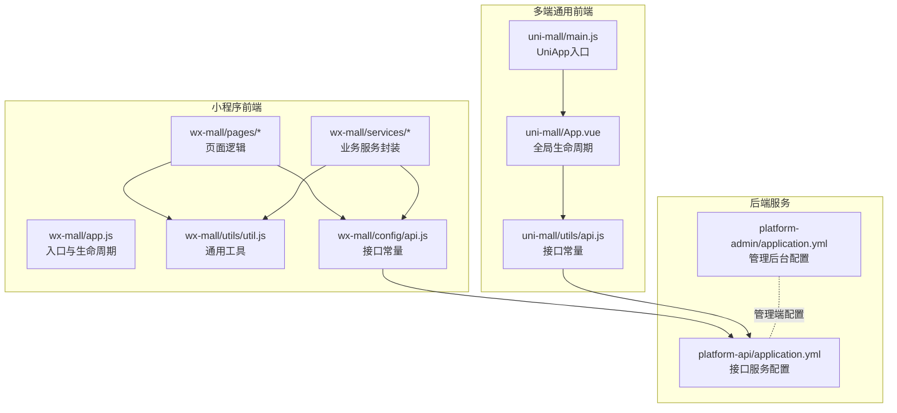
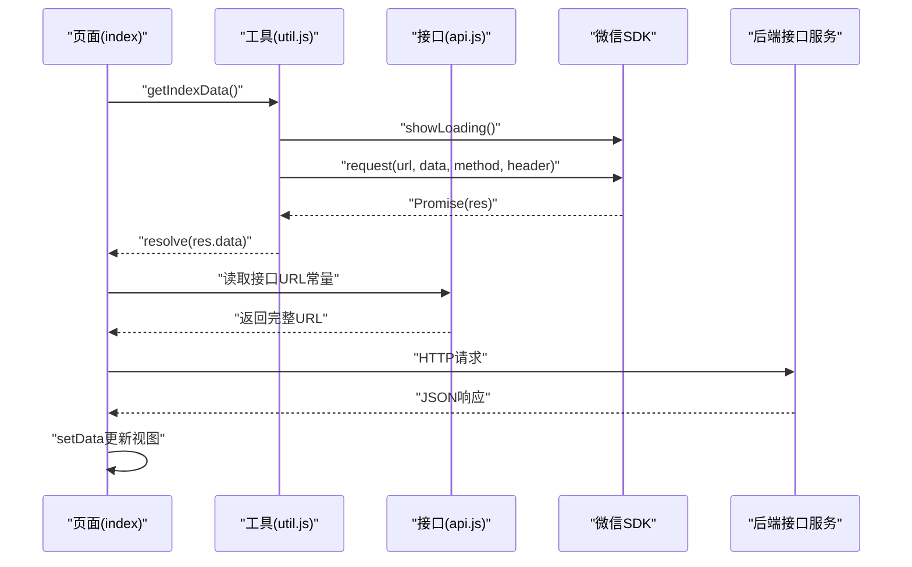
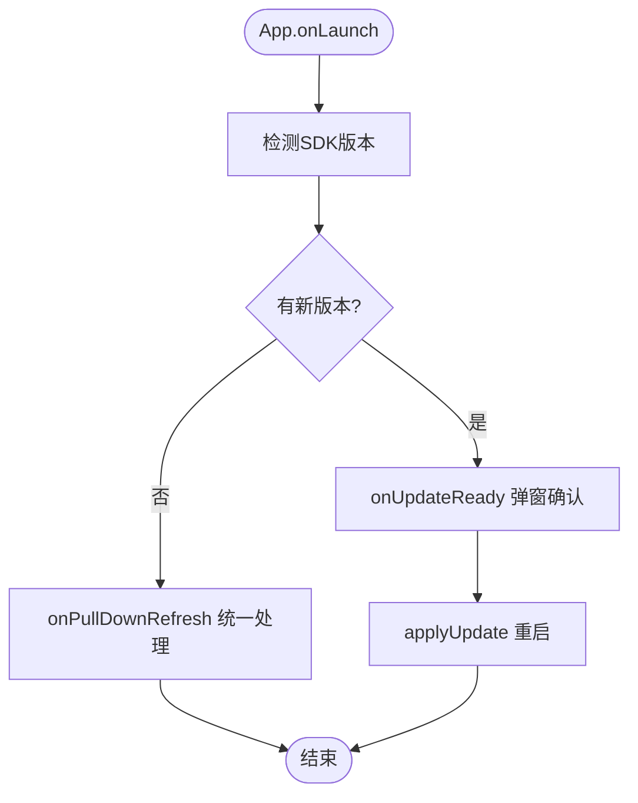
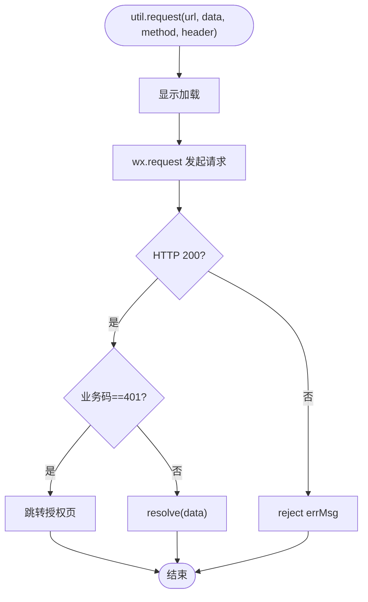
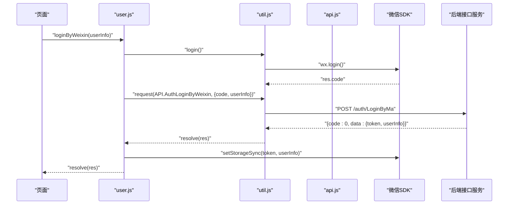
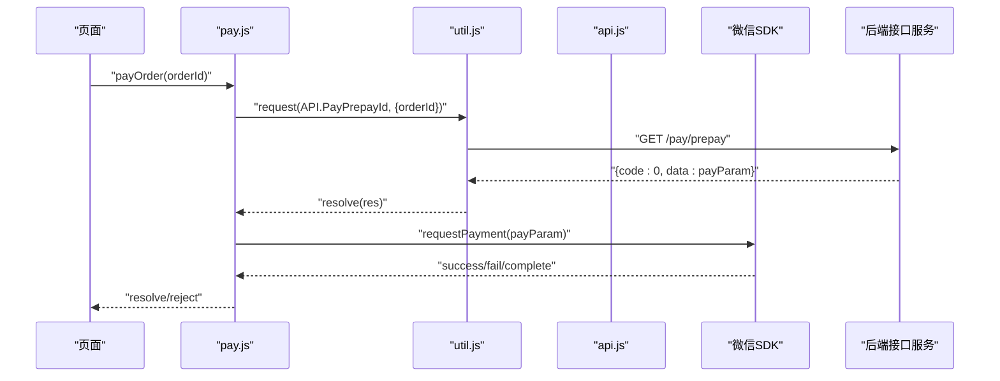
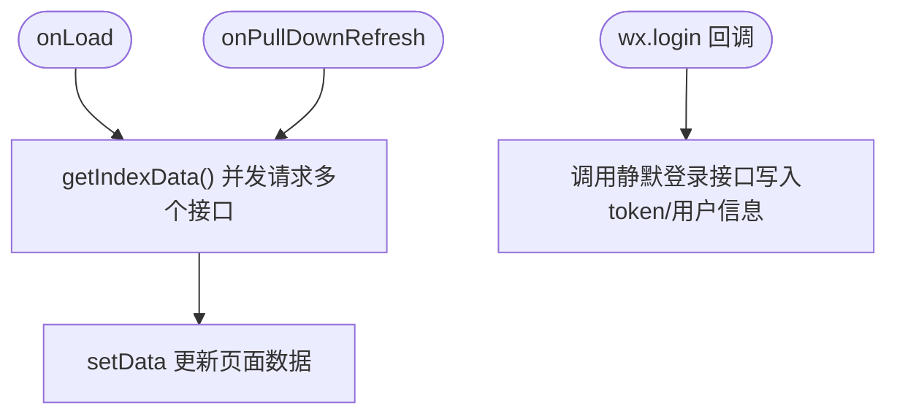
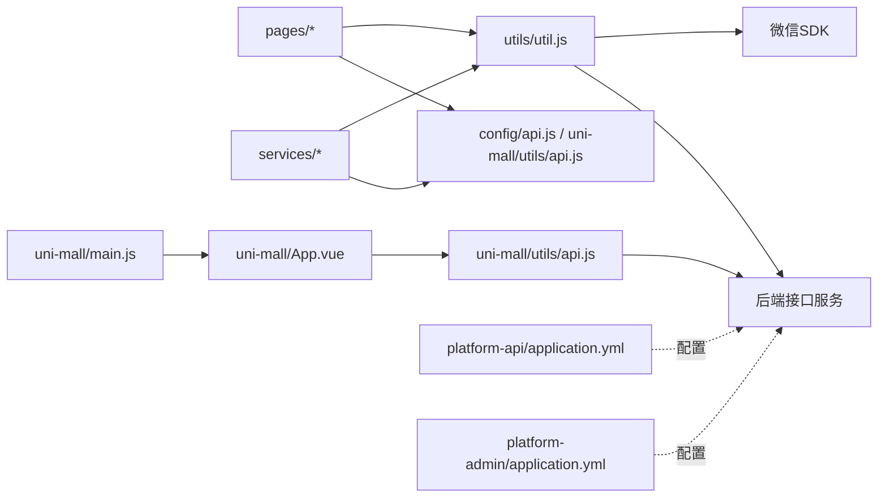

# 微信小程序开发

<cite>
**本文引用的文件**
- [wx-mall/app.js](file://wx-mall/app.js)
- [wx-mall/app.json](file://wx-mall/app.json)
- [wx-mall/config/api.js](file://wx-mall/config/api.js)
- [wx-mall/utils/util.js](file://wx-mall/utils/util.js)
- [wx-mall/services/user.js](file://wx-mall/services/user.js)
- [wx-mall/services/pay.js](file://wx-mall/services/pay.js)
- [wx-mall/pages/index/index.js](file://wx-mall/pages/index/index.js)
- [wx-mall/pages/auth/login/login.js](file://wx-mall/pages/auth/login/login.js)
- [uni-mall/main.js](file://uni-mall/main.js)
- [uni-mall/App.vue](file://uni-mall/App.vue)
- [uni-mall/utils/api.js](file://uni-mall/utils/api.js)
- [platform-api/src/main/resources/application.yml](file://platform-api/src/main/resources/application.yml)
- [platform-admin/src/main/resources/application.yml](file://platform-admin/src/main/resources/application.yml)
</cite>

## 目录
1. [引言](#引言)
2. [项目结构](#项目结构)
3. [核心组件](#核心组件)
4. [架构总览](#架构总览)
5. [详细组件分析](#详细组件分析)
6. [依赖关系分析](#依赖关系分析)
7. [性能考虑](#性能考虑)
8. [故障排查指南](#故障排查指南)
9. [结论](#结论)
10. [附录](#附录)

## 引言
本文件面向微信小程序开发者，系统性梳理仓库中的小程序前端实现、后端接口配置与交互流程，覆盖以下主题：
- 小程序接口开发与调用规范、接口权限与鉴权、数据传输协议
- 小程序配置管理（参数、开发/生产环境、分包与懒加载）
- 分析能力与埋点思路（基于现有页面与工具函数的扩展建议）
- 与后端服务的交互模式（接口设计、数据格式、安全校验）
- 生命周期管理、用户体验优化与性能调优建议

## 项目结构
该项目包含多端实现与后端工程：
- 微信小程序前端：wx-mall（原生小程序）
- 多端通用前端：uni-mall（基于Vue/UniApp）
- 后端管理平台：platform-admin（Spring Boot）
- 移动端接口服务：platform-api（Spring Boot）

图表来源
- [wx-mall/app.js:1-96](file://wx-mall/app.js#L1-L96)
- [wx-mall/pages/index/index.js:1-123](file://wx-mall/pages/index/index.js#L1-L123)
- [wx-mall/services/user.js:1-74](file://wx-mall/services/user.js#L1-L74)
- [wx-mall/utils/util.js:1-132](file://wx-mall/utils/util.js#L1-L132)
- [wx-mall/config/api.js:1-84](file://wx-mall/config/api.js#L1-L84)
- [uni-mall/main.js:1-29](file://uni-mall/main.js#L1-L29)
- [uni-mall/App.vue:1-72](file://uni-mall/App.vue#L1-L72)
- [uni-mall/utils/api.js:1-81](file://uni-mall/utils/api.js#L1-L81)
- [platform-api/src/main/resources/application.yml:1-195](file://platform-api/src/main/resources/application.yml#L1-L195)
- [platform-admin/src/main/resources/application.yml:1-205](file://platform-admin/src/main/resources/application.yml#L1-L205)

章节来源
- [wx-mall/app.json:1-136](file://wx-mall/app.json#L1-L136)
- [wx-mall/app.js:1-96](file://wx-mall/app.js#L1-L96)
- [uni-mall/main.js:1-29](file://uni-mall/main.js#L1-L29)
- [uni-mall/App.vue:1-72](file://uni-mall/App.vue#L1-L72)

## 核心组件
- 小程序入口与生命周期：负责版本更新检测、下拉刷新、全局数据与错误处理
- 通用工具层：封装网络请求、登录态检查、Toast提示、登录流程
- 业务服务层：用户登录、支付流程等业务封装
- 页面层：首页数据拉取、登录页表单提交
- 接口常量：统一管理后端接口地址
- UniApp入口与App：多端通用入口与全局生命周期
- 后端配置：接口服务与管理后台的环境、鉴权、微信/支付配置

章节来源
- [wx-mall/app.js:1-96](file://wx-mall/app.js#L1-L96)
- [wx-mall/utils/util.js:1-132](file://wx-mall/utils/util.js#L1-L132)
- [wx-mall/services/user.js:1-74](file://wx-mall/services/user.js#L1-L74)
- [wx-mall/services/pay.js:1-44](file://wx-mall/services/pay.js#L1-L44)
- [wx-mall/pages/index/index.js:1-123](file://wx-mall/pages/index/index.js#L1-L123)
- [wx-mall/pages/auth/login/login.js:1-106](file://wx-mall/pages/auth/login/login.js#L1-L106)
- [wx-mall/config/api.js:1-84](file://wx-mall/config/api.js#L1-L84)
- [uni-mall/main.js:1-29](file://uni-mall/main.js#L1-L29)
- [uni-mall/App.vue:1-72](file://uni-mall/App.vue#L1-L72)
- [uni-mall/utils/api.js:1-81](file://uni-mall/utils/api.js#L1-L81)
- [platform-api/src/main/resources/application.yml:123-195](file://platform-api/src/main/resources/application.yml#L123-L195)
- [platform-admin/src/main/resources/application.yml:169-205](file://platform-admin/src/main/resources/application.yml#L169-L205)

## 架构总览
小程序前端通过统一的接口常量调用后端接口服务，业务服务封装登录与支付流程，页面层负责数据展示与交互。后端通过配置文件集中管理微信小程序与支付相关参数。

图表来源
- [wx-mall/pages/index/index.js:41-87](file://wx-mall/pages/index/index.js#L41-L87)
- [wx-mall/utils/util.js:20-57](file://wx-mall/utils/util.js#L20-L57)
- [wx-mall/config/api.js:1-84](file://wx-mall/config/api.js#L1-L84)

## 详细组件分析

### 小程序入口与生命周期（wx-mall/app.js）
- 版本更新检测：通过更新管理器监听新版本并引导重启
- 下拉刷新：统一处理导航栏加载与停止刷新
- 全局数据：用户信息、token、优惠券等
- 错误处理：低版本提示

图表来源
- [wx-mall/app.js:1-96](file://wx-mall/app.js#L1-L96)

章节来源
- [wx-mall/app.js:1-96](file://wx-mall/app.js#L1-L96)

### 通用工具层（wx-mall/utils/util.js）
- 网络请求封装：统一loading、header携带token、状态码与业务码处理
- 登录态检查：checkSession
- 微信登录：login
- Toast封装：成功/失败提示

图表来源
- [wx-mall/utils/util.js:20-57](file://wx-mall/utils/util.js#L20-L57)

章节来源
- [wx-mall/utils/util.js:1-132](file://wx-mall/utils/util.js#L1-L132)

### 业务服务层（wx-mall/services/user.js）
- 登录流程：调用微信登录获取code，携带userInfo请求后端换取token与用户信息
- 登录态校验：本地storage存在且session有效

图表来源
- [wx-mall/services/user.js:11-38](file://wx-mall/services/user.js#L11-L38)
- [wx-mall/utils/util.js:78-93](file://wx-mall/utils/util.js#L78-L93)
- [wx-mall/config/api.js:17](file://wx-mall/config/api.js#L17)

章节来源
- [wx-mall/services/user.js:1-74](file://wx-mall/services/user.js#L1-L74)

### 支付流程（wx-mall/services/pay.js）
- 预下单：向后端请求支付参数
- 发起支付：调用requestPayment传入后端返回的参数
- 成功/失败/完成回调

图表来源
- [wx-mall/services/pay.js:11-39](file://wx-mall/services/pay.js#L11-L39)
- [wx-mall/config/api.js:39](file://wx-mall/config/api.js#L39)

章节来源
- [wx-mall/services/pay.js:1-44](file://wx-mall/services/pay.js#L1-L44)

### 页面层（wx-mall/pages/index/index.js）
- 首页数据聚合：新品、热销、专题、品牌、楼层、banner、channel
- 下拉刷新：触发getIndexData
- 静默登录：wx.login后调用后端静默登录接口写入storage

图表来源
- [wx-mall/pages/index/index.js:41-109](file://wx-mall/pages/index/index.js#L41-L109)

章节来源
- [wx-mall/pages/index/index.js:1-123](file://wx-mall/pages/index/index.js#L1-L123)

### 登录页（wx-mall/pages/auth/login/login.js）
- 表单校验与提交：用户名/密码登录
- 成功后存储token并跳转tab

章节来源
- [wx-mall/pages/auth/login/login.js:1-106](file://wx-mall/pages/auth/login/login.js#L1-L106)

### UniApp入口与App（uni-mall）
- 入口：main.js挂载Vue实例，监听网络状态
- App：全局生命周期、更新检测、错误捕获

章节来源
- [uni-mall/main.js:1-29](file://uni-mall/main.js#L1-L29)
- [uni-mall/App.vue:1-72](file://uni-mall/App.vue#L1-L72)

### 接口常量（wx-mall/config/api.js 与 uni-mall/utils/api.js）
- 小程序端：维护完整URL（含本地开发服务地址），便于调试与部署切换
- UniApp端：维护相对路径，由后端统一暴露

章节来源
- [wx-mall/config/api.js:1-84](file://wx-mall/config/api.js#L1-L84)
- [uni-mall/utils/api.js:1-81](file://uni-mall/utils/api.js#L1-L81)

### 后端配置（platform-api/application.yml 与 platform-admin/application.yml）
- 接口服务：端口、上下文路径、Swagger Knife4j、Redis、JWT、微信/支付配置
- 管理后台：端口、上下文路径、Swagger Knife4j、Redis、微信/支付配置

章节来源
- [platform-api/src/main/resources/application.yml:123-195](file://platform-api/src/main/resources/application.yml#L123-L195)
- [platform-admin/src/main/resources/application.yml:169-205](file://platform-admin/src/main/resources/application.yml#L169-L205)

## 依赖关系分析
- 页面依赖工具层与接口常量
- 业务服务依赖工具层与接口常量
- 工具层依赖微信SDK与后端接口
- UniApp端与小程序端共享接口常量的语义，但URL来源不同
- 后端配置集中于application.yml，分别服务于接口服务与管理后台

图表来源
- [wx-mall/pages/index/index.js:1-123](file://wx-mall/pages/index/index.js#L1-L123)
- [wx-mall/services/user.js:1-74](file://wx-mall/services/user.js#L1-L74)
- [wx-mall/utils/util.js:1-132](file://wx-mall/utils/util.js#L1-L132)
- [wx-mall/config/api.js:1-84](file://wx-mall/config/api.js#L1-L84)
- [uni-mall/main.js:1-29](file://uni-mall/main.js#L1-L29)
- [uni-mall/App.vue:1-72](file://uni-mall/App.vue#L1-L72)
- [uni-mall/utils/api.js:1-81](file://uni-mall/utils/api.js#L1-L81)
- [platform-api/src/main/resources/application.yml:123-195](file://platform-api/src/main/resources/application.yml#L123-L195)
- [platform-admin/src/main/resources/application.yml:169-205](file://platform-admin/src/main/resources/application.yml#L169-L205)

## 性能考虑
- 网络请求
  - 使用统一loading与Promise封装，减少重复逻辑
  - 合理设置超时与并发，避免阻塞UI
- 分包与懒加载
  - app.json启用分包与独立分包，按需加载技能模块
  - 启用懒加载组件，降低首屏体积
- 缓存与存储
  - 利用storage缓存token与用户信息，减少重复登录
  - 合理设置缓存策略，避免频繁请求
- 图片与资源
  - 使用CDN与压缩图片，控制首屏加载时间
- 事件与渲染
  - 避免在渲染周期内进行大量计算
  - 使用setData合并更新，减少重绘

## 故障排查指南
- 登录失败/401
  - 检查工具层对业务码401的处理与跳转逻辑
  - 确认后端登录接口返回结构与token写入
- 支付失败
  - 核对后端返回的支付参数结构与字段
  - 检查requestPayment回调分支
- 网络请求异常
  - 查看工具层fail回调与reject处理
  - 确认后端接口可达与跨域配置
- 版本更新问题
  - 检查更新管理器回调与SDK版本要求
- UniApp网络监听
  - 确认网络状态变更事件是否正确派发至store

章节来源
- [wx-mall/utils/util.js:20-57](file://wx-mall/utils/util.js#L20-L57)
- [wx-mall/services/user.js:11-38](file://wx-mall/services/user.js#L11-L38)
- [wx-mall/services/pay.js:11-39](file://wx-mall/services/pay.js#L11-L39)
- [uni-mall/main.js:8-18](file://uni-mall/main.js#L8-L18)

## 结论
本项目提供了微信小程序前后端一体化的实现范式：前端通过统一的工具层与接口常量对接后端服务，业务服务封装登录与支付等关键流程，页面层专注数据与交互。后端配置集中管理，便于开发与运维。建议在现有基础上完善分析埋点、错误上报与性能监控体系，持续优化用户体验与稳定性。

## 附录

### 小程序配置管理要点
- 参数配置
  - 接口基础URL：小程序端可动态写入storage，便于切换环境
  - 网络超时：合理设置request与downloadFile超时
  - 分包与懒加载：按需加载提升首屏性能
- 开发/生产环境
  - 通过配置文件切换端口、上下文路径与微信/支付参数
  - UniApp端接口常量使用相对路径，由后端统一暴露
- 安全与鉴权
  - 工具层统一携带token，后端JWT配置与header一致
  - 登录态检查与storage持久化

章节来源
- [wx-mall/app.json:85-136](file://wx-mall/app.json#L85-L136)
- [wx-mall/config/api.js:1-4](file://wx-mall/config/api.js#L1-L4)
- [platform-api/src/main/resources/application.yml:123-195](file://platform-api/src/main/resources/application.yml#L123-L195)
- [platform-admin/src/main/resources/application.yml:169-205](file://platform-admin/src/main/resources/application.yml#L169-L205)

### 接口权限与数据传输协议
- 权限模型
  - 工具层在header中携带token，后端JWT校验
- 数据格式
  - 统一JSON格式，业务码与HTTP状态码分离处理
- 传输协议
  - 建议使用HTTPS，结合后端配置与证书

章节来源
- [wx-mall/utils/util.js:20-57](file://wx-mall/utils/util.js#L20-L57)
- [platform-api/src/main/resources/application.yml:123-195](file://platform-api/src/main/resources/application.yml#L123-L195)

### 分析功能与埋点建议
- 用户行为分析
  - 在页面生命周期与关键交互处增加埋点上报
  - 对分享、下单、支付等关键路径进行事件追踪
- 访问统计与流量分析
  - 通过后端接口记录UV/PV与页面停留时长
  - 结合微信统计与自有埋点进行交叉验证
- 数据采集与上报
  - 建议在工具层增加埋点方法，统一上报格式与去重策略

[本节为概念性内容，无需列出具体文件来源]