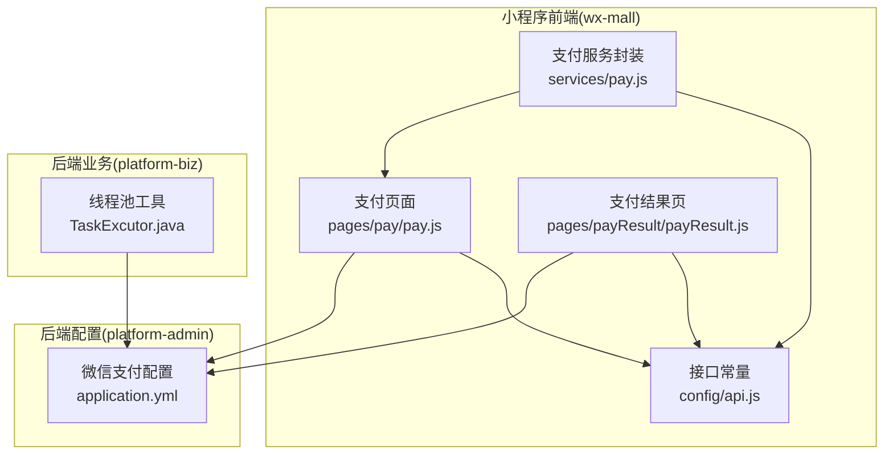
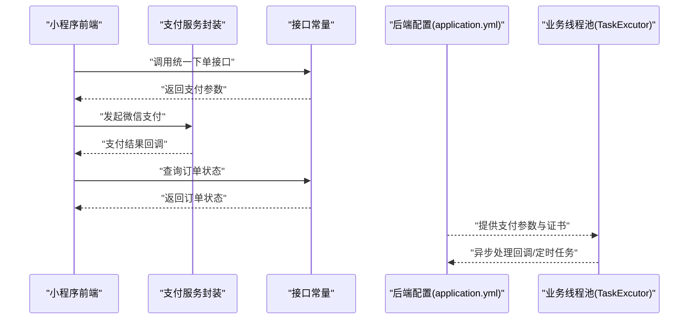
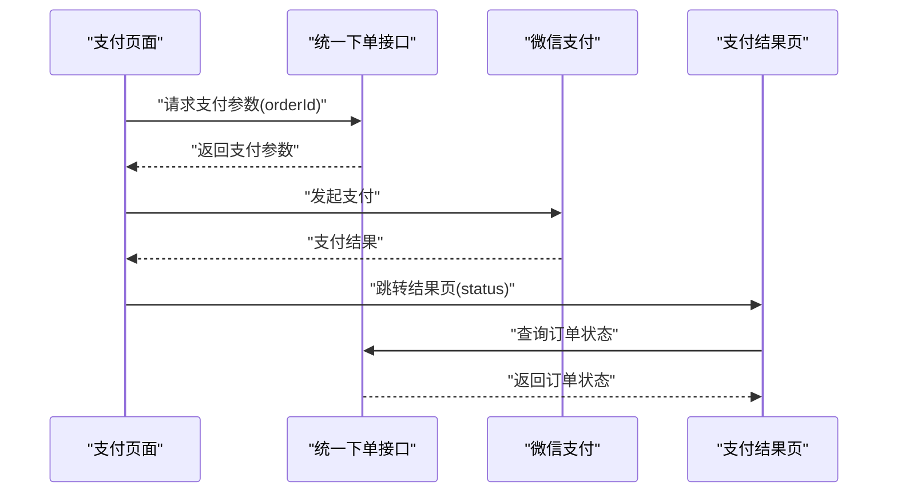
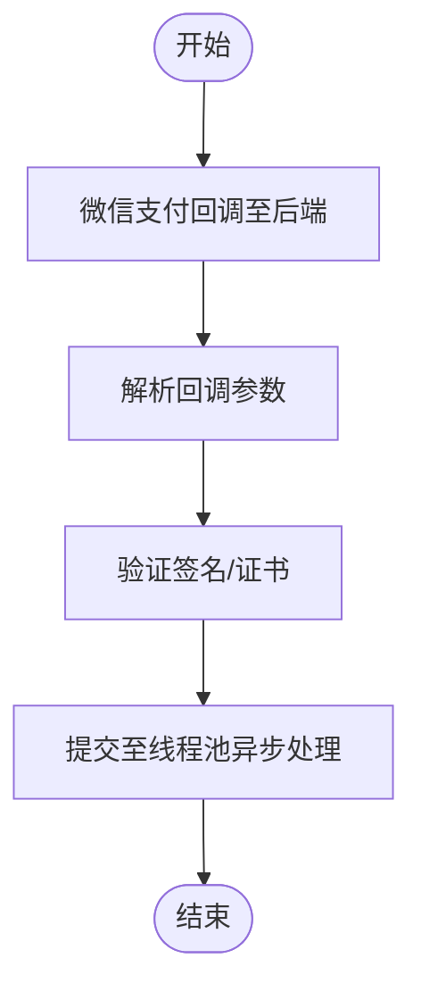
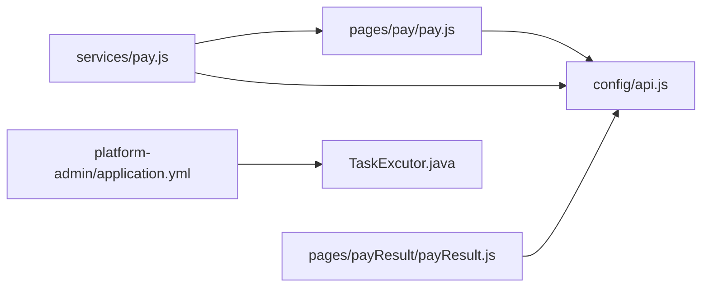

# 微信支付处理

<cite>
**本文引用的文件**
- [application.yml](file://platform-admin/src/main/resources/application.yml)
- [api.js](file://wx-mall/config/api.js)
- [pay.js](file://wx-mall/services/pay.js)
- [pay.js](file://wx-mall/pages/pay/pay.js)
- [payResult.js](file://wx-mall/pages/payResult/payResult.js)
- [TaskExcutor.java](file://platform-biz/src/main/java/com/platform/modules/wx/TaskExcutor.java)
</cite>

## 目录
1. [引言](#引言)
2. [项目结构](#项目结构)
3. [核心组件](#核心组件)
4. [架构总览](#架构总览)
5. [详细组件分析](#详细组件分析)
6. [依赖关系分析](#依赖关系分析)
7. [性能考虑](#性能考虑)
8. [故障排查指南](#故障排查指南)
9. [结论](#结论)
10. [附录](#附录)

## 引言
本文件面向支付开发者，系统性梳理平台在微信支付方面的集成与处理实现，覆盖支付配置管理、统一下单与支付发起、支付状态查询、支付结果通知、退款处理机制、对账管理以及安全与风控最佳实践。文档基于仓库现有代码进行分析，重点展示前端小程序调用链路、后端支付配置与线程池调度，帮助开发者快速理解并正确集成微信支付。

## 项目结构
平台采用多模块分层架构，微信支付涉及的关键位置如下：
- 前端小程序（wx-mall）：负责支付页面、统一下单参数获取、微信支付调起与结果页展示
- 后端配置（platform-admin）：集中存放微信支付参数（appId、mchId、mchKey、keyPath、baseNotifyUrl）
- 后端业务（platform-biz）：提供统一线程池工具，用于异步任务与定时任务调度（如支付回调处理）

**图表来源**
- [application.yml:189-205](file://platform-admin/src/main/resources/application.yml#L189-L205)
- [api.js:39-79](file://wx-mall/config/api.js#L39-L79)
- [pay.js:33-57](file://wx-mall/pages/pay/pay.js#L33-L57)
- [payResult.js:35-49](file://wx-mall/pages/payResult/payResult.js#L35-L49)
- [pay.js:11-39](file://wx-mall/services/pay.js#L11-L39)
- [TaskExcutor.java:29-84](file://platform-biz/src/main/java/com/platform/modules/wx/TaskExcutor.java#L29-L84)

**章节来源**
- [application.yml:189-205](file://platform-admin/src/main/resources/application.yml#L189-L205)
- [api.js:39-79](file://wx-mall/config/api.js#L39-L79)
- [pay.js:33-57](file://wx-mall/pages/pay/pay.js#L33-L57)
- [payResult.js:35-49](file://wx-mall/pages/payResult/payResult.js#L35-L49)
- [pay.js:11-39](file://wx-mall/services/pay.js#L11-L39)
- [TaskExcutor.java:29-84](file://platform-biz/src/main/java/com/platform/modules/wx/TaskExcutor.java#L29-L84)

## 核心组件
- 小程序支付页面：负责接收订单参数，调用统一下单接口获取支付参数，随后通过微信支付能力发起支付，并根据结果跳转到结果页
- 支付服务封装：对 wx.requestPayment 的封装，统一处理成功/失败回调，并与结果页联动
- 支付结果页：展示支付成功/失败状态，提供重新支付入口，并轮询订单状态
- 后端支付配置：集中管理微信支付 appId、mchId、mchKey、证书路径与回调地址
- 线程池工具：提供统一的线程池与定时任务调度，用于异步处理支付回调等任务

**章节来源**
- [pay.js:33-57](file://wx-mall/pages/pay/pay.js#L33-L57)
- [pay.js:11-39](file://wx-mall/services/pay.js#L11-L39)
- [payResult.js:35-49](file://wx-mall/pages/payResult/payResult.js#L35-L49)
- [application.yml:189-205](file://platform-admin/src/main/resources/application.yml#L189-L205)
- [TaskExcutor.java:29-84](file://platform-biz/src/main/java/com/platform/modules/wx/TaskExcutor.java#L29-L84)

## 架构总览
下图展示了从小程序到后端的支付调用链路，以及后端配置与线程池的作用：

**图表来源**
- [api.js:39-79](file://wx-mall/config/api.js#L39-L79)
- [pay.js:33-57](file://wx-mall/pages/pay/pay.js#L33-L57)
- [pay.js:11-39](file://wx-mall/services/pay.js#L11-L39)
- [application.yml:189-205](file://platform-admin/src/main/resources/application.yml#L189-L205)
- [TaskExcutor.java:29-84](file://platform-biz/src/main/java/com/platform/modules/wx/TaskExcutor.java#L29-L84)

## 详细组件分析

### 支付配置管理
- 配置项说明
  - appId：小程序/公众号的 appId
  - mchId：商户号
  - mchKey：商户密钥（用于签名与部分校验）
  - subAppId/subMchId：服务商模式下的子商户信息（可选）
  - keyPath：p12 证书路径（支持 classpath 或绝对路径）
  - baseNotifyUrl：支付回调通知的基础地址
- 配置位置与作用
  - 配置集中在后端 application.yml 中，供支付相关服务读取
  - 小程序侧通过统一下单接口获取支付参数，由后端完成签名与证书处理

**章节来源**
- [application.yml:189-205](file://platform-admin/src/main/resources/application.yml#L189-L205)

### 统一下单与支付发起
- 前端流程
  - 支付页面加载时携带 orderId 与应付金额
  - 调用统一下单接口获取支付参数
  - 调用微信支付能力发起支付
  - 成功/失败分别跳转到结果页
- 支付服务封装
  - 对 wx.requestPayment 进行封装，统一处理回调
  - 在结果页中再次调用支付服务以支持“重新支付”

**图表来源**
- [pay.js:33-57](file://wx-mall/pages/pay/pay.js#L33-L57)
- [pay.js:11-39](file://wx-mall/services/pay.js#L11-L39)
- [payResult.js:35-49](file://wx-mall/pages/payResult/payResult.js#L35-L49)
- [api.js:39-79](file://wx-mall/config/api.js#L39-L79)

**章节来源**
- [pay.js:33-57](file://wx-mall/pages/pay/pay.js#L33-L57)
- [pay.js:11-39](file://wx-mall/services/pay.js#L11-L39)
- [payResult.js:35-49](file://wx-mall/pages/payResult/payResult.js#L35-L49)
- [api.js:39-79](file://wx-mall/config/api.js#L39-L79)

### 支付状态查询
- 小程序侧在支付结果页调用订单查询接口，轮询或一次性获取订单状态
- 该接口用于确认支付是否成功，便于前端展示与后续流程推进

**章节来源**
- [api.js:79-79](file://wx-mall/config/api.js#L79-L79)
- [payResult.js:35-38](file://wx-mall/pages/payResult/payResult.js#L35-L38)

### 支付结果通知与回调处理
- 回调地址由后端配置提供，小程序侧通过统一下单接口获取支付参数，最终由微信支付回调至后端
- 后端线程池工具可用于异步处理回调任务，避免阻塞主线程

**图表来源**
- [application.yml:204-204](file://platform-admin/src/main/resources/application.yml#L204-L204)
- [TaskExcutor.java:45-84](file://platform-biz/src/main/java/com/platform/modules/wx/TaskExcutor.java#L45-L84)

**章节来源**
- [application.yml:204-204](file://platform-admin/src/main/resources/application.yml#L204-L204)
- [TaskExcutor.java:29-84](file://platform-biz/src/main/java/com/platform/modules/wx/TaskExcutor.java#L29-L84)

### 退款处理机制
- 退款流程建议
  - 申请：后端校验订单状态与金额，生成退款单据
  - 审核：人工或规则触发的审核流程
  - 执行：调用微信退款接口，使用证书与密钥完成签名
  - 查询：轮询或回调查询退款状态，更新数据库
- 注意事项
  - 退款需遵循微信支付的限额与频率控制
  - 退款完成后应记录日志与对账差异

[本节为通用流程说明，未直接分析特定源码文件，故无“章节来源”]

### 对账管理
- 交易对账
  - 定期拉取微信支付对账单，比对订单系统中的交易明细
- 资金流水
  - 记录每笔入账/出账流水，确保账实相符
- 差异处理
  - 对于差异订单，进行人工复核与调整，保留审计轨迹

[本节为通用流程说明，未直接分析特定源码文件，故无“章节来源”]

## 依赖关系分析
- 前端依赖
  - 支付页面依赖接口常量与支付服务封装
  - 支付服务封装依赖接口常量与微信支付能力
- 后端依赖
  - 支付配置集中于 application.yml
  - 线程池工具为异步任务提供统一调度

**图表来源**
- [pay.js:33-57](file://wx-mall/pages/pay/pay.js#L33-L57)
- [pay.js:11-39](file://wx-mall/services/pay.js#L11-L39)
- [payResult.js:35-49](file://wx-mall/pages/payResult/payResult.js#L35-L49)
- [api.js:39-79](file://wx-mall/config/api.js#L39-L79)
- [application.yml:189-205](file://platform-admin/src/main/resources/application.yml#L189-L205)
- [TaskExcutor.java:29-84](file://platform-biz/src/main/java/com/platform/modules/wx/TaskExcutor.java#L29-L84)

**章节来源**
- [pay.js:33-57](file://wx-mall/pages/pay/pay.js#L33-L57)
- [pay.js:11-39](file://wx-mall/services/pay.js#L11-L39)
- [payResult.js:35-49](file://wx-mall/pages/payResult/payResult.js#L35-L49)
- [api.js:39-79](file://wx-mall/config/api.js#L39-L79)
- [application.yml:189-205](file://platform-admin/src/main/resources/application.yml#L189-L205)
- [TaskExcutor.java:29-84](file://platform-biz/src/main/java/com/platform/modules/wx/TaskExcutor.java#L29-L84)

## 性能考虑
- 线程池设计
  - 核心线程数与最大线程数、空闲存活时间、拒绝策略均已在工具类中明确
  - 建议将高并发的支付回调处理放入线程池，避免阻塞请求线程
- 请求超时与重试
  - 建议在小程序侧设置合理的支付请求超时与失败重试策略
- 日志与监控
  - 对支付关键节点增加埋点与日志，便于定位性能瓶颈

**章节来源**
- [TaskExcutor.java:36-84](file://platform-biz/src/main/java/com/platform/modules/wx/TaskExcutor.java#L36-L84)

## 故障排查指南
- 支付参数为空
  - 检查统一下单接口返回值与小程序侧参数拼装逻辑
- 支付失败
  - 查看小程序侧回调分支与错误提示；确认后端签名与证书配置
- 回调未到达
  - 核对后端回调地址配置与网络可达性
- 退款异常
  - 校验退款金额、订单状态与证书密钥；关注微信支付限额与频率限制

**章节来源**
- [pay.js:33-57](file://wx-mall/pages/pay/pay.js#L33-L57)
- [pay.js:11-39](file://wx-mall/services/pay.js#L11-L39)
- [application.yml:189-205](file://platform-admin/src/main/resources/application.yml#L189-L205)

## 结论
本项目在微信支付方面形成了从前端统一下单、支付调起到后端配置与线程池异步处理的完整闭环。开发者可依据本文档快速完成支付集成，同时建议结合实际业务完善退款与对账流程，并持续优化性能与稳定性。

## 附录
- 关键接口与配置清单
  - 统一下单接口：用于获取支付参数
  - 订单查询接口：用于确认支付状态
  - 微信支付配置：appId、mchId、mchKey、keyPath、baseNotifyUrl
  - 线程池工具：统一异步任务调度

**章节来源**
- [api.js:39-79](file://wx-mall/config/api.js#L39-L79)
- [application.yml:189-205](file://platform-admin/src/main/resources/application.yml#L189-L205)
- [TaskExcutor.java:29-84](file://platform-biz/src/main/java/com/platform/modules/wx/TaskExcutor.java#L29-L84)