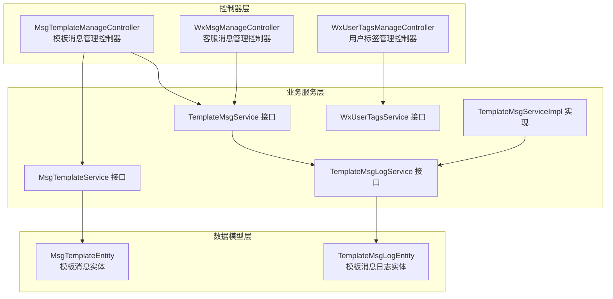
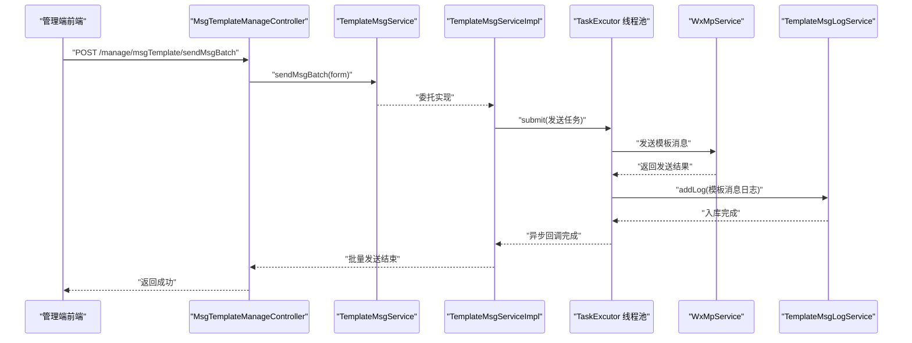
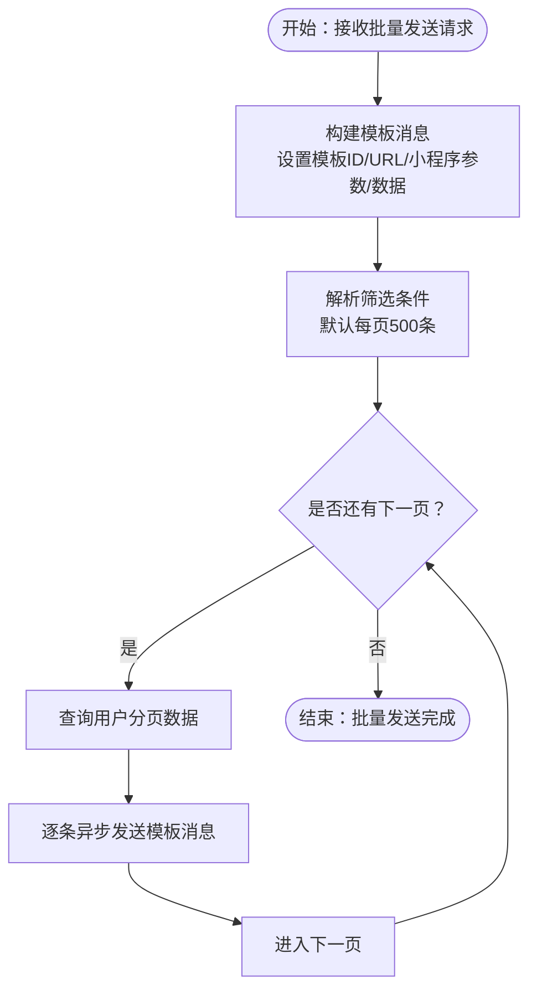
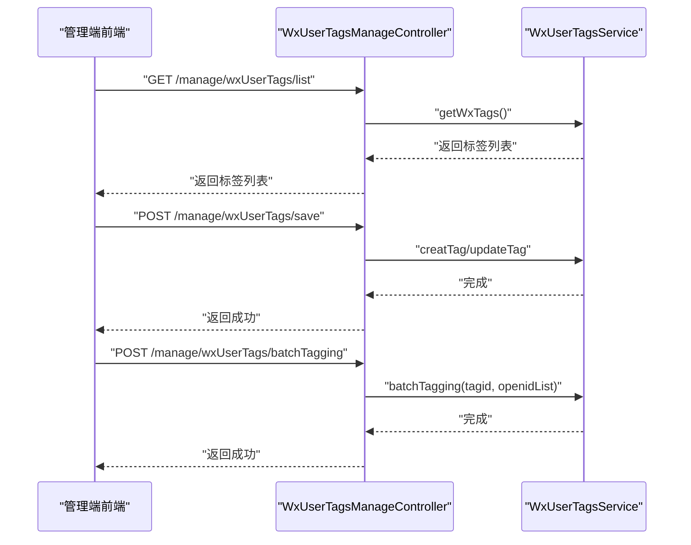
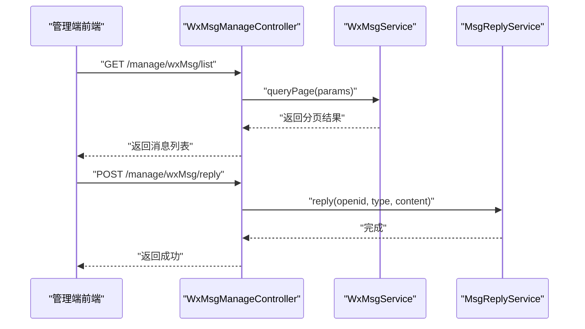
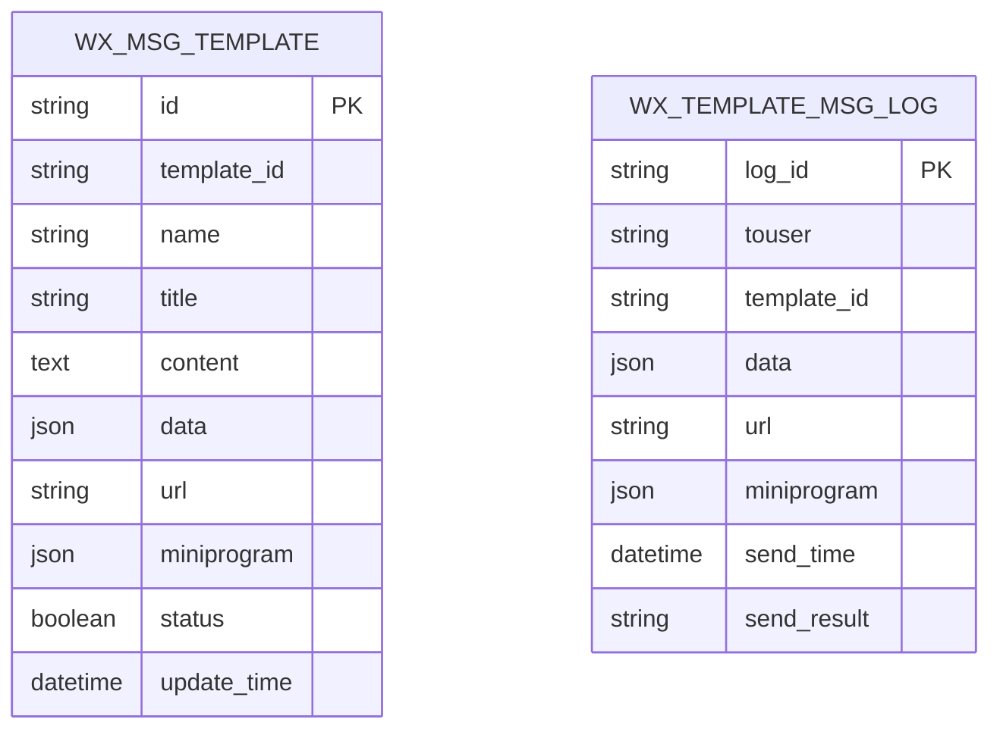
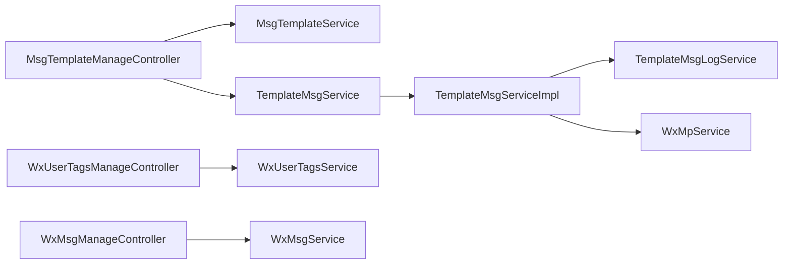

# 微信消息推送

<cite>
**本文引用的文件**
- [MsgTemplateManageController.java](file://platform-admin/src/main/java/com/platform/modules/wx/controller/MsgTemplateManageController.java)
- [WxUserTagsManageController.java](file://platform-admin/src/main/java/com/platform/modules/wx/controller/WxUserTagsManageController.java)
- [WxMsgManageController.java](file://platform-admin/src/main/java/com/platform/modules/wx/controller/WxMsgManageController.java)
- [TemplateMsgService.java](file://platform-biz/src/main/java/com/platform/modules/wx/service/TemplateMsgService.java)
- [TemplateMsgServiceImpl.java](file://platform-biz/src/main/java/com/platform/modules/wx/service/impl/TemplateMsgServiceImpl.java)
- [TemplateMsgLogService.java](file://platform-biz/src/main/java/com/platform/modules/wx/service/TemplateMsgLogService.java)
- [MsgTemplateEntity.java](file://platform-biz/src/main/java/com/platform/modules/wx/entity/MsgTemplateEntity.java)
- [TemplateMsgLogEntity.java](file://platform-biz/src/main/java/com/platform/modules/wx/entity/TemplateMsgLogEntity.java)
- [WxUserTagsService.java](file://platform-biz/src/main/java/com/platform/modules/wx/service/WxUserTagsService.java)
- [MsgTemplateService.java](file://platform-biz/src/main/java/com/platform/modules/wx/service/MsgTemplateService.java)
</cite>

## 目录
1. [简介](#简介)
2. [项目结构](#项目结构)
3. [核心组件](#核心组件)
4. [架构总览](#架构总览)
5. [详细组件分析](#详细组件分析)
6. [依赖分析](#依赖分析)
7. [性能考虑](#性能考虑)
8. [故障排查指南](#故障排查指南)
9. [结论](#结论)
10. [附录](#附录)

## 简介
本文件面向运营与技术团队，系统化梳理平台在微信生态中的消息推送能力，覆盖模板消息与客服消息两大方向。重点包括：
- 模板消息管理：模板配置、模板内容设计、模板参数绑定、模板同步与审核流程（对接微信平台）。
- 消息发送机制：单发、批量、条件筛选、异步执行与日志记录。
- 消息记录管理：发送记录查询、发送状态跟踪、发送结果统计。
- 用户标签管理：标签创建、用户打标签、标签筛选、标签运营。
- 运营指南：模板设计建议、发送时机选择、效果评估与优化。

## 项目结构
后端采用三层架构：
- 控制器层（platform-admin）：对外暴露REST接口，负责鉴权、参数校验与调用服务层。
- 业务服务层（platform-biz）：封装具体业务逻辑，如模板消息发送、日志记录、用户标签管理等。
- 数据模型层（platform-biz entity）：定义数据库映射实体，承载模板、日志、用户等数据结构。

图表来源
- [MsgTemplateManageController.java:1-178](file://platform-admin/src/main/java/com/platform/modules/wx/controller/MsgTemplateManageController.java#L1-L178)
- [WxUserTagsManageController.java:1-112](file://platform-admin/src/main/java/com/platform/modules/wx/controller/WxUserTagsManageController.java#L1-L112)
- [WxMsgManageController.java:1-101](file://platform-admin/src/main/java/com/platform/modules/wx/controller/WxMsgManageController.java#L1-L101)
- [TemplateMsgService.java:1-42](file://platform-biz/src/main/java/com/platform/modules/wx/service/TemplateMsgService.java#L1-L42)
- [TemplateMsgServiceImpl.java:1-102](file://platform-biz/src/main/java/com/platform/modules/wx/service/impl/TemplateMsgServiceImpl.java#L1-L102)
- [TemplateMsgLogService.java:1-46](file://platform-biz/src/main/java/com/platform/modules/wx/service/TemplateMsgLogService.java#L1-L46)
- [MsgTemplateEntity.java:1-78](file://platform-biz/src/main/java/com/platform/modules/wx/entity/MsgTemplateEntity.java#L1-L78)
- [TemplateMsgLogEntity.java:1-75](file://platform-biz/src/main/java/com/platform/modules/wx/entity/TemplateMsgLogEntity.java#L1-L75)

章节来源
- [MsgTemplateManageController.java:1-178](file://platform-admin/src/main/java/com/platform/modules/wx/controller/MsgTemplateManageController.java#L1-L178)
- [WxUserTagsManageController.java:1-112](file://platform-admin/src/main/java/com/platform/modules/wx/controller/WxUserTagsManageController.java#L1-L112)
- [WxMsgManageController.java:1-101](file://platform-admin/src/main/java/com/platform/modules/wx/controller/WxMsgManageController.java#L1-L101)
- [TemplateMsgService.java:1-42](file://platform-biz/src/main/java/com/platform/modules/wx/service/TemplateMsgService.java#L1-L42)
- [TemplateMsgServiceImpl.java:1-102](file://platform-biz/src/main/java/com/platform/modules/wx/service/impl/TemplateMsgServiceImpl.java#L1-L102)
- [TemplateMsgLogService.java:1-46](file://platform-biz/src/main/java/com/platform/modules/wx/service/TemplateMsgLogService.java#L1-L46)
- [MsgTemplateEntity.java:1-78](file://platform-biz/src/main/java/com/platform/modules/wx/entity/MsgTemplateEntity.java#L1-L78)
- [TemplateMsgLogEntity.java:1-75](file://platform-biz/src/main/java/com/platform/modules/wx/entity/TemplateMsgLogEntity.java#L1-L75)

## 核心组件
- 模板消息管理控制器：提供模板列表、详情、新增、更新、删除、同步微信模板、批量发送等功能。
- 用户标签管理控制器：提供标签列表、创建/更新/删除标签、批量打标签/取消标签。
- 客服消息管理控制器：提供消息列表、详情、回复、删除。
- 模板消息服务接口与实现：定义发送模板消息与批量发送的契约，实现异步发送与日志入库。
- 日志服务接口：定义分页查询与异步入库能力。
- 实体模型：模板消息实体与模板消息日志实体，承载模板配置、参数、小程序跳转、发送结果等字段。
- 用户标签服务接口：封装标签查询、创建、更新、删除与批量操作。

章节来源
- [MsgTemplateManageController.java:59-176](file://platform-admin/src/main/java/com/platform/modules/wx/controller/MsgTemplateManageController.java#L59-L176)
- [WxUserTagsManageController.java:51-110](file://platform-admin/src/main/java/com/platform/modules/wx/controller/WxUserTagsManageController.java#L51-L110)
- [WxMsgManageController.java:54-99](file://platform-admin/src/main/java/com/platform/modules/wx/controller/WxMsgManageController.java#L54-L99)
- [TemplateMsgService.java:27-41](file://platform-biz/src/main/java/com/platform/modules/wx/service/TemplateMsgService.java#L27-L41)
- [TemplateMsgServiceImpl.java:55-100](file://platform-biz/src/main/java/com/platform/modules/wx/service/impl/TemplateMsgServiceImpl.java#L55-L100)
- [TemplateMsgLogService.java:30-45](file://platform-biz/src/main/java/com/platform/modules/wx/service/TemplateMsgLogService.java#L30-L45)
- [MsgTemplateEntity.java:42-77](file://platform-biz/src/main/java/com/platform/modules/wx/entity/MsgTemplateEntity.java#L42-L77)
- [TemplateMsgLogEntity.java:42-74](file://platform-biz/src/main/java/com/platform/modules/wx/entity/TemplateMsgLogEntity.java#L42-L74)
- [WxUserTagsService.java:29-98](file://platform-biz/src/main/java/com/platform/modules/wx/service/WxUserTagsService.java#L29-L98)

## 架构总览
系统围绕“控制器—服务—实体”分层展开，模板消息发送采用异步线程池执行，确保高并发下的稳定性；日志服务异步入库，避免阻塞主线程。

图表来源
- [MsgTemplateManageController.java:169-176](file://platform-admin/src/main/java/com/platform/modules/wx/controller/MsgTemplateManageController.java#L169-L176)
- [TemplateMsgServiceImpl.java:55-100](file://platform-biz/src/main/java/com/platform/modules/wx/service/impl/TemplateMsgServiceImpl.java#L55-L100)
- [TemplateMsgLogService.java:40-45](file://platform-biz/src/main/java/com/platform/modules/wx/service/TemplateMsgLogService.java#L40-L45)

## 详细组件分析

### 模板消息管理
- 功能点
  - 列表与详情：支持分页查询与按主键/名称查询。
  - 增删改：支持新增、更新（含更新时间）、删除。
  - 同步微信模板：从微信平台拉取已添加模板并落库。
  - 批量发送：按条件筛选用户，分页拉取用户并逐条异步发送模板消息。
- 关键实现
  - 控制器通过服务层调用实现批量发送与模板同步。
  - 服务实现中使用线程池异步发送，避免阻塞请求线程。
  - 发送完成后写入模板消息日志，便于后续追踪与统计。

图表来源
- [TemplateMsgServiceImpl.java:74-100](file://platform-biz/src/main/java/com/platform/modules/wx/service/impl/TemplateMsgServiceImpl.java#L74-L100)

章节来源
- [MsgTemplateManageController.java:59-176](file://platform-admin/src/main/java/com/platform/modules/wx/controller/MsgTemplateManageController.java#L59-L176)
- [TemplateMsgServiceImpl.java:55-100](file://platform-biz/src/main/java/com/platform/modules/wx/service/impl/TemplateMsgServiceImpl.java#L55-L100)
- [MsgTemplateEntity.java:42-77](file://platform-biz/src/main/java/com/platform/modules/wx/entity/MsgTemplateEntity.java#L42-L77)

### 用户标签管理
- 功能点
  - 标签列表：获取公众号用户标签。
  - 标签维护：创建、更新、删除标签。
  - 批量标签：对指定标签批量打标/取消打标。
- 关键实现
  - 控制器统一入口，调用服务层完成标签操作。
  - 服务层封装微信标签API调用，保证幂等与一致性。

图表来源
- [WxUserTagsManageController.java:51-110](file://platform-admin/src/main/java/com/platform/modules/wx/controller/WxUserTagsManageController.java#L51-L110)
- [WxUserTagsService.java:36-98](file://platform-biz/src/main/java/com/platform/modules/wx/service/WxUserTagsService.java#L36-L98)

章节来源
- [WxUserTagsManageController.java:51-110](file://platform-admin/src/main/java/com/platform/modules/wx/controller/WxUserTagsManageController.java#L51-L110)
- [WxUserTagsService.java:29-98](file://platform-biz/src/main/java/com/platform/modules/wx/service/WxUserTagsService.java#L29-L98)

### 客服消息管理
- 功能点
  - 消息列表与详情：支持分页查询与按主键查询。
  - 回复：对用户消息进行回复。
  - 删除：删除历史消息记录。
- 关键实现
  - 控制器调用消息服务与回复服务，完成消息处理与回复。

图表来源
- [WxMsgManageController.java:54-99](file://platform-admin/src/main/java/com/platform/modules/wx/controller/WxMsgManageController.java#L54-L99)

章节来源
- [WxMsgManageController.java:54-99](file://platform-admin/src/main/java/com/platform/modules/wx/controller/WxMsgManageController.java#L54-L99)

### 模板消息实体与日志实体
- 模板消息实体
  - 字段：模板ID、名称、标题、内容、参数数组、跳转URL、小程序参数、状态、更新时间等。
  - 用途：存储模板配置与参数结构，支持与微信模板同步。
- 模板消息日志实体
  - 字段：日志ID、目标用户、模板ID、参数数组、URL、小程序参数、发送时间、发送结果。
  - 用途：记录每次发送的明细，用于查询、统计与问题定位。

图表来源
- [MsgTemplateEntity.java:42-77](file://platform-biz/src/main/java/com/platform/modules/wx/entity/MsgTemplateEntity.java#L42-L77)
- [TemplateMsgLogEntity.java:42-74](file://platform-biz/src/main/java/com/platform/modules/wx/entity/TemplateMsgLogEntity.java#L42-L74)

章节来源
- [MsgTemplateEntity.java:42-77](file://platform-biz/src/main/java/com/platform/modules/wx/entity/MsgTemplateEntity.java#L42-L77)
- [TemplateMsgLogEntity.java:42-74](file://platform-biz/src/main/java/com/platform/modules/wx/entity/TemplateMsgLogEntity.java#L42-L74)

## 依赖分析
- 控制器到服务：各控制器均通过构造注入方式依赖对应服务接口，职责清晰、耦合度低。
- 服务到微信SDK：模板消息发送通过WxMpService异步执行，降低外部依赖带来的阻塞风险。
- 日志解耦：模板消息发送完成后异步入库，避免影响请求响应时间。
- 标签服务：标签相关操作通过WxUserTagsService统一抽象，便于扩展与替换实现。

图表来源
- [MsgTemplateManageController.java:50-51](file://platform-admin/src/main/java/com/platform/modules/wx/controller/MsgTemplateManageController.java#L50-L51)
- [WxUserTagsManageController.java:46](file://platform-admin/src/main/java/com/platform/modules/wx/controller/WxUserTagsManageController.java#L46)
- [WxMsgManageController.java:48-49](file://platform-admin/src/main/java/com/platform/modules/wx/controller/WxMsgManageController.java#L48-L49)
- [TemplateMsgServiceImpl.java:48-50](file://platform-biz/src/main/java/com/platform/modules/wx/service/impl/TemplateMsgServiceImpl.java#L48-L50)

章节来源
- [MsgTemplateManageController.java:50-51](file://platform-admin/src/main/java/com/platform/modules/wx/controller/MsgTemplateManageController.java#L50-L51)
- [WxUserTagsManageController.java:46](file://platform-admin/src/main/java/com/platform/modules/wx/controller/WxUserTagsManageController.java#L46)
- [WxMsgManageController.java:48-49](file://platform-admin/src/main/java/com/platform/modules/wx/controller/WxMsgManageController.java#L48-L49)
- [TemplateMsgServiceImpl.java:48-50](file://platform-biz/src/main/java/com/platform/modules/wx/service/impl/TemplateMsgServiceImpl.java#L48-L50)

## 性能考虑
- 异步发送：模板消息发送采用线程池异步执行，避免阻塞请求线程，提升吞吐。
- 分页批量：批量发送按每页500条分批拉取用户并逐条发送，降低单次压力。
- 日志异步入库：发送完成后异步入库，减少IO对主流程的影响。
- 并发控制：线程池大小与队列容量需结合服务器资源与微信限流策略合理配置，避免抖动。

## 故障排查指南
- 发送失败
  - 检查模板ID是否正确、参数是否符合微信要求、小程序跳转参数是否完整。
  - 查看模板消息日志表，定位发送时间、发送结果与异常信息。
- 批量发送未覆盖全部用户
  - 确认筛选条件是否正确，检查分页参数与总数限制。
  - 关注日志中每页处理数量与总页数，确认循环是否正常结束。
- 标签操作异常
  - 确认标签ID有效性与用户OpenID列表格式。
  - 检查微信侧标签上限与接口权限。

章节来源
- [TemplateMsgLogEntity.java:57-68](file://platform-biz/src/main/java/com/platform/modules/wx/entity/TemplateMsgLogEntity.java#L57-L68)
- [TemplateMsgServiceImpl.java:74-100](file://platform-biz/src/main/java/com/platform/modules/wx/service/impl/TemplateMsgServiceImpl.java#L74-L100)
- [WxUserTagsManageController.java:78-110](file://platform-admin/src/main/java/com/platform/modules/wx/controller/WxUserTagsManageController.java#L78-L110)

## 结论
该系统以清晰的分层架构实现了微信模板消息与客服消息的核心能力，具备完善的模板管理、批量发送、异步日志与用户标签体系。通过异步与分页策略，系统在高并发场景下仍可保持稳定与可观的吞吐。建议在生产环境中结合微信限流与自身资源情况，持续优化线程池与分页参数，完善监控与告警，以保障消息推送的可靠性与效果。

## 附录

### 运营指南：模板消息设计与发送策略
- 模板设计
  - 明确触发场景与用户意图，确保标题与内容简洁明确、直达主题。
  - 参数绑定要语义化，避免硬编码，便于运营灵活调整。
- 发送时机
  - 事件驱动：订单状态变更、支付成功、发货通知、活动提醒等。
  - 节假日与生日祝福等情感化节点。
- 发送策略
  - 单发：针对高价值用户或个性化场景。
  - 批量：基于标签与行为画像筛选用户，分批触达。
  - 条件筛选：结合用户属性、消费频次、最近行为等维度。
- 效果评估与优化
  - 关注打开率、点击率、转化率与退订率。
  - 对比不同模板、不同时间段、不同标签的效果，持续迭代。

### 常用接口一览（控制器）
- 模板消息管理
  - GET /manage/msgTemplate/list：分页查询模板
  - GET /manage/msgTemplate/info/{id}：按主键查询
  - GET /manage/msgTemplate/getByName：按名称查询
  - POST /manage/msgTemplate/save：新增模板
  - POST /manage/msgTemplate/update：更新模板
  - POST /manage/msgTemplate/delete：删除模板
  - POST /manage/msgTemplate/syncWxTemplate：同步微信模板
  - POST /manage/msgTemplate/sendMsgBatch：批量发送模板消息
- 用户标签管理
  - GET /manage/wxUserTags/list：标签列表
  - POST /manage/wxUserTags/save：创建/更新标签
  - POST /manage/wxUserTags/delete/{tagid}：删除标签
  - POST /manage/wxUserTags/batchTagging：批量打标签
  - POST /manage/wxUserTags/batchUnTagging：批量取消标签
- 客服消息管理
  - GET /manage/wxMsg/list：消息列表
  - GET /manage/wxMsg/info/{id}：消息详情
  - POST /manage/wxMsg/reply：回复消息
  - POST /manage/wxMsg/delete：删除消息

章节来源
- [MsgTemplateManageController.java:59-176](file://platform-admin/src/main/java/com/platform/modules/wx/controller/MsgTemplateManageController.java#L59-L176)
- [WxUserTagsManageController.java:51-110](file://platform-admin/src/main/java/com/platform/modules/wx/controller/WxUserTagsManageController.java#L51-L110)
- [WxMsgManageController.java:54-99](file://platform-admin/src/main/java/com/platform/modules/wx/controller/WxMsgManageController.java#L54-L99)