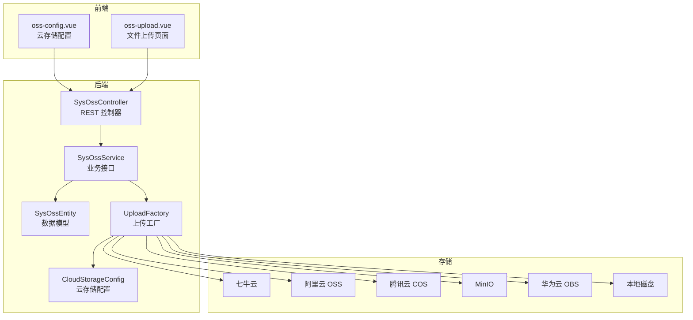
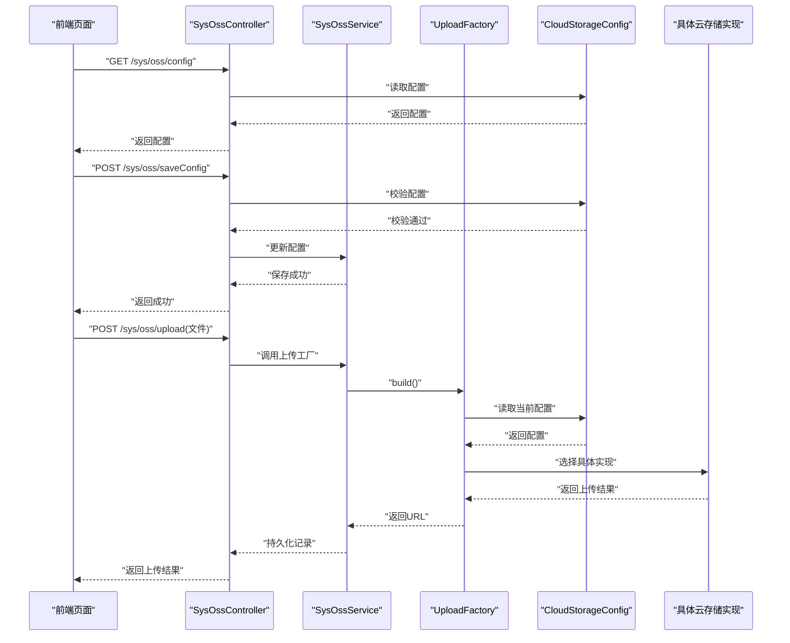
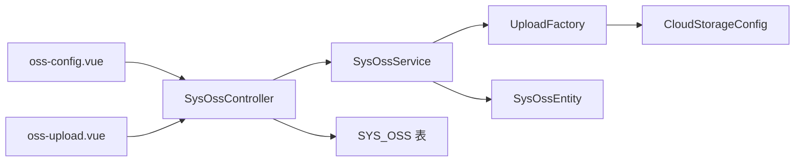

# 文件存储模块

<cite>
**本文引用的文件**
- [SysOssController.java](file://platform-admin/src/main/java/com/platform/modules/oss/controller/SysOssController.java)
- [oss-config.vue](file://platform-admin-ui/src/views/modules/oss/oss-config.vue)
- [oss-upload.vue](file://platform-admin-ui/src/views/modules/oss/oss-upload.vue)
- [base.sql](file://_sql/base.sql)
- [application.yml](file://platform-admin/src/main/resources/application.yml)
- [CloudStorageConfig.java](file://platform-biz/src/main/java/com/platform/modules/oss/cloud/CloudStorageConfig.java)
- [UploadFactory.java](file://platform-biz/src/main/java/com/platform/modules/oss/cloud/UploadFactory.java)
- [SysOssEntity.java](file://platform-biz/src/main/java/com/platform/modules/oss/entity/SysOssEntity.java)
- [SysOssService.java](file://platform-biz/src/main/java/com/platform/modules/oss/service/SysOssService.java)
- [webuploader.withoutimage.js](file://platform-admin-ui/static/ueditor/third-party/webuploader/webuploader.withoutimage.js)
- [webuploader.js](file://platform-admin-ui/static/ueditor/third-party/webuploader/webuploader.js)
- [webuploader.html5only.js](file://platform-admin-ui/static/ueditor/third-party/webuploader/webuploader.html5only.js)
- [webuploader.flashonly.js](file://platform-admin-ui/static/ueditor/third-party/webuploader/webuploader.flashonly.js)
- [webuploader.custom.js](file://platform-admin-ui/static/ueditor/third-party/webuploader/webuploader.custom.js)
</cite>

## 目录
1. [简介](#简介)
2. [项目结构](#项目结构)
3. [核心组件](#核心组件)
4. [架构概览](#架构概览)
5. [详细组件分析](#详细组件分析)
6. [依赖分析](#依赖分析)
7. [性能考虑](#性能考虑)
8. [故障排查指南](#故障排查指南)
9. [结论](#结论)
10. [附录](#附录)

## 简介
本文件存储模块面向平台的文件上传与存储管理，覆盖以下能力：
- 文件上传接口与前端上传组件
- 文件验证、格式检查、大小限制等上传控制机制
- 多云存储集成（七牛云、阿里云 OSS、腾讯云 COS、MinIO、华为云 OBS、本地磁盘）
- 图片处理能力（压缩、格式转换、缩略图生成）
- 文件安全管理（权限控制、访问控制、防盗链、文件清理）

该模块通过统一的云存储配置与工厂模式，屏蔽不同云厂商差异，提供一致的上传体验；同时结合前端 WebUploader 组件，实现多场景的上传控制与图片处理。

## 项目结构
文件存储模块由“前端界面 + 后端控制器 + 业务服务 + 数据模型 + 云存储适配”构成，核心目录如下：
- 平台管理端（后端）：提供文件上传接口、云存储配置与管理
- 平台管理端（前端）：提供云存储配置页面与上传页面
- 业务层：封装云存储配置、上传工厂与数据模型
- 数据库：记录上传文件元数据

图表来源
- [SysOssController.java:1-139](file://platform-admin/src/main/java/com/platform/modules/oss/controller/SysOssController.java#L1-L139)
- [SysOssService.java:1-43](file://platform-biz/src/main/java/com/platform/modules/oss/service/SysOssService.java#L1-L43)
- [SysOssEntity.java:1-58](file://platform-biz/src/main/java/com/platform/modules/oss/entity/SysOssEntity.java#L1-L58)
- [CloudStorageConfig.java:1-188](file://platform-biz/src/main/java/com/platform/modules/oss/cloud/CloudStorageConfig.java#L1-L188)
- [UploadFactory.java:1-59](file://platform-biz/src/main/java/com/platform/modules/oss/cloud/UploadFactory.java#L1-L59)
- [oss-config.vue:1-178](file://platform-admin-ui/src/views/modules/oss/oss-config.vue#L1-L178)
- [oss-upload.vue](file://platform-admin-ui/src/views/modules/oss/oss-upload.vue)

章节来源
- [SysOssController.java:1-139](file://platform-admin/src/main/java/com/platform/modules/oss/controller/SysOssController.java#L1-L139)
- [oss-config.vue:1-178](file://platform-admin-ui/src/views/modules/oss/oss-config.vue#L1-L178)

## 核心组件
- 控制器：提供文件上传配置、保存配置、分页查询等功能
- 业务服务：封装分页查询与数据权限控制
- 数据模型：持久化文件上传记录
- 云存储配置：统一的配置对象，支持多种云厂商参数
- 上传工厂：根据配置动态选择具体云存储实现
- 前端上传组件：WebUploader，支持文件数量、大小、去重等校验与图片压缩

章节来源
- [SysOssController.java:70-139](file://platform-admin/src/main/java/com/platform/modules/oss/controller/SysOssController.java#L70-L139)
- [SysOssService.java:33-42](file://platform-biz/src/main/java/com/platform/modules/oss/service/SysOssService.java#L33-L42)
- [SysOssEntity.java:34-57](file://platform-biz/src/main/java/com/platform/modules/oss/entity/SysOssEntity.java#L34-L57)
- [CloudStorageConfig.java:37-187](file://platform-biz/src/main/java/com/platform/modules/oss/cloud/CloudStorageConfig.java#L37-L187)
- [UploadFactory.java:31-56](file://platform-biz/src/main/java/com/platform/modules/oss/cloud/UploadFactory.java#L31-L56)
- [oss-config.vue:1-178](file://platform-admin-ui/src/views/modules/oss/oss-config.vue#L1-L178)

## 架构概览
文件上传流程从前端发起，经后端控制器校验与权限控制，调用业务服务与上传工厂，最终写入云存储或本地磁盘，并记录到数据库。

图表来源
- [SysOssController.java:93-139](file://platform-admin/src/main/java/com/platform/modules/oss/controller/SysOssController.java#L93-L139)
- [SysOssService.java:33-42](file://platform-biz/src/main/java/com/platform/modules/oss/service/SysOssService.java#L33-L42)
- [UploadFactory.java:31-56](file://platform-biz/src/main/java/com/platform/modules/oss/cloud/UploadFactory.java#L31-L56)
- [CloudStorageConfig.java:37-187](file://platform-biz/src/main/java/com/platform/modules/oss/cloud/CloudStorageConfig.java#L37-L187)

## 详细组件分析

### 后端控制器：SysOssController
- 提供云存储配置查询与保存接口，支持按云厂商分组校验
- 提供文件分页查询接口，内置数据权限控制
- 使用注解进行权限控制与日志记录

章节来源
- [SysOssController.java:70-139](file://platform-admin/src/main/java/com/platform/modules/oss/controller/SysOssController.java#L70-L139)

### 业务服务：SysOssService
- 定义分页查询接口，便于扩展数据权限与过滤条件
- 作为上传流程的桥梁，协调控制器与工厂

章节来源
- [SysOssService.java:33-42](file://platform-biz/src/main/java/com/platform/modules/oss/service/SysOssService.java#L33-L42)

### 数据模型：SysOssEntity
- 记录上传文件的URL、创建人、创建部门与创建时间
- 与数据库表 SYS_OSS 对应

章节来源
- [SysOssEntity.java:34-57](file://platform-biz/src/main/java/com/platform/modules/oss/entity/SysOssEntity.java#L34-L57)
- [base.sql:624-634](file://_sql/base.sql#L624-L634)

### 云存储配置：CloudStorageConfig
- 统一配置对象，支持类型枚举与分组校验
- 支持七牛、阿里云、腾讯云、MinIO、华为云、本地磁盘等配置项
- 通过分组校验确保各云厂商必填参数齐全

章节来源
- [CloudStorageConfig.java:37-187](file://platform-biz/src/main/java/com/platform/modules/oss/cloud/CloudStorageConfig.java#L37-L187)

### 上传工厂：UploadFactory
- 依据配置类型动态构建具体云存储实现
- 通过 Spring 上下文获取配置服务，保证配置一致性

章节来源
- [UploadFactory.java:31-56](file://platform-biz/src/main/java/com/platform/modules/oss/cloud/UploadFactory.java#L31-L56)

### 前端上传组件：WebUploader
- 支持文件数量限制、单文件大小限制、去重等校验
- 支持图片压缩与缩略图生成，提升上传效率与用户体验
- 提供 HTML5/Flash 多运行时适配

章节来源
- [webuploader.withoutimage.js:3413-3541](file://platform-admin-ui/static/ueditor/third-party/webuploader/webuploader.withoutimage.js#L3413-L3541)
- [webuploader.js:3779-3907](file://platform-admin-ui/static/ueditor/third-party/webuploader/webuploader.js#L3779-L3907)
- [webuploader.html5only.js:3779-3907](file://platform-admin-ui/static/ueditor/third-party/webuploader/webuploader.html5only.js#L3779-L3907)
- [webuploader.flashonly.js:3585-3713](file://platform-admin-ui/static/ueditor/third-party/webuploader/webuploader.flashonly.js#L3585-L3713)
- [webuploader.custom.js:1820-2001](file://platform-admin-ui/static/ueditor/third-party/webuploader/webuploader.custom.js#L1820-L2001)

### 前端页面：oss-config.vue 与 oss-upload.vue
- oss-config.vue：提供云存储配置页面，支持多厂商参数录入与校验
- oss-upload.vue：提供文件上传页面，集成 WebUploader 组件

章节来源
- [oss-config.vue:1-178](file://platform-admin-ui/src/views/modules/oss/oss-config.vue#L1-L178)
- [oss-upload.vue](file://platform-admin-ui/src/views/modules/oss/oss-upload.vue)

## 依赖分析
- 控制器依赖业务服务与配置服务，实现权限控制与配置读写
- 工厂依赖配置对象，按类型选择具体云存储实现
- 前端页面依赖后端接口与 WebUploader 组件
- 数据模型与数据库表一一对应，支撑文件元数据持久化

图表来源
- [SysOssController.java:1-139](file://platform-admin/src/main/java/com/platform/modules/oss/controller/SysOssController.java#L1-L139)
- [SysOssService.java:1-43](file://platform-biz/src/main/java/com/platform/modules/oss/service/SysOssService.java#L1-L43)
- [SysOssEntity.java:1-58](file://platform-biz/src/main/java/com/platform/modules/oss/entity/SysOssEntity.java#L1-L58)
- [CloudStorageConfig.java:1-188](file://platform-biz/src/main/java/com/platform/modules/oss/cloud/CloudStorageConfig.java#L1-L188)
- [UploadFactory.java:1-59](file://platform-biz/src/main/java/com/platform/modules/oss/cloud/UploadFactory.java#L1-L59)
- [oss-config.vue:1-178](file://platform-admin-ui/src/views/modules/oss/oss-config.vue#L1-L178)
- [oss-upload.vue](file://platform-admin-ui/src/views/modules/oss/oss-upload.vue)
- [base.sql:624-634](file://_sql/base.sql#L624-L634)

## 性能考虑
- 上传大小限制：后端与前端均设置最大文件与请求大小，避免资源浪费
- 图片压缩：前端对图片进行压缩与缩略图生成，降低带宽与存储压力
- 去重与并发：前端上传组件支持去重与并发控制，减少重复上传
- 存储选择：根据业务场景选择合适的云存储或本地磁盘，平衡成本与性能

章节来源
- [application.yml:76-80](file://platform-admin/src/main/resources/application.yml#L76-L80)
- [webuploader.withoutimage.js:3413-3541](file://platform-admin-ui/static/ueditor/third-party/webuploader/webuploader.withoutimage.js#L3413-L3541)
- [webuploader.js:3779-3907](file://platform-admin-ui/static/ueditor/third-party/webuploader/webuploader.js#L3779-L3907)
- [webuploader.html5only.js:3779-3907](file://platform-admin-ui/static/ueditor/third-party/webuploader/webuploader.html5only.js#L3779-L3907)
- [webuploader.flashonly.js:3585-3713](file://platform-admin-ui/static/ueditor/third-party/webuploader/webuploader.flashonly.js#L3585-L3713)
- [webuploader.custom.js:1820-2001](file://platform-admin-ui/static/ueditor/third-party/webuploader/webuploader.custom.js#L1820-L2001)

## 故障排查指南
- 配置校验失败：确认 oss-config.vue 中各云厂商参数是否符合分组校验要求
- 上传失败：检查后端日志与前端错误提示，关注文件大小、格式与去重策略
- 云存储连接问题：核对 AccessKey、SecretKey、BucketName、Endpoint 等参数
- 数据库异常：确认 SYS_OSS 表结构与字段是否匹配数据模型

章节来源
- [SysOssController.java:112-139](file://platform-admin/src/main/java/com/platform/modules/oss/controller/SysOssController.java#L112-L139)
- [CloudStorageConfig.java:37-187](file://platform-biz/src/main/java/com/platform/modules/oss/cloud/CloudStorageConfig.java#L37-L187)
- [base.sql:624-634](file://_sql/base.sql#L624-L634)

## 结论
文件存储模块通过清晰的分层设计与统一的配置体系，实现了多云存储的无缝接入与高效的文件上传体验。结合前端上传组件的严格校验与图片处理能力，能够满足大多数业务场景的文件管理需求。建议在生产环境中进一步完善访问控制与防盗链策略，并定期清理过期文件，保障系统稳定与安全。

## 附录
- 数据库表：SYS_OSS 字段包括 ID、URL、创建人ID、创建人部门、创建时间
- 云存储类型：七牛云、阿里云 OSS、腾讯云 COS、MinIO、华为云 OBS、本地磁盘
- 前端组件：WebUploader 提供文件数量、大小、去重与图片压缩能力

章节来源
- [base.sql:624-634](file://_sql/base.sql#L624-L634)
- [CloudStorageConfig.java:42-45](file://platform-biz/src/main/java/com/platform/modules/oss/cloud/CloudStorageConfig.java#L42-L45)
- [webuploader.withoutimage.js:3413-3541](file://platform-admin-ui/static/ueditor/third-party/webuploader/webuploader.withoutimage.js#L3413-L3541)