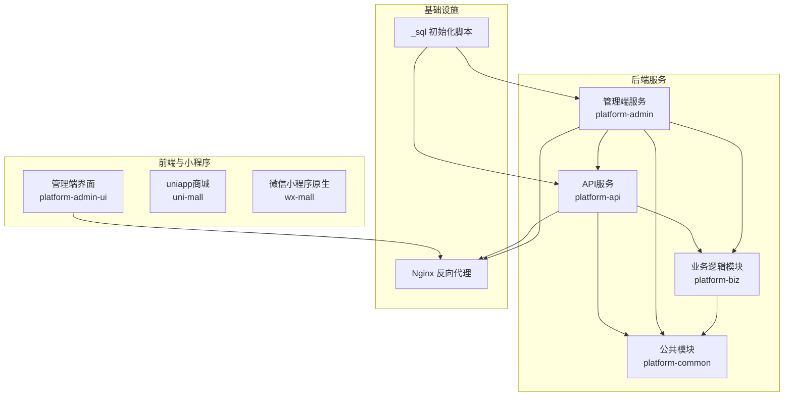
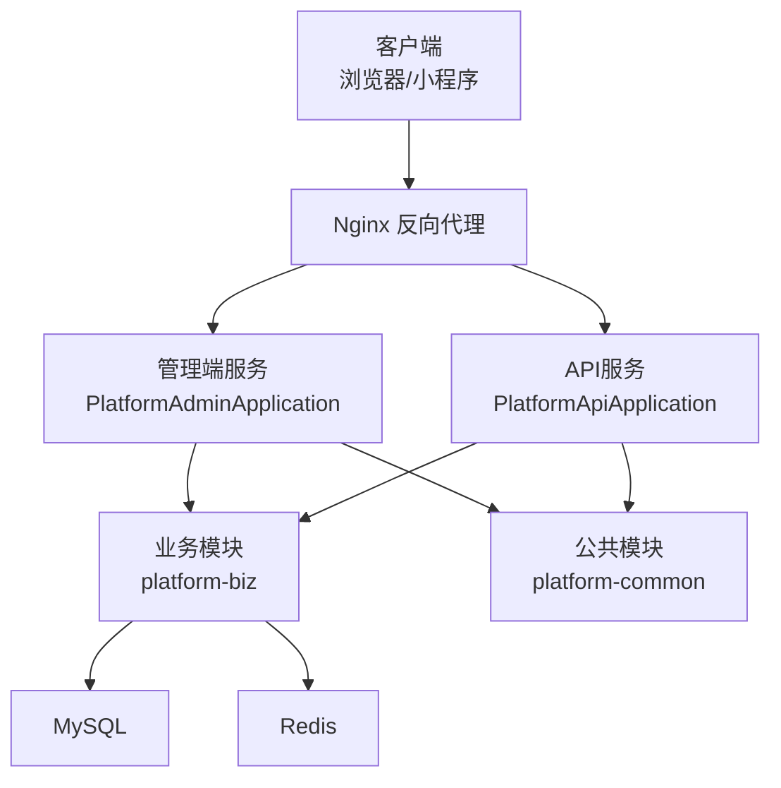
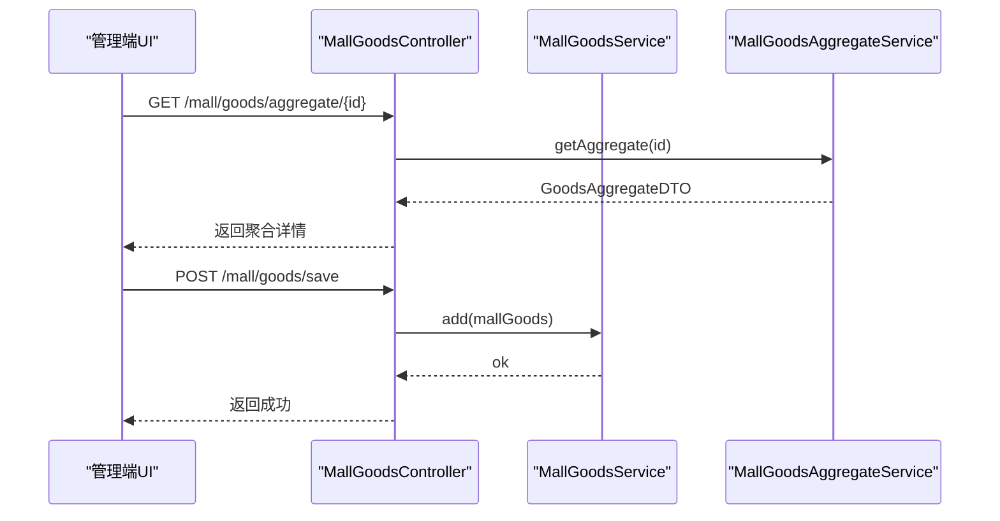
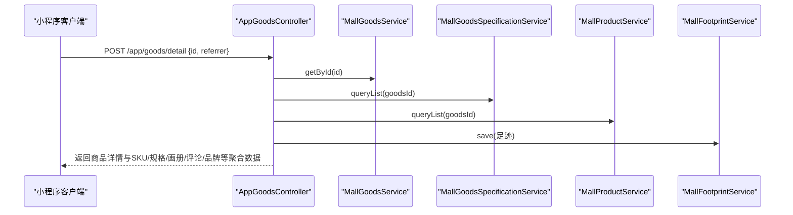
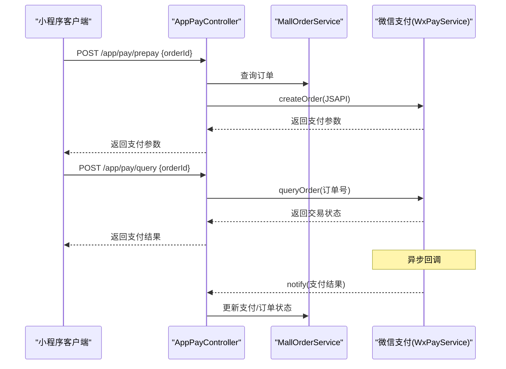
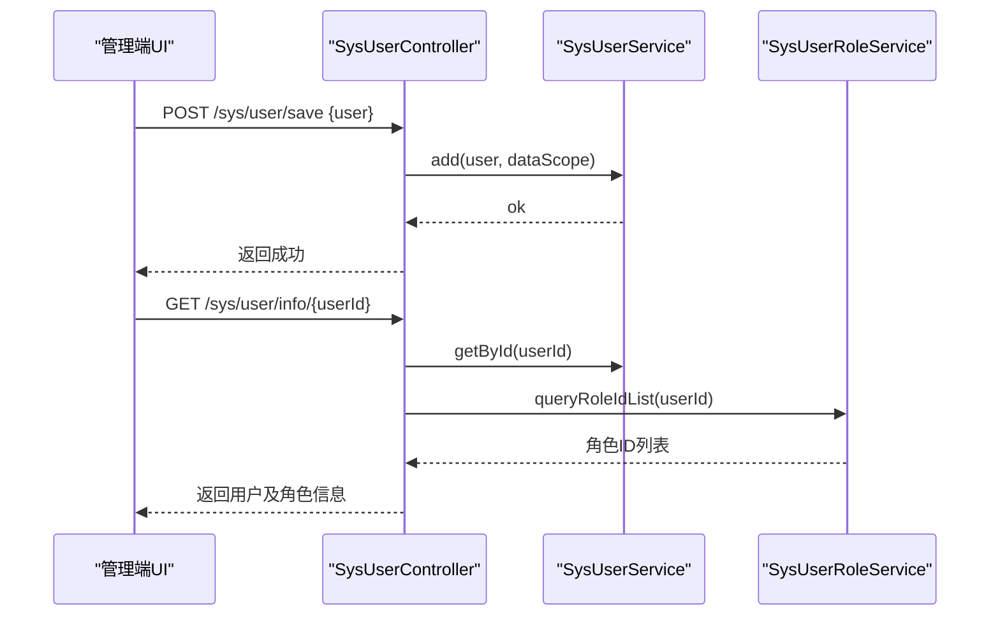
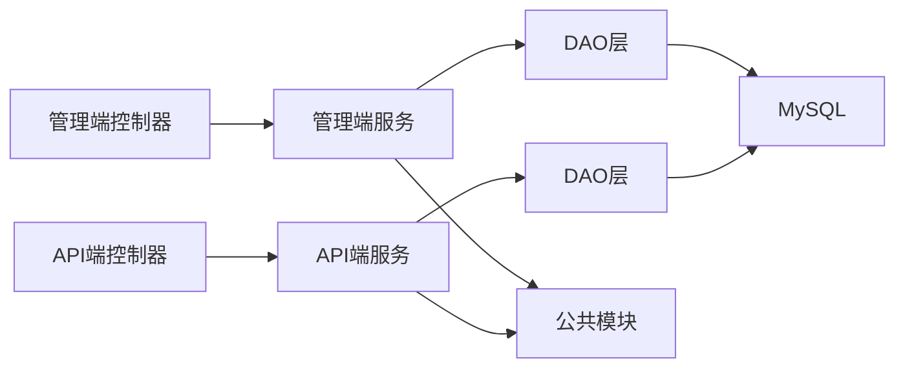

# 核心业务功能

<cite>
**本文引用的文件**   
- [平台管理应用启动类](file://platform-admin/src/main/java/com/platform/PlatformAdminApplication.java)
- [平台API应用启动类](file://platform-api/src/main/java/com/platform/PlatformApiApplication.java)
- [系统常量定义](file://platform-common/src/main/java/com/platform/common/utils/Constant.java)
- [商品控制器（管理端）](file://platform-admin/src/main/java/com/platform/modules/mall/controller/MallGoodsController.java)
- [商品控制器（小程序端）](file://platform-api/src/main/java/com/platform/modules/app/controller/AppGoodsController.java)
- [支付控制器（小程序端）](file://platform-api/src/main/java/com/platform/modules/app/controller/AppPayController.java)
- [系统用户控制器（管理端）](file://platform-admin/src/main/java/com/platform/modules/sys/controller/SysUserController.java)
- [基础SQL脚本](file://_sql/base.sql)
- [项目说明文档](file://README.md)
</cite>

## 目录
1. [简介](#简介)
2. [项目结构](#项目结构)
3. [核心组件](#核心组件)
4. [架构总览](#架构总览)
5. [详细组件分析](#详细组件分析)
6. [依赖分析](#依赖分析)
7. [性能考虑](#性能考虑)
8. [故障排查指南](#故障排查指南)
9. [结论](#结论)
10. [附录](#附录)

## 简介
本文件面向业务分析师、产品经理与开发者，系统化梳理平台的核心业务功能与实现要点，覆盖以下方面：
- 商城业务模块：商品管理（商品、分类、品牌、规格）、订单处理（下单、支付、发货、售后）、用户管理（会员、等级、购物车、地址）、营销活动（优惠券、促销、搜索历史）
- 系统管理模块：用户权限管理、系统配置管理、日志审计、数据字典管理
- 微信业务模块：微信公众号、小程序开发、支付处理、消息推送
- 文件存储模块：文件上传处理、云存储集成、图片处理
- 平台整体架构与前后端交互流程，帮助快速理解与落地实施

## 项目结构
平台采用多模块分层架构，包含后端服务（管理端与API端）、前端管理界面、小程序与公众号工程、通用公共模块以及初始化SQL脚本。

**图表来源**
- [平台管理应用启动类:42-92](file://platform-admin/src/main/java/com/platform/PlatformAdminApplication.java#L42-L92)
- [平台API应用启动类:41-91](file://platform-api/src/main/java/com/platform/PlatformApiApplication.java#L41-L91)
- [项目说明文档:59-100](file://README.md#L59-L100)

**章节来源**
- [平台管理应用启动类:42-92](file://platform-admin/src/main/java/com/platform/PlatformAdminApplication.java#L42-L92)
- [平台API应用启动类:41-91](file://platform-api/src/main/java/com/platform/PlatformApiApplication.java#L41-L91)
- [项目说明文档:59-100](file://README.md#L59-L100)

## 核心组件
- 启动类与服务入口
  - 管理端服务启动类负责后台管理接口的启动与首页提示，开启异步与动态数据源配置。
  - API服务启动类负责小程序商城接口的启动与首页提示，开启异步能力。
- 通用常量与枚举
  - 统一维护系统常量、云存储服务商枚举、短信服务商枚举、定时任务状态等，便于跨模块复用。
- 控制器层
  - 管理端：商品、用户、系统配置、字典、日志、菜单、角色、组织等控制器，提供RBAC权限控制与审计日志。
  - API端：商品、支付、用户、地址、购物车、评论、收藏、足迹、搜索历史等控制器，支撑小程序端业务。
- 数据模型与SQL
  - 初始化SQL包含调度任务相关表与业务表，确保服务启动后具备基础数据结构。

**章节来源**
- [平台管理应用启动类:42-92](file://platform-admin/src/main/java/com/platform/PlatformAdminApplication.java#L42-L92)
- [平台API应用启动类:41-91](file://platform-api/src/main/java/com/platform/PlatformApiApplication.java#L41-L91)
- [系统常量定义:26-240](file://platform-common/src/main/java/com/platform/common/utils/Constant.java#L26-L240)
- [基础SQL脚本:1-200](file://_sql/base.sql#L1-L200)

## 架构总览
平台采用“管理端 + API端 + 前端界面 + 小程序/公众号”的分层架构，通过Nginx统一反向代理与静态资源托管，后端服务通过Swagger文档暴露REST接口，支持管理端与小程序端双端业务。

**图表来源**
- [平台管理应用启动类:42-92](file://platform-admin/src/main/java/com/platform/PlatformAdminApplication.java#L42-L92)
- [平台API应用启动类:41-91](file://platform-api/src/main/java/com/platform/PlatformApiApplication.java#L41-L91)
- [项目说明文档:140-152](file://README.md#L140-L152)

## 详细组件分析

### 商城业务模块

#### 商品管理（管理端）
- 功能点
  - 商品列表分页查询、详情查看、聚合信息查询、新增/修改、批量删除
  - 支持聚合保存与更新，便于组合商品、规格、画册、参数等信息
- 关键接口
  - 列表与分页：GET mall/goods/list
  - 详情：GET mall/goods/info/{id}
  - 聚合详情：GET mall/goods/aggregate/{id}
  - 新增/更新/删除：POST mall/goods/save、POST mall/goods/update、POST mall/goods/delete
- 权限控制
  - 基于Shiro的权限注解，如 mall:goods:list、mall:goods:save、mall:goods:update、mall:goods:delete

**图表来源**
- [商品控制器（管理端）:105-138](file://platform-admin/src/main/java/com/platform/modules/mall/controller/MallGoodsController.java#L105-L138)

**章节来源**
- [商品控制器（管理端）:55-182](file://platform-admin/src/main/java/com/platform/modules/mall/controller/MallGoodsController.java#L55-L182)

#### 商品管理（小程序端）
- 功能点
  - 商品首页、详情页、分类筛选、新品/热销推荐、相关商品推荐、商品SKU信息、购物车数量联动
  - 搜索历史记录、收藏/足迹、评论与图片、品牌信息、规格与库存明细
- 关键接口
  - 商品首页：/app/goods/index
  - 商品详情：/app/goods/detail
  - 商品列表：/app/goods/list
  - 商品SKU：/app/goods/sku
  - 相关商品：/app/goods/related
  - 商品总数：/app/goods/count
- 数据流
  - 详情页记录用户足迹，结合推荐与优惠券发放策略，提升转化

**图表来源**
- [商品控制器（小程序端）:109-266](file://platform-api/src/main/java/com/platform/modules/app/controller/AppGoodsController.java#L109-L266)

**章节来源**
- [商品控制器（小程序端）:73-404](file://platform-api/src/main/java/com/platform/modules/app/controller/AppGoodsController.java#L73-L404)

#### 订单处理（下单、支付、发货、售后）
- 下单与支付
  - 小程序端发起预支付，构造统一下单请求，设置通知地址与JSAPI交易类型，更新订单支付状态
  - 支付回调解析微信通知，更新订单支付状态与时间
  - 支付查询接口轮询订单状态，确保最终一致性
- 售后与退款
  - 用户可发起退款请求，调用统一下单退款接口，依据订单状态变更售后状态
- 关键接口
  - 预支付：/app/pay/prepay
  - 支付查询：/app/pay/query
  - 支付回调：/app/pay/notify
  - 退款：/app/pay/refund

**图表来源**
- [支付控制器（小程序端）:63-203](file://platform-api/src/main/java/com/platform/modules/app/controller/AppPayController.java#L63-L203)

**章节来源**
- [支付控制器（小程序端）:63-248](file://platform-api/src/main/java/com/platform/modules/app/controller/AppPayController.java#L63-L248)

#### 用户管理（会员、等级、购物车、地址）
- 会员与等级
  - 管理端提供用户增删改查、重置密码、分配角色与组织、数据范围控制
- 购物车与地址
  - 小程序端提供购物车增删改、结算、地址管理、收货地址选择与保存
- 关键接口
  - 用户管理：/sys/user/list、/sys/user/save、/sys/user/update、/sys/user/delete、/sys/user/resetPw
  - 用户信息：/sys/user/info

**图表来源**
- [系统用户控制器（管理端）:155-193](file://platform-admin/src/main/java/com/platform/modules/sys/controller/SysUserController.java#L155-L193)

**章节来源**
- [系统用户控制器（管理端）:65-241](file://platform-admin/src/main/java/com/platform/modules/sys/controller/SysUserController.java#L65-L241)

#### 营销活动（优惠券、促销、搜索历史）
- 优惠券
  - 小程序端支持领券、新人券、转发生券等策略，结合用户行为与搜索历史触发发放
- 促销
  - 新品首发、热销推荐、分类促销等入口与筛选
- 搜索历史
  - 商品列表与详情页均记录搜索历史，支持后续个性化推荐
- 关键接口
  - 商品列表与筛选：/app/goods/list、/app/goods/filter
  - 搜索历史：/app/goods/list 中的记录逻辑

**章节来源**
- [商品控制器（小程序端）:294-404](file://platform-api/src/main/java/com/platform/modules/app/controller/AppGoodsController.java#L294-L404)

### 系统管理模块
- 用户权限管理
  - 基于Shiro的RBAC模型，提供菜单、角色、用户、组织、数据范围等管理
- 系统配置管理
  - 提供系统参数配置、字典分组与字典项管理、缓存管理、监控与日志审计
- 日志审计
  - 基于注解的系统日志记录，便于追踪操作轨迹
- 数据字典管理
  - 字典分组与字典项的增删改查，支持业务语义标准化

**章节来源**
- [系统常量定义:26-240](file://platform-common/src/main/java/com/platform/common/utils/Constant.java#L26-L240)
- [系统用户控制器（管理端）:65-241](file://platform-admin/src/main/java/com/platform/modules/sys/controller/SysUserController.java#L65-L241)

### 微信业务模块
- 微信公众号与小程序
  - 通过微信SDK集成公众号与小程序开发能力，支持模板消息、素材管理、菜单、二维码、草稿与发布等
- 支付处理
  - 基于微信支付SDK完成统一下单、查询、通知与退款，保证交易安全与幂等
- 消息推送
  - 通过模板消息与事件推送，实现订单状态变更、营销活动提醒等

**章节来源**
- [支付控制器（小程序端）:63-203](file://platform-api/src/main/java/com/platform/modules/app/controller/AppPayController.java#L63-L203)

### 文件存储模块
- 存储配置
  - 通过常量定义云存储配置键，支持多种云厂商（七牛、阿里、腾讯、华为）与本地磁盘
- 图片处理
  - 支持上传、缩略、裁剪、水印等处理流程，结合CDN加速与缓存策略
- 集成方式
  - 通过配置中心集中管理存储密钥与域名，避免硬编码

**章节来源**
- [系统常量定义:48-240](file://platform-common/src/main/java/com/platform/common/utils/Constant.java#L48-L240)

## 依赖分析
- 模块耦合
  - 控制器层仅负责编排与鉴权，业务逻辑集中在service层，DAO层封装持久化细节
  - 通用模块提供工具类、异常处理、缓存与Web配置，降低重复代码
- 外部依赖
  - 微信SDK、支付SDK、定时任务框架（Quartz）、动态数据源、Shiro安全框架
- 数据依赖
  - 初始化SQL提供调度与业务表结构，确保服务启动即具备基础数据能力

**图表来源**
- [平台管理应用启动类:42-92](file://platform-admin/src/main/java/com/platform/PlatformAdminApplication.java#L42-L92)
- [平台API应用启动类:41-91](file://platform-api/src/main/java/com/platform/PlatformApiApplication.java#L41-L91)

**章节来源**
- [平台管理应用启动类:42-92](file://platform-admin/src/main/java/com/platform/PlatformAdminApplication.java#L42-L92)
- [平台API应用启动类:41-91](file://platform-api/src/main/java/com/platform/PlatformApiApplication.java#L41-L91)

## 性能考虑
- 缓存策略
  - 利用Redis缓存热点数据与配置，减少数据库压力
- 分页与索引
  - 商品列表、订单、用户等高频接口使用分页与合理索引，避免全表扫描
- 异步处理
  - 启用异步注解，对非关键路径（如日志、通知）异步执行
- CDN与静态资源
  - Nginx托管静态资源并反向代理后端服务，提升响应速度

## 故障排查指南
- 支付问题
  - 核对回调地址与证书配置，检查通知解析与订单状态更新逻辑
  - 使用查询接口确认交易状态，定位超时或重复提交
- 权限问题
  - 检查Shiro权限注解与角色授权，确认当前用户是否具备操作权限
- 数据初始化
  - 确认初始化SQL已执行，特别是调度与业务表结构
- 日志审计
  - 通过系统日志接口回溯操作轨迹，定位异常环节

**章节来源**
- [支付控制器（小程序端）:158-203](file://platform-api/src/main/java/com/platform/modules/app/controller/AppPayController.java#L158-L203)
- [系统用户控制器（管理端）:155-193](file://platform-admin/src/main/java/com/platform/modules/sys/controller/SysUserController.java#L155-L193)
- [基础SQL脚本:1-200](file://_sql/base.sql#L1-L200)

## 结论
本平台围绕“管理端 + API端 + 前端界面 + 小程序/公众号”的完整链路构建，以清晰的模块划分与完善的权限体系支撑商城核心业务闭环。通过统一的常量与配置、规范的控制器与服务层分离、以及完善的日志与审计机制，能够满足从商品管理、订单处理到用户运营与微信生态集成的多样化需求。建议在生产环境中进一步完善缓存策略、异步化与监控告警体系，持续优化用户体验与系统稳定性。

## 附录
- 快速启动步骤
  - 初始化数据库与脚本，准备支付证书，修改配置文件，分别启动管理端与API端服务，导入小程序工程并配置API地址
- Docker部署
  - 使用脚本构建镜像与打包，通过docker-compose一键启动MySQL、Redis、Nginx、管理端与API端服务

**章节来源**
- [项目说明文档:72-152](file://README.md#L72-L152)