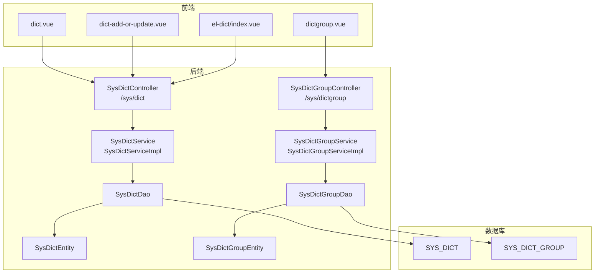
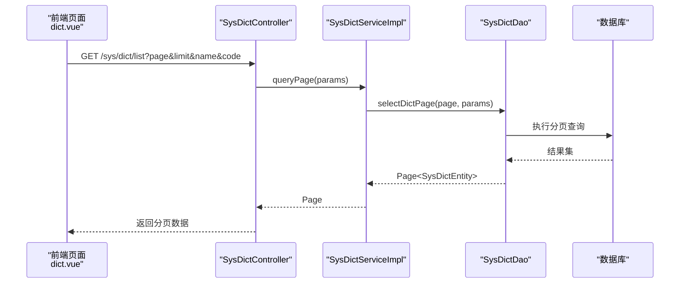
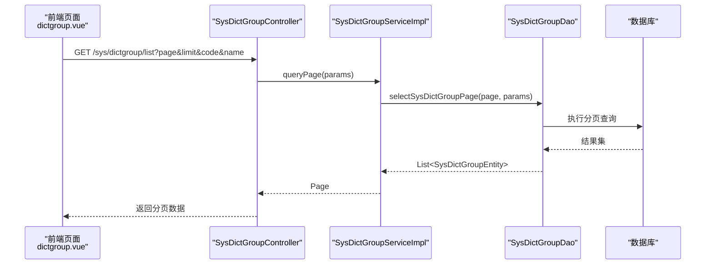
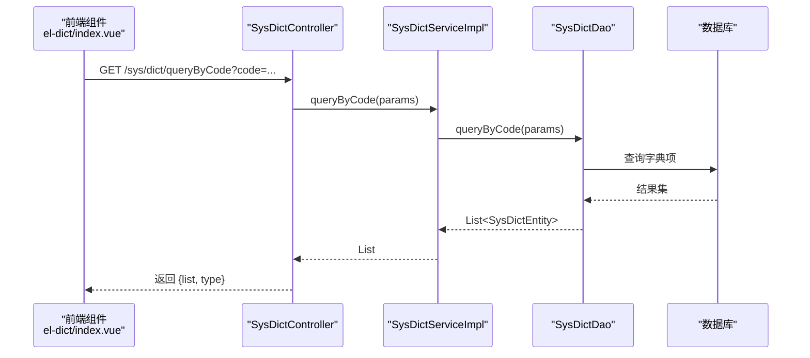
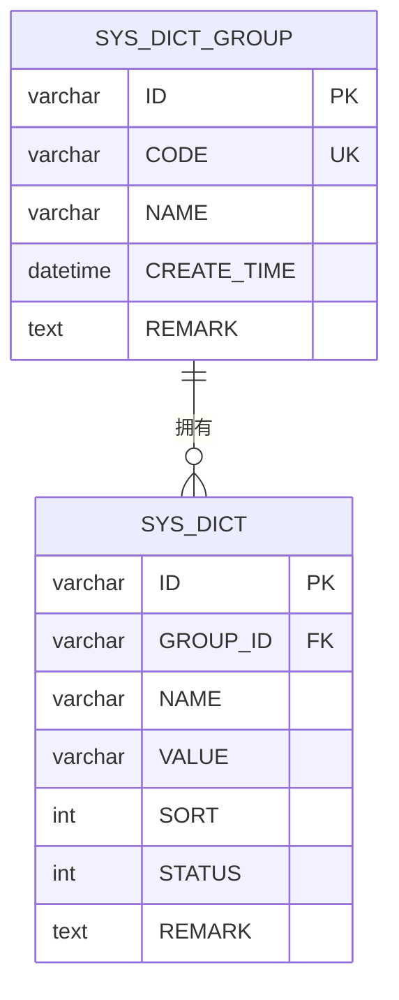
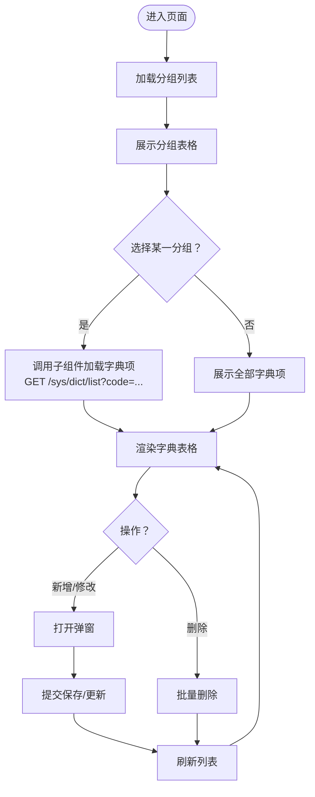
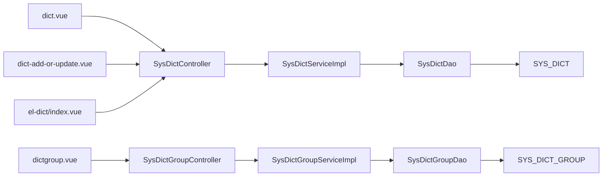

# 数据字典管理

<cite>
**本文引用的文件**
- [platform-admin/src/main/java/com/platform/modules/sys/controller/SysDictController.java](file://platform-admin/src/main/java/com/platform/modules/sys/controller/SysDictController.java)
- [platform-admin/src/main/java/com/platform/modules/sys/controller/SysDictGroupController.java](file://platform-admin/src/main/java/com/platform/modules/sys/controller/SysDictGroupController.java)
- [platform-admin/src/main/java/com/platform/modules/sys/service/SysDictService.java](file://platform-admin/src/main/java/com/platform/modules/sys/service/SysDictService.java)
- [platform-admin/src/main/java/com/platform/modules/sys/service/impl/SysDictServiceImpl.java](file://platform-admin/src/main/java/com/platform/modules/sys/service/impl/SysDictServiceImpl.java)
- [platform-admin/src/main/java/com/platform/modules/sys/service/SysDictGroupService.java](file://platform-admin/src/main/java/com/platform/modules/sys/service/SysDictGroupService.java)
- [platform-admin/src/main/java/com/platform/modules/sys/service/impl/SysDictGroupServiceImpl.java](file://platform-admin/src/main/java/com/platform/modules/sys/service/impl/SysDictGroupServiceImpl.java)
- [platform-admin/src/main/java/com/platform/modules/sys/dao/SysDictDao.java](file://platform-admin/src/main/java/com/platform/modules/sys/dao/SysDictDao.java)
- [platform-admin/src/main/java/com/platform/modules/sys/dao/SysDictGroupDao.java](file://platform-admin/src/main/java/com/platform/modules/sys/dao/SysDictGroupDao.java)
- [platform-admin/src/main/java/com/platform/modules/sys/entity/SysDictEntity.java](file://platform-admin/src/main/java/com/platform/modules/sys/entity/SysDictEntity.java)
- [platform-admin/src/main/java/com/platform/modules/sys/entity/SysDictGroupEntity.java](file://platform-admin/src/main/java/com/platform/modules/sys/entity/SysDictGroupEntity.java)
- [platform-admin-ui/src/views/modules/sys/dict.vue](file://platform-admin-ui/src/views/modules/sys/dict.vue)
- [platform-admin-ui/src/views/modules/sys/dict-add-or-update.vue](file://platform-admin-ui/src/views/modules/sys/dict-add-or-update.vue)
- [platform-admin-ui/src/views/modules/sys/dictgroup.vue](file://platform-admin-ui/src/views/modules/sys/dictgroup.vue)
- [platform-admin-ui/src/components/el-dict/index.vue](file://platform-admin-ui/src/components/el-dict/index.vue)
- [_sql/base.sql](file://_sql/base.sql)
</cite>

## 目录
1. [简介](#简介)
2. [项目结构](#项目结构)
3. [核心组件](#核心组件)
4. [架构总览](#架构总览)
5. [详细组件分析](#详细组件分析)
6. [依赖分析](#依赖分析)
7. [性能考虑](#性能考虑)
8. [故障排查指南](#故障排查指南)
9. [结论](#结论)
10. [附录](#附录)

## 简介
本文件面向系统管理员与开发者，系统性阐述平台中“数据字典管理”的功能与实现，覆盖以下方面：
- 字典分组与字典项的分类管理
- 字典数据的增删改查、分页与条件查询
- 前端展示与交互（表格、弹窗、选择器）
- 枚举值查询与前端组件集成
- 数据库表结构与字段语义
- 可扩展点与最佳实践（数据标准化、一致性与性能）

## 项目结构
数据字典功能由后端Spring Boot模块与前端Vue模块协同完成，核心目录与文件如下：
- 后端模块：platform-admin
  - 控制器：SysDictController、SysDictGroupController
  - 服务接口与实现：SysDictService/SysDictServiceImpl、SysDictGroupService/SysDictGroupServiceImpl
  - DAO与实体：SysDictDao、SysDictGroupDao、SysDictEntity、SysDictGroupEntity
- 前端模块：platform-admin-ui
  - 页面视图：dict.vue、dictgroup.vue、dict-add-or-update.vue
  - 组件：el-dict/index.vue
- 数据库：_sql/base.sql 中定义了 SYS_DICT 与 SYS_DICT_GROUP 表

图表来源
- [platform-admin/src/main/java/com/platform/modules/sys/controller/SysDictController.java:50-176](file://platform-admin/src/main/java/com/platform/modules/sys/controller/SysDictController.java#L50-L176)
- [platform-admin/src/main/java/com/platform/modules/sys/controller/SysDictGroupController.java:44-147](file://platform-admin/src/main/java/com/platform/modules/sys/controller/SysDictGroupController.java#L44-L147)
- [platform-admin/src/main/java/com/platform/modules/sys/service/impl/SysDictServiceImpl.java:40-83](file://platform-admin/src/main/java/com/platform/modules/sys/service/impl/SysDictServiceImpl.java#L40-L83)
- [platform-admin/src/main/java/com/platform/modules/sys/service/impl/SysDictGroupServiceImpl.java:40-79](file://platform-admin/src/main/java/com/platform/modules/sys/service/impl/SysDictGroupServiceImpl.java#L40-L79)
- [platform-admin/src/main/java/com/platform/modules/sys/dao/SysDictDao.java:36-37](file://platform-admin/src/main/java/com/platform/modules/sys/dao/SysDictDao.java#L36-L37)
- [platform-admin/src/main/java/com/platform/modules/sys/dao/SysDictGroupDao.java:36-55](file://platform-admin/src/main/java/com/platform/modules/sys/dao/SysDictGroupDao.java#L36-L55)
- [platform-admin/src/main/java/com/platform/modules/sys/entity/SysDictEntity.java:38-76](file://platform-admin/src/main/java/com/platform/modules/sys/entity/SysDictEntity.java#L38-L76)
- [platform-admin/src/main/java/com/platform/modules/sys/entity/SysDictGroupEntity.java:40-67](file://platform-admin/src/main/java/com/platform/modules/sys/entity/SysDictGroupEntity.java#L40-L67)
- [platform-admin-ui/src/views/modules/sys/dict.vue:1-187](file://platform-admin-ui/src/views/modules/sys/dict.vue#L1-L187)
- [platform-admin-ui/src/views/modules/sys/dictgroup.vue:1-156](file://platform-admin-ui/src/views/modules/sys/dictgroup.vue#L1-L156)
- [platform-admin-ui/src/views/modules/sys/dict-add-or-update.vue:1-143](file://platform-admin-ui/src/views/modules/sys/dict-add-or-update.vue#L1-L143)
- [platform-admin-ui/src/components/el-dict/index.vue:1-74](file://platform-admin-ui/src/components/el-dict/index.vue#L1-L74)
- [_sql/base.sql:334-354](file://_sql/base.sql#L334-L354)

章节来源
- [platform-admin/src/main/java/com/platform/modules/sys/controller/SysDictController.java:50-176](file://platform-admin/src/main/java/com/platform/modules/sys/controller/SysDictController.java#L50-L176)
- [platform-admin/src/main/java/com/platform/modules/sys/controller/SysDictGroupController.java:44-147](file://platform-admin/src/main/java/com/platform/modules/sys/controller/SysDictGroupController.java#L44-L147)
- [platform-admin/src/main/java/com/platform/modules/sys/service/impl/SysDictServiceImpl.java:40-83](file://platform-admin/src/main/java/com/platform/modules/sys/service/impl/SysDictServiceImpl.java#L40-L83)
- [platform-admin/src/main/java/com/platform/modules/sys/service/impl/SysDictGroupServiceImpl.java:40-79](file://platform-admin/src/main/java/com/platform/modules/sys/service/impl/SysDictGroupServiceImpl.java#L40-L79)
- [platform-admin/src/main/java/com/platform/modules/sys/dao/SysDictDao.java:36-37](file://platform-admin/src/main/java/com/platform/modules/sys/dao/SysDictDao.java#L36-L37)
- [platform-admin/src/main/java/com/platform/modules/sys/dao/SysDictGroupDao.java:36-55](file://platform-admin/src/main/java/com/platform/modules/sys/dao/SysDictGroupDao.java#L36-L55)
- [platform-admin/src/main/java/com/platform/modules/sys/entity/SysDictEntity.java:38-76](file://platform-admin/src/main/java/com/platform/modules/sys/entity/SysDictEntity.java#L38-L76)
- [platform-admin/src/main/java/com/platform/modules/sys/entity/SysDictGroupEntity.java:40-67](file://platform-admin/src/main/java/com/platform/modules/sys/entity/SysDictGroupEntity.java#L40-L67)
- [platform-admin-ui/src/views/modules/sys/dict.vue:1-187](file://platform-admin-ui/src/views/modules/sys/dict.vue#L1-L187)
- [platform-admin-ui/src/views/modules/sys/dictgroup.vue:1-156](file://platform-admin-ui/src/views/modules/sys/dictgroup.vue#L1-L156)
- [platform-admin-ui/src/views/modules/sys/dict-add-or-update.vue:1-143](file://platform-admin-ui/src/views/modules/sys/dict-add-or-update.vue#L1-L143)
- [platform-admin-ui/src/components/el-dict/index.vue:1-74](file://platform-admin-ui/src/components/el-dict/index.vue#L1-L74)
- [_sql/base.sql:334-354](file://_sql/base.sql#L334-L354)

## 核心组件
- 控制器
  - SysDictController：提供字典项的分页查询、详情查询、保存、修改、批量删除、按分组编码查询字典列表等接口
  - SysDictGroupController：提供字典分组的分页查询、详情查询、保存、修改、批量删除等接口
- 服务层
  - SysDictService/SysDictServiceImpl：封装字典项的查询、分页、新增、更新、删除、按编码查询等业务逻辑
  - SysDictGroupService/SysDictGroupServiceImpl：封装字典分组的查询、分页、新增、更新、删除等业务逻辑
- 数据访问层
  - SysDictDao、SysDictGroupDao：MyBatis Mapper，负责SQL执行与结果映射
- 实体模型
  - SysDictEntity：字典项实体，包含分组ID、名称、值、排序、状态、备注等字段
  - SysDictGroupEntity：字典分组实体，包含分组编码、名称、创建时间、备注等字段
- 前端页面与组件
  - dict.vue：字典项列表与操作
  - dictgroup.vue：字典分组列表与联动字典项展示
  - dict-add-or-update.vue：字典项新增/修改弹窗
  - el-dict/index.vue：基于分组编码的前端枚举选择器

章节来源
- [platform-admin/src/main/java/com/platform/modules/sys/controller/SysDictController.java:50-176](file://platform-admin/src/main/java/com/platform/modules/sys/controller/SysDictController.java#L50-L176)
- [platform-admin/src/main/java/com/platform/modules/sys/controller/SysDictGroupController.java:44-147](file://platform-admin/src/main/java/com/platform/modules/sys/controller/SysDictGroupController.java#L44-L147)
- [platform-admin/src/main/java/com/platform/modules/sys/service/SysDictService.java:34-86](file://platform-admin/src/main/java/com/platform/modules/sys/service/SysDictService.java#L34-L86)
- [platform-admin/src/main/java/com/platform/modules/sys/service/impl/SysDictServiceImpl.java:40-83](file://platform-admin/src/main/java/com/platform/modules/sys/service/impl/SysDictServiceImpl.java#L40-L83)
- [platform-admin/src/main/java/com/platform/modules/sys/service/SysDictGroupService.java](file://platform-admin/src/main/java/com/platform/modules/sys/service/SysDictGroupService.java)
- [platform-admin/src/main/java/com/platform/modules/sys/service/impl/SysDictGroupServiceImpl.java:40-79](file://platform-admin/src/main/java/com/platform/modules/sys/service/impl/SysDictGroupServiceImpl.java#L40-L79)
- [platform-admin/src/main/java/com/platform/modules/sys/dao/SysDictDao.java:36-37](file://platform-admin/src/main/java/com/platform/modules/sys/dao/SysDictDao.java#L36-L37)
- [platform-admin/src/main/java/com/platform/modules/sys/dao/SysDictGroupDao.java:36-55](file://platform-admin/src/main/java/com/platform/modules/sys/dao/SysDictGroupDao.java#L36-L55)
- [platform-admin/src/main/java/com/platform/modules/sys/entity/SysDictEntity.java:38-76](file://platform-admin/src/main/java/com/platform/modules/sys/entity/SysDictEntity.java#L38-L76)
- [platform-admin/src/main/java/com/platform/modules/sys/entity/SysDictGroupEntity.java:40-67](file://platform-admin/src/main/java/com/platform/modules/sys/entity/SysDictGroupEntity.java#L40-L67)
- [platform-admin-ui/src/views/modules/sys/dict.vue:1-187](file://platform-admin-ui/src/views/modules/sys/dict.vue#L1-L187)
- [platform-admin-ui/src/views/modules/sys/dictgroup.vue:1-156](file://platform-admin-ui/src/views/modules/sys/dictgroup.vue#L1-L156)
- [platform-admin-ui/src/views/modules/sys/dict-add-or-update.vue:1-143](file://platform-admin-ui/src/views/modules/sys/dict-add-or-update.vue#L1-L143)
- [platform-admin-ui/src/components/el-dict/index.vue:1-74](file://platform-admin-ui/src/components/el-dict/index.vue#L1-L74)

## 架构总览
后端采用经典的三层架构：控制层接收请求并鉴权，服务层编排业务，持久层执行数据库操作；前端通过HTTP与后端交互，使用Element UI构建表格、弹窗与选择器。

图表来源
- [platform-admin/src/main/java/com/platform/modules/sys/controller/SysDictController.java:79-86](file://platform-admin/src/main/java/com/platform/modules/sys/controller/SysDictController.java#L79-L86)
- [platform-admin/src/main/java/com/platform/modules/sys/service/impl/SysDictServiceImpl.java:48-54](file://platform-admin/src/main/java/com/platform/modules/sys/service/impl/SysDictServiceImpl.java#L48-L54)
- [platform-admin/src/main/java/com/platform/modules/sys/dao/SysDictDao.java:36-37](file://platform-admin/src/main/java/com/platform/modules/sys/dao/SysDictDao.java#L36-L37)

章节来源
- [platform-admin/src/main/java/com/platform/modules/sys/controller/SysDictController.java:79-86](file://platform-admin/src/main/java/com/platform/modules/sys/controller/SysDictController.java#L79-L86)
- [platform-admin/src/main/java/com/platform/modules/sys/service/impl/SysDictServiceImpl.java:48-54](file://platform-admin/src/main/java/com/platform/modules/sys/service/impl/SysDictServiceImpl.java#L48-L54)
- [platform-admin/src/main/java/com/platform/modules/sys/dao/SysDictDao.java:36-37](file://platform-admin/src/main/java/com/platform/modules/sys/dao/SysDictDao.java#L36-L37)

## 详细组件分析

### 字典分组管理
- 功能要点
  - 分组列表与分页查询
  - 新增、修改、删除分组
  - 与字典项联动：在分组页面右侧嵌套字典项列表，支持按分组筛选
- 前端交互
  - dictgroup.vue 负责分组列表与分页，调用 /sys/dictgroup/list
  - 通过子组件 dict.vue 展示该分组下的字典项，并传递分组标识或编码
- 后端接口
  - /sys/dictgroup/list：分页查询
  - /sys/dictgroup/save、/sys/dictgroup/update、/sys/dictgroup/delete：CRUD
  - /sys/dict/queryAll：用于字典项页面的全局查询（可按分组过滤）

图表来源
- [platform-admin/src/main/java/com/platform/modules/sys/controller/SysDictGroupController.java:73-80](file://platform-admin/src/main/java/com/platform/modules/sys/controller/SysDictGroupController.java#L73-L80)
- [platform-admin/src/main/java/com/platform/modules/sys/service/impl/SysDictGroupServiceImpl.java:48-55](file://platform-admin/src/main/java/com/platform/modules/sys/service/impl/SysDictGroupServiceImpl.java#L48-L55)
- [platform-admin/src/main/java/com/platform/modules/sys/dao/SysDictGroupDao.java:46-55](file://platform-admin/src/main/java/com/platform/modules/sys/dao/SysDictGroupDao.java#L46-L55)

章节来源
- [platform-admin/src/main/java/com/platform/modules/sys/controller/SysDictGroupController.java:73-80](file://platform-admin/src/main/java/com/platform/modules/sys/controller/SysDictGroupController.java#L73-L80)
- [platform-admin/src/main/java/com/platform/modules/sys/service/impl/SysDictGroupServiceImpl.java:48-55](file://platform-admin/src/main/java/com/platform/modules/sys/service/impl/SysDictGroupServiceImpl.java#L48-L55)
- [platform-admin/src/main/java/com/platform/modules/sys/dao/SysDictGroupDao.java:46-55](file://platform-admin/src/main/java/com/platform/modules/sys/dao/SysDictGroupDao.java#L46-L55)
- [platform-admin-ui/src/views/modules/sys/dictgroup.vue:112-156](file://platform-admin-ui/src/views/modules/sys/dictgroup.vue#L112-L156)

### 字典项管理
- 功能要点
  - 分页查询、按名称与分组编码过滤
  - 新增/修改（含分组选择、状态、排序、备注）
  - 批量删除
  - 按分组编码查询字典列表（供前端选择器使用）
- 前端交互
  - dict.vue：表格展示、分页、批量操作
  - dict-add-or-update.vue：弹窗表单，提交至 /sys/dict/save 或 /sys/dict/update
  - el-dict/index.vue：通过 /sys/dict/queryByCode?code 获取枚举项并渲染下拉选择
- 后端接口
  - /sys/dict/list、/sys/dict/queryAll、/sys/dict/info/{id}
  - /sys/dict/save、/sys/dict/update、/sys/dict/delete
  - /sys/dict/queryByCode：返回列表与分组类型名

图表来源
- [platform-admin/src/main/java/com/platform/modules/sys/controller/SysDictController.java:157-174](file://platform-admin/src/main/java/com/platform/modules/sys/controller/SysDictController.java#L157-L174)
- [platform-admin/src/main/java/com/platform/modules/sys/service/impl/SysDictServiceImpl.java:78-81](file://platform-admin/src/main/java/com/platform/modules/sys/service/impl/SysDictServiceImpl.java#L78-L81)
- [platform-admin/src/main/java/com/platform/modules/sys/dao/SysDictDao.java:36-37](file://platform-admin/src/main/java/com/platform/modules/sys/dao/SysDictDao.java#L36-L37)

章节来源
- [platform-admin/src/main/java/com/platform/modules/sys/controller/SysDictController.java:157-174](file://platform-admin/src/main/java/com/platform/modules/sys/controller/SysDictController.java#L157-L174)
- [platform-admin/src/main/java/com/platform/modules/sys/service/impl/SysDictServiceImpl.java:78-81](file://platform-admin/src/main/java/com/platform/modules/sys/service/impl/SysDictServiceImpl.java#L78-L81)
- [platform-admin-ui/src/views/modules/sys/dict.vue:108-184](file://platform-admin-ui/src/views/modules/sys/dict.vue#L108-L184)
- [platform-admin-ui/src/views/modules/sys/dict-add-or-update.vue:80-140](file://platform-admin-ui/src/views/modules/sys/dict-add-or-update.vue#L80-L140)
- [platform-admin-ui/src/components/el-dict/index.vue:58-72](file://platform-admin-ui/src/components/el-dict/index.vue#L58-L72)

### 数据模型与表结构
- SYS_DICT：字典项表
  - 字段：ID、GROUP_ID、NAME、VALUE、SORT、STATUS、REMARK
  - 关系：与 SYS_DICT_GROUP 通过 GROUP_ID 关联
- SYS_DICT_GROUP：字典分组表
  - 字段：ID、CODE、NAME、CREATE_TIME、REMARK
  - 用途：作为字典项的分类维度，前端通过 CODE 识别分组类型

图表来源
- [_sql/base.sql:334-354](file://_sql/base.sql#L334-L354)
- [platform-admin/src/main/java/com/platform/modules/sys/entity/SysDictEntity.java:43-71](file://platform-admin/src/main/java/com/platform/modules/sys/entity/SysDictEntity.java#L43-L71)
- [platform-admin/src/main/java/com/platform/modules/sys/entity/SysDictGroupEntity.java:45-65](file://platform-admin/src/main/java/com/platform/modules/sys/entity/SysDictGroupEntity.java#L45-L65)

章节来源
- [_sql/base.sql:334-354](file://_sql/base.sql#L334-L354)
- [platform-admin/src/main/java/com/platform/modules/sys/entity/SysDictEntity.java:43-71](file://platform-admin/src/main/java/com/platform/modules/sys/entity/SysDictEntity.java#L43-L71)
- [platform-admin/src/main/java/com/platform/modules/sys/entity/SysDictGroupEntity.java:45-65](file://platform-admin/src/main/java/com/platform/modules/sys/entity/SysDictGroupEntity.java#L45-L65)

### 前端展示与交互
- 字典项列表（dict.vue）
  - 支持按名称过滤、分页、批量删除
  - 集成新增/修改弹窗组件
- 字典分组页面（dictgroup.vue）
  - 左侧分组列表，右侧嵌套字典项列表
  - 通过 ref 调用子组件刷新数据
- 新增/修改弹窗（dict-add-or-update.vue）
  - 下拉选择分组（只读于编辑态），必填校验字典名称与字典值
- 枚举选择器（el-dict/index.vue）
  - 通过 code 参数远程加载字典项，渲染为下拉选择

图表来源
- [platform-admin-ui/src/views/modules/sys/dictgroup.vue:112-156](file://platform-admin-ui/src/views/modules/sys/dictgroup.vue#L112-L156)
- [platform-admin-ui/src/views/modules/sys/dict.vue:108-184](file://platform-admin-ui/src/views/modules/sys/dict.vue#L108-L184)
- [platform-admin-ui/src/views/modules/sys/dict-add-or-update.vue:80-140](file://platform-admin-ui/src/views/modules/sys/dict-add-or-update.vue#L80-L140)
- [platform-admin-ui/src/components/el-dict/index.vue:58-72](file://platform-admin-ui/src/components/el-dict/index.vue#L58-L72)

章节来源
- [platform-admin-ui/src/views/modules/sys/dict.vue:1-187](file://platform-admin-ui/src/views/modules/sys/dict.vue#L1-L187)
- [platform-admin-ui/src/views/modules/sys/dictgroup.vue:1-156](file://platform-admin-ui/src/views/modules/sys/dictgroup.vue#L1-L156)
- [platform-admin-ui/src/views/modules/sys/dict-add-or-update.vue:1-143](file://platform-admin-ui/src/views/modules/sys/dict-add-or-update.vue#L1-L143)
- [platform-admin-ui/src/components/el-dict/index.vue:1-74](file://platform-admin-ui/src/components/el-dict/index.vue#L1-L74)

## 依赖分析
- 控制器依赖服务接口，服务实现依赖DAO，DAO依赖数据库表
- 前端组件通过HTTP与后端控制器交互
- 字典项实体与分组实体分别映射到 SYS_DICT 与 SYS_DICT_GROUP 表
- 前端枚举选择器依赖后端按分组编码查询接口

图表来源
- [platform-admin/src/main/java/com/platform/modules/sys/controller/SysDictController.java:50-176](file://platform-admin/src/main/java/com/platform/modules/sys/controller/SysDictController.java#L50-L176)
- [platform-admin/src/main/java/com/platform/modules/sys/controller/SysDictGroupController.java:44-147](file://platform-admin/src/main/java/com/platform/modules/sys/controller/SysDictGroupController.java#L44-L147)
- [platform-admin/src/main/java/com/platform/modules/sys/service/impl/SysDictServiceImpl.java:40-83](file://platform-admin/src/main/java/com/platform/modules/sys/service/impl/SysDictServiceImpl.java#L40-L83)
- [platform-admin/src/main/java/com/platform/modules/sys/service/impl/SysDictGroupServiceImpl.java:40-79](file://platform-admin/src/main/java/com/platform/modules/sys/service/impl/SysDictGroupServiceImpl.java#L40-L79)
- [platform-admin/src/main/java/com/platform/modules/sys/dao/SysDictDao.java:36-37](file://platform-admin/src/main/java/com/platform/modules/sys/dao/SysDictDao.java#L36-L37)
- [platform-admin/src/main/java/com/platform/modules/sys/dao/SysDictGroupDao.java:36-55](file://platform-admin/src/main/java/com/platform/modules/sys/dao/SysDictGroupDao.java#L36-L55)
- [_sql/base.sql:334-354](file://_sql/base.sql#L334-L354)

章节来源
- [platform-admin/src/main/java/com/platform/modules/sys/controller/SysDictController.java:50-176](file://platform-admin/src/main/java/com/platform/modules/sys/controller/SysDictController.java#L50-L176)
- [platform-admin/src/main/java/com/platform/modules/sys/controller/SysDictGroupController.java:44-147](file://platform-admin/src/main/java/com/platform/modules/sys/controller/SysDictGroupController.java#L44-L147)
- [platform-admin/src/main/java/com/platform/modules/sys/service/impl/SysDictServiceImpl.java:40-83](file://platform-admin/src/main/java/com/platform/modules/sys/service/impl/SysDictServiceImpl.java#L40-L83)
- [platform-admin/src/main/java/com/platform/modules/sys/service/impl/SysDictGroupServiceImpl.java:40-79](file://platform-admin/src/main/java/com/platform/modules/sys/service/impl/SysDictGroupServiceImpl.java#L40-L79)
- [platform-admin/src/main/java/com/platform/modules/sys/dao/SysDictDao.java:36-37](file://platform-admin/src/main/java/com/platform/modules/sys/dao/SysDictDao.java#L36-L37)
- [platform-admin/src/main/java/com/platform/modules/sys/dao/SysDictGroupDao.java:36-55](file://platform-admin/src/main/java/com/platform/modules/sys/dao/SysDictGroupDao.java#L36-L55)
- [_sql/base.sql:334-354](file://_sql/base.sql#L334-L354)

## 性能考虑
- 分页与排序
  - 字典项分页默认按 SORT 升序；分组按创建时间降序
  - 建议在高频查询场景下为 GROUP_ID、NAME、VALUE 建立索引以提升过滤效率
- 缓存机制
  - 当前未发现显式缓存实现（如Redis）。建议对热点字典分组（如性别）建立缓存，降低数据库压力
  - 缓存键建议采用 code 或分组ID，值为序列化后的字典项列表
- 并发与事务
  - 更新与删除采用事务回滚保障一致性
  - 高并发下建议引入乐观锁或分布式锁，避免竞态
- 前端渲染
  - 大列表建议启用虚拟滚动与懒加载
  - 枚举选择器可复用已加载数据，减少重复请求

## 故障排查指南
- 常见问题
  - 新增/修改失败：检查必填字段校验（名称、值、分组）
  - 查询无结果：确认分组编码是否正确，或是否存在过滤条件
  - 删除失败：确认权限与选中项
- 定位步骤
  - 后端：查看控制器日志与异常栈，确认参数与权限
  - 前端：检查网络面板，确认返回码与消息
  - 数据库：核对 SYS_DICT 与 SYS_DICT_GROUP 的关联关系与索引

章节来源
- [platform-admin/src/main/java/com/platform/modules/sys/controller/SysDictController.java:112-117](file://platform-admin/src/main/java/com/platform/modules/sys/controller/SysDictController.java#L112-L117)
- [platform-admin/src/main/java/com/platform/modules/sys/controller/SysDictGroupController.java:107-112](file://platform-admin/src/main/java/com/platform/modules/sys/controller/SysDictGroupController.java#L107-L112)
- [platform-admin-ui/src/views/modules/sys/dict.vue:157-184](file://platform-admin-ui/src/views/modules/sys/dict.vue#L157-L184)
- [platform-admin-ui/src/views/modules/sys/dict-add-or-update.vue:113-139](file://platform-admin-ui/src/views/modules/sys/dict-add-or-update.vue#L113-L139)

## 结论
本数据字典管理模块实现了清晰的分层架构与前后端协作模式，具备完善的字典分组与字典项管理能力。建议后续在以下方面持续优化：
- 引入字典缓存与失效策略，提升读取性能
- 增加字典版本与变更审计，满足合规与追溯需求
- 提供导入/导出能力，便于批量维护
- 在前端增加字典项的树形/层级展示，适配复杂分类场景

## 附录
- 快速操作指引（管理员）
  - 新增分组：进入“系统配置/数据字典/字典分组”，点击“新增”
  - 新增字典项：在分组页面右侧点击“新增”，选择分组并填写名称与值
  - 查询与筛选：支持按名称与分组编码过滤
  - 删除：勾选后执行“批量删除”
- 开发者参考（扩展接口）
  - 字典项：/sys/dict/list、/sys/dict/save、/sys/dict/update、/sys/dict/delete、/sys/dict/queryByCode
  - 分组：/sys/dictgroup/list、/sys/dictgroup/save、/sys/dictgroup/update、/sys/dictgroup/delete
  - 前端组件：el-dict 通过 code 参数接入任意分组的枚举值

章节来源
- [platform-admin/src/main/java/com/platform/modules/sys/controller/SysDictController.java:79-174](file://platform-admin/src/main/java/com/platform/modules/sys/controller/SysDictController.java#L79-L174)
- [platform-admin/src/main/java/com/platform/modules/sys/controller/SysDictGroupController.java:73-145](file://platform-admin/src/main/java/com/platform/modules/sys/controller/SysDictGroupController.java#L73-L145)
- [platform-admin-ui/src/components/el-dict/index.vue:36-42](file://platform-admin-ui/src/components/el-dict/index.vue#L36-L42)