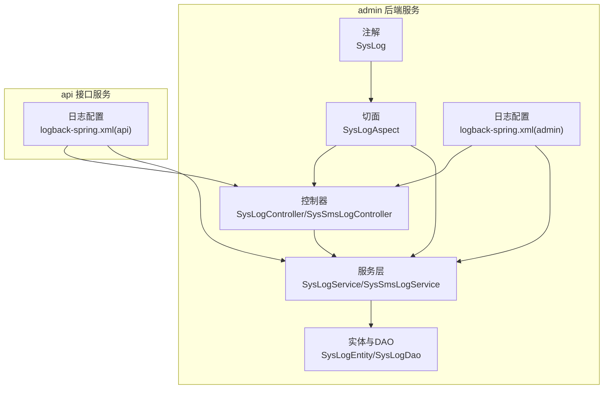
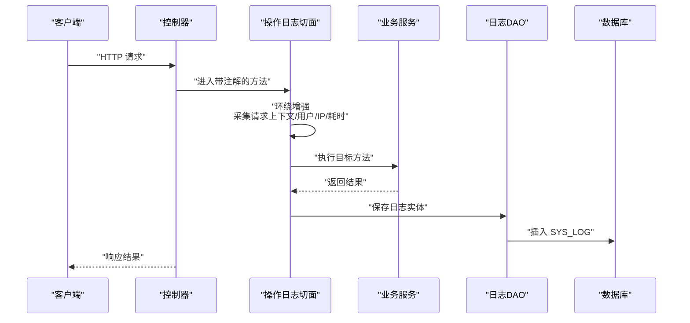
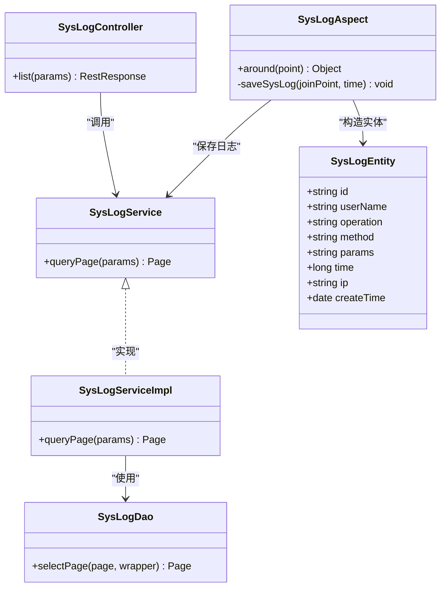
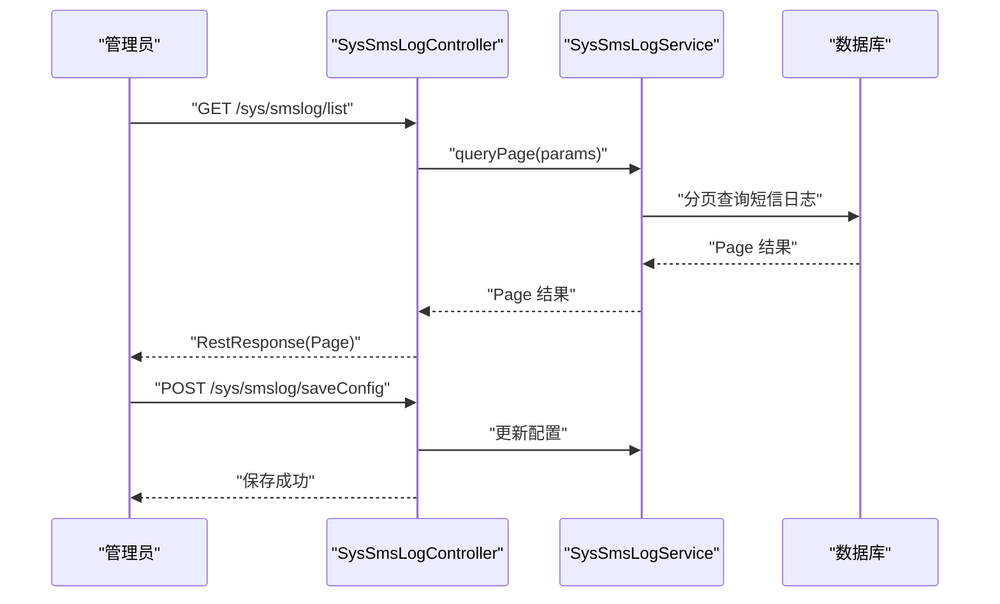
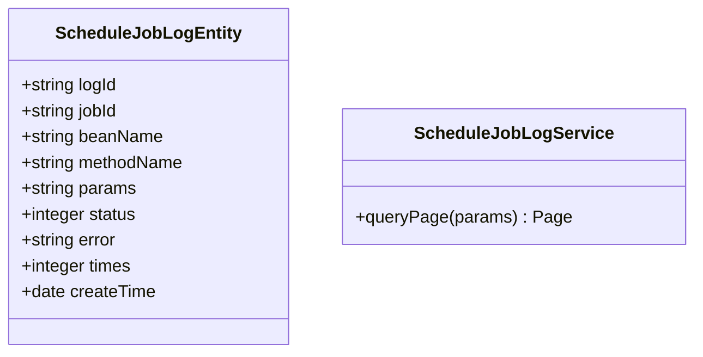
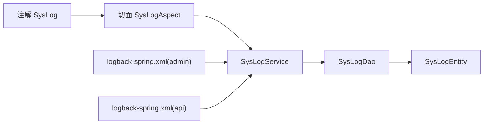

# 日志审计管理

<cite>
**本文引用的文件**
- [platform-admin/src/main/java/com/platform/common/annotation/SysLog.java](file://platform-admin/src/main/java/com/platform/common/annotation/SysLog.java)
- [platform-admin/src/main/java/com/platform/common/aspect/SysLogAspect.java](file://platform-admin/src/main/java/com/platform/common/aspect/SysLogAspect.java)
- [platform-admin/src/main/java/com/platform/modules/sys/controller/SysLogController.java](file://platform-admin/src/main/java/com/platform/modules/sys/controller/SysLogController.java)
- [platform-admin/src/main/java/com/platform/modules/sys/entity/SysLogEntity.java](file://platform-admin/src/main/java/com/platform/modules/sys/entity/SysLogEntity.java)
- [platform-admin/src/main/java/com/platform/modules/sys/dao/SysLogDao.java](file://platform-admin/src/main/java/com/platform/modules/sys/dao/SysLogDao.java)
- [platform-admin/src/main/java/com/platform/modules/sys/service/SysLogService.java](file://platform-admin/src/main/java/com/platform/modules/sys/service/SysLogService.java)
- [platform-admin/src/main/java/com/platform/modules/sys/service/impl/SysLogServiceImpl.java](file://platform-admin/src/main/java/com/platform/modules/sys/service/impl/SysLogServiceImpl.java)
- [platform-admin/src/main/java/com/platform/modules/sys/controller/SysSmsLogController.java](file://platform-admin/src/main/java/com/platform/modules/sys/controller/SysSmsLogController.java)
- [platform-admin/src/main/java/com/platform/modules/job/entity/ScheduleJobLogEntity.java](file://platform-admin/src/main/java/com/platform/modules/job/entity/ScheduleJobLogEntity.java)
- [platform-admin/src/main/java/com/platform/modules/job/service/ScheduleJobLogService.java](file://platform-admin/src/main/java/com/platform/modules/job/service/ScheduleJobLogService.java)
- [platform-admin/src/main/resources/logback-spring.xml](file://platform-admin/src/main/resources/logback-spring.xml)
- [platform-api/src/main/resources/logback-spring.xml](file://platform-api/src/main/resources/logback-spring.xml)
</cite>

## 目录
1. [简介](#简介)
2. [项目结构](#项目结构)
3. [核心组件](#核心组件)
4. [架构总览](#架构总览)
5. [详细组件分析](#详细组件分析)
6. [依赖分析](#依赖分析)
7. [性能考虑](#性能考虑)
8. [故障排查指南](#故障排查指南)
9. [结论](#结论)
10. [附录](#附录)

## 简介
本文件面向系统管理员与开发者，全面阐述平台的日志审计管理能力，包括系统操作日志、登录日志、短信发送日志、定时任务日志等的采集、存储、查询与维护策略；解释日志数据结构、日志级别与格式规范；并提供日志分析、异常监控与安全审计的高级特性说明，以及性能优化、存储策略与安全合规的最佳实践。

## 项目结构
围绕日志审计的关键模块分布于 admin 后端服务与 api 接口服务中，并通过统一的日志框架进行输出与归档。

图表来源
- [platform-admin/src/main/java/com/platform/modules/sys/controller/SysLogController.java:45-63](file://platform-admin/src/main/java/com/platform/modules/sys/controller/SysLogController.java#L45-L63)
- [platform-admin/src/main/java/com/platform/modules/sys/controller/SysSmsLogController.java:45-178](file://platform-admin/src/main/java/com/platform/modules/sys/controller/SysSmsLogController.java#L45-L178)
- [platform-admin/src/main/java/com/platform/modules/sys/service/impl/SysLogServiceImpl.java:36-53](file://platform-admin/src/main/java/com/platform/modules/sys/service/impl/SysLogServiceImpl.java#L36-L53)
- [platform-admin/src/main/java/com/platform/common/aspect/SysLogAspect.java:46-110](file://platform-admin/src/main/java/com/platform/common/aspect/SysLogAspect.java#L46-L110)
- [platform-admin/src/main/java/com/platform/common/annotation/SysLog.java:23-34](file://platform-admin/src/main/java/com/platform/common/annotation/SysLog.java#L23-L34)
- [platform-admin/src/main/resources/logback-spring.xml:1-94](file://platform-admin/src/main/resources/logback-spring.xml#L1-L94)
- [platform-api/src/main/resources/logback-spring.xml:1-94](file://platform-api/src/main/resources/logback-spring.xml#L1-L94)

章节来源
- [platform-admin/src/main/java/com/platform/modules/sys/controller/SysLogController.java:45-63](file://platform-admin/src/main/java/com/platform/modules/sys/controller/SysLogController.java#L45-L63)
- [platform-admin/src/main/java/com/platform/modules/sys/controller/SysSmsLogController.java:45-178](file://platform-admin/src/main/java/com/platform/modules/sys/controller/SysSmsLogController.java#L45-L178)
- [platform-admin/src/main/resources/logback-spring.xml:1-94](file://platform-admin/src/main/resources/logback-spring.xml#L1-L94)
- [platform-api/src/main/resources/logback-spring.xml:1-94](file://platform-api/src/main/resources/logback-spring.xml#L1-L94)

## 核心组件
- 操作日志（系统日志）
  - 注解与切面：通过注解标记需要记录的操作，切面自动采集请求上下文、用户、IP、耗时等信息并持久化。
  - 控制器与服务：提供分页查询接口，支持按关键字与IP过滤。
  - 数据模型：包含用户、操作描述、方法签名、请求参数、耗时、IP、创建时间等字段。
- 登录日志
  - 登录行为由登录控制器处理，结合认证流程可扩展登录事件记录（如登录结果、失败原因、IP等）。
- 短信发送日志
  - 提供短信发送记录的增删改查与分页查询接口，支持配置短信通道参数。
- 定时任务日志
  - 记录任务执行状态、错误信息、耗时等，便于任务运行审计与排障。

章节来源
- [platform-admin/src/main/java/com/platform/common/annotation/SysLog.java:23-34](file://platform-admin/src/main/java/com/platform/common/annotation/SysLog.java#L23-L34)
- [platform-admin/src/main/java/com/platform/common/aspect/SysLogAspect.java:46-110](file://platform-admin/src/main/java/com/platform/common/aspect/SysLogAspect.java#L46-L110)
- [platform-admin/src/main/java/com/platform/modules/sys/controller/SysLogController.java:45-63](file://platform-admin/src/main/java/com/platform/modules/sys/controller/SysLogController.java#L45-L63)
- [platform-admin/src/main/java/com/platform/modules/sys/service/impl/SysLogServiceImpl.java:36-53](file://platform-admin/src/main/java/com/platform/modules/sys/service/impl/SysLogServiceImpl.java#L36-L53)
- [platform-admin/src/main/java/com/platform/modules/sys/entity/SysLogEntity.java:36-71](file://platform-admin/src/main/java/com/platform/modules/sys/entity/SysLogEntity.java#L36-L71)
- [platform-admin/src/main/java/com/platform/modules/sys/controller/SysSmsLogController.java:45-178](file://platform-admin/src/main/java/com/platform/modules/sys/controller/SysSmsLogController.java#L45-L178)
- [platform-admin/src/main/java/com/platform/modules/job/entity/ScheduleJobLogEntity.java:28-84](file://platform-admin/src/main/java/com/platform/modules/job/entity/ScheduleJobLogEntity.java#L28-L84)

## 架构总览
下图展示从请求到日志落库的整体链路，以及日志输出到控制台与滚动文件的配置路径。

图表来源
- [platform-admin/src/main/java/com/platform/common/aspect/SysLogAspect.java:57-108](file://platform-admin/src/main/java/com/platform/common/aspect/SysLogAspect.java#L57-L108)
- [platform-admin/src/main/java/com/platform/modules/sys/service/impl/SysLogServiceImpl.java:36-53](file://platform-admin/src/main/java/com/platform/modules/sys/service/impl/SysLogServiceImpl.java#L36-L53)
- [platform-admin/src/main/java/com/platform/modules/sys/dao/SysLogDao.java:21-34](file://platform-admin/src/main/java/com/platform/modules/sys/dao/SysLogDao.java#L21-L34)

## 详细组件分析

### 操作日志（系统日志）
- 注解与切面
  - 注解用于在方法上声明“操作日志”描述，切面环绕捕获执行时长、请求参数、IP、用户等信息。
  - 切面在异常情况下会吞掉保存日志过程中的异常，保证业务主流程不受影响。
- 控制器与服务
  - 控制器提供分页列表接口，服务层基于查询参数构建条件，支持按IP与关键字模糊匹配，并按创建时间倒序。
- 数据模型
  - 字段覆盖用户、操作描述、方法签名、请求参数、耗时、IP、创建时间等，满足审计与复盘需求。

图表来源
- [platform-admin/src/main/java/com/platform/modules/sys/entity/SysLogEntity.java:36-71](file://platform-admin/src/main/java/com/platform/modules/sys/entity/SysLogEntity.java#L36-L71)
- [platform-admin/src/main/java/com/platform/modules/sys/dao/SysLogDao.java:21-34](file://platform-admin/src/main/java/com/platform/modules/sys/dao/SysLogDao.java#L21-L34)
- [platform-admin/src/main/java/com/platform/modules/sys/service/SysLogService.java:27-41](file://platform-admin/src/main/java/com/platform/modules/sys/service/SysLogService.java#L27-L41)
- [platform-admin/src/main/java/com/platform/modules/sys/service/impl/SysLogServiceImpl.java:36-53](file://platform-admin/src/main/java/com/platform/modules/sys/service/impl/SysLogServiceImpl.java#L36-L53)
- [platform-admin/src/main/java/com/platform/modules/sys/controller/SysLogController.java:45-63](file://platform-admin/src/main/java/com/platform/modules/sys/controller/SysLogController.java#L45-L63)
- [platform-admin/src/main/java/com/platform/common/aspect/SysLogAspect.java:46-110](file://platform-admin/src/main/java/com/platform/common/aspect/SysLogAspect.java#L46-L110)

章节来源
- [platform-admin/src/main/java/com/platform/common/annotation/SysLog.java:23-34](file://platform-admin/src/main/java/com/platform/common/annotation/SysLog.java#L23-L34)
- [platform-admin/src/main/java/com/platform/common/aspect/SysLogAspect.java:57-108](file://platform-admin/src/main/java/com/platform/common/aspect/SysLogAspect.java#L57-L108)
- [platform-admin/src/main/java/com/platform/modules/sys/controller/SysLogController.java:45-63](file://platform-admin/src/main/java/com/platform/modules/sys/controller/SysLogController.java#L45-L63)
- [platform-admin/src/main/java/com/platform/modules/sys/service/impl/SysLogServiceImpl.java:36-53](file://platform-admin/src/main/java/com/platform/modules/sys/service/impl/SysLogServiceImpl.java#L36-L53)
- [platform-admin/src/main/java/com/platform/modules/sys/entity/SysLogEntity.java:36-71](file://platform-admin/src/main/java/com/platform/modules/sys/entity/SysLogEntity.java#L36-L71)

### 登录日志
- 登录控制器负责处理登录流程，可在此处扩展登录事件记录（如登录结果、失败原因、IP、UA等），形成完整的登录审计轨迹。
- 建议将登录日志与操作日志分离存储，便于独立查询与分析。

章节来源
- [platform-admin/src/main/java/com/platform/modules/sys/controller/SysLogController.java:45-63](file://platform-admin/src/main/java/com/platform/modules/sys/controller/SysLogController.java#L45-L63)

### 短信发送日志
- 控制器提供短信日志的分页查询、详情查询、新增/修改/删除与配置读取/保存接口。
- 支持对短信通道配置进行集中管理，便于审计与合规检查。

图表来源
- [platform-admin/src/main/java/com/platform/modules/sys/controller/SysSmsLogController.java:45-178](file://platform-admin/src/main/java/com/platform/modules/sys/controller/SysSmsLogController.java#L45-L178)

章节来源
- [platform-admin/src/main/java/com/platform/modules/sys/controller/SysSmsLogController.java:45-178](file://platform-admin/src/main/java/com/platform/modules/sys/controller/SysSmsLogController.java#L45-L178)

### 定时任务日志
- 任务日志实体包含任务ID、Bean名称、方法名、参数、状态、错误信息、耗时与创建时间等字段。
- 服务接口提供分页查询能力，便于对任务执行情况进行审计与问题定位。

图表来源
- [platform-admin/src/main/java/com/platform/modules/job/entity/ScheduleJobLogEntity.java:28-84](file://platform-admin/src/main/java/com/platform/modules/job/entity/ScheduleJobLogEntity.java#L28-L84)
- [platform-admin/src/main/java/com/platform/modules/job/service/ScheduleJobLogService.java:27-43](file://platform-admin/src/main/java/com/platform/modules/job/service/ScheduleJobLogService.java#L27-L43)

章节来源
- [platform-admin/src/main/java/com/platform/modules/job/entity/ScheduleJobLogEntity.java:28-84](file://platform-admin/src/main/java/com/platform/modules/job/entity/ScheduleJobLogEntity.java#L28-L84)
- [platform-admin/src/main/java/com/platform/modules/job/service/ScheduleJobLogService.java:27-43](file://platform-admin/src/main/java/com/platform/modules/job/service/ScheduleJobLogService.java#L27-L43)

## 依赖分析
- 切面与注解
  - 切面依赖注解识别被标注的方法，环绕增强后调用服务保存日志。
- 控制器与服务
  - 控制器仅负责参数接收与权限校验，具体查询逻辑由服务层实现。
- DAO 与实体
  - 实体映射 SYS_LOG 表，DAO 使用分页查询与条件构造器完成过滤与排序。
- 日志输出
  - 两套服务均配置了基于时间的滚动文件策略，生产环境默认仅输出 ERROR 级别以上到控制台，同时写入滚动文件。

图表来源
- [platform-admin/src/main/java/com/platform/common/annotation/SysLog.java:23-34](file://platform-admin/src/main/java/com/platform/common/annotation/SysLog.java#L23-L34)
- [platform-admin/src/main/java/com/platform/common/aspect/SysLogAspect.java:46-110](file://platform-admin/src/main/java/com/platform/common/aspect/SysLogAspect.java#L46-L110)
- [platform-admin/src/main/java/com/platform/modules/sys/service/impl/SysLogServiceImpl.java:36-53](file://platform-admin/src/main/java/com/platform/modules/sys/service/impl/SysLogServiceImpl.java#L36-L53)
- [platform-admin/src/main/java/com/platform/modules/sys/dao/SysLogDao.java:21-34](file://platform-admin/src/main/java/com/platform/modules/sys/dao/SysLogDao.java#L21-L34)
- [platform-admin/src/main/resources/logback-spring.xml:60-94](file://platform-admin/src/main/resources/logback-spring.xml#L60-L94)
- [platform-api/src/main/resources/logback-spring.xml:60-94](file://platform-api/src/main/resources/logback-spring.xml#L60-L94)

章节来源
- [platform-admin/src/main/java/com/platform/common/aspect/SysLogAspect.java:46-110](file://platform-admin/src/main/java/com/platform/common/aspect/SysLogAspect.java#L46-L110)
- [platform-admin/src/main/java/com/platform/modules/sys/service/impl/SysLogServiceImpl.java:36-53](file://platform-admin/src/main/java/com/platform/modules/sys/service/impl/SysLogServiceImpl.java#L36-L53)
- [platform-admin/src/main/resources/logback-spring.xml:60-94](file://platform-admin/src/main/resources/logback-spring.xml#L60-L94)
- [platform-api/src/main/resources/logback-spring.xml:60-94](file://platform-api/src/main/resources/logback-spring.xml#L60-L94)

## 性能考虑
- 切面采集
  - 切面在方法前后采集上下文与耗时，建议避免在高频接口上过度使用复杂参数序列化，必要时对敏感参数脱敏或限制长度。
- 分页与过滤
  - 服务层已内置分页与模糊过滤，建议前端传入合理范围的日期与关键词，避免全表扫描。
- 日志输出
  - 生产环境默认仅输出 ERROR 级别到控制台，降低控制台压力；滚动文件策略按天切割并限制保留天数与总量，避免磁盘膨胀。
- 异步落库
  - 当前实现为同步保存日志，若业务量较大，建议引入异步队列或批量入库策略，降低对主业务的影响。

## 故障排查指南
- 日志未入库
  - 检查控制器是否正确标注注解，确认切面生效且未发生异常吞吐。
  - 核对数据库连接与 SYS_LOG 表结构是否存在。
- 查询不到日志
  - 确认查询参数（关键字、IP）是否正确；检查排序是否按创建时间倒序。
- 日志文件不滚动
  - 检查 rollingPolicy 的文件路径与 maxHistory、totalSizeCap 配置是否生效。
- 控制台无输出
  - 确认当前环境 profile 是否为 dev/test/prod，不同环境默认日志级别不同。

章节来源
- [platform-admin/src/main/java/com/platform/common/aspect/SysLogAspect.java:104-108](file://platform-admin/src/main/java/com/platform/common/aspect/SysLogAspect.java#L104-L108)
- [platform-admin/src/main/java/com/platform/modules/sys/service/impl/SysLogServiceImpl.java:36-53](file://platform-admin/src/main/java/com/platform/modules/sys/service/impl/SysLogServiceImpl.java#L36-L53)
- [platform-admin/src/main/resources/logback-spring.xml:60-94](file://platform-admin/src/main/resources/logback-spring.xml#L60-L94)

## 结论
本项目通过注解+切面的方式实现了统一的操作日志采集，配合分页查询与条件过滤，满足日常审计与排障需求；短信与定时任务日志提供了更广泛的审计覆盖面。结合日志框架的滚动策略与环境级别配置，可在保证可观测性的同时兼顾性能与资源占用。建议在高并发场景下进一步优化日志落库策略，并完善登录日志与异常监控的联动。

## 附录

### 日志数据结构与字段说明
- 系统日志（SYS_LOG）
  - 字段：主键、用户名、操作描述、方法签名、请求参数、耗时、IP、创建时间。
- 短信发送日志
  - 建议字段：主键、手机号、模板ID、发送状态、返回码、错误信息、发送时间、请求参数等（依据实际业务扩展）。
- 定时任务日志（SCHEDULE_JOB_LOG）
  - 字段：日志ID、任务ID、Bean名称、方法名、参数、状态、错误信息、耗时、创建时间。

章节来源
- [platform-admin/src/main/java/com/platform/modules/sys/entity/SysLogEntity.java:36-71](file://platform-admin/src/main/java/com/platform/modules/sys/entity/SysLogEntity.java#L36-L71)
- [platform-admin/src/main/java/com/platform/modules/job/entity/ScheduleJobLogEntity.java:28-84](file://platform-admin/src/main/java/com/platform/modules/job/entity/ScheduleJobLogEntity.java#L28-L84)

### 日志级别与格式规范
- 级别
  - 开发环境：INFO 级别及以上输出到控制台。
  - 测试/生产环境：默认 INFO 级别及以上输出到控制台，ERROR 级别及以上输出到滚动文件。
- 格式
  - 控制台与文件编码统一为 UTF-8，文件按日期滚动，保留天数与总量上限可配置。

章节来源
- [platform-admin/src/main/resources/logback-spring.xml:14-94](file://platform-admin/src/main/resources/logback-spring.xml#L14-L94)
- [platform-api/src/main/resources/logback-spring.xml:14-94](file://platform-api/src/main/resources/logback-spring.xml#L14-L94)

### 查询过滤与权限控制
- 查询过滤
  - 支持按 IP 与关键字（用户名/操作描述）模糊过滤，并按创建时间倒序。
- 权限控制
  - 对日志列表、短信日志列表与配置等接口添加了权限注解，确保只有授权用户可访问。

章节来源
- [platform-admin/src/main/java/com/platform/modules/sys/service/impl/SysLogServiceImpl.java:36-53](file://platform-admin/src/main/java/com/platform/modules/sys/service/impl/SysLogServiceImpl.java#L36-L53)
- [platform-admin/src/main/java/com/platform/modules/sys/controller/SysLogController.java:45-63](file://platform-admin/src/main/java/com/platform/modules/sys/controller/SysLogController.java#L45-L63)
- [platform-admin/src/main/java/com/platform/modules/sys/controller/SysSmsLogController.java:45-178](file://platform-admin/src/main/java/com/platform/modules/sys/controller/SysSmsLogController.java#L45-L178)

### 存储策略与清理维护
- 滚动策略
  - 按天滚动，保留天数与总量上限配置，避免无限增长。
- 清理建议
  - 结合业务周期定期清理过期日志；对大字段（如请求参数）可考虑压缩或外部化存储。

章节来源
- [platform-admin/src/main/resources/logback-spring.xml:37-80](file://platform-admin/src/main/resources/logback-spring.xml#L37-L80)
- [platform-api/src/main/resources/logback-spring.xml:37-80](file://platform-api/src/main/resources/logback-spring.xml#L37-L80)

### 安全审计与合规最佳实践
- 敏感信息脱敏
  - 对密码、手机号等敏感字段在日志中进行脱敏处理。
- 访问控制
  - 严格限制日志查询与配置修改权限，采用最小授权原则。
- 审计留痕
  - 关键操作必须有明确的操作日志与时间戳，便于追溯。

[本节为通用指导，无需列出章节来源]