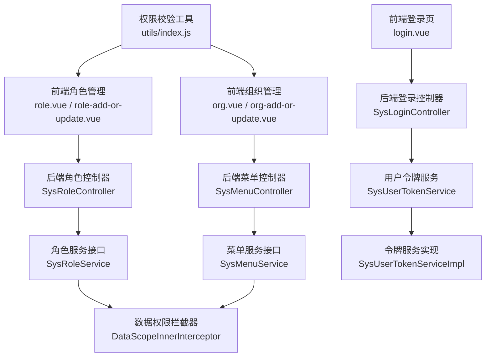
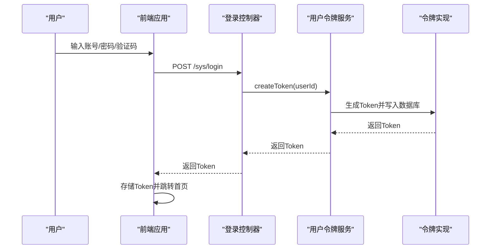
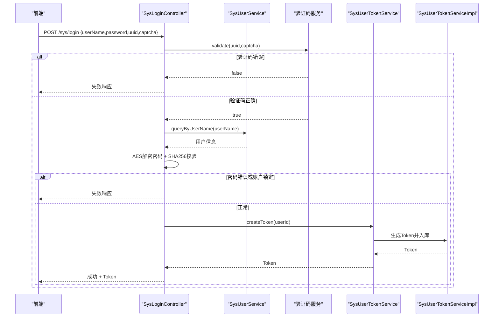
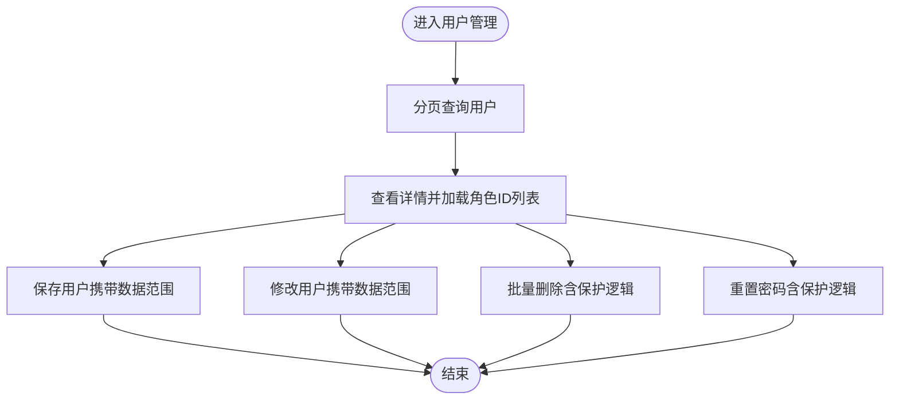
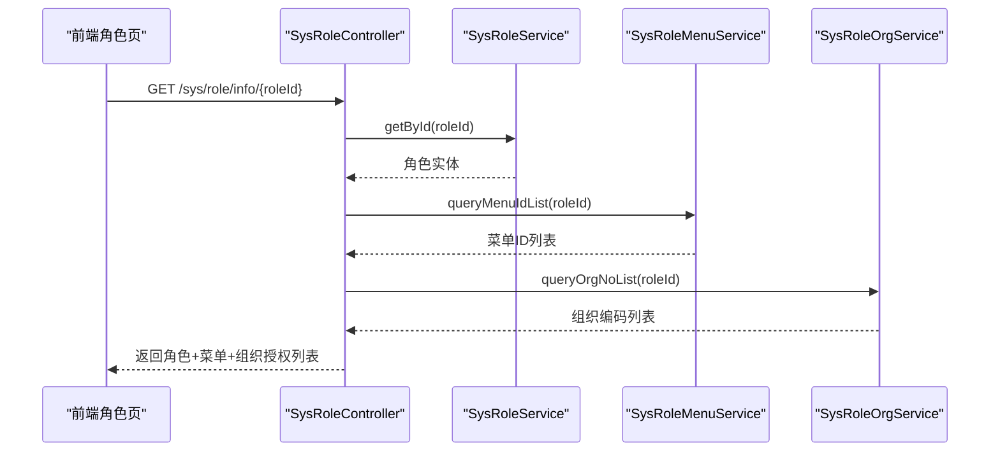
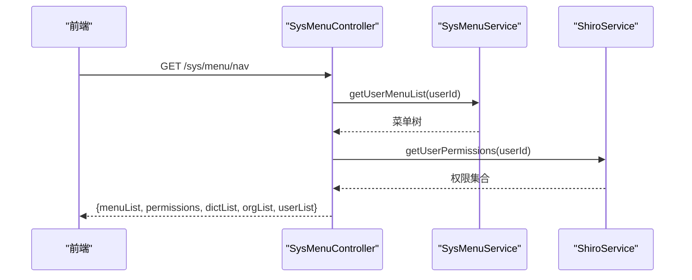
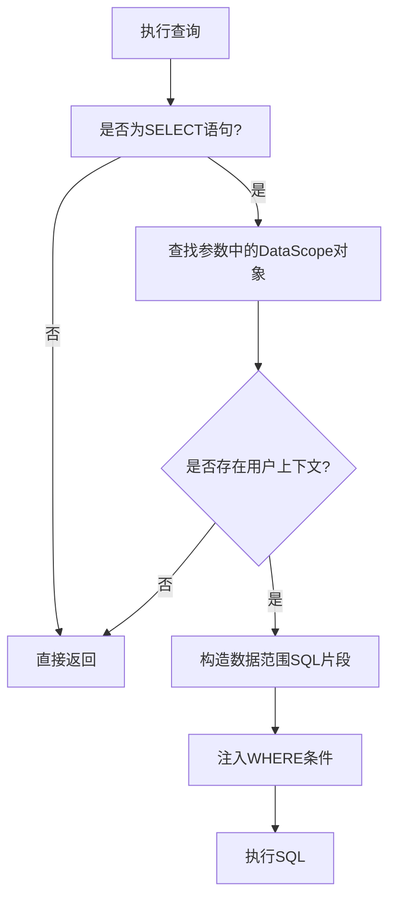
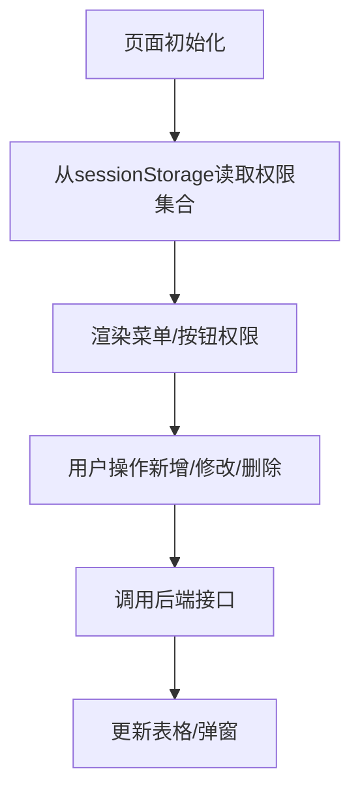
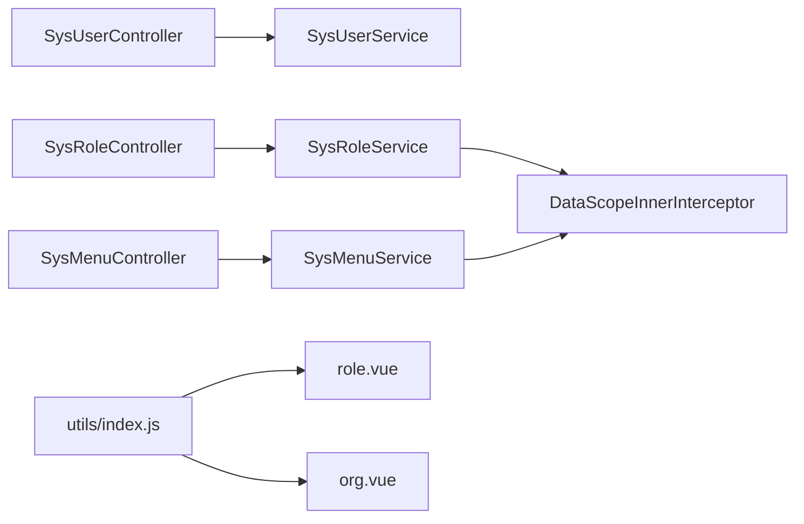

# 用户权限管理

<cite>
**本文引用的文件**   
- [platform-admin/src/main/java/com/platform/modules/sys/controller/SysLoginController.java](file://platform-admin/src/main/java/com/platform/modules/sys/controller/SysLoginController.java)
- [platform-admin/src/main/java/com/platform/modules/sys/oauth2/Oauth2Token.java](file://platform-admin/src/main/java/com/platform/modules/sys/oauth2/Oauth2Token.java)
- [platform-admin/src/main/java/com/platform/modules/sys/service/SysUserTokenService.java](file://platform-admin/src/main/java/com/platform/modules/sys/service/SysUserTokenService.java)
- [platform-admin/src/main/java/com/platform/modules/sys/service/impl/SysUserTokenServiceImpl.java](file://platform-admin/src/main/java/com/platform/modules/sys/service/impl/SysUserTokenServiceImpl.java)
- [platform-admin/src/main/java/com/platform/common/utils/ShiroUtils.java](file://platform-admin/src/main/java/com/platform/common/utils/ShiroUtils.java)
- [platform-admin/src/main/java/com/platform/modules/sys/controller/SysUserController.java](file://platform-admin/src/main/java/com/platform/modules/sys/controller/SysUserController.java)
- [platform-admin/src/main/java/com/platform/modules/sys/controller/SysRoleController.java](file://platform-admin/src/main/java/com/platform/modules/sys/controller/SysRoleController.java)
- [platform-admin/src/main/java/com/platform/modules/sys/controller/SysMenuController.java](file://platform-admin/src/main/java/com/platform/modules/sys/controller/SysMenuController.java)
- [platform-admin/src/main/java/com/platform/modules/sys/service/SysUserService.java](file://platform-admin/src/main/java/com/platform/modules/sys/service/SysUserService.java)
- [platform-admin/src/main/java/com/platform/modules/sys/service/SysRoleService.java](file://platform-admin/src/main/java/com/platform/modules/sys/service/SysRoleService.java)
- [platform-admin/src/main/java/com/platform/modules/sys/service/SysMenuService.java](file://platform-admin/src/main/java/com/platform/modules/sys/service/SysMenuService.java)
- [platform-admin/src/main/java/com/platform/modules/sys/entity/SysRoleEntity.java](file://platform-admin/src/main/java/com/platform/modules/sys/entity/SysRoleEntity.java)
- [platform-admin/src/main/java/com/platform/modules/sys/entity/SysOrgEntity.java](file://platform-admin/src/main/java/com/platform/modules/sys/entity/SysOrgEntity.java)
- [platform-admin/src/main/java/com/platform/datascope/DataScope.java](file://platform-admin/src/main/java/com/platform/datascope/DataScope.java)
- [platform-admin/src/main/java/com/platform/datascope/DataScopeInnerInterceptor.java](file://platform-admin/src/main/java/com/platform/datascope/DataScopeInnerInterceptor.java)
- [platform-admin-ui/src/views/common/login.vue](file://platform-admin-ui/src/views/common/login.vue)
- [platform-admin-ui/src/views/modules/sys/role.vue](file://platform-admin-ui/src/views/modules/sys/role.vue)
- [platform-admin-ui/src/views/modules/sys/role-add-or-update.vue](file://platform-admin-ui/src/views/modules/sys/role-add-or-update.vue)
- [platform-admin-ui/src/views/modules/sys/org.vue](file://platform-admin-ui/src/views/modules/sys/org.vue)
- [platform-admin-ui/src/views/modules/sys/org-add-or-update.vue](file://platform-admin-ui/src/views/modules/sys/org-add-or-update.vue)
- [platform-admin-ui/src/utils/index.js](file://platform-admin-ui/src/utils/index.js)
- [platform-admin-ui/src/store/modules/user.js](file://platform-admin-ui/src/store/modules/user.js)
</cite>

## 目录
1. [简介](#简介)
2. [项目结构](#项目结构)
3. [核心组件](#核心组件)
4. [架构总览](#架构总览)
5. [详细组件分析](#详细组件分析)
6. [依赖分析](#依赖分析)
7. [性能考虑](#性能考虑)
8. [故障排查指南](#故障排查指南)
9. [结论](#结论)
10. [附录](#附录)

## 简介
本文件面向系统管理员与开发者，系统性阐述平台的用户权限管理体系，涵盖基于角色的权限控制（RBAC）、用户与角色管理、菜单权限、部门组织架构、会话与认证、权限验证与数据权限控制等。文档以“前后端分离”方式呈现，前端采用 Vue 技术栈，后端采用 Spring Boot + Apache Shiro + MyBatis-Plus，通过统一的控制器层暴露 REST 接口，配合拦截器与服务层实现权限与数据范围控制。

## 项目结构
围绕权限管理的关键模块分布如下：
- 后端权限控制层
  - 控制器：用户、角色、菜单、登录登出、权限资源
  - 服务接口与实现：用户、角色、菜单、组织、令牌、Shiro 权限解析
  - 实体模型：用户、角色、组织、角色-菜单关联、角色-组织关联
  - 数据权限拦截器：MyBatis-Plus 内置拦截器，动态注入数据范围条件
- 前端权限展示与交互
  - 登录页面、角色管理、组织管理、权限校验工具、用户状态存储

图表来源
- [platform-admin-ui/src/views/common/login.vue](file://platform-admin-ui/src/views/common/login.vue)
- [platform-admin/src/main/java/com/platform/modules/sys/controller/SysLoginController.java](file://platform-admin/src/main/java/com/platform/modules/sys/controller/SysLoginController.java)
- [platform-admin/src/main/java/com/platform/modules/sys/controller/SysRoleController.java](file://platform-admin/src/main/java/com/platform/modules/sys/controller/SysRoleController.java)
- [platform-admin/src/main/java/com/platform/modules/sys/controller/SysMenuController.java](file://platform-admin/src/main/java/com/platform/modules/sys/controller/SysMenuController.java)
- [platform-admin/src/main/java/com/platform/modules/sys/service/SysUserTokenService.java](file://platform-admin/src/main/java/com/platform/modules/sys/service/SysUserTokenService.java)
- [platform-admin/src/main/java/com/platform/modules/sys/service/impl/SysUserTokenServiceImpl.java](file://platform-admin/src/main/java/com/platform/modules/sys/service/impl/SysUserTokenServiceImpl.java)
- [platform-admin/src/main/java/com/platform/datascope/DataScopeInnerInterceptor.java](file://platform-admin/src/main/java/com/platform/datascope/DataScopeInnerInterceptor.java)

章节来源
- [platform-admin/src/main/java/com/platform/modules/sys/controller/SysLoginController.java:85-123](file://platform-admin/src/main/java/com/platform/modules/sys/controller/SysLoginController.java#L85-L123)
- [platform-admin/src/main/java/com/platform/modules/sys/controller/SysRoleController.java:61-88](file://platform-admin/src/main/java/com/platform/modules/sys/controller/SysRoleController.java#L61-L88)
- [platform-admin/src/main/java/com/platform/modules/sys/controller/SysMenuController.java:67-84](file://platform-admin/src/main/java/com/platform/modules/sys/controller/SysMenuController.java#L67-L84)
- [platform-admin/src/main/java/com/platform/modules/sys/service/SysUserTokenService.java:32-47](file://platform-admin/src/main/java/com/platform/modules/sys/service/SysUserTokenService.java#L32-L47)
- [platform-admin/src/main/java/com/platform/modules/sys/service/impl/SysUserTokenServiceImpl.java:44-74](file://platform-admin/src/main/java/com/platform/modules/sys/service/impl/SysUserTokenServiceImpl.java#L44-L74)
- [platform-admin/src/main/java/com/platform/datascope/DataScopeInnerInterceptor.java:50-86](file://platform-admin/src/main/java/com/platform/datascope/DataScopeInnerInterceptor.java#L50-L86)
- [platform-admin-ui/src/views/common/login.vue:93-109](file://platform-admin-ui/src/views/common/login.vue#L93-L109)
- [platform-admin-ui/src/views/modules/sys/role.vue:100-121](file://platform-admin-ui/src/views/modules/sys/role.vue#L100-L121)
- [platform-admin-ui/src/views/modules/sys/org.vue:119-134](file://platform-admin-ui/src/views/modules/sys/org.vue#L119-L134)
- [platform-admin-ui/src/utils/index.js:18-20](file://platform-admin-ui/src/utils/index.js#L18-L20)

## 核心组件
- 登录与会话管理
  - 前端登录页负责获取验证码、AES 加密密码并提交登录请求；后端登录控制器完成验证码校验、用户查询、密码比对与生成 Token；令牌服务负责 Token 的生成与过期时间维护；退出登录调用令牌服务更新 Token。
- RBAC 控制器
  - 用户控制器：分页查询、保存/修改、删除、重置密码、获取当前登录用户信息、修改密码等；均受 Shiro 注解保护。
  - 角色控制器：分页查询、角色选择、详情查询（含菜单与组织授权列表）、保存/修改/删除。
  - 菜单控制器：导航菜单（含权限集合）、菜单列表、选择菜单（用于构建树形菜单）、保存/修改/删除。
- 数据权限
  - 通过 MyBatis-Plus 内置拦截器在 SELECT 前自动注入数据范围过滤条件，结合用户上下文与角色/组织数据范围，限制查询结果集。
- 前端权限展示
  - 权限校验工具函数从 sessionStorage 中读取权限集合，用于控制按钮与菜单显示；组织/字典/用户列表缓存于 sessionStorage，便于渲染与翻译。

章节来源
- [platform-admin/src/main/java/com/platform/modules/sys/controller/SysLoginController.java:85-136](file://platform-admin/src/main/java/com/platform/modules/sys/controller/SysLoginController.java#L85-L136)
- [platform-admin/src/main/java/com/platform/modules/sys/service/SysUserTokenService.java:32-47](file://platform-admin/src/main/java/com/platform/modules/sys/service/SysUserTokenService.java#L32-L47)
- [platform-admin/src/main/java/com/platform/modules/sys/service/impl/SysUserTokenServiceImpl.java:44-79](file://platform-admin/src/main/java/com/platform/modules/sys/service/impl/SysUserTokenServiceImpl.java#L44-L79)
- [platform-admin/src/main/java/com/platform/modules/sys/controller/SysUserController.java:80-91](file://platform-admin/src/main/java/com/platform/modules/sys/controller/SysUserController.java#L80-L91)
- [platform-admin/src/main/java/com/platform/modules/sys/controller/SysRoleController.java:96-111](file://platform-admin/src/main/java/com/platform/modules/sys/controller/SysRoleController.java#L96-L111)
- [platform-admin/src/main/java/com/platform/modules/sys/controller/SysMenuController.java:67-84](file://platform-admin/src/main/java/com/platform/modules/sys/controller/SysMenuController.java#L67-L84)
- [platform-admin/src/main/java/com/platform/datascope/DataScopeInnerInterceptor.java:50-86](file://platform-admin/src/main/java/com/platform/datascope/DataScopeInnerInterceptor.java#L50-L86)
- [platform-admin-ui/src/utils/index.js:18-20](file://platform-admin-ui/src/utils/index.js#L18-L20)

## 架构总览
整体采用“前端路由 + 后端 REST API + 权限拦截”的模式。前端通过 Cookie 或本地存储携带 Token 访问后端接口；后端使用 Shiro 进行鉴权与授权，MyBatis-Plus 拦截器实现数据权限过滤。

图表来源
- [platform-admin-ui/src/views/common/login.vue:93-109](file://platform-admin-ui/src/views/common/login.vue#L93-L109)
- [platform-admin/src/main/java/com/platform/modules/sys/controller/SysLoginController.java:85-123](file://platform-admin/src/main/java/com/platform/modules/sys/controller/SysLoginController.java#L85-L123)
- [platform-admin/src/main/java/com/platform/modules/sys/service/SysUserTokenService.java:32-47](file://platform-admin/src/main/java/com/platform/modules/sys/service/SysUserTokenService.java#L32-L47)
- [platform-admin/src/main/java/com/platform/modules/sys/service/impl/SysUserTokenServiceImpl.java:44-74](file://platform-admin/src/main/java/com/platform/modules/sys/service/impl/SysUserTokenServiceImpl.java#L44-L74)

## 详细组件分析

### 登录与会话管理
- 前端登录流程
  - 生成 uuid 获取验证码图片；表单校验后，使用 AES 对密码加密，携带 uuid 与验证码提交登录请求；登录成功后将 Token 写入 Cookie 并跳转首页。
- 后端登录流程
  - 验证码校验通过后，按用户名查询用户，校验账户状态；对提交的明文密码进行 AES 解密与 SHA256 加盐哈希对比；通过后生成 Token 并持久化。
- 令牌服务
  - 生成 Token 并设置过期时间；退出登录时重新生成随机 Token 使旧 Token 失效。
- 会话与权限上下文
  - Shiro 工具类提供获取当前用户、会话、权限集合等能力；前端权限校验函数从 sessionStorage 读取权限集合。

图表来源
- [platform-admin-ui/src/views/common/login.vue:93-109](file://platform-admin-ui/src/views/common/login.vue#L93-L109)
- [platform-admin/src/main/java/com/platform/modules/sys/controller/SysLoginController.java:85-123](file://platform-admin/src/main/java/com/platform/modules/sys/controller/SysLoginController.java#L85-L123)
- [platform-admin/src/main/java/com/platform/modules/sys/service/SysUserTokenService.java:32-47](file://platform-admin/src/main/java/com/platform/modules/sys/service/SysUserTokenService.java#L32-L47)
- [platform-admin/src/main/java/com/platform/modules/sys/service/impl/SysUserTokenServiceImpl.java:44-74](file://platform-admin/src/main/java/com/platform/modules/sys/service/impl/SysUserTokenServiceImpl.java#L44-L74)

章节来源
- [platform-admin-ui/src/views/common/login.vue:93-109](file://platform-admin-ui/src/views/common/login.vue#L93-L109)
- [platform-admin/src/main/java/com/platform/modules/sys/controller/SysLoginController.java:85-136](file://platform-admin/src/main/java/com/platform/modules/sys/controller/SysLoginController.java#L85-L136)
- [platform-admin/src/main/java/com/platform/modules/sys/service/SysUserTokenService.java:32-47](file://platform-admin/src/main/java/com/platform/modules/sys/service/SysUserTokenService.java#L32-L47)
- [platform-admin/src/main/java/com/platform/modules/sys/service/impl/SysUserTokenServiceImpl.java:44-79](file://platform-admin/src/main/java/com/platform/modules/sys/service/impl/SysUserTokenServiceImpl.java#L44-L79)
- [platform-admin/src/main/java/com/platform/common/utils/ShiroUtils.java:32-71](file://platform-admin/src/main/java/com/platform/common/utils/ShiroUtils.java#L32-L71)

### 用户管理
- 功能点
  - 列表分页、详情查询（附带角色 ID 列表）、保存/修改（携带数据范围参数）、删除/重置密码（含超级管理员与当前用户保护）。
  - 修改密码接口要求提供原密码与新密码，使用用户盐值进行 SHA256 哈希比对与更新。
- 权限注解
  - 使用 Shiro 注解控制访问，如 sys:user:list/sys:user:save/sys:user:update/sys:user:delete/sys:user:resetPw 等。

图表来源
- [platform-admin/src/main/java/com/platform/modules/sys/controller/SysUserController.java:80-91](file://platform-admin/src/main/java/com/platform/modules/sys/controller/SysUserController.java#L80-L91)
- [platform-admin/src/main/java/com/platform/modules/sys/controller/SysUserController.java:136-147](file://platform-admin/src/main/java/com/platform/modules/sys/controller/SysUserController.java#L136-L147)
- [platform-admin/src/main/java/com/platform/modules/sys/controller/SysUserController.java:155-170](file://platform-admin/src/main/java/com/platform/modules/sys/controller/SysUserController.java#L155-L170)
- [platform-admin/src/main/java/com/platform/modules/sys/controller/SysUserController.java:172-193](file://platform-admin/src/main/java/com/platform/modules/sys/controller/SysUserController.java#L172-L193)
- [platform-admin/src/main/java/com/platform/modules/sys/controller/SysUserController.java:195-217](file://platform-admin/src/main/java/com/platform/modules/sys/controller/SysUserController.java#L195-L217)
- [platform-admin/src/main/java/com/platform/modules/sys/controller/SysUserController.java:219-241](file://platform-admin/src/main/java/com/platform/modules/sys/controller/SysUserController.java#L219-L241)

章节来源
- [platform-admin/src/main/java/com/platform/modules/sys/controller/SysUserController.java:80-241](file://platform-admin/src/main/java/com/platform/modules/sys/controller/SysUserController.java#L80-L241)
- [platform-admin/src/main/java/com/platform/modules/sys/service/SysUserService.java:33-106](file://platform-admin/src/main/java/com/platform/modules/sys/service/SysUserService.java#L33-L106)

### 角色管理
- 功能点
  - 角色分页查询（支持数据范围）、角色选择（用于授权）、详情查询（返回菜单与组织授权列表）、保存/修改/删除。
- 授权流程
  - 角色详情接口同时查询该角色绑定的菜单 ID 列表与组织编码列表，供前端勾选授权使用。

图表来源
- [platform-admin/src/main/java/com/platform/modules/sys/controller/SysRoleController.java:96-111](file://platform-admin/src/main/java/com/platform/modules/sys/controller/SysRoleController.java#L96-L111)
- [platform-admin/src/main/java/com/platform/modules/sys/entity/SysRoleEntity.java:37-80](file://platform-admin/src/main/java/com/platform/modules/sys/entity/SysRoleEntity.java#L37-L80)
- [platform-admin/src/main/java/com/platform/modules/sys/service/SysRoleService.java:33-79](file://platform-admin/src/main/java/com/platform/modules/sys/service/SysRoleService.java#L33-L79)

章节来源
- [platform-admin/src/main/java/com/platform/modules/sys/controller/SysRoleController.java:61-167](file://platform-admin/src/main/java/com/platform/modules/sys/controller/SysRoleController.java#L61-L167)
- [platform-admin/src/main/java/com/platform/modules/sys/entity/SysRoleEntity.java:37-80](file://platform-admin/src/main/java/com/platform/modules/sys/entity/SysRoleEntity.java#L37-L80)
- [platform-admin/src/main/java/com/platform/modules/sys/service/SysRoleService.java:33-79](file://platform-admin/src/main/java/com/platform/modules/sys/service/SysRoleService.java#L33-L79)

### 菜单权限与导航
- 功能点
  - 导航菜单接口返回当前用户的菜单树与权限集合；菜单列表与选择菜单接口用于后台维护。
- 权限来源
  - 权限集合由 Shiro 服务解析用户角色后汇总得到，前端据此控制按钮与菜单显示。

图表来源
- [platform-admin/src/main/java/com/platform/modules/sys/controller/SysMenuController.java:67-84](file://platform-admin/src/main/java/com/platform/modules/sys/controller/SysMenuController.java#L67-L84)
- [platform-admin/src/main/java/com/platform/modules/sys/service/SysMenuService.java:31-87](file://platform-admin/src/main/java/com/platform/modules/sys/service/SysMenuService.java#L31-L87)

章节来源
- [platform-admin/src/main/java/com/platform/modules/sys/controller/SysMenuController.java:67-120](file://platform-admin/src/main/java/com/platform/modules/sys/controller/SysMenuController.java#L67-L120)
- [platform-admin/src/main/java/com/platform/modules/sys/service/SysMenuService.java:31-87](file://platform-admin/src/main/java/com/platform/modules/sys/service/SysMenuService.java#L31-L87)

### 组织架构与数据权限
- 组织管理
  - 支持树形结构的组织查询、新增/修改、删除；前端通过树控件选择上级机构，防止自指与环路。
- 数据权限
  - 通过 DataScope 参数与 DataScopeInnerInterceptor 在查询前注入数据范围过滤条件，结合用户所属组织层级，限制可见数据。

图表来源
- [platform-admin/src/main/java/com/platform/datascope/DataScopeInnerInterceptor.java:50-86](file://platform-admin/src/main/java/com/platform/datascope/DataScopeInnerInterceptor.java#L50-L86)
- [platform-admin/src/main/java/com/platform/datascope/DataScope.java:33-54](file://platform-admin/src/main/java/com/platform/datascope/DataScope.java#L33-L54)

章节来源
- [platform-admin/src/main/java/com/platform/modules/sys/entity/SysOrgEntity.java:41-91](file://platform-admin/src/main/java/com/platform/modules/sys/entity/SysOrgEntity.java#L41-L91)
- [platform-admin/src/main/java/com/platform/datascope/DataScopeInnerInterceptor.java:50-113](file://platform-admin/src/main/java/com/platform/datascope/DataScopeInnerInterceptor.java#L50-L113)
- [platform-admin/src/main/java/com/platform/datascope/DataScope.java:33-54](file://platform-admin/src/main/java/com/platform/datascope/DataScope.java#L33-L54)
- [platform-admin-ui/src/views/modules/sys/org.vue:119-134](file://platform-admin-ui/src/views/modules/sys/org.vue#L119-L134)
- [platform-admin-ui/src/views/modules/sys/org-add-or-update.vue:135-154](file://platform-admin-ui/src/views/modules/sys/org-add-or-update.vue#L135-L154)

### 前端权限控制与界面集成
- 权限校验
  - isAuth(key) 从 sessionStorage 中读取权限数组，判断是否具备某项权限，用于控制按钮与菜单显隐。
- 列表与弹窗
  - 角色列表页通过 isAuth 控制“修改/删除”按钮；角色新增/修改弹窗初始化时拉取菜单树与组织树并回显已授权节点。
- 用户状态
  - 用户模块 store 仅保存基础用户标识，实际用户信息由后端接口提供。

图表来源
- [platform-admin-ui/src/utils/index.js:18-20](file://platform-admin-ui/src/utils/index.js#L18-L20)
- [platform-admin-ui/src/views/modules/sys/role.vue:50-59](file://platform-admin-ui/src/views/modules/sys/role.vue#L50-L59)
- [platform-admin-ui/src/views/modules/sys/role-add-or-update.vue:77-106](file://platform-admin-ui/src/views/modules/sys/role-add-or-update.vue#L77-L106)
- [platform-admin-ui/src/store/modules/user.js:1-16](file://platform-admin-ui/src/store/modules/user.js#L1-L16)

章节来源
- [platform-admin-ui/src/utils/index.js:18-20](file://platform-admin-ui/src/utils/index.js#L18-L20)
- [platform-admin-ui/src/views/modules/sys/role.vue:50-59](file://platform-admin-ui/src/views/modules/sys/role.vue#L50-L59)
- [platform-admin-ui/src/views/modules/sys/role-add-or-update.vue:77-106](file://platform-admin-ui/src/views/modules/sys/role-add-or-update.vue#L77-L106)
- [platform-admin-ui/src/store/modules/user.js:1-16](file://platform-admin-ui/src/store/modules/user.js#L1-L16)

## 依赖分析
- 控制器与服务
  - 控制器依赖对应服务接口；服务接口再依赖 DAO/持久化层；数据权限通过拦截器与工具类贯穿查询链路。
- 前后端耦合点
  - 前端通过 Cookie/本地存储携带 Token；后端通过 Shiro 将用户主体放入会话；权限集合通过导航接口下发至前端。

图表来源
- [platform-admin/src/main/java/com/platform/modules/sys/controller/SysUserController.java:54-57](file://platform-admin/src/main/java/com/platform/modules/sys/controller/SysUserController.java#L54-L57)
- [platform-admin/src/main/java/com/platform/modules/sys/controller/SysRoleController.java:50-52](file://platform-admin/src/main/java/com/platform/modules/sys/controller/SysRoleController.java#L50-L52)
- [platform-admin/src/main/java/com/platform/modules/sys/controller/SysMenuController.java:55-59](file://platform-admin/src/main/java/com/platform/modules/sys/controller/SysMenuController.java#L55-L59)
- [platform-admin/src/main/java/com/platform/datascope/DataScopeInnerInterceptor.java:50-86](file://platform-admin/src/main/java/com/platform/datascope/DataScopeInnerInterceptor.java#L50-L86)
- [platform-admin-ui/src/utils/index.js:18-20](file://platform-admin-ui/src/utils/index.js#L18-L20)

章节来源
- [platform-admin/src/main/java/com/platform/modules/sys/controller/SysUserController.java:54-57](file://platform-admin/src/main/java/com/platform/modules/sys/controller/SysUserController.java#L54-L57)
- [platform-admin/src/main/java/com/platform/modules/sys/controller/SysRoleController.java:50-52](file://platform-admin/src/main/java/com/platform/modules/sys/controller/SysRoleController.java#L50-L52)
- [platform-admin/src/main/java/com/platform/modules/sys/controller/SysMenuController.java:55-59](file://platform-admin/src/main/java/com/platform/modules/sys/controller/SysMenuController.java#L55-L59)
- [platform-admin/src/main/java/com/platform/datascope/DataScopeInnerInterceptor.java:50-86](file://platform-admin/src/main/java/com/platform/datascope/DataScopeInnerInterceptor.java#L50-L86)
- [platform-admin-ui/src/utils/index.js:18-20](file://platform-admin-ui/src/utils/index.js#L18-L20)

## 性能考虑
- Token 过期策略
  - 令牌服务设置固定过期时间，建议结合刷新令牌机制与服务端并发登录控制，避免频繁登录。
- 数据权限过滤
  - 拦截器在每次 SELECT 前注入过滤条件，应确保相关字段建立索引，避免大表全扫描。
- 前端权限缓存
  - 权限集合与字典、组织、用户列表缓存在 sessionStorage，减少重复请求；切换用户或刷新页面需清理缓存。

## 故障排查指南
- 登录失败
  - 验证码错误：检查前端 uuid 与后端验证码服务；确认 AES 加密流程一致。
  - 账号或密码错误：确认用户状态正常、盐值与哈希算法一致。
  - Token 失效：确认前端是否正确存储 Token，后端是否更新了 Token。
- 权限不足
  - 检查后端 Shiro 注解与权限字符串是否匹配；确认角色已授予相应菜单/按钮权限；前端 isAuth 返回值是否正确。
- 数据看不到
  - 检查数据范围参数是否正确传递；确认用户所属组织层级与 DataScope 配置；拦截器是否生效。
- 组织树异常
  - 防止自指与环路：新增/修改组织时禁止将自身设为上级；避免将下级机构设为上级。

章节来源
- [platform-admin/src/main/java/com/platform/modules/sys/controller/SysLoginController.java:85-136](file://platform-admin/src/main/java/com/platform/modules/sys/controller/SysLoginController.java#L85-L136)
- [platform-admin/src/main/java/com/platform/modules/sys/service/impl/SysUserTokenServiceImpl.java:76-79](file://platform-admin/src/main/java/com/platform/modules/sys/service/impl/SysUserTokenServiceImpl.java#L76-L79)
- [platform-admin-ui/src/utils/index.js:18-20](file://platform-admin-ui/src/utils/index.js#L18-L20)
- [platform-admin/src/main/java/com/platform/datascope/DataScopeInnerInterceptor.java:50-86](file://platform-admin/src/main/java/com/platform/datascope/DataScopeInnerInterceptor.java#L50-L86)
- [platform-admin-ui/src/views/modules/sys/org-add-or-update.vue:135-154](file://platform-admin-ui/src/views/modules/sys/org-add-or-update.vue#L135-L154)

## 结论
本权限体系以 RBAC 为核心，结合 Shiro 的鉴权与 MyBatis-Plus 的数据权限拦截器，实现了菜单、按钮、数据的多层权限控制。前端通过权限工具与缓存提升用户体验，后端通过注解与拦截器保障安全边界。建议在生产环境中完善 Token 刷新、审计日志与权限最小化原则，持续优化查询性能与权限配置效率。

## 附录
- 安全最佳实践
  - 强密码策略与定期更换；启用二次验证（可选）；严格控制权限字符串命名规范；最小权限原则；定期审计权限变更。
- 常见问题
  - 权限不生效：核对角色授权与菜单/按钮权限字符串；确认 isAuth 与权限集合同步。
  - 数据越权：检查 DataScope 参数与拦截器注入逻辑；确保用户组织层级正确。
  - 登录卡顿：优化 Token 过期与刷新策略；减少不必要的权限集合计算。