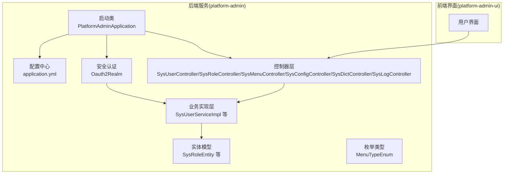
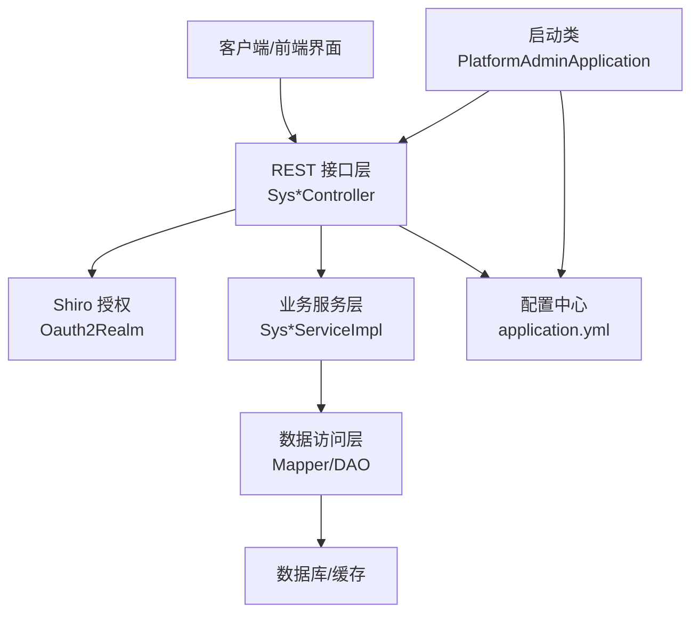
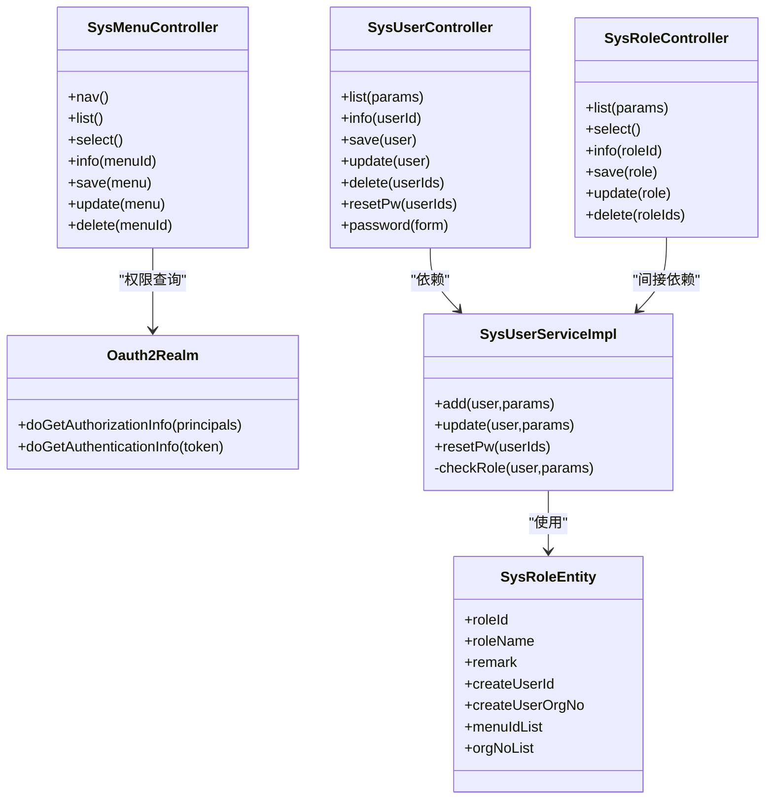
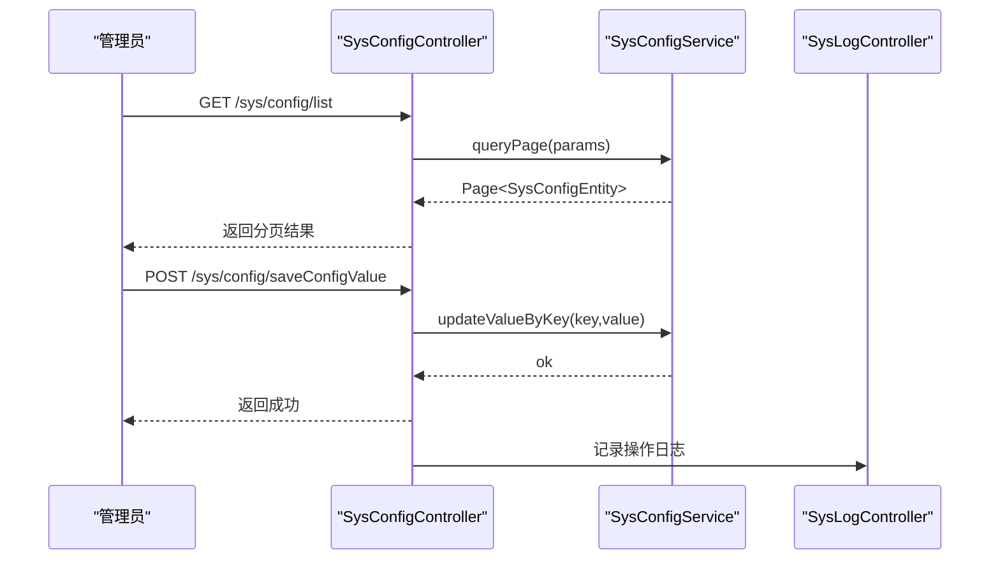
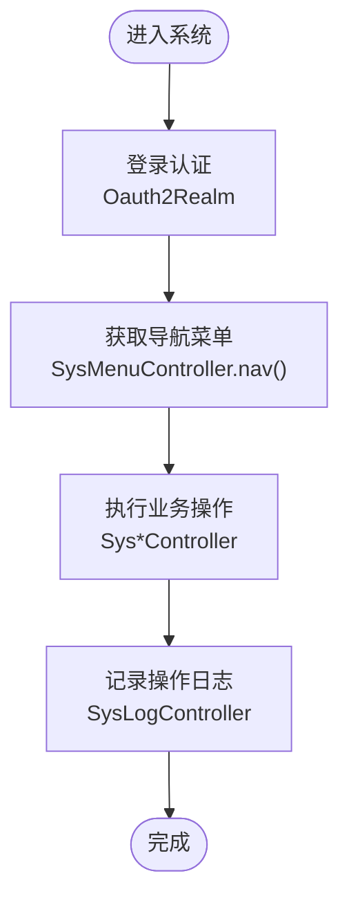
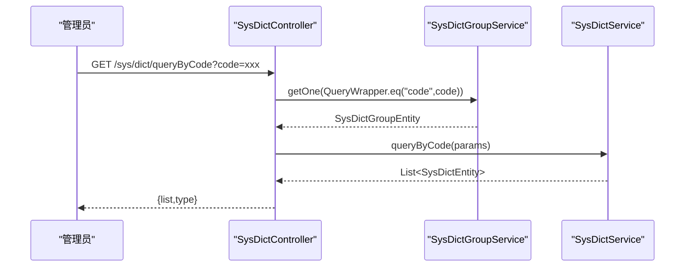
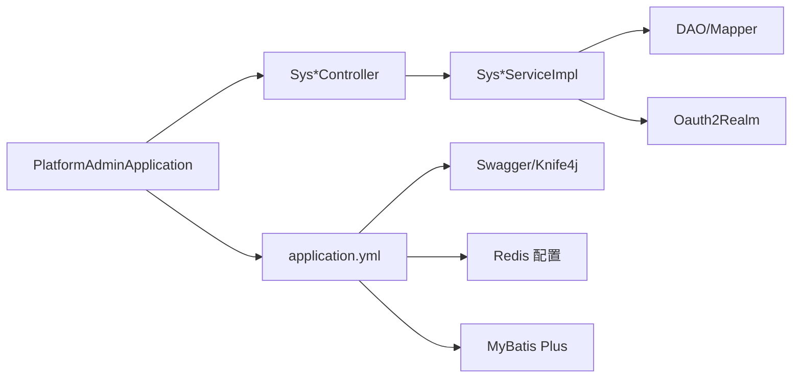

# 系统管理模块

<cite>
**本文引用的文件**   
- [PlatformAdminApplication.java](file://platform-admin/src/main/java/com/platform/PlatformAdminApplication.java)
- [application.yml](file://platform-admin/src/main/resources/application.yml)
- [SysUserController.java](file://platform-admin/src/main/java/com/platform/modules/sys/controller/SysUserController.java)
- [SysRoleController.java](file://platform-admin/src/main/java/com/platform/modules/sys/controller/SysRoleController.java)
- [SysMenuController.java](file://platform-admin/src/main/java/com/platform/modules/sys/controller/SysMenuController.java)
- [SysConfigController.java](file://platform-admin/src/main/java/com/platform/modules/sys/controller/SysConfigController.java)
- [SysDictController.java](file://platform-admin/src/main/java/com/platform/modules/sys/controller/SysDictController.java)
- [SysLogController.java](file://platform-admin/src/main/java/com/platform/modules/sys/controller/SysLogController.java)
- [Oauth2Realm.java](file://platform-admin/src/main/java/com/platform/modules/sys/oauth2/Oauth2Realm.java)
- [SysUserServiceImpl.java](file://platform-admin/src/main/java/com/platform/modules/sys/service/impl/SysUserServiceImpl.java)
- [SysRoleEntity.java](file://platform-admin/src/main/java/com/platform/modules/sys/entity/SysRoleEntity.java)
- [MenuTypeEnum.java](file://platform-admin/src/main/java/com/platform/modules/sys/enums/MenuTypeEnum.java)
</cite>

## 目录
1. [简介](#简介)
2. [项目结构](#项目结构)
3. [核心组件](#核心组件)
4. [架构总览](#架构总览)
5. [详细组件分析](#详细组件分析)
6. [依赖分析](#依赖分析)
7. [性能考虑](#性能考虑)
8. [故障排查指南](#故障排查指南)
9. [结论](#结论)
10. [附录](#附录)

## 简介
本文件面向系统管理员与开发者，系统性梳理平台“系统管理模块”的权限控制、配置管理、日志审计与数据字典能力，覆盖用户管理、角色管理、菜单权限、部门组织、参数配置、字典管理、系统设置、缓存管理、操作日志、登录日志、系统监控与字典数据标准化等完整功能域。文档在保证技术深度的同时，提供可操作的最佳实践建议与排障指引。

## 项目结构
系统管理模块位于后端服务模块 platform-admin 中，采用基于功能域的分层组织：controller 控制器层、service 业务层、dao 数据访问层、entity 实体层、oauth2 安全认证、enums 枚举等。前端界面位于 platform-admin-ui，通过 REST 接口与后端交互；后端通过 Spring Boot 启动，集成 Shiro 实现鉴权授权，Swagger/OpenAPI 提供接口文档。

图表来源
- [PlatformAdminApplication.java:1-93](file://platform-admin/src/main/java/com/platform/PlatformAdminApplication.java#L1-L93)
- [application.yml:1-205](file://platform-admin/src/main/resources/application.yml#L1-L205)
- [SysUserController.java:1-243](file://platform-admin/src/main/java/com/platform/modules/sys/controller/SysUserController.java#L1-L243)
- [SysRoleController.java:1-169](file://platform-admin/src/main/java/com/platform/modules/sys/controller/SysRoleController.java#L1-L169)
- [SysMenuController.java:1-252](file://platform-admin/src/main/java/com/platform/modules/sys/controller/SysMenuController.java#L1-L252)
- [SysConfigController.java:1-177](file://platform-admin/src/main/java/com/platform/modules/sys/controller/SysConfigController.java#L1-L177)
- [SysDictController.java:1-176](file://platform-admin/src/main/java/com/platform/modules/sys/controller/SysDictController.java#L1-L176)
- [SysLogController.java:1-64](file://platform-admin/src/main/java/com/platform/modules/sys/controller/SysLogController.java#L1-L64)
- [Oauth2Realm.java:1-89](file://platform-admin/src/main/java/com/platform/modules/sys/oauth2/Oauth2Realm.java#L1-L89)
- [SysUserServiceImpl.java:1-153](file://platform-admin/src/main/java/com/platform/modules/sys/service/impl/SysUserServiceImpl.java#L1-L153)
- [SysRoleEntity.java:1-80](file://platform-admin/src/main/java/com/platform/modules/sys/entity/SysRoleEntity.java#L1-L80)
- [MenuTypeEnum.java:1-60](file://platform-admin/src/main/java/com/platform/modules/sys/enums/MenuTypeEnum.java#L1-L60)

章节来源
- [PlatformAdminApplication.java:1-93](file://platform-admin/src/main/java/com/platform/PlatformAdminApplication.java#L1-L93)
- [application.yml:1-205](file://platform-admin/src/main/resources/application.yml#L1-L205)

## 核心组件
- 用户管理：提供用户分页查询、详情查询、新增/修改、删除、重置密码、密码修改等功能，并结合数据权限与角色校验，确保权限边界。
- 角色管理：提供角色分页查询、角色选择、详情查询、新增/修改/删除，以及角色绑定菜单与组织范围。
- 菜单权限：提供导航菜单生成、菜单树选择、菜单类型校验（目录/菜单/按钮），并支持权限字符串动态加载。
- 配置管理：提供系统参数配置的增删改查、按 key 查询/更新配置值、状态筛选等。
- 字典管理：提供数据字典与字典类型的增删改查、按 code 查询字典项、类型标注等。
- 日志审计：提供系统日志分页查询，支撑操作审计与问题定位。
- 安全认证：基于 Shiro 的 Realm 实现，按用户权限集授予资源访问能力，防止越权访问。

章节来源
- [SysUserController.java:1-243](file://platform-admin/src/main/java/com/platform/modules/sys/controller/SysUserController.java#L1-L243)
- [SysRoleController.java:1-169](file://platform-admin/src/main/java/com/platform/modules/sys/controller/SysRoleController.java#L1-L169)
- [SysMenuController.java:1-252](file://platform-admin/src/main/java/com/platform/modules/sys/controller/SysMenuController.java#L1-L252)
- [SysConfigController.java:1-177](file://platform-admin/src/main/java/com/platform/modules/sys/controller/SysConfigController.java#L1-L177)
- [SysDictController.java:1-176](file://platform-admin/src/main/java/com/platform/modules/sys/controller/SysDictController.java#L1-L176)
- [SysLogController.java:1-64](file://platform-admin/src/main/java/com/platform/modules/sys/controller/SysLogController.java#L1-L64)
- [Oauth2Realm.java:1-89](file://platform-admin/src/main/java/com/platform/modules/sys/oauth2/Oauth2Realm.java#L1-L89)

## 架构总览
系统管理模块遵循“控制器-服务-数据访问-实体”分层，配合 Shiro 进行鉴权授权，统一通过 REST 接口对外提供能力。启动类负责服务引导与日志输出，配置文件集中管理端口、上下文路径、Swagger 分组、Redis、MyBatis Plus 等运行参数。

图表来源
- [PlatformAdminApplication.java:1-93](file://platform-admin/src/main/java/com/platform/PlatformAdminApplication.java#L1-L93)
- [application.yml:1-205](file://platform-admin/src/main/resources/application.yml#L1-L205)
- [Oauth2Realm.java:1-89](file://platform-admin/src/main/java/com/platform/modules/sys/oauth2/Oauth2Realm.java#L1-L89)
- [SysUserController.java:1-243](file://platform-admin/src/main/java/com/platform/modules/sys/controller/SysUserController.java#L1-L243)
- [SysRoleController.java:1-169](file://platform-admin/src/main/java/com/platform/modules/sys/controller/SysRoleController.java#L1-L169)
- [SysMenuController.java:1-252](file://platform-admin/src/main/java/com/platform/modules/sys/controller/SysMenuController.java#L1-L252)
- [SysConfigController.java:1-177](file://platform-admin/src/main/java/com/platform/modules/sys/controller/SysConfigController.java#L1-L177)
- [SysDictController.java:1-176](file://platform-admin/src/main/java/com/platform/modules/sys/controller/SysDictController.java#L1-L176)
- [SysLogController.java:1-64](file://platform-admin/src/main/java/com/platform/modules/sys/controller/SysLogController.java#L1-L64)

## 详细组件分析

### 用户权限管理
- 用户管理
  - 分页查询、详情查询、新增/修改、删除、重置密码、密码修改均受权限注解保护。
  - 新增/修改时对角色集合进行越权校验，确保仅能维护在自身数据权限范围内的角色。
  - 密码采用 SHA-256 加盐存储，保障安全性。
- 角色管理
  - 角色绑定菜单与组织范围，支持按数据权限过滤。
  - 角色详情同时返回菜单 ID 列表与组织 NO 列表，便于前端渲染与权限计算。
- 菜单权限
  - 导航菜单按用户动态生成，权限集合由 Shiro 统一提供。
  - 菜单类型严格校验（目录/菜单仅允许特定父级类型，按钮仅允许菜单作为父级）。
- 安全认证
  - Realm 在授权阶段加载用户权限集合，在认证阶段校验 token 有效性与账户状态。

图表来源
- [SysUserController.java:1-243](file://platform-admin/src/main/java/com/platform/modules/sys/controller/SysUserController.java#L1-L243)
- [SysRoleController.java:1-169](file://platform-admin/src/main/java/com/platform/modules/sys/controller/SysRoleController.java#L1-L169)
- [SysMenuController.java:1-252](file://platform-admin/src/main/java/com/platform/modules/sys/controller/SysMenuController.java#L1-L252)
- [Oauth2Realm.java:1-89](file://platform-admin/src/main/java/com/platform/modules/sys/oauth2/Oauth2Realm.java#L1-L89)
- [SysUserServiceImpl.java:1-153](file://platform-admin/src/main/java/com/platform/modules/sys/service/impl/SysUserServiceImpl.java#L1-L153)
- [SysRoleEntity.java:1-80](file://platform-admin/src/main/java/com/platform/modules/sys/entity/SysRoleEntity.java#L1-L80)

章节来源
- [SysUserController.java:1-243](file://platform-admin/src/main/java/com/platform/modules/sys/controller/SysUserController.java#L1-L243)
- [SysRoleController.java:1-169](file://platform-admin/src/main/java/com/platform/modules/sys/controller/SysRoleController.java#L1-L169)
- [SysMenuController.java:1-252](file://platform-admin/src/main/java/com/platform/modules/sys/controller/SysMenuController.java#L1-L252)
- [Oauth2Realm.java:1-89](file://platform-admin/src/main/java/com/platform/modules/sys/oauth2/Oauth2Realm.java#L1-L89)
- [SysUserServiceImpl.java:1-153](file://platform-admin/src/main/java/com/platform/modules/sys/service/impl/SysUserServiceImpl.java#L1-L153)
- [SysRoleEntity.java:1-80](file://platform-admin/src/main/java/com/platform/modules/sys/entity/SysRoleEntity.java#L1-L80)

### 系统配置管理
- 参数配置：支持分页查询、详情查询、新增、修改、删除、按 key 查询值、按 key 更新值。
- 状态筛选：提供 status=0 的键值对查询，便于前端快速拉取启用态配置。
- 配置变更审计：所有写操作均记录系统日志，便于审计追踪。

图表来源
- [SysConfigController.java:1-177](file://platform-admin/src/main/java/com/platform/modules/sys/controller/SysConfigController.java#L1-L177)
- [SysLogController.java:1-64](file://platform-admin/src/main/java/com/platform/modules/sys/controller/SysLogController.java#L1-L64)

章节来源
- [SysConfigController.java:1-177](file://platform-admin/src/main/java/com/platform/modules/sys/controller/SysConfigController.java#L1-L177)
- [SysLogController.java:1-64](file://platform-admin/src/main/java/com/platform/modules/sys/controller/SysLogController.java#L1-L64)

### 日志审计功能
- 操作日志：提供分页查询，支持按条件筛选，便于审计与问题回溯。
- 登录日志：登录流程由认证模块统一拦截与记录，结合权限模块实现访问控制。
- 系统监控：通过日志聚合与告警策略实现系统健康度监控（部署层面建议结合外部日志平台）。

图表来源
- [Oauth2Realm.java:1-89](file://platform-admin/src/main/java/com/platform/modules/sys/oauth2/Oauth2Realm.java#L1-L89)
- [SysMenuController.java:1-252](file://platform-admin/src/main/java/com/platform/modules/sys/controller/SysMenuController.java#L1-L252)
- [SysLogController.java:1-64](file://platform-admin/src/main/java/com/platform/modules/sys/controller/SysLogController.java#L1-L64)

章节来源
- [SysLogController.java:1-64](file://platform-admin/src/main/java/com/platform/modules/sys/controller/SysLogController.java#L1-L64)
- [Oauth2Realm.java:1-89](file://platform-admin/src/main/java/com/platform/modules/sys/oauth2/Oauth2Realm.java#L1-L89)

### 数据字典管理
- 字典类型与字典数据：支持分页查询、详情查询、新增、修改、删除、按 code 查询字典项。
- 类型标注：根据字典分组 code 反查类型名称，便于前端展示与使用。
- 枚举管理：菜单类型通过枚举统一约束（目录/菜单/按钮），保证层级与权限语义清晰。

图表来源
- [SysDictController.java:1-176](file://platform-admin/src/main/java/com/platform/modules/sys/controller/SysDictController.java#L1-L176)

章节来源
- [SysDictController.java:1-176](file://platform-admin/src/main/java/com/platform/modules/sys/controller/SysDictController.java#L1-L176)
- [MenuTypeEnum.java:1-60](file://platform-admin/src/main/java/com/platform/modules/sys/enums/MenuTypeEnum.java#L1-L60)

## 依赖分析
- 启动与配置
  - 启动类排除默认安全配置，引入动态数据源与 Undertow 服务器配置，统一输出服务启动信息与 API 文档地址。
  - 配置文件定义了 Swagger 分组（含系统管理分组）、Knife4j 增强、Redis 连接、MyBatis Plus 全局配置、上传大小限制等。
- 控制器与服务
  - 控制器层广泛使用 Shiro 注解进行权限控制，服务层承担业务逻辑与事务管理，DAO 层封装数据访问。
- 安全与权限
  - Realm 在授权阶段加载用户权限集合，在认证阶段校验 token 与账户状态，防止越权与失效访问。

图表来源
- [PlatformAdminApplication.java:1-93](file://platform-admin/src/main/java/com/platform/PlatformAdminApplication.java#L1-L93)
- [application.yml:1-205](file://platform-admin/src/main/resources/application.yml#L1-L205)
- [Oauth2Realm.java:1-89](file://platform-admin/src/main/java/com/platform/modules/sys/oauth2/Oauth2Realm.java#L1-L89)

章节来源
- [PlatformAdminApplication.java:1-93](file://platform-admin/src/main/java/com/platform/PlatformAdminApplication.java#L1-L93)
- [application.yml:1-205](file://platform-admin/src/main/resources/application.yml#L1-L205)

## 性能考虑
- 分页与排序：控制器层统一使用分页组件与排序字段，避免一次性加载大量数据。
- 缓存与连接池：Redis 连接池参数与 MyBatis Plus 缓存配置需结合实际负载调整。
- 并发与线程： Undertow 线程池配置需根据并发量与 CPU 核心数优化，避免文件句柄耗尽。
- 接口文档：Swagger/Knife4j 分组扫描仅限系统管理相关包，减少文档构建开销。

## 故障排查指南
- 登录失败/账号锁定
  - 认证阶段若 token 失效或账户状态异常，Realm 将抛出相应异常；检查 token 是否过期与账户状态。
- 权限不足
  - 控制器方法均标注权限注解，若返回权限不足，确认用户角色是否包含所需权限字符串。
- 菜单层级错误
  - 菜单类型校验严格限制父子层级关系，若保存失败，检查父级类型是否符合要求。
- 配置更新无效
  - 使用按 key 更新值接口时，确认 key 正确且状态有效；必要时通过分页查询核对配置项。
- 日志无法查询
  - 确认日志表存在且索引合理；检查分页参数与筛选条件。

章节来源
- [Oauth2Realm.java:1-89](file://platform-admin/src/main/java/com/platform/modules/sys/oauth2/Oauth2Realm.java#L1-L89)
- [SysMenuController.java:1-252](file://platform-admin/src/main/java/com/platform/modules/sys/controller/SysMenuController.java#L1-L252)
- [SysConfigController.java:1-177](file://platform-admin/src/main/java/com/platform/modules/sys/controller/SysConfigController.java#L1-L177)
- [SysLogController.java:1-64](file://platform-admin/src/main/java/com/platform/modules/sys/controller/SysLogController.java#L1-L64)

## 结论
系统管理模块以“权限-配置-审计-字典”为核心能力，通过严格的权限注解、菜单类型约束、配置与日志审计机制，构建了安全可控、可观测、可扩展的后台管理体系。建议在生产环境结合外部日志平台与缓存策略进一步完善监控与性能优化。

## 附录
- 最佳实践
  - 权限设计：采用细粒度权限字符串，结合角色与组织范围实现最小权限原则。
  - 配置管理：启用状态的配置项优先暴露，敏感配置通过密钥管理与只读策略保护。
  - 审计留痕：所有写操作必记录日志，保留至少 90 天以上，定期归档与轮转。
  - 字典治理：统一字典类型与编码规范，避免重复与歧义，定期清理废弃项。
  - 安全加固：定期轮换 token 有效期，强制密码复杂度与定期更换策略。