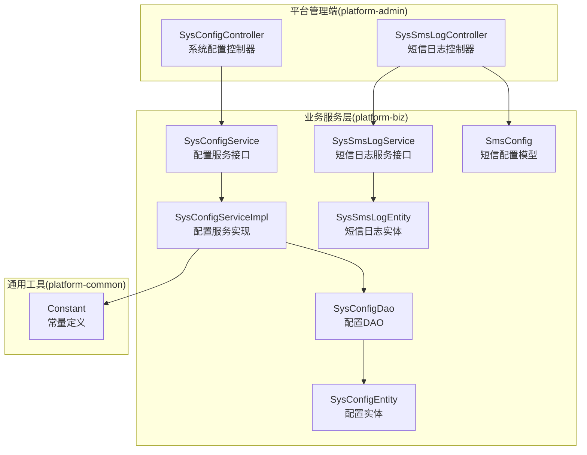
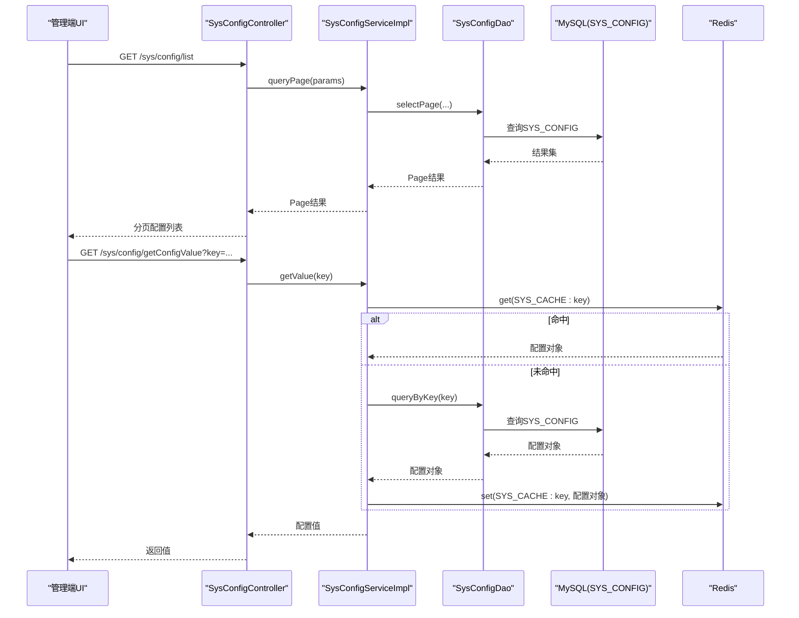
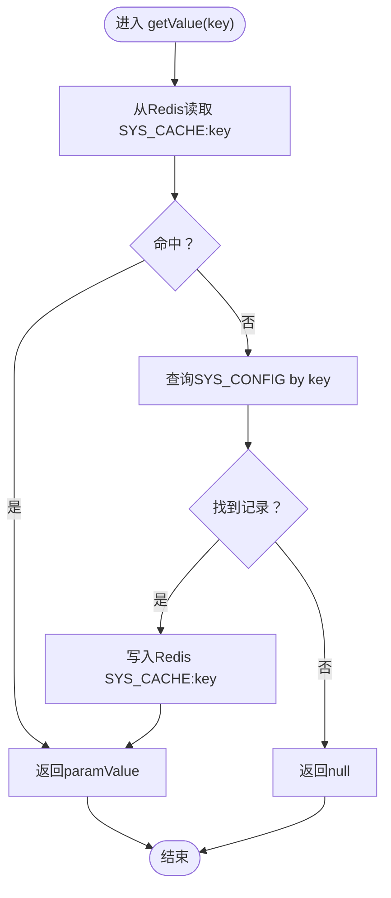
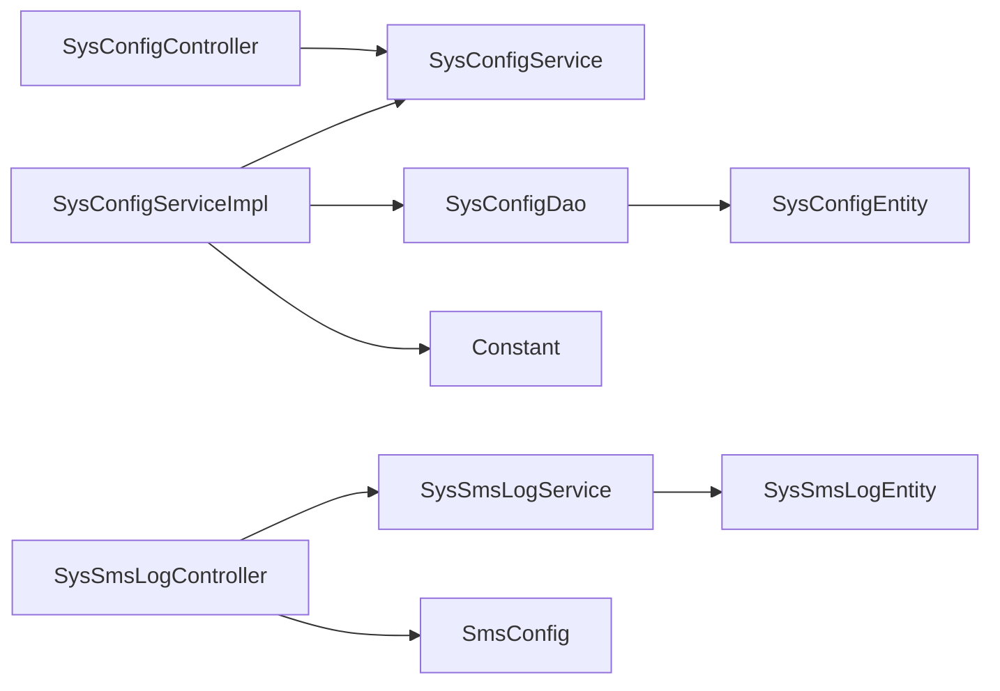

# 系统配置管理

<cite>
**本文引用的文件**
- [SysConfigController.java](file://platform-admin/src/main/java/com/platform/modules/sys/controller/SysConfigController.java)
- [SysConfigService.java](file://platform-biz/src/main/java/com/platform/modules/sys/service/SysConfigService.java)
- [SysConfigServiceImpl.java](file://platform-biz/src/main/java/com/platform/modules/sys/service/impl/SysConfigServiceImpl.java)
- [SysConfigDao.java](file://platform-biz/src/main/java/com/platform/modules/sys/dao/SysConfigDao.java)
- [SysConfigEntity.java](file://platform-biz/src/main/java/com/platform/modules/sys/entity/SysConfigEntity.java)
- [SysSmsLogController.java](file://platform-admin/src/main/java/com/platform/modules/sys/controller/SysSmsLogController.java)
- [SysSmsLogService.java](file://platform-biz/src/main/java/com/platform/modules/sys/service/SysSmsLogService.java)
- [SysSmsLogEntity.java](file://platform-biz/src/main/java/com/platform/modules/sys/entity/SysSmsLogEntity.java)
- [SmsConfig.java](file://platform-biz/src/main/java/com/platform/modules/sys/entity/SmsConfig.java)
- [Constant.java](file://platform-common/src/main/java/com/platform/common/utils/Constant.java)
- [application.yml](file://platform-admin/src/main/resources/application.yml)
- [base.sql](file://_sql/base.sql)
</cite>

## 目录
1. [简介](#简介)
2. [项目结构](#项目结构)
3. [核心组件](#核心组件)
4. [架构总览](#架构总览)
5. [详细组件分析](#详细组件分析)
6. [依赖分析](#依赖分析)
7. [性能考虑](#性能考虑)
8. [故障排除指南](#故障排除指南)
9. [结论](#结论)
10. [附录](#附录)

## 简介
本文件系统性阐述平台的“系统配置管理”能力，覆盖系统参数配置、短信配置、邮件配置、缓存配置等系统级设置功能；详述配置项的新增、修改、删除、查询与按Key取值等操作流程；解释配置数据的持久化存储、Redis缓存策略与热更新机制；介绍短信发送日志与短信配置维护；并为系统管理员提供操作指南，为开发者提供扩展接口参考，同时给出配置安全、性能优化与故障排除的实用建议。

## 项目结构
围绕配置管理的关键模块分布于三个子工程：
- 平台管理端（platform-admin）：提供配置管理的Web控制器与权限控制
- 业务服务层（platform-biz）：提供配置与短信日志的服务接口与实现、DAO、实体
- 通用工具与常量（platform-common）：提供常量定义与通用工具

图表来源
- [SysConfigController.java:46-176](file://platform-admin/src/main/java/com/platform/modules/sys/controller/SysConfigController.java#L46-L176)
- [SysSmsLogController.java:48-177](file://platform-admin/src/main/java/com/platform/modules/sys/controller/SysSmsLogController.java#L48-L177)
- [SysConfigService.java:32-98](file://platform-biz/src/main/java/com/platform/modules/sys/service/SysConfigService.java#L32-L98)
- [SysConfigServiceImpl.java:45-141](file://platform-biz/src/main/java/com/platform/modules/sys/service/impl/SysConfigServiceImpl.java#L45-L141)
- [SysConfigDao.java:31-50](file://platform-biz/src/main/java/com/platform/modules/sys/dao/SysConfigDao.java#L31-L50)
- [SysConfigEntity.java:33-46](file://platform-biz/src/main/java/com/platform/modules/sys/entity/SysConfigEntity.java#L33-L46)
- [SysSmsLogService.java:34-79](file://platform-biz/src/main/java/com/platform/modules/sys/service/SysSmsLogService.java#L34-L79)
- [SysSmsLogEntity.java:34-80](file://platform-biz/src/main/java/com/platform/modules/sys/entity/SysSmsLogEntity.java#L34-L80)
- [SmsConfig.java:33-74](file://platform-biz/src/main/java/com/platform/modules/sys/entity/SmsConfig.java#L33-L74)
- [Constant.java:26-239](file://platform-common/src/main/java/com/platform/common/utils/Constant.java#L26-L239)

章节来源
- [SysConfigController.java:46-176](file://platform-admin/src/main/java/com/platform/modules/sys/controller/SysConfigController.java#L46-L176)
- [SysSmsLogController.java:48-177](file://platform-admin/src/main/java/com/platform/modules/sys/controller/SysSmsLogController.java#L48-L177)
- [SysConfigService.java:32-98](file://platform-biz/src/main/java/com/platform/modules/sys/service/SysConfigService.java#L32-L98)
- [SysConfigServiceImpl.java:45-141](file://platform-biz/src/main/java/com/platform/modules/sys/service/impl/SysConfigServiceImpl.java#L45-L141)
- [SysConfigDao.java:31-50](file://platform-biz/src/main/java/com/platform/modules/sys/dao/SysConfigDao.java#L31-L50)
- [SysConfigEntity.java:33-46](file://platform-biz/src/main/java/com/platform/modules/sys/entity/SysConfigEntity.java#L33-L46)
- [SysSmsLogService.java:34-79](file://platform-biz/src/main/java/com/platform/modules/sys/service/SysSmsLogService.java#L34-L79)
- [SysSmsLogEntity.java:34-80](file://platform-biz/src/main/java/com/platform/modules/sys/entity/SysSmsLogEntity.java#L34-L80)
- [SmsConfig.java:33-74](file://platform-biz/src/main/java/com/platform/modules/sys/entity/SmsConfig.java#L33-L74)
- [Constant.java:26-239](file://platform-common/src/main/java/com/platform/common/utils/Constant.java#L26-L239)

## 核心组件
- 系统配置控制器：提供配置列表、详情、保存、更新、删除、按Key取值、按Key更新值等REST接口
- 配置服务接口与实现：封装分页查询、新增、更新、按Key更新值、删除、按Key取值、按Key取对象等逻辑，并集成Redis缓存
- 配置DAO：提供按Key查询与按Key更新值的数据库操作
- 配置实体：SYS_CONFIG表的ORM映射
- 短信日志控制器：提供短信日志的列表、详情、新增、更新、删除、短信配置读取与保存
- 短信日志服务与实体：短信发送记录的CRUD与分页
- 短信配置模型：短信通道类型、模板、签名等配置结构
- 常量：统一管理配置Key、缓存前缀、短信前缀等

章节来源
- [SysConfigController.java:46-176](file://platform-admin/src/main/java/com/platform/modules/sys/controller/SysConfigController.java#L46-L176)
- [SysConfigService.java:32-98](file://platform-biz/src/main/java/com/platform/modules/sys/service/SysConfigService.java#L32-L98)
- [SysConfigServiceImpl.java:45-141](file://platform-biz/src/main/java/com/platform/modules/sys/service/impl/SysConfigServiceImpl.java#L45-L141)
- [SysConfigDao.java:31-50](file://platform-biz/src/main/java/com/platform/modules/sys/dao/SysConfigDao.java#L31-L50)
- [SysConfigEntity.java:33-46](file://platform-biz/src/main/java/com/platform/modules/sys/entity/SysConfigEntity.java#L33-L46)
- [SysSmsLogController.java:48-177](file://platform-admin/src/main/java/com/platform/modules/sys/controller/SysSmsLogController.java#L48-L177)
- [SysSmsLogService.java:34-79](file://platform-biz/src/main/java/com/platform/modules/sys/service/SysSmsLogService.java#L34-L79)
- [SysSmsLogEntity.java:34-80](file://platform-biz/src/main/java/com/platform/modules/sys/entity/SysSmsLogEntity.java#L34-L80)
- [SmsConfig.java:33-74](file://platform-biz/src/main/java/com/platform/modules/sys/entity/SmsConfig.java#L33-L74)
- [Constant.java:26-239](file://platform-common/src/main/java/com/platform/common/utils/Constant.java#L26-L239)

## 架构总览
系统配置管理采用“控制器-服务-DAO-实体”的分层架构，结合Redis实现配置的热加载与缓存命中，确保高并发场景下的低延迟访问。

图表来源
- [SysConfigController.java:56-63](file://platform-admin/src/main/java/com/platform/modules/sys/controller/SysConfigController.java#L56-L63)
- [SysConfigServiceImpl.java:91-99](file://platform-biz/src/main/java/com/platform/modules/sys/service/impl/SysConfigServiceImpl.java#L91-L99)
- [SysConfigDao.java:34-49](file://platform-biz/src/main/java/com/platform/modules/sys/dao/SysConfigDao.java#L34-L49)
- [Constant.java:68-70](file://platform-common/src/main/java/com/platform/common/utils/Constant.java#L68-L70)

## 详细组件分析

### 系统配置控制器（SysConfigController）
- 提供配置列表、按Key取值、按Key更新值、保存、更新、删除等接口
- 使用Shiro注解进行权限控制
- 使用统一响应包装RestResponse

章节来源
- [SysConfigController.java:56-176](file://platform-admin/src/main/java/com/platform/modules/sys/controller/SysConfigController.java#L56-L176)

### 配置服务接口与实现（SysConfigService/SysConfigServiceImpl）
- 分页查询：支持按参数名模糊查询，仅展示状态为“显示”的配置
- 新增/更新：持久化后同步写入Redis缓存
- 按Key更新值：更新数据库后删除Redis对应Key，实现热更新
- 删除：遍历ID集合，先删Redis缓存，再删除数据库记录
- 按Key取值：优先从Redis读取，未命中则查询数据库并回填Redis
- 按Key取对象：基于getValue返回的JSON字符串反序列化为目标对象

图表来源
- [SysConfigServiceImpl.java:91-107](file://platform-biz/src/main/java/com/platform/modules/sys/service/impl/SysConfigServiceImpl.java#L91-L107)
- [Constant.java:68-70](file://platform-common/src/main/java/com/platform/common/utils/Constant.java#L68-L70)

章节来源
- [SysConfigService.java:32-98](file://platform-biz/src/main/java/com/platform/modules/sys/service/SysConfigService.java#L32-L98)
- [SysConfigServiceImpl.java:45-141](file://platform-biz/src/main/java/com/platform/modules/sys/service/impl/SysConfigServiceImpl.java#L45-L141)

### 配置DAO与实体（SysConfigDao/SysConfigEntity）
- DAO提供按Key查询与按Key更新值的SQL操作
- 实体映射SYS_CONFIG表，包含主键、参数Key、参数值、状态、备注等字段

章节来源
- [SysConfigDao.java:31-50](file://platform-biz/src/main/java/com/platform/modules/sys/dao/SysConfigDao.java#L31-L50)
- [SysConfigEntity.java:33-46](file://platform-biz/src/main/java/com/platform/modules/sys/entity/SysConfigEntity.java#L33-L46)

### 短信配置与短信日志
- 短信配置模型SmsConfig定义了短信通道类型、模板、签名等字段
- 短信日志实体SysSmsLogEntity记录模板ID、验证码、手机号、发送时间、签名、发送状态、发送编号、成功数、返回消息等
- SysSmsLogController提供短信日志的CRUD与短信配置的读取/保存接口

章节来源
- [SmsConfig.java:33-74](file://platform-biz/src/main/java/com/platform/modules/sys/entity/SmsConfig.java#L33-L74)
- [SysSmsLogEntity.java:34-80](file://platform-biz/src/main/java/com/platform/modules/sys/entity/SysSmsLogEntity.java#L34-L80)
- [SysSmsLogController.java:48-177](file://platform-admin/src/main/java/com/platform/modules/sys/controller/SysSmsLogController.java#L48-L177)

### 常量与配置Key
- 统一管理配置Key（如短信配置Key、云存储配置Key）、缓存前缀（系统缓存前缀、业务缓存前缀）、短信前缀等
- 通过常量集中管理，降低硬编码风险

章节来源
- [Constant.java:26-239](file://platform-common/src/main/java/com/platform/common/utils/Constant.java#L26-L239)

### 数据模型与初始化脚本
- SYS_CONFIG表结构包含ID、PARAM_KEY、PARAM_VALUE、STATUS、REMARK等字段，其中PARAM_KEY唯一
- 初始化脚本中包含短信配置与云存储配置示例记录

章节来源
- [base.sql:317-326](file://_sql/base.sql#L317-L326)
- [base.sql:331-331](file://_sql/base.sql#L331-L331)

## 依赖分析
- 控制器依赖服务接口；服务实现依赖DAO与Redis工具；DAO依赖数据库；常量贯穿服务与控制器
- 配置Key与缓存前缀在多处使用，形成跨模块依赖

图表来源
- [SysConfigController.java:46-176](file://platform-admin/src/main/java/com/platform/modules/sys/controller/SysConfigController.java#L46-L176)
- [SysConfigService.java:32-98](file://platform-biz/src/main/java/com/platform/modules/sys/service/SysConfigService.java#L32-L98)
- [SysConfigServiceImpl.java:45-141](file://platform-biz/src/main/java/com/platform/modules/sys/service/impl/SysConfigServiceImpl.java#L45-L141)
- [SysConfigDao.java:31-50](file://platform-biz/src/main/java/com/platform/modules/sys/dao/SysConfigDao.java#L31-L50)
- [SysConfigEntity.java:33-46](file://platform-biz/src/main/java/com/platform/modules/sys/entity/SysConfigEntity.java#L33-L46)
- [SysSmsLogController.java:48-177](file://platform-admin/src/main/java/com/platform/modules/sys/controller/SysSmsLogController.java#L48-L177)
- [SysSmsLogService.java:34-79](file://platform-biz/src/main/java/com/platform/modules/sys/service/SysSmsLogService.java#L34-L79)
- [SysSmsLogEntity.java:34-80](file://platform-biz/src/main/java/com/platform/modules/sys/entity/SysSmsLogEntity.java#L34-L80)
- [SmsConfig.java:33-74](file://platform-biz/src/main/java/com/platform/modules/sys/entity/SmsConfig.java#L33-L74)
- [Constant.java:26-239](file://platform-common/src/main/java/com/platform/common/utils/Constant.java#L26-L239)

## 性能考虑
- 缓存命中优先：getValue按Key优先从Redis读取，减少数据库压力
- 热更新策略：按Key更新值后删除Redis缓存，下次访问自动回填，保证一致性
- 分页查询：列表接口支持分页与模糊匹配，避免一次性加载大量配置
- Redis连接池配置：在应用配置中提供连接池参数，建议结合压测调整
- 配置对象反序列化：按Key取对象时使用Gson进行JSON解析，注意对象结构变更的兼容性

章节来源
- [SysConfigServiceImpl.java:91-130](file://platform-biz/src/main/java/com/platform/modules/sys/service/impl/SysConfigServiceImpl.java#L91-L130)
- [application.yml:81-98](file://platform-admin/src/main/resources/application.yml#L81-L98)

## 故障排除指南
- 配置无法生效
  - 检查配置状态是否为“显示”（STATUS=1）
  - 检查Redis中是否存在SYS_CACHE前缀的Key
  - 如需强制刷新，可使用按Key更新值接口清空缓存后重试
- 短信配置不生效
  - 使用短信配置读取接口确认当前配置
  - 使用短信配置保存接口更新配置后，检查数据库与Redis缓存是否一致
- 邮件配置
  - 邮件服务器配置在应用配置文件中硬编码，如需变更请在相应位置修改
- 权限不足
  - 接口均带有权限注解，确保操作用户具备相应权限

章节来源
- [SysConfigController.java:56-176](file://platform-admin/src/main/java/com/platform/modules/sys/controller/SysConfigController.java#L56-L176)
- [SysSmsLogController.java:154-176](file://platform-admin/src/main/java/com/platform/modules/sys/controller/SysSmsLogController.java#L154-L176)
- [application.yml:106-112](file://platform-admin/src/main/resources/application.yml#L106-L112)

## 结论
系统配置管理通过“控制器-服务-DAO-实体”的清晰分层与Redis缓存策略，实现了配置的高效读取与热更新；短信配置与短信日志提供了完整的运维可观测性；统一的常量管理降低了耦合度。建议在生产环境中结合压测优化Redis连接池参数，并持续完善配置校验与审计日志。

## 附录

### 配置管理操作指南（管理员）
- 新增配置
  - 调用保存接口，传入参数Key与参数值，系统持久化后自动写入Redis
- 修改配置
  - 调用更新接口或按Key更新值接口；后者会删除Redis缓存，下次访问自动回填
- 删除配置
  - 调用删除接口；系统会先清理Redis缓存，再删除数据库记录
- 查询配置
  - 列表接口支持分页与模糊查询；按Key取值接口用于快速获取配置值
- 短信配置
  - 通过短信配置读取接口查看当前配置；通过保存接口更新配置

章节来源
- [SysConfigController.java:56-176](file://platform-admin/src/main/java/com/platform/modules/sys/controller/SysConfigController.java#L56-L176)
- [SysSmsLogController.java:154-176](file://platform-admin/src/main/java/com/platform/modules/sys/controller/SysSmsLogController.java#L154-L176)

### 开发者扩展接口参考
- 新增配置Key
  - 在常量类中新增配置Key常量
  - 在数据库中插入对应的配置记录（或通过管理端界面新增）
- 新增配置实体与服务
  - 定义实体与DAO，实现服务接口与实现
  - 在控制器中新增对应REST接口
- 配置对象化
  - 使用按Key取对象接口，将JSON字符串反序列化为目标对象

章节来源
- [Constant.java:26-239](file://platform-common/src/main/java/com/platform/common/utils/Constant.java#L26-L239)
- [SysConfigService.java:88-96](file://platform-biz/src/main/java/com/platform/modules/sys/service/SysConfigService.java#L88-L96)
- [SysConfigServiceImpl.java:101-113](file://platform-biz/src/main/java/com/platform/modules/sys/service/impl/SysConfigServiceImpl.java#L101-L113)