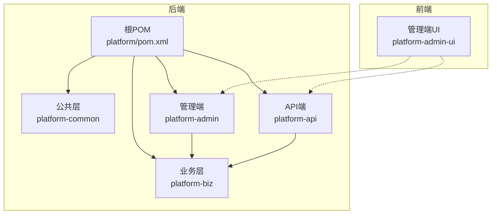
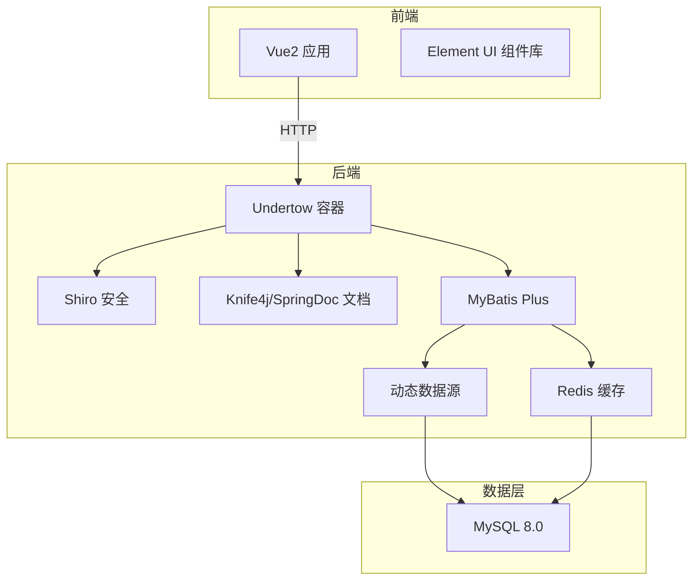
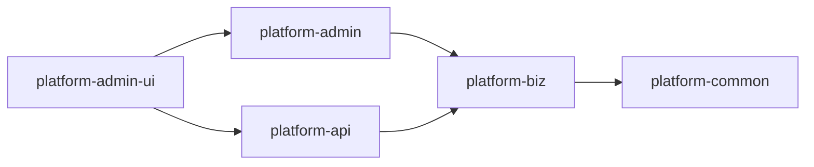

# 技术选型与架构模式

<cite>
**本文引用的文件**   
- [根POM（platform/pom.xml）](file://pom.xml)
- [平台管理端POM（platform-admin/pom.xml）](file://platform-admin/pom.xml)
- [平台API端POM（platform-api/pom.xml）](file://platform-api/pom.xml)
- [平台业务层POM（platform-biz/pom.xml）](file://platform-biz/pom.xml)
- [平台公共层POM（platform-common/pom.xml）](file://platform-common/pom.xml)
- [平台管理端启动类（PlatformAdminApplication.java）](file://platform-admin/src/main/java/com/platform/PlatformAdminApplication.java)
- [平台管理端MyBatis Plus配置（MybatisPlusConfig.java）](file://platform-admin/src/main/java/com/platform/config/MybatisPlusConfig.java)
- [平台管理端Shiro配置（ShiroConfig.java）](file://platform-admin/src/main/java/com/platform/config/ShiroConfig.java)
- [平台管理端应用配置（application.yml）](file://platform-admin/src/main/resources/application.yml)
- [平台API端应用配置（application.yml）](file://platform-api/src/main/resources/application.yml)
- [公共层Redis配置（RedisConfig.java）](file://platform-common/src/main/java/com/platform/config/RedisConfig.java)
- [公共层常量定义（Constant.java）](file://platform-common/src/main/java/com/platform/common/utils/Constant.java)
- [前端UI依赖（platform-admin-ui/package.json）](file://platform-admin-ui/package.json)
</cite>

## 目录
1. [引言](#引言)
2. [项目结构](#项目结构)
3. [核心组件](#核心组件)
4. [架构总览](#架构总览)
5. [详细组件分析](#详细组件分析)
6. [依赖关系分析](#依赖关系分析)
7. [性能考虑](#性能考虑)
8. [故障排查指南](#故障排查指南)
9. [结论](#结论)
10. [附录](#附录)

## 引言
本文件围绕平台技术选型与架构模式展开，重点解释如下技术栈组合的设计动机与优势：
- 后端：Spring Boot 2.7.15 + Java 21
- 前端：Vue2 + Element UI
- 数据访问：MyBatis Plus + XML Mapper
- 缓存：Redis（Jedis）
- 数据库：MySQL 8.0
- 架构：多模块Maven工程 + Undertow容器 + Shiro安全 + Knife4j/SpringDoc接口文档

同时，结合项目实际代码，对工厂模式、观察者模式、策略模式等在项目中的落地进行分析，并给出权衡与最佳实践建议。

## 项目结构
平台采用多模块Maven工程组织，包含公共层、业务层、管理端、API端等模块，配合前端UI与部署脚本，形成前后端分离、模块清晰的分层架构。

图表来源
- [根POM（platform/pom.xml）:42-46](file://pom.xml#L42-L46)
- [平台管理端POM（platform-admin/pom.xml）:36-40](file://platform-admin/pom.xml#L36-L40)
- [平台API端POM（platform-api/pom.xml）:16-21](file://platform-api/pom.xml#L16-L21)
- [平台业务层POM（platform-biz/pom.xml）:24-29](file://platform-biz/pom.xml#L24-L29)
- [平台公共层POM（platform-common/pom.xml）:16-18](file://platform-common/pom.xml#L16-L18)

章节来源
- [根POM（platform/pom.xml）:42-46](file://pom.xml#L42-L46)
- [平台管理端POM（platform-admin/pom.xml）:36-40](file://platform-admin/pom.xml#L36-L40)
- [平台API端POM（platform-api/pom.xml）:16-21](file://platform-api/pom.xml#L16-L21)
- [平台业务层POM（platform-biz/pom.xml）:24-29](file://platform-biz/pom.xml#L24-L29)
- [平台公共层POM（platform-common/pom.xml）:16-18](file://platform-common/pom.xml#L16-L18)

## 核心组件
- 后端运行时与容器：Spring Boot 2.7.15 + Undertow（排除Tomcat），提升高并发场景下的I/O吞吐与资源占用控制。
- 安全与鉴权：Shiro + JWT（Knife4j集成OpenAPI3），统一登录、权限拦截与接口文档增强。
- 数据访问：MyBatis Plus 3.5.3 + XML Mapper + 动态数据源 + Druid监控，提供分页、乐观锁、自动填充、数据权限等能力。
- 缓存：Redis（Jedis）+ Spring Cache，配置化连接池与序列化策略，支持键生成器与缓存管理器。
- 数据库：MySQL Connector/J 8.0.33，配合逻辑删除、下划线转驼峰、JdbcTypeForNull等配置。
- 前端：Vue 2.6.14 + Element UI 2.15.10，组件化页面与路由管理，构建产物部署于Nginx。

章节来源
- [根POM（platform/pom.xml）:92-150](file://pom.xml#L92-L150)
- [平台管理端启动类（PlatformAdminApplication.java）:49-51](file://platform-admin/src/main/java/com/platform/PlatformAdminApplication.java#L49-L51)
- [平台管理端应用配置（application.yml）:3-20](file://platform-admin/src/main/resources/application.yml#L3-L20)
- [平台API端应用配置（application.yml）:3-20](file://platform-api/src/main/resources/application.yml#L3-L20)
- [平台管理端MyBatis Plus配置（MybatisPlusConfig.java）:44-54](file://platform-admin/src/main/java/com/platform/config/MybatisPlusConfig.java#L44-L54)
- [公共层Redis配置（RedisConfig.java）:94-100](file://platform-common/src/main/java/com/platform/config/RedisConfig.java#L94-L100)
- [公共层Redis配置（RedisConfig.java）:137-151](file://platform-common/src/main/java/com/platform/config/RedisConfig.java#L137-L151)
- [根POM（platform/pom.xml）:155-160](file://pom.xml#L155-L160)
- [前端UI依赖（platform-admin-ui/package.json）](file://platform-admin-ui/package.json#L31)

## 架构总览
整体采用“多模块后端 + 前后端分离”的微服务化思想（尽管当前为单体多模块形态），通过管理端与API端分别承载后台管理与移动端/小程序接口，业务层复用通用能力，公共层沉淀基础设施。

图表来源
- [平台管理端启动类（PlatformAdminApplication.java）:49-51](file://platform-admin/src/main/java/com/platform/PlatformAdminApplication.java#L49-L51)
- [平台管理端应用配置（application.yml）:22-67](file://platform-admin/src/main/resources/application.yml#L22-L67)
- [平台API端应用配置（application.yml）:22-56](file://platform-api/src/main/resources/application.yml#L22-L56)
- [平台管理端MyBatis Plus配置（MybatisPlusConfig.java）:44-54](file://platform-admin/src/main/java/com/platform/config/MybatisPlusConfig.java#L44-L54)
- [公共层Redis配置（RedisConfig.java）:94-100](file://platform-common/src/main/java/com/platform/config/RedisConfig.java#L94-L100)
- [根POM（platform/pom.xml）:155-160](file://pom.xml#L155-L160)

## 详细组件分析

### 后端运行时与容器（Spring Boot 2.7.15 + Undertow）
- 选择理由
  - Spring Boot 2.7.15：稳定版本，生态成熟，兼容性好；配合Java 21，获得更好的性能与特性支持。
  - Undertow：替代Tomcat，具备更高的I/O吞吐与更低的内存占用，适合高并发场景；通过线程与缓冲区参数精细化调优。
- 关键配置
  - Undertow线程与缓冲：IO线程、工作线程、直接缓冲等参数在各环境配置中明确设置，避免“文件句柄过多”等问题。
  - 上下文路径与端口：管理端与API端分别独立端口与上下文路径，便于隔离与部署。
- 启动入口
  - 禁用默认安全自动装配与Druid自动装配，按需导入动态数据源配置，体现“按需启用”的模块化思想。

章节来源
- [根POM（platform/pom.xml）:36-40](file://pom.xml#L36-L40)
- [平台管理端启动类（PlatformAdminApplication.java）:49-51](file://platform-admin/src/main/java/com/platform/PlatformAdminApplication.java#L49-L51)
- [平台管理端应用配置（application.yml）:3-20](file://platform-admin/src/main/resources/application.yml#L3-L20)
- [平台API端应用配置（application.yml）:3-20](file://platform-api/src/main/resources/application.yml#L3-L20)

### 安全与鉴权（Shiro + JWT + Knife4j）
- 选择理由
  - Shiro：成熟的权限框架，支持Realm、Session、过滤链等机制，适配复杂权限模型。
  - JWT：无状态鉴权，利于分布式与跨域场景；结合Knife4j增强OpenAPI体验。
- 关键实现
  - Shiro过滤链：对静态资源、登录、验证码等放行，其余路径统一走OAuth2过滤器。
  - 文档增强：Knife4j启用、语言设置、分组展示、自定义Footer等。
- 最佳实践
  - 将鉴权与业务解耦，过滤器链集中管理；接口文档与鉴权配置分离，便于维护。

章节来源
- [平台管理端Shiro配置（ShiroConfig.java）:64-83](file://platform-admin/src/main/java/com/platform/config/ShiroConfig.java#L64-L83)
- [平台管理端应用配置（application.yml）:22-67](file://platform-admin/src/main/resources/application.yml#L22-L67)
- [平台API端应用配置（application.yml）:22-56](file://platform-api/src/main/resources/application.yml#L22-L56)

### 数据访问策略（MyBatis Plus + XML Mapper）
- 选择理由
  - MyBatis Plus：减少重复SQL与样板代码，提供分页、乐观锁、自动填充、逻辑删除等开箱即用能力。
  - XML Mapper：在复杂查询、批量操作、跨表联查等场景下，XML更易维护与优化。
- 关键配置
  - 分页插件：PaginationInnerInterceptor，与数据权限插件顺序固定。
  - 乐观锁插件：OptimisticLockerInnerInterceptor，适用于高并发写入场景。
  - 自动填充：MetaObjectHandler，统一插入/更新时间与删除标记。
  - 配置项：驼峰映射、JdbcTypeForNull、缓存开关、逻辑删除字段等。
- 对比纯注解式CRUD
  - 优点：XML可读性强、易于调试与优化；复杂SQL与批量操作更直观。
  - 缺点：Mapper数量增加、需维护XML文件；对新手不够友好。
- 最佳实践
  - 复杂查询用XML，简单CRUD可用注解；保持命名规范与目录结构统一。

章节来源
- [平台管理端MyBatis Plus配置（MybatisPlusConfig.java）:44-77](file://platform-admin/src/main/java/com/platform/config/MybatisPlusConfig.java#L44-L77)
- [平台管理端应用配置（application.yml）:113-142](file://platform-admin/src/main/resources/application.yml#L113-L142)
- [平台API端应用配置（application.yml）:96-122](file://platform-api/src/main/resources/application.yml#L96-L122)

### 缓存策略（Redis + Spring Cache）
- 选择理由
  - Redis：高性能KV存储，支持多种数据结构，适合作为热点数据缓存与会话存储。
  - Jedis：轻量、稳定，与Spring Data Redis集成良好。
- 关键配置
  - 连接池：最大活跃、最大等待、最大空闲、最小空闲等参数可调。
  - 序列化：Key使用String序列化，Value使用Jackson2Json序列化，支持泛型类型保留。
  - 缓存管理：默认TTL 6小时，统一Key生成策略，便于缓存治理。
- 最佳实践
  - 明确缓存边界与失效策略；对热点数据设置合理TTL；避免缓存穿透与雪崩。

章节来源
- [公共层Redis配置（RedisConfig.java）:94-100](file://platform-common/src/main/java/com/platform/config/RedisConfig.java#L94-L100)
- [公共层Redis配置（RedisConfig.java）:137-151](file://platform-common/src/main/java/com/platform/config/RedisConfig.java#L137-L151)
- [平台管理端应用配置（application.yml）:81-99](file://platform-admin/src/main/resources/application.yml#L81-L99)
- [平台API端应用配置（application.yml）:70-82](file://platform-api/src/main/resources/application.yml#L70-L82)

### 数据库（MySQL 8.0）
- 选择理由
  - MySQL 8.0：新特性丰富（窗口函数、CTE、JSON增强等），性能与稳定性持续优化。
  - Connector/J 8.0.33：支持新特性与安全增强，配合逻辑删除、下划线转驼峰等配置。
- 关键配置
  - 逻辑删除字段、逻辑未删/已删值、主键策略（ASSIGN_UUID）、大写字段转换等。
- 最佳实践
  - 合理索引设计与分区策略；开启慢查询日志与连接池监控；定期维护统计信息。

章节来源
- [根POM（platform/pom.xml）:155-160](file://pom.xml#L155-L160)
- [平台管理端应用配置（application.yml）:129-142](file://platform-admin/src/main/resources/application.yml#L129-L142)
- [平台API端应用配置（application.yml）:112-122](file://platform-api/src/main/resources/application.yml#L112-L122)

### 前端技术栈（Vue2 + Element UI）
- 选择理由
  - Vue2：生态成熟、组件化开发体验良好；Element UI提供丰富的后台管理组件。
  - 平台管理端UI：基于Vue2 + Element UI构建，组件化页面与路由管理，便于快速迭代。
- 关键依赖
  - Vue 2.6.14、Element UI 2.15.10、Vue Router、Vuex、Axios等。
- 最佳实践
  - 组件拆分与复用；统一样式与主题；接口调用封装与错误处理。

章节来源
- [前端UI依赖（platform-admin-ui/package.json）](file://platform-admin-ui/package.json#L31)
- [前端UI依赖（platform-admin-ui/package.json）:14-36](file://platform-admin-ui/package.json#L14-L36)

### 架构模式落地分析
- 工厂模式
  - 在公共层常量中定义枚举（如定时任务状态、云服务商、短信类型），作为“工厂”输出的标准值，供各模块消费，避免魔法值与分散定义。
- 观察者模式
  - Shiro过滤链对请求进行拦截与转发，可视为“观察者”对事件（请求）的监听与处理；与Spring MVC拦截器协同，形成统一的横切关注点。
- 策略模式
  - 多种云存储（七牛、阿里、腾讯、华为、MINIO）与短信供应商（腾讯云、阿里云）通过枚举与配置区分，调用方根据策略选择对应实现，便于扩展与替换。

章节来源
- [公共层常量定义（Constant.java）:158-177](file://platform-common/src/main/java/com/platform/common/utils/Constant.java#L158-L177)
- [公共层常量定义（Constant.java）:182-217](file://platform-common/src/main/java/com/platform/common/utils/Constant.java#L182-L217)
- [公共层常量定义（Constant.java）:219-237](file://platform-common/src/main/java/com/platform/common/utils/Constant.java#L219-L237)
- [平台管理端Shiro配置（ShiroConfig.java）:64-83](file://platform-admin/src/main/java/com/platform/config/ShiroConfig.java#L64-L83)

## 依赖关系分析
后端模块间依赖清晰：管理端与API端均依赖业务层，业务层依赖公共层；公共层提供Redis、工具类、配置等基础能力；前端UI通过HTTP与后端交互。

图表来源
- [平台管理端POM（platform-admin/pom.xml）:36-40](file://platform-admin/pom.xml#L36-L40)
- [平台API端POM（platform-api/pom.xml）:16-21](file://platform-api/pom.xml#L16-L21)
- [平台业务层POM（platform-biz/pom.xml）:24-29](file://platform-biz/pom.xml#L24-L29)
- [平台公共层POM（platform-common/pom.xml）:16-18](file://platform-common/pom.xml#L16-L18)

章节来源
- [平台管理端POM（platform-admin/pom.xml）:36-40](file://platform-admin/pom.xml#L36-L40)
- [平台API端POM（platform-api/pom.xml）:16-21](file://platform-api/pom.xml#L16-L21)
- [平台业务层POM（platform-biz/pom.xml）:24-29](file://platform-biz/pom.xml#L24-L29)
- [平台公共层POM（platform-common/pom.xml）:16-18](file://platform-common/pom.xml#L16-L18)

## 性能考虑
- 容器与线程
  - Undertow线程与缓冲参数需结合硬件与流量峰值调优，避免IO线程过多导致文件句柄耗尽。
- 数据库
  - 使用MySQL 8.0新特性与Connector/J 8.0.33，配合逻辑删除、驼峰映射、JdbcTypeForNull等配置，减少ORM层开销。
- 缓存
  - Redis连接池参数与序列化策略直接影响命中率与延迟；建议为不同业务设置差异化TTL与淘汰策略。
- ORM
  - MyBatis Plus插件顺序与自动填充策略需与业务一致性要求匹配，避免并发写入冲突与脏数据。
- 前端
  - UI组件按需引入与打包优化，减少首屏体积；接口调用统一拦截与错误提示。

## 故障排查指南
- 启动失败（文件句柄过多）
  - 检查Undertow线程与缓冲配置，适当降低IO线程或增大最大文件描述符。
- 缓存连接异常
  - 校验Redis连接参数（host/port/password/database/timeout）与连接池上限，确认网络连通性。
- 数据库连接问题
  - 检查Druid监控与连接池配置，核对MySQL版本与驱动版本兼容性。
- 权限拦截异常
  - 检查Shiro过滤链配置与OAuth2过滤器实现，确保放行路径与受保护路径正确。
- 接口文档不可见
  - 确认Knife4j与SpringDoc配置、分组与扫描包路径，检查浏览器代理与跨域设置。

章节来源
- [平台管理端应用配置（application.yml）:3-20](file://platform-admin/src/main/resources/application.yml#L3-L20)
- [平台API端应用配置（application.yml）:3-20](file://platform-api/src/main/resources/application.yml#L3-L20)
- [公共层Redis配置（RedisConfig.java）:154-180](file://platform-common/src/main/java/com/platform/config/RedisConfig.java#L154-L180)
- [平台管理端Shiro配置（ShiroConfig.java）:64-83](file://platform-admin/src/main/java/com/platform/config/ShiroConfig.java#L64-L83)
- [平台管理端应用配置（application.yml）:22-67](file://platform-admin/src/main/resources/application.yml#L22-L67)
- [平台API端应用配置（application.yml）:22-56](file://platform-api/src/main/resources/application.yml#L22-L56)

## 结论
本项目在技术选型上兼顾了稳定性、性能与可维护性：后端采用Spring Boot 2.7.15 + Java 21 + Undertow，前端采用Vue2 + Element UI，数据访问采用MyBatis Plus + XML Mapper，缓存采用Redis（Jedis），数据库采用MySQL 8.0。通过模块化Maven工程与Shiro+JWT的安全体系，以及Knife4j增强的接口文档，形成了清晰、可扩展且易于演进的架构。针对工厂、观察者、策略等设计模式，项目在常量与过滤链层面已有良好落地，建议在后续扩展中进一步完善策略抽象与事件驱动机制。

## 附录
- 版本与依赖
  - Spring Boot 2.7.15、Java 21、MyBatis Plus 3.5.3、MySQL Connector/J 8.0.33、Redis Jedis 3.9.0、Vue 2.6.14、Element UI 2.15.10。
- 部署与运维
  - Docker编排与Nginx反向代理配置位于deploy目录，可参考README与default.conf进行部署。