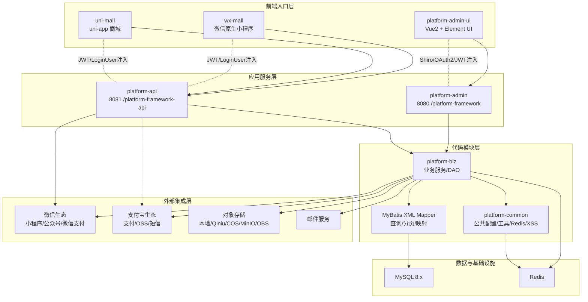
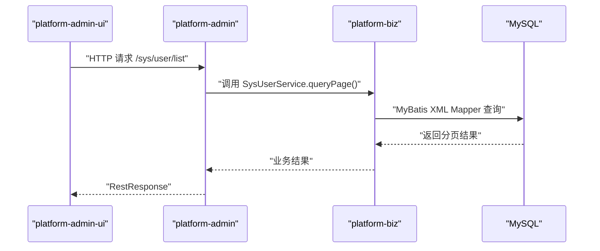
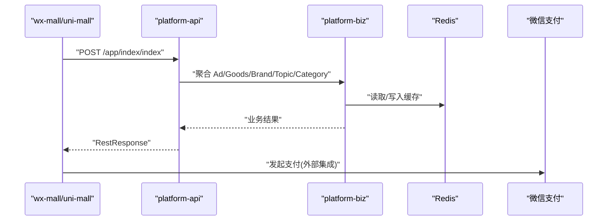
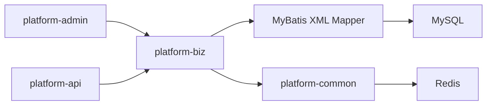
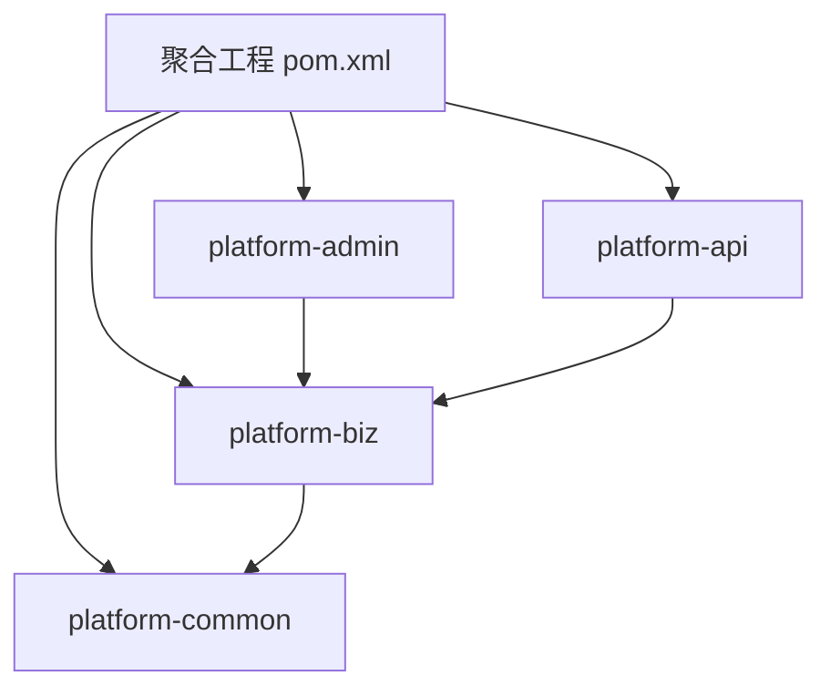

# 整体架构概览

<cite>
**本文引用的文件**
- [PlatformAdminApplication.java](file://platform-admin/src/main/java/com/platform/PlatformAdminApplication.java)
- [PlatformApiApplication.java](file://platform-api/src/main/java/com/platform/PlatformApiApplication.java)
- [application.yml(管理服务)](file://platform-admin/src/main/resources/application.yml)
- [application.yml(API服务)](file://platform-api/src/main/resources/application.yml)
- [main.js(后台UI)](file://platform-admin-ui/src/main.js)
- [main.js(uni-app)](file://uni-mall/main.js)
- [app.js(微信小程序)](file://wx-mall/app.js)
- [SysUserController.java](file://platform-admin/src/main/java/com/platform/modules/sys/controller/SysUserController.java)
- [AppIndexController.java](file://platform-api/src/main/java/com/platform/modules/app/controller/AppIndexController.java)
- [Constant.java](file://platform-common/src/main/java/com/platform/common/utils/Constant.java)
- [pom.xml(聚合工程)](file://pom.xml)
- [系统架构说明.md](file://docs/系统架构说明.md)
- [系统架构图.mmd](file://docs/系统架构图.mmd)
</cite>

## 目录
1. [引言](#引言)
2. [项目结构](#项目结构)
3. [核心组件](#核心组件)
4. [架构总览](#架构总览)
5. [详细组件分析](#详细组件分析)
6. [依赖关系分析](#依赖关系分析)
7. [性能考量](#性能考量)
8. [故障排查指南](#故障排查指南)
9. [结论](#结论)
10. [附录](#附录)

## 引言
本文件面向平台整体架构，围绕“多前端入口 + 双后端服务入口”的设计理念，系统性阐述分层架构模式（访问入口层、应用服务层、代码模块层、数据与基础设施层、外部集成层）的职责与边界；解释微服务化思想在本项目中的落地方式（模块化设计原则、组件依赖关系），并通过可视化图表呈现系统边界与组件交互关系，帮助开发者快速理解系统设计思路与各层协作机制。

## 项目结构
平台采用 Maven 聚合工程组织，包含前后端与业务服务模块：
- 平台公共层：platform-common（公共配置、工具、Redis、异常、XSS等）
- 后台服务：platform-admin（端口8080，context-path /platform-framework）
- API服务：platform-api（端口8081，context-path /platform-framework-api）
- 业务模块：platform-biz（Service、DAO、实体、XML Mapper）
- 前端入口：
  - platform-admin-ui（Vue2 + Element UI 后台管理台）
  - uni-mall（uni-app 商城）
  - wx-mall（微信原生小程序）

**图表来源**
- [系统架构图.mmd:1-53](file://docs/系统架构图.mmd#L1-L53)

**章节来源**
- [pom.xml(聚合工程):42-47](file://pom.xml#L42-L47)
- [系统架构说明.md:12-23](file://docs/系统架构说明.md#L12-L23)

## 核心组件
- 启动类与服务入口
  - platform-admin：Spring Boot 启动类，提供后台管理接口，端口8080，context-path /platform-framework
  - platform-api：Spring Boot 启动类，提供商城与小程序接口，端口8081，context-path /platform-framework-api
- 前端入口
  - platform-admin-ui：Vue2 + Element UI，调用 platform-admin
  - uni-mall：uni-app，调用 platform-api
  - wx-mall：微信小程序，调用 platform-api
- 业务与公共模块
  - platform-biz：核心业务与DAO，承载Service、实体、XML Mapper
  - platform-common：公共配置、工具、Redis、异常、XSS、Web安全等
- 基础设施与外部集成
  - MySQL 8.x + Redis
  - 微信生态（小程序/公众号/支付）、支付宝生态（支付/OSS/短信）、对象存储（本地/Qiniu/COS/MinIO/OBS）、邮件服务

**章节来源**
- [PlatformAdminApplication.java:49-51](file://platform-admin/src/main/java/com/platform/PlatformAdminApplication.java#L49-L51)
- [PlatformApiApplication.java:49-50](file://platform-api/src/main/java/com/platform/PlatformApiApplication.java#L49-L50)
- [application.yml(管理服务):18-20](file://platform-admin/src/main/resources/application.yml#L18-L20)
- [application.yml(API服务):18-20](file://platform-api/src/main/resources/application.yml#L18-L20)
- [main.js(后台UI):1-80](file://platform-admin-ui/src/main.js#L1-L80)
- [main.js(uni-app):1-29](file://uni-mall/main.js#L1-L29)
- [app.js(微信小程序):1-96](file://wx-mall/app.js#L1-L96)

## 架构总览
本系统采用“多前端入口 + 双后端服务入口”的分层架构：
- 访问入口层：多前端入口统一调用后端服务，负责页面交互与用户操作入口
- 应用服务层：platform-admin 与 platform-api 分别面向后台与前台，承担接口编排与鉴权
- 代码模块层：platform-biz 承载核心业务与DAO，platform-common 提供公共能力
- 数据与基础设施层：MySQL + Redis
- 外部集成层：微信/支付宝/对象存储/短信/邮件等

分层边界清晰，跨层调用遵循“单向依赖、自顶向下”的原则，便于扩展与演进。

**章节来源**
- [系统架构说明.md:81-130](file://docs/系统架构说明.md#L81-L130)

## 详细组件分析

### 访问入口层
- platform-admin-ui（Vue2 + Element UI）
  - 初始化挂载全局工具与组件，统一通过 httpRequest 发起请求
  - 作为后台管理台，调用 platform-admin
- uni-mall（uni-app）
  - 统一事件总线与Store，网络状态监听，调用 platform-api
- wx-mall（微信小程序）
  - 生命周期与更新机制，调用 platform-api

**图表来源**
- [SysUserController.java:80-91](file://platform-admin/src/main/java/com/platform/modules/sys/controller/SysUserController.java#L80-L91)
- [application.yml(管理服务):18-20](file://platform-admin/src/main/resources/application.yml#L18-L20)

**章节来源**
- [main.js(后台UI):1-80](file://platform-admin-ui/src/main.js#L1-L80)
- [SysUserController.java:54-91](file://platform-admin/src/main/java/com/platform/modules/sys/controller/SysUserController.java#L54-L91)

### 应用服务层
- platform-admin
  - 提供系统管理、商城后台管理、任务、OSS、微信管理等接口
  - 使用 Shiro/OAuth2 进行权限控制
- platform-api
  - 提供登录、商品、购物车、订单、支付、收货地址、优惠券等接口
  - 使用 JWT 注入 LoginUser，支持多端调用

**图表来源**
- [AppIndexController.java:50-145](file://platform-api/src/main/java/com/platform/modules/app/controller/AppIndexController.java#L50-L145)
- [application.yml(API服务):18-20](file://platform-api/src/main/resources/application.yml#L18-L20)

**章节来源**
- [PlatformAdminApplication.java:49-51](file://platform-admin/src/main/java/com/platform/PlatformAdminApplication.java#L49-L51)
- [PlatformApiApplication.java:49-50](file://platform-api/src/main/java/com/platform/PlatformApiApplication.java#L49-L50)
- [AppIndexController.java:30-145](file://platform-api/src/main/java/com/platform/modules/app/controller/AppIndexController.java#L30-L145)

### 代码模块层
- platform-biz
  - 承载 Service、DAO、实体、DTO 与领域逻辑
  - MyBatis XML Mapper 承载查询条件、分页、结果映射与联表SQL
- platform-common
  - 提供公共配置、工具类、Redis能力、异常处理、XSS过滤、Web安全等

**图表来源**
- [pom.xml(聚合工程):42-47](file://pom.xml#L42-L47)
- [application.yml(管理服务):114-142](file://platform-admin/src/main/resources/application.yml#L114-L142)
- [application.yml(API服务):96-122](file://platform-api/src/main/resources/application.yml#L96-L122)

**章节来源**
- [pom.xml(聚合工程):42-47](file://pom.xml#L42-L47)
- [Constant.java:26-120](file://platform-common/src/main/java/com/platform/common/utils/Constant.java#L26-L120)

### 数据与基础设施层
- MySQL 8.x：承载用户、商品、订单、配置、营销、系统管理等核心数据
- Redis：缓存、短信验证码、部分会话与业务加速

**章节来源**
- [application.yml(管理服务):81-99](file://platform-admin/src/main/resources/application.yml#L81-L99)
- [application.yml(API服务):70-82](file://platform-api/src/main/resources/application.yml#L70-L82)

### 外部集成层
- 微信生态：小程序、公众号、微信支付
- 支付宝生态：小程序/支付
- 对象存储：本地存储、七牛云、腾讯 COS、MinIO、华为 OBS
- 短信：阿里云短信、腾讯云短信
- 邮件服务

**章节来源**
- [application.yml(管理服务):169-205](file://platform-admin/src/main/resources/application.yml#L169-L205)
- [application.yml(API服务):157-195](file://platform-api/src/main/resources/application.yml#L157-L195)

## 依赖关系分析
- 模块依赖
  - platform-admin → platform-biz
  - platform-api → platform-biz
  - platform-biz → platform-common
- 代码耦合与内聚
  - 控制器仅负责编排与参数校验，业务逻辑集中在 service 层
  - DAO 与 XML Mapper 解耦，便于独立测试与演进
- 外部依赖
  - 微信/支付宝 SDK、对象存储 SDK、邮件组件等均通过配置中心化管理

**图表来源**
- [pom.xml(聚合工程):42-47](file://pom.xml#L42-L47)

**章节来源**
- [pom.xml(聚合工程):42-47](file://pom.xml#L42-L47)

## 性能考量
- Web容器与线程模型
  - Undertow 配置 IO 线程与 Worker 线程，适配高并发请求
- 缓存策略
  - Redis 缓存热点数据与会话，减少数据库压力
- 数据访问
  - MyBatis XML Mapper 承担复杂查询与分页，建议结合索引与慢查询优化
- 外部集成
  - 微信/支付宝回调需幂等与异步处理，避免阻塞请求线程

**章节来源**
- [application.yml(管理服务):4-18](file://platform-admin/src/main/resources/application.yml#L4-L18)
- [application.yml(API服务):4-18](file://platform-api/src/main/resources/application.yml#L4-L18)
- [application.yml(管理服务):81-99](file://platform-admin/src/main/resources/application.yml#L81-L99)
- [application.yml(API服务):70-82](file://platform-api/src/main/resources/application.yml#L70-L82)

## 故障排查指南
- 查询与列表类问题
  - 顺序排查：前端请求参数 → controller 入参 → service 调用路径 → DAO 接口 → XML Mapper 条件与结果映射
- 权限与登录问题
  - 区分两条链路：
    - 后台链路：platform-admin-ui + platform-admin + Shiro/OAuth2
    - 用户侧链路：wx-mall/uni-mall + platform-api + JWT/LoginUser
- 第三方集成问题
  - 若涉及支付、短信、OSS、微信回调等，优先核对应用配置、证书/密钥、回调地址与第三方账号环境

**章节来源**
- [系统架构说明.md:191-218](file://docs/系统架构说明.md#L191-L218)

## 结论
本平台通过“多前端入口 + 双后端服务入口”的架构设计，实现了前台多端统一、后台集中治理的目标；依托 platform-biz 与 platform-common 的模块化分层，配合 MySQL + Redis 的基础设施与丰富的外部集成能力，形成了稳定、可扩展且易于维护的系统形态。后续开发与排障应始终以“确认链路 → 确认模块 → 沿真实调用路径下钻”为基本原则。

## 附录
- 本地联调关注点
  - platform-admin：端口 8080，context-path /platform-framework
  - platform-api：端口 8081，context-path /platform-framework-api
  - platform-admin-ui：默认本地地址 http://localhost:8000
  - wx-mall：本地 API 基址默认 http://localhost:8081/platform-framework-api/app/

**章节来源**
- [系统架构说明.md:168-189](file://docs/系统架构说明.md#L168-L189)