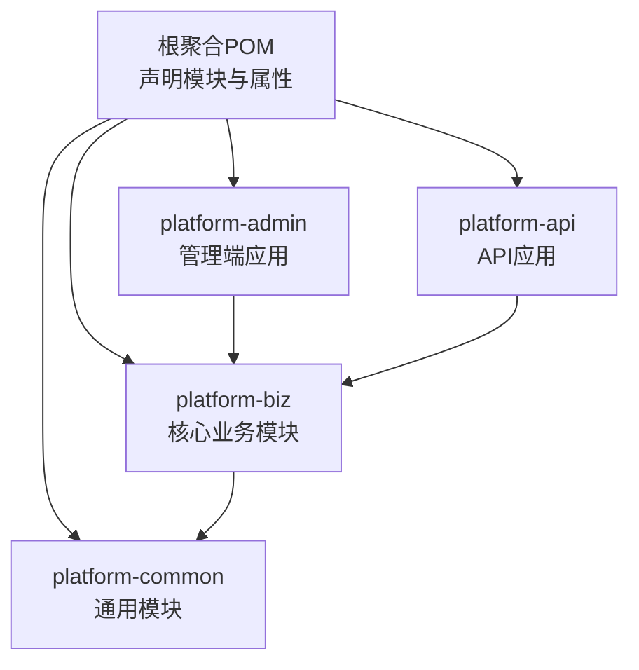
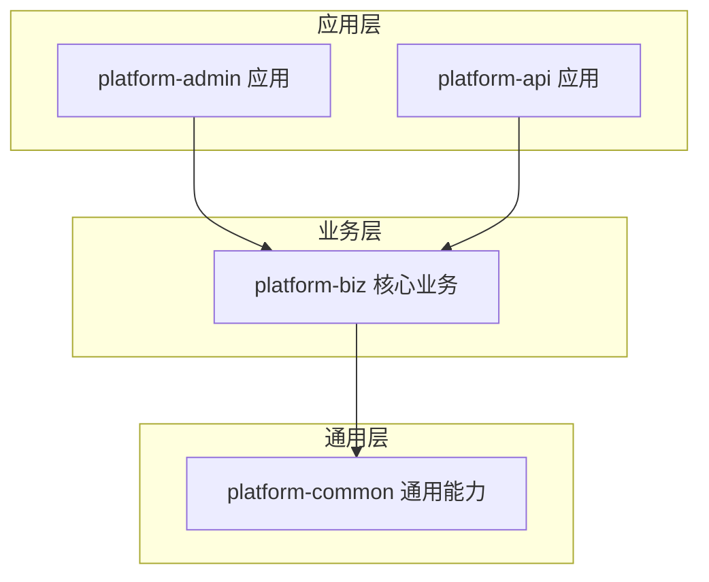
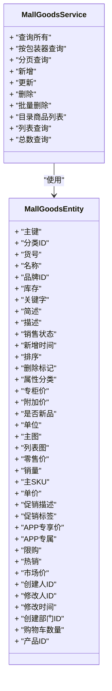
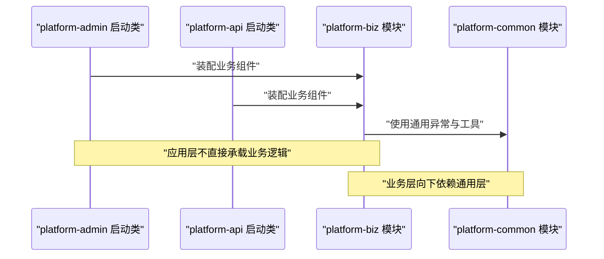
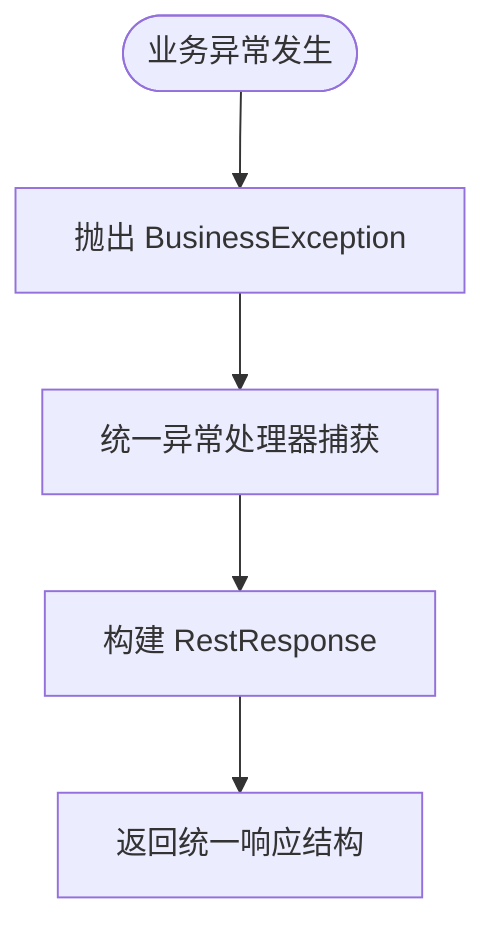
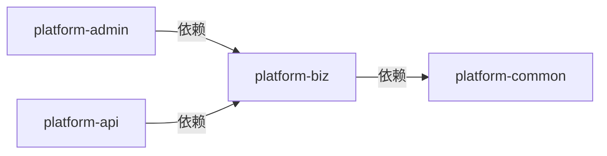

# 模块依赖关系

<cite>
**本文引用的文件**
- [根聚合POM](file://pom.xml)
- [平台模块聚合定义:42-47](file://pom.xml#L42-L47)
- [平台公共模块 POM](file://platform-common/pom.xml)
- [平台业务模块 POM](file://platform-biz/pom.xml)
- [平台管理端 POM](file://platform-admin/pom.xml)
- [平台API端 POM](file://platform-api/pom.xml)
- [平台管理端启动类](file://platform-admin/src/main/java/com/platform/PlatformAdminApplication.java)
- [平台API启动类](file://platform-api/src/main/java/com/platform/PlatformApiApplication.java)
- [平台业务模块商品服务接口](file://platform-biz/src/main/java/com/platform/modules/mall/service/MallGoodsService.java)
- [平台业务模块商品实体](file://platform-biz/src/main/java/com/platform/modules/mall/entity/MallGoodsEntity.java)
- [平台通用响应封装](file://platform-common/src/main/java/com/platform/common/utils/RestResponse.java)
- [平台通用业务异常](file://platform-common/src/main/java/com/platform/common/exception/BusinessException.java)
</cite>

## 目录
1. [引言](#引言)
2. [项目结构](#项目结构)
3. [核心组件](#核心组件)
4. [架构总览](#架构总览)
5. [详细组件分析](#详细组件分析)
6. [依赖关系分析](#依赖关系分析)
7. [性能考量](#性能考量)
8. [故障排查指南](#故障排查指南)
9. [结论](#结论)

## 引言
本文件聚焦于平台模块的依赖关系设计与实现，系统性阐述以下依赖结构：
- platform-admin 依赖 platform-biz
- platform-api 依赖 platform-biz
- platform-biz 依赖 platform-common

我们将从模块职责边界、接口契约、数据模型、错误处理与统一响应等维度，解释该分层设计在代码复用、职责分离、测试隔离等方面的收益，并提供模块依赖图与接口依赖关系，帮助开发者理解模块间的耦合度与扩展性。

## 项目结构
平台采用 Maven 多模块聚合结构，顶层 POM 声明了四个子模块：
- platform-common：通用能力与基础设施
- platform-biz：核心业务域（Service、DAO、实体、DTO、领域逻辑）
- platform-admin：后台管理端应用
- platform-api：对外API应用

图表来源
- [根聚合POM:42-47](file://pom.xml#L42-L47)
- [平台公共模块 POM:1-20](file://platform-common/pom.xml#L1-L20)
- [平台业务模块 POM:1-32](file://platform-biz/pom.xml#L1-L32)
- [平台管理端 POM:1-96](file://platform-admin/pom.xml#L1-L96)
- [平台API端 POM:1-71](file://platform-api/pom.xml#L1-L71)

章节来源
- [根聚合POM:42-47](file://pom.xml#L42-L47)
- [平台公共模块 POM:1-20](file://platform-common/pom.xml#L1-L20)
- [平台业务模块 POM:1-32](file://platform-biz/pom.xml#L1-L32)
- [平台管理端 POM:1-96](file://platform-admin/pom.xml#L1-L96)
- [平台API端 POM:1-71](file://platform-api/pom.xml#L1-L71)

## 核心组件
- 平台公共模块（platform-common）
  - 统一异常体系与全局响应封装，为上层应用提供一致的错误与返回格式
  - 典型职责：异常定义、工具类、配置与基础组件
- 平台业务模块（platform-biz）
  - 承载核心业务域，包含 Service 接口、DAO 数据访问、实体与 DTO、以及领域逻辑
  - 典型职责：业务编排、数据模型、持久化抽象
- 平台管理端（platform-admin）与平台API（platform-api）
  - 作为应用层，仅负责装配与暴露业务能力，不直接承载业务逻辑
  - 典型职责：Web 控制器、安全配置、调度与集成

章节来源
- [平台通用响应封装:1-122](file://platform-common/src/main/java/com/platform/common/utils/RestResponse.java#L1-L122)
- [平台通用业务异常:1-74](file://platform-common/src/main/java/com/platform/common/exception/BusinessException.java#L1-L74)
- [平台业务模块商品服务接口:1-99](file://platform-biz/src/main/java/com/platform/modules/mall/service/MallGoodsService.java#L1-L99)
- [平台业务模块商品实体:1-190](file://platform-biz/src/main/java/com/platform/modules/mall/entity/MallGoodsEntity.java#L1-L190)

## 架构总览
该架构遵循“应用层-业务层-通用层”的分层原则，形成清晰的依赖方向与职责边界：

图表来源
- [平台管理端 POM:36-40](file://platform-admin/pom.xml#L36-L40)
- [平台API端 POM:17-21](file://platform-api/pom.xml#L17-L21)
- [平台业务模块 POM:24-29](file://platform-biz/pom.xml#L24-L29)

## 详细组件分析

### 平台业务模块（platform-biz）设计要点
- 职责边界
  - 业务域内聚：以 mall 等模块组织 Service、DAO、实体与 DTO
  - 领域逻辑：通过 Service 编排 DAO 与实体，保证业务规则集中
- 接口契约
  - Service 接口定义明确的业务能力与参数约束，便于上层调用与替换
  - 实体与 DTO 明确数据结构，避免跨层传递不必要的实现细节
- 数据模型
  - 使用注解映射数据库表，字段覆盖业务关键属性，支持分页与条件查询

图表来源
- [平台业务模块商品服务接口:35-98](file://platform-biz/src/main/java/com/platform/modules/mall/service/MallGoodsService.java#L35-L98)
- [平台业务模块商品实体:37-189](file://platform-biz/src/main/java/com/platform/modules/mall/entity/MallGoodsEntity.java#L37-L189)

章节来源
- [平台业务模块商品服务接口:1-99](file://platform-biz/src/main/java/com/platform/modules/mall/service/MallGoodsService.java#L1-L99)
- [平台业务模块商品实体:1-190](file://platform-biz/src/main/java/com/platform/modules/mall/entity/MallGoodsEntity.java#L1-L190)

### 应用层启动类与依赖装配
- 平台管理端与平台API均通过 Spring Boot 启动类进行装配，应用层仅负责引导与配置，不承载业务逻辑
- 二者均显式依赖 platform-biz，体现“应用层只依赖业务层”的依赖方向

图表来源
- [平台管理端启动类:49-51](file://platform-admin/src/main/java/com/platform/PlatformAdminApplication.java#L49-L51)
- [平台API启动类:49-51](file://platform-api/src/main/java/com/platform/PlatformApiApplication.java#L49-L51)
- [平台管理端 POM:36-40](file://platform-admin/pom.xml#L36-L40)
- [平台API端 POM:17-21](file://platform-api/pom.xml#L17-L21)
- [平台业务模块 POM:24-29](file://platform-biz/pom.xml#L24-L29)

章节来源
- [平台管理端启动类:1-93](file://platform-admin/src/main/java/com/platform/PlatformAdminApplication.java#L1-L93)
- [平台API启动类:1-92](file://platform-api/src/main/java/com/platform/PlatformApiApplication.java#L1-L92)

### 通用层（platform-common）职责与接口契约
- 统一异常与响应
  - BusinessException 提供业务异常语义与状态码
  - RestResponse 提供统一响应结构，屏蔽底层实现差异
- 典型接口契约
  - 异常处理：上抛 BusinessException，由统一异常处理器转换为 RestResponse
  - 响应规范：所有业务返回统一结构，便于前端与网关处理

图表来源
- [平台通用业务异常:28-73](file://platform-common/src/main/java/com/platform/common/exception/BusinessException.java#L28-L73)
- [平台通用响应封装:79-121](file://platform-common/src/main/java/com/platform/common/utils/RestResponse.java#L79-L121)

章节来源
- [平台通用业务异常:1-74](file://platform-common/src/main/java/com/platform/common/exception/BusinessException.java#L1-L74)
- [平台通用响应封装:1-122](file://platform-common/src/main/java/com/platform/common/utils/RestResponse.java#L1-L122)

## 依赖关系分析
- 依赖方向
  - platform-admin → platform-biz
  - platform-api → platform-biz
  - platform-biz → platform-common
- 设计原理与优势
  - 代码复用：通用异常与响应在 platform-common 中集中实现，避免重复代码
  - 职责分离：应用层专注装配与暴露，业务层专注领域逻辑，通用层专注基础设施
  - 测试隔离：上层应用通过接口调用业务层，便于单元测试与集成测试
  - 可扩展性：新增业务域只需在 platform-biz 内部扩展，不影响应用层与通用层

图表来源
- [平台管理端 POM:36-40](file://platform-admin/pom.xml#L36-L40)
- [平台API端 POM:17-21](file://platform-api/pom.xml#L17-L21)
- [平台业务模块 POM:24-29](file://platform-biz/pom.xml#L24-L29)

章节来源
- [平台管理端 POM:1-96](file://platform-admin/pom.xml#L1-L96)
- [平台API端 POM:1-71](file://platform-api/pom.xml#L1-L71)
- [平台业务模块 POM:1-32](file://platform-biz/pom.xml#L1-L32)
- [平台公共模块 POM:1-20](file://platform-common/pom.xml#L1-L20)

## 性能考量
- 依赖方向清晰有助于缓存与事务边界的界定，减少跨层传播带来的额外开销
- 通过统一异常与响应，可减少序列化与格式转换的重复工作
- 在业务层集中处理复杂逻辑，有利于数据库连接池与事务管理的优化

## 故障排查指南
- 统一异常定位
  - 优先检查 BusinessException 抛出位置与上下文
  - 通过统一异常处理器确认 RestResponse 输出是否符合预期
- 响应一致性验证
  - 核对 RestResponse 字段是否完整（success、code、msg、data、timestamp）
- 依赖链路核验
  - 确认应用层是否正确引入 platform-biz，业务层是否正确引入 platform-common

章节来源
- [平台通用业务异常:1-74](file://platform-common/src/main/java/com/platform/common/exception/BusinessException.java#L1-L74)
- [平台通用响应封装:1-122](file://platform-common/src/main/java/com/platform/common/utils/RestResponse.java#L1-L122)

## 结论
该模块依赖设计以“应用层-业务层-通用层”为主线，实现了职责清晰、耦合可控、易于测试与扩展的目标。platform-biz 作为核心业务承载者，向上提供稳定接口契约，向下复用通用能力，确保平台在多端（管理端与API端）场景下保持一致的业务行为与质量标准。