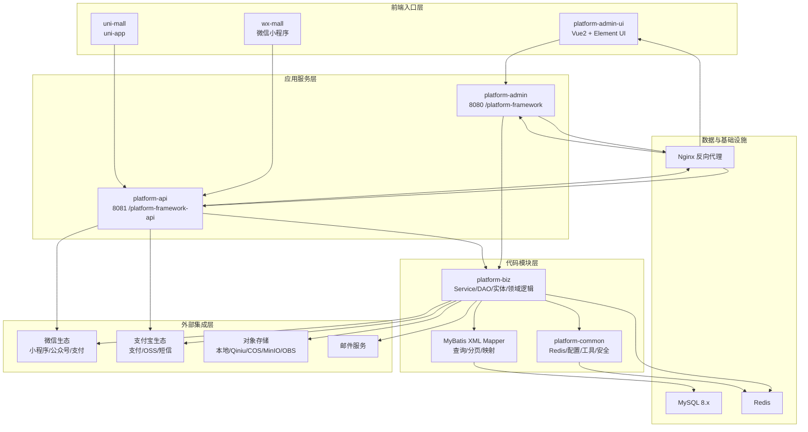
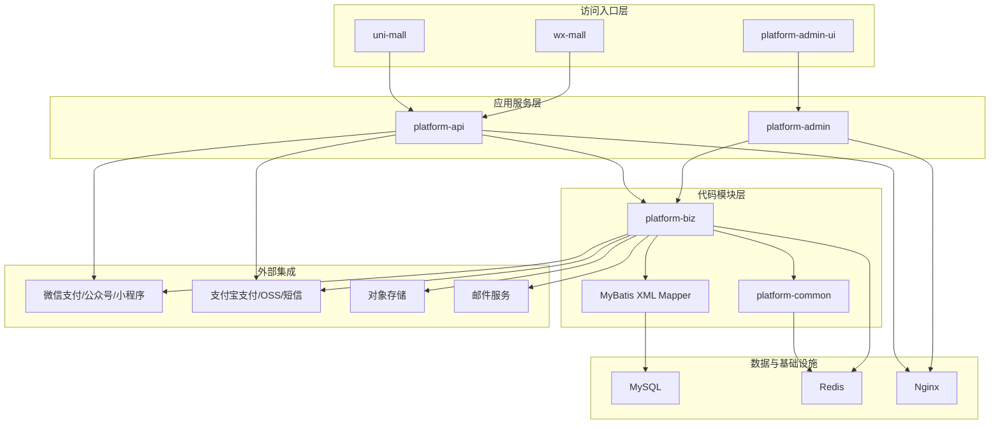
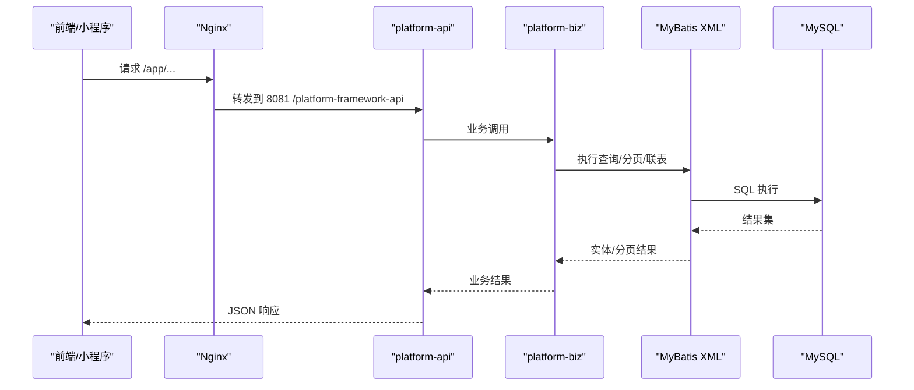
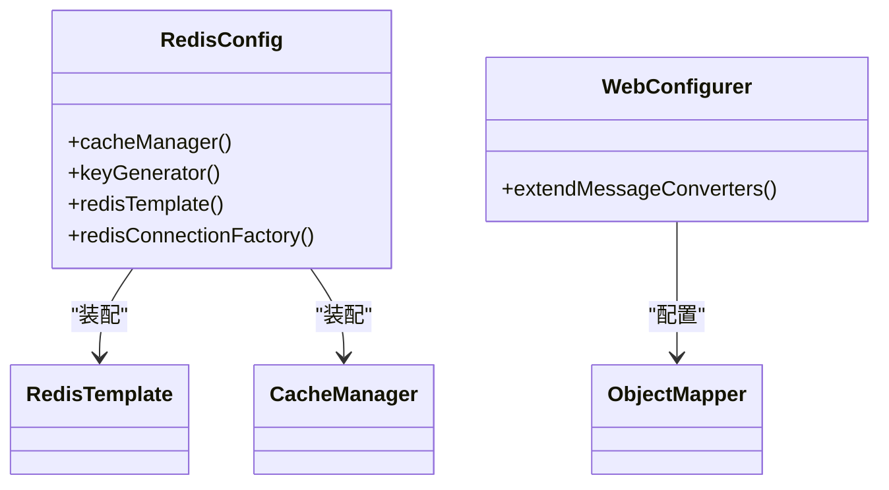
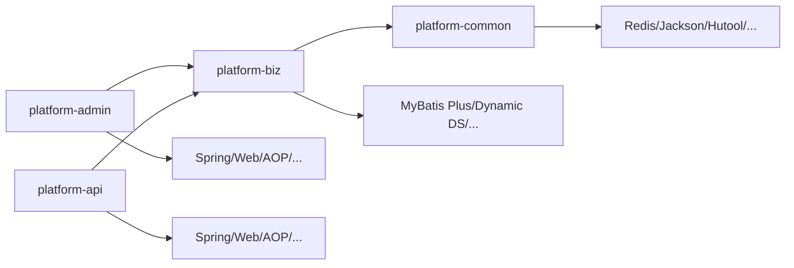
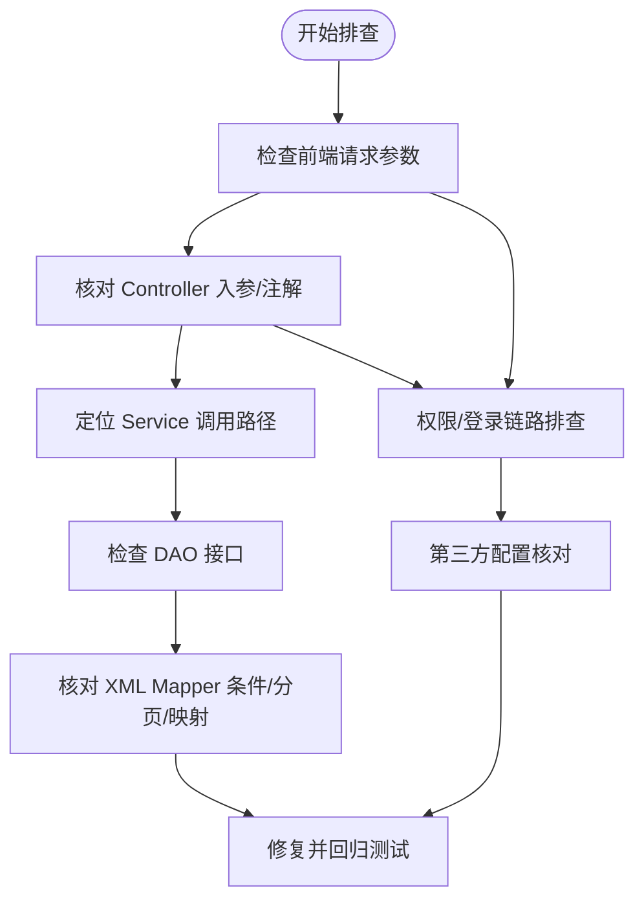

# 系统架构设计

<cite>
**本文引用的文件**
- [pom.xml](file://pom.xml)
- [docker-compose.yml](file://docker-compose.yml)
- [PlatformAdminApplication.java](file://platform-admin/src/main/java/com/platform/PlatformAdminApplication.java)
- [application.yml](file://platform-admin/src/main/resources/application.yml)
- [ShiroConfig.java](file://platform-admin/src/main/java/com/platform/config/ShiroConfig.java)
- [PlatformApiApplication.java](file://platform-api/src/main/java/com/platform/PlatformApiApplication.java)
- [application.yml](file://platform-api/src/main/resources/application.yml)
- [RedisConfig.java](file://platform-common/src/main/java/com/platform/config/RedisConfig.java)
- [WebConfigurer.java](file://platform-common/src/main/java/com/platform/config/WebConfigurer.java)
- [系统架构说明.md](file://docs/系统架构说明.md)
</cite>

## 目录
1. [引言](#引言)
2. [项目结构](#项目结构)
3. [核心组件](#核心组件)
4. [架构总览](#架构总览)
5. [详细组件分析](#详细组件分析)
6. [依赖分析](#依赖分析)
7. [性能考虑](#性能考虑)
8. [故障排查指南](#故障排查指南)
9. [结论](#结论)
10. [附录](#附录)

## 引言
本架构文档面向平台系统的设计与实现，围绕多入口前端、双后端服务、共享业务模块、MyBatis XML 驱动的数据访问层、MySQL+Redis 基础设施以及微信/支付宝/对象存储/短信/邮件等外部能力集成，系统性阐述分层架构、模块化设计与微服务化理念下的技术选型与工程实践。文档同时给出组件交互关系、数据流、集成模式、高可用与可扩展性策略，以及部署与排障要点，帮助开发者快速理解并高效维护系统。

## 项目结构
项目采用 Maven 多模块聚合结构，按职责划分四大后端模块与公共模块，配合前端与小程序/uni-app 前端及 Docker 编排，形成清晰的层次化组织：

- 平台后端
  - platform-admin：后台管理接口服务（8080 /platform-framework）
  - platform-api：商城与小程序接口服务（8081 /platform-framework-api）
  - platform-biz：业务服务/领域逻辑/DAO
  - platform-common：公共配置/工具/Redis/异常/XSS/安全
- 前端与小程序
  - platform-admin-ui：Vue2 + Element UI 后台管理台
  - wx-mall：微信原生小程序
  - uni-mall：uni-app 商城
- 基础设施与编排
  - MySQL 8.x、Redis、Nginx
  - docker-compose 编排与部署

**图表来源**
- [系统架构说明.md:26-79](file://docs/系统架构说明.md#L26-L79)
- [docker-compose.yml:1-115](file://docker-compose.yml#L1-L115)

**章节来源**
- [系统架构说明.md:12-231](file://docs/系统架构说明.md#L12-L231)
- [pom.xml:42-47](file://pom.xml#L42-L47)

## 核心组件
- 平台后端服务
  - platform-admin：后台管理接口服务，启用 Undertow、Swagger/OpenAPI3、Shiro 权限与动态数据源，对外暴露系统管理、任务调度、OSS、微信管理等接口。
  - platform-api：商城与小程序接口服务，启用 Undertow、Knife4j/Swagger 增强、JWT 认证，对外暴露登录、商品、购物车、订单、支付、收货地址、优惠券等接口。
- 共享业务与公共能力
  - platform-biz：承载 Service、DAO、实体、DTO、领域逻辑；大量查询由 MyBatis XML Mapper 实现，强调“SQL 驱动”的可读性与可控性。
  - platform-common：提供 Redis 缓存配置、Jackson 序列化、Web MVC 扩展、异常与安全处理（XSS、SQL 注入过滤等），作为跨模块复用的基础能力。
- 前端与小程序
  - platform-admin-ui：后台管理台，调用 platform-admin。
  - wx-mall/uni-mall：移动端入口，调用 platform-api。
- 基础设施与编排
  - docker-compose 统一编排 MySQL、Redis、两套 Java 服务与 Nginx，提供健康检查与持久化卷。

**章节来源**
- [PlatformAdminApplication.java:49-92](file://platform-admin/src/main/java/com/platform/PlatformAdminApplication.java#L49-L92)
- [application.yml:1-205](file://platform-admin/src/main/resources/application.yml#L1-L205)
- [ShiroConfig.java:44-99](file://platform-admin/src/main/java/com/platform/config/ShiroConfig.java#L44-L99)
- [PlatformApiApplication.java:49-91](file://platform-api/src/main/java/com/platform/PlatformApiApplication.java#L49-L91)
- [application.yml:1-195](file://platform-api/src/main/resources/application.yml#L1-L195)
- [RedisConfig.java:56-181](file://platform-common/src/main/java/com/platform/config/RedisConfig.java#L56-L181)
- [WebConfigurer.java:39-61](file://platform-common/src/main/java/com/platform/config/WebConfigurer.java#L39-L61)
- [docker-compose.yml:1-115](file://docker-compose.yml#L1-L115)

## 架构总览
系统采用“多入口前端 + 双后端服务 + 共享业务模块 + XML 驱动数据访问 + MySQL+Redis + 外部生态集成”的整体架构。双后端服务分别面向后台管理与商城/小程序，共享业务能力，通过 Nginx 提供统一入口与静态资源分发。公共模块提供 Redis 缓存、序列化与安全配置，确保跨服务一致性与可维护性。

**图表来源**
- [系统架构说明.md:26-79](file://docs/系统架构说明.md#L26-L79)
- [docker-compose.yml:103-115](file://docker-compose.yml#L103-L115)

## 详细组件分析

### 平台后端服务（platform-admin 与 platform-api）
- 启动与容器化
  - 两套服务均基于 Spring Boot，使用 Undertow 作为嵌入式 Web 容器，提升并发与资源占用表现。
  - 通过 docker-compose 编排，分别监听 8080 与 8081 端口，context-path 区分管理端与 API 端，便于 Nginx 路由与运维隔离。
- 配置与文档
  - admin 与 api 均启用 OpenAPI/Swagger 文档，admin 使用 springdoc，api 使用 knife4j 增强 UI。
  - 两套服务均配置 multipart 上传上限与静态资源映射策略，保证文件上传与资源加载稳定性。
- 安全与认证
  - platform-admin：集成 Shiro，提供 OAuth2 Realm 与过滤链，开放常见静态资源与文档路径，其余请求走 oauth2 过滤。
  - platform-api：通过注解与 JWT 配置实现用户侧认证，结合 LoginUser 注入与拦截器，保障移动端链路安全。
- 数据访问
  - 两套服务均依赖 platform-biz，后者通过 MyBatis Plus 与 XML Mapper 执行复杂查询、分页与联表逻辑，减少注解式 CRUD 的局限性。

**图表来源**
- [系统架构说明.md:146-158](file://docs/系统架构说明.md#L146-L158)
- [application.yml:18-21](file://platform-api/src/main/resources/application.yml#L18-L21)
- [application.yml:18-21](file://platform-admin/src/main/resources/application.yml#L18-L21)

**章节来源**
- [PlatformAdminApplication.java:49-92](file://platform-admin/src/main/java/com/platform/PlatformAdminApplication.java#L49-L92)
- [application.yml:1-205](file://platform-admin/src/main/resources/application.yml#L1-L205)
- [ShiroConfig.java:63-86](file://platform-admin/src/main/java/com/platform/config/ShiroConfig.java#L63-L86)
- [PlatformApiApplication.java:49-91](file://platform-api/src/main/java/com/platform/PlatformApiApplication.java#L49-L91)
- [application.yml:1-195](file://platform-api/src/main/resources/application.yml#L1-L195)

### 共享公共模块（platform-common）
- Redis 缓存
  - 提供 RedisCacheManager、KeyGenerator、RedisTemplate 与 Jackson 序列化配置，支持 TTL、连接池参数与单机连接工厂，满足高并发下的缓存读写需求。
- Web 配置
  - 扩展 Jackson 序列化器，设置日期格式与 UTF-8 支持，统一响应内容类型，提升跨端兼容性。
- 安全与工具
  - 提供 XSS 过滤、SQL 注入过滤、Token 生成、HTTP 工具、日期/字符串工具等，作为跨模块安全与工具基础。

**图表来源**
- [RedisConfig.java:94-181](file://platform-common/src/main/java/com/platform/config/RedisConfig.java#L94-L181)
- [WebConfigurer.java:42-60](file://platform-common/src/main/java/com/platform/config/WebConfigurer.java#L42-L60)

**章节来源**
- [RedisConfig.java:56-181](file://platform-common/src/main/java/com/platform/config/RedisConfig.java#L56-L181)
- [WebConfigurer.java:39-61](file://platform-common/src/main/java/com/platform/config/WebConfigurer.java#L39-L61)

### 数据访问层（platform-biz + MyBatis XML）
- 设计原则
  - 以 XML Mapper 为核心，承载复杂查询、分页、联表与结果映射，提升 SQL 可读性与可维护性。
  - 通过 MyBatis Plus 提供通用 CRUD 与逻辑删除、驼峰映射、JdbcType 配置等，兼顾灵活性与一致性。
- 性能与可扩展性
  - 通过合理的索引与 SQL 设计、分页参数控制、缓存命中策略，降低数据库压力。
  - 模块化 DAO 与 Service 边界清晰，便于横向扩展与替换实现。

**章节来源**
- [application.yml:114-142](file://platform-admin/src/main/resources/application.yml#L114-L142)
- [application.yml:96-122](file://platform-api/src/main/resources/application.yml#L96-L122)

### 外部集成与第三方服务
- 微信生态：小程序、公众号、微信支付，通过 weixin-java-* SDK 集成，涉及配置、证书与回调地址校验。
- 支付宝生态：小程序/支付、OSS、短信，通过 alipay-easysdk 与 alipay-sdk-java 集成。
- 对象存储：本地/七牛/腾讯 COS/MinIO/华为 OBS，通过统一抽象适配多厂商。
- 短信与邮件：阿里云/腾讯云短信与 SMTP 邮件服务，作为营销与通知通道。

**章节来源**
- [application.yml:143-205](file://platform-admin/src/main/resources/application.yml#L143-L205)
- [application.yml:123-195](file://platform-api/src/main/resources/application.yml#L123-L195)
- [pom.xml:332-365](file://pom.xml#L332-L365)
- [pom.xml:254-287](file://pom.xml#L254-L287)
- [pom.xml:406-426](file://pom.xml#L406-L426)

## 依赖分析
- 模块依赖
  - platform-admin 依赖 platform-biz
  - platform-api 依赖 platform-biz
  - platform-biz 依赖 platform-common
- 外部依赖
  - Spring Boot 生态（Web、AOP、配置处理器、测试）
  - MyBatis Plus、动态数据源、Druid 监控
  - Redis、Jedis、Knife4j/SpringDoc
  - Shiro、JWT、Hutool、Easypoi、Logstash、微信/支付宝 SDK、短信/邮件/对象存储 SDK

**图表来源**
- [pom.xml:42-47](file://pom.xml#L42-L47)
- [pom.xml:92-437](file://pom.xml#L92-L437)

**章节来源**
- [pom.xml:42-47](file://pom.xml#L42-L47)
- [pom.xml:92-437](file://pom.xml#L92-L437)

## 性能考虑
- Web 容器与线程模型
  - Undertow 配置 IO 线程与 Worker 线程数量，平衡高并发与资源占用；合理设置 buffer-size 与 direct-buffers，提升网络 IO 效率。
- 缓存策略
  - Redis 采用 Jackson 序列化与连接池配置，结合 CacheManager 默认 TTL 与 KeyGenerator 规则，提升热点数据读取性能。
- 数据访问
  - MyBatis Plus + XML Mapper 的组合，有利于 SQL 优化与分页控制；建议配合慢查询监控与索引优化。
- 文件上传与静态资源
  - 通过 multipart 限制与静态资源映射，避免过大的请求体与资源冲突。
- 外部依赖
  - 第三方 SDK 的连接池与超时配置需与业务峰值相匹配，避免阻塞与抖动。

**章节来源**
- [application.yml:4-18](file://platform-admin/src/main/resources/application.yml#L4-L18)
- [application.yml:4-18](file://platform-api/src/main/resources/application.yml#L4-L18)
- [RedisConfig.java:154-180](file://platform-common/src/main/java/com/platform/config/RedisConfig.java#L154-L180)

## 故障排查指南
- 查询与列表类问题
  - 按“前端请求参数 → controller 入参 → service 调用 → DAO 接口 → XML mapper 条件与映射”顺序逐层定位。
- 权限与登录问题
  - 后台链路：platform-admin-ui + platform-admin + Shiro/OAuth2；用户侧链路：wx-mall/uni-mall + platform-api + JWT/LoginUser。
- 第三方集成问题
  - 若涉及支付/短信/OSS/微信回调，优先核对应用配置、证书/密钥、回调地址与第三方账号状态。
- 本地联调关注点
  - 端口与 context-path、profile、数据源与 Redis、第三方配置是否与当前环境一致。

**图表来源**
- [系统架构说明.md:191-218](file://docs/系统架构说明.md#L191-L218)

**章节来源**
- [系统架构说明.md:168-231](file://docs/系统架构说明.md#L168-L231)

## 结论
本系统以“多入口前端 + 双后端服务 + 共享业务模块 + XML 驱动数据访问 + MySQL+Redis + 外部生态集成”为核心，通过 Spring Boot 生态与模块化设计实现高内聚低耦合；借助 Undertow、Redis、Knife4j/SpringDoc、Shiro/JWT 等技术栈，兼顾性能、可观测性与安全性。在工程实践中，应重点关注共享模块的变更影响面、第三方配置的一致性与缓存/数据库的协同优化，以支撑持续演进与稳定交付。

## 附录
- 部署与编排
  - docker-compose 提供 MySQL、Redis、两套 Java 服务与 Nginx 的一键编排，支持健康检查与持久化卷，便于本地与生产环境快速落地。
- 版本与依赖
  - 核心依赖版本集中在父 POM 中统一管理，涵盖 Web、ORM、缓存、安全、第三方 SDK 等，确保一致性与可升级性。

**章节来源**
- [docker-compose.yml:1-115](file://docker-compose.yml#L1-L115)
- [pom.xml:49-90](file://pom.xml#L49-L90)