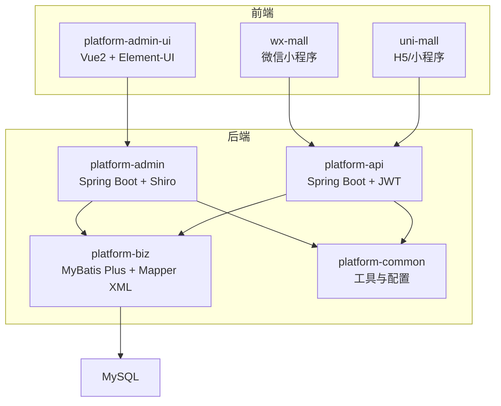
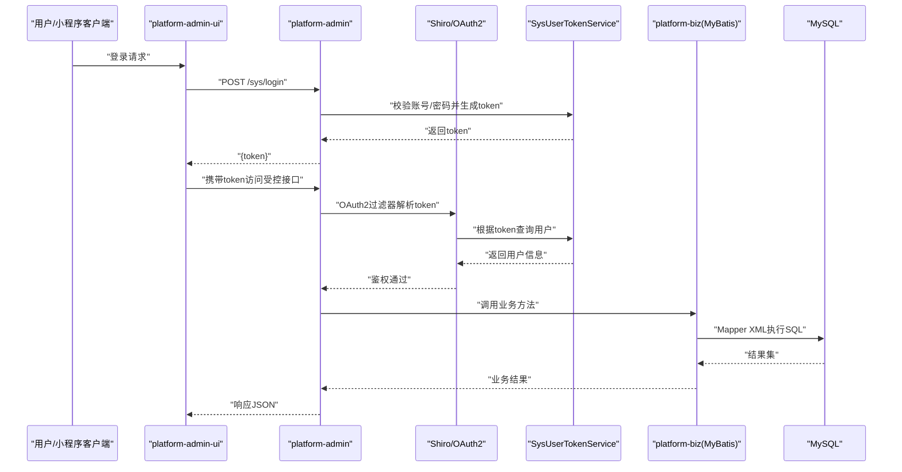
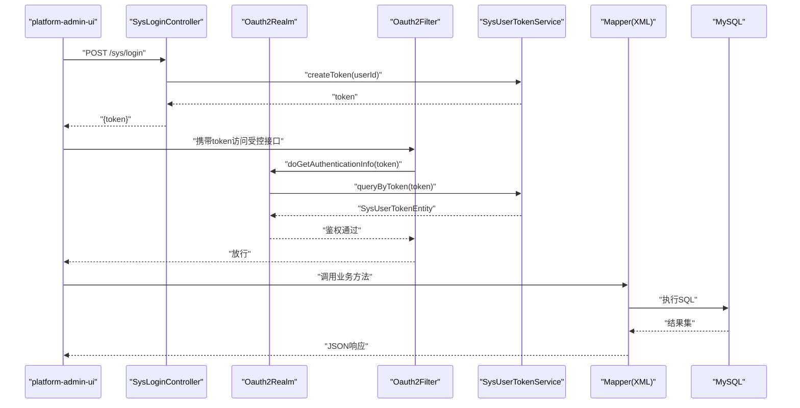
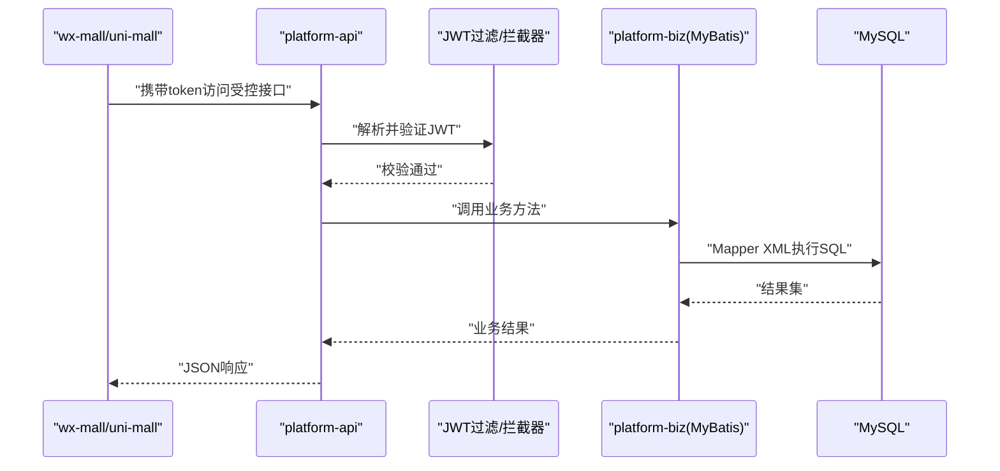
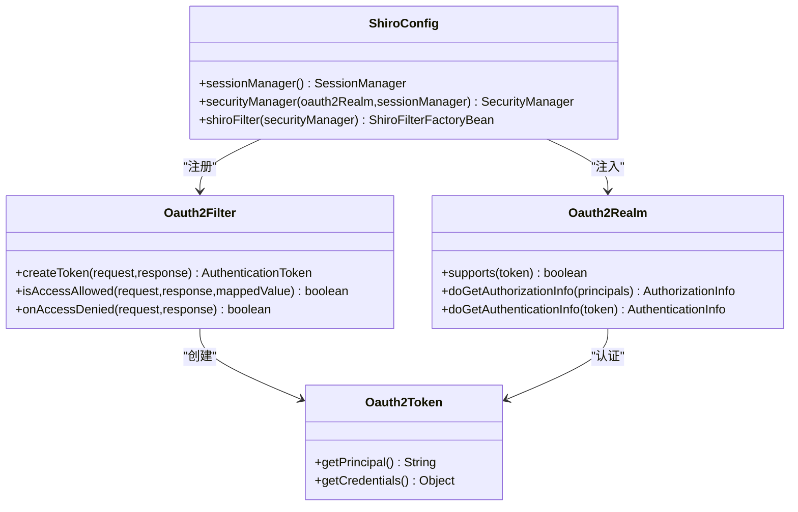
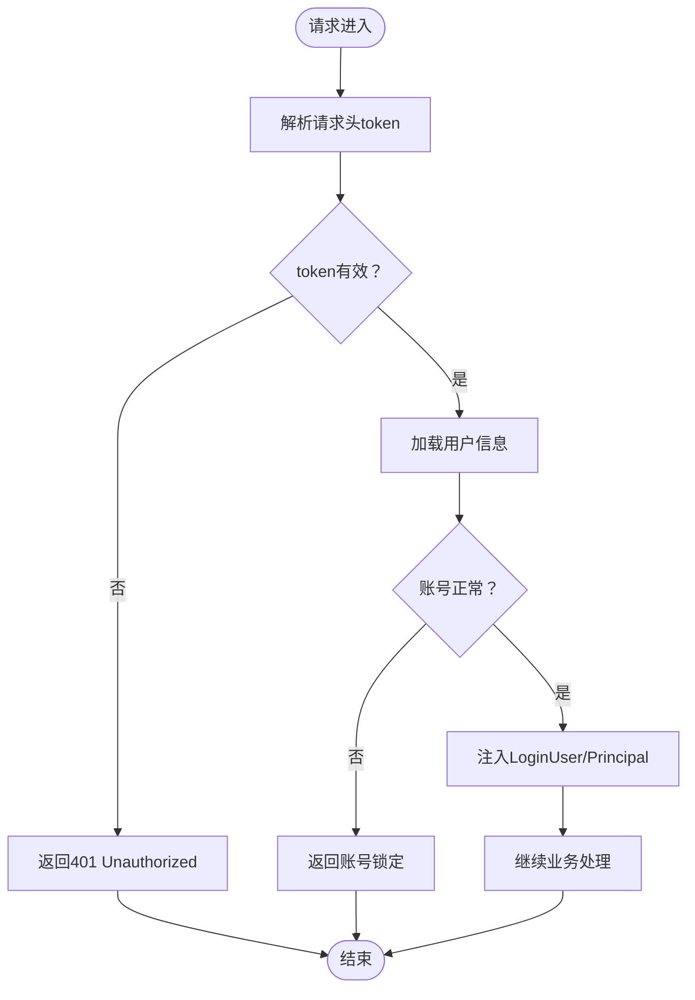
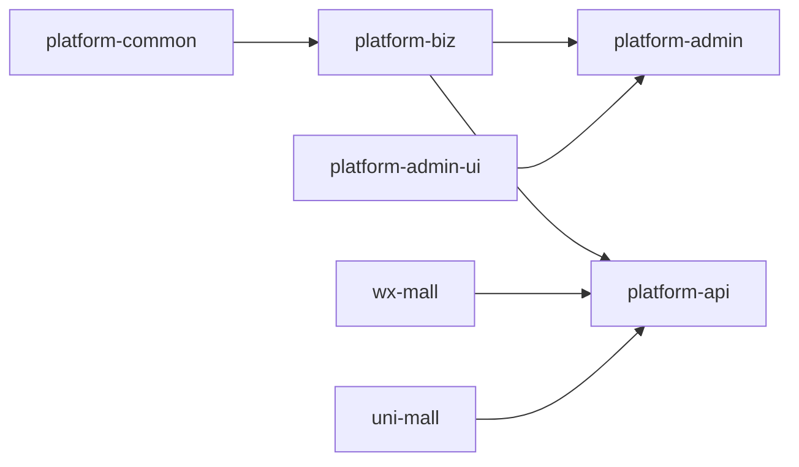

# 组件交互与数据流

<cite>
**本文引用的文件**
- [platform-admin/src/main/java/com/platform/PlatformAdminApplication.java](file://platform-admin/src/main/java/com/platform/PlatformAdminApplication.java)
- [platform-api/src/main/java/com/platform/PlatformApiApplication.java](file://platform-api/src/main/java/com/platform/PlatformApiApplication.java)
- [platform-admin/src/main/resources/application.yml](file://platform-admin/src/main/resources/application.yml)
- [platform-api/src/main/resources/application.yml](file://platform-api/src/main/resources/application.yml)
- [platform-admin/src/main/java/com/platform/config/ShiroConfig.java](file://platform-admin/src/main/java/com/platform/config/ShiroConfig.java)
- [platform-admin/src/main/java/com/platform/modules/sys/oauth2/Oauth2Filter.java](file://platform-admin/src/main/java/com/platform/modules/sys/oauth2/Oauth2Filter.java)
- [platform-admin/src/main/java/com/platform/modules/sys/oauth2/Oauth2Realm.java](file://platform-admin/src/main/java/com/platform/modules/sys/oauth2/Oauth2Realm.java)
- [platform-admin/src/main/java/com/platform/modules/sys/oauth2/Oauth2Token.java](file://platform-admin/src/main/java/com/platform/modules/sys/oauth2/Oauth2Token.java)
- [platform-admin/src/main/java/com/platform/modules/sys/controller/SysLoginController.java](file://platform-admin/src/main/java/com/platform/modules/sys/controller/SysLoginController.java)
- [platform-admin/src/main/java/com/platform/modules/sys/service/SysUserTokenService.java](file://platform-admin/src/main/java/com/platform/modules/sys/service/SysUserTokenService.java)
- [platform-api/src/main/java/com/platform/annotation/IgnoreAuth.java](file://platform-api/src/main/java/com/platform/annotation/IgnoreAuth.java)
- [platform-common/src/main/java/com/platform/common/utils/HttpContextUtils.java](file://platform-common/src/main/java/com/platform/common/utils/HttpContextUtils.java)
- [platform-common/src/main/java/com/platform/common/utils/TokenGenerator.java](file://platform-common/src/main/java/com/platform/common/utils/TokenGenerator.java)
- [platform-biz/pom.xml](file://platform-biz/pom.xml)
- [platform-admin-ui/package.json](file://platform-admin-ui/package.json)
- [wx-mall/project.config.json](file://wx-mall/project.config.json)
</cite>

## 目录
1. [引言](#引言)
2. [项目结构](#项目结构)
3. [核心组件](#核心组件)
4. [架构总览](#架构总览)
5. [详细组件分析](#详细组件分析)
6. [依赖分析](#依赖分析)
7. [性能考虑](#性能考虑)
8. [故障排查指南](#故障排查指南)
9. [结论](#结论)
10. [附录](#附录)

## 引言
本文件面向平台组件交互与数据流，聚焦两大业务链路：
- 后台管理链路：platform-admin-ui → platform-admin → platform-biz → MyBatis XML → MySQL
- 商城/小程序链路：wx-mall/uni-mall → platform-api → platform-biz → MyBatis XML → MySQL

文档将解释组件间依赖关系与数据传递机制，重点覆盖 JWT 令牌传递、Shiro/OAuth2 权限验证、LoginUser 用户注入等关键交互点，并提供时序图与调用链路图，帮助开发者快速理解真实请求处理流程与组件协作模式。

## 项目结构
平台采用多模块 Maven 结构，前后端分离部署：
- 前端
  - 平台管理前端：platform-admin-ui（Vue2 + Element-UI）
  - 微信小程序前端：wx-mall（微信小程序）
  - uni-app 小程序前端：uni-mall（H5/小程序）
- 后端
  - 平台管理后端：platform-admin（Spring Boot + Shiro + OAuth2）
  - 平台开放 API：platform-api（Spring Boot + JWT）
  - 业务层：platform-biz（MyBatis Plus + Mapper XML）
  - 通用工具：platform-common（工具类、拦截器、Redis 配置等）

图表来源
- [platform-admin/src/main/java/com/platform/PlatformAdminApplication.java:49-51](file://platform-admin/src/main/java/com/platform/PlatformAdminApplication.java#L49-L51)
- [platform-api/src/main/java/com/platform/PlatformApiApplication.java:49-50](file://platform-api/src/main/java/com/platform/PlatformApiApplication.java#L49-L50)
- [platform-biz/pom.xml:24-30](file://platform-biz/pom.xml#L24-L30)

章节来源
- [platform-admin/src/main/java/com/platform/PlatformAdminApplication.java:49-51](file://platform-admin/src/main/java/com/platform/PlatformAdminApplication.java#L49-L51)
- [platform-api/src/main/java/com/platform/PlatformApiApplication.java:49-50](file://platform-api/src/main/java/com/platform/PlatformApiApplication.java#L49-L50)
- [platform-biz/pom.xml:24-30](file://platform-biz/pom.xml#L24-L30)

## 核心组件
- 平台管理后端（platform-admin）
  - 启动类：排除安全自动装配，启用异步，引入动态数据源自动装配
  - 权限框架：Shiro + OAuth2，基于自定义 Realm 与过滤器实现
  - 配置：Undertow 线程模型、Swagger 分组、MyBatis Plus 插件、Redis、邮件、微信/支付宝配置
- 平台开放 API（platform-api）
  - 启动类：排除数据源自动装配，启用异步
  - 认证注解：@IgnoreAuth 用于跳过鉴权
  - 配置：JWT 秘钥、过期时间、Header 名称、Swagger 分组、MyBatis Plus、Redis、微信/支付宝配置
- 业务层（platform-biz）
  - 依赖 platform-common，提供 MyBatis Plus Mapper XML 与业务服务
- 通用工具（platform-common）
  - HTTP 上下文工具、Token 生成器、Redis 配置、跨域与过滤器等

章节来源
- [platform-admin/src/main/java/com/platform/PlatformAdminApplication.java:49-51](file://platform-admin/src/main/java/com/platform/PlatformAdminApplication.java#L49-L51)
- [platform-api/src/main/java/com/platform/PlatformApiApplication.java:49-50](file://platform-api/src/main/java/com/platform/PlatformApiApplication.java#L49-L50)
- [platform-admin/src/main/resources/application.yml:1-205](file://platform-admin/src/main/resources/application.yml#L1-L205)
- [platform-api/src/main/resources/application.yml:1-195](file://platform-api/src/main/resources/application.yml#L1-L195)
- [platform-biz/pom.xml:24-30](file://platform-biz/pom.xml#L24-L30)
- [platform-common/src/main/java/com/platform/common/utils/HttpContextUtils.java:31-47](file://platform-common/src/main/java/com/platform/common/utils/HttpContextUtils.java#L31-L47)
- [platform-common/src/main/java/com/platform/common/utils/TokenGenerator.java:31-62](file://platform-common/src/main/java/com/platform/common/utils/TokenGenerator.java#L31-L62)

## 架构总览
两大链路的总体交互如下：

图表来源
- [platform-admin/src/main/java/com/platform/modules/sys/controller/SysLoginController.java:94-122](file://platform-admin/src/main/java/com/platform/modules/sys/controller/SysLoginController.java#L94-L122)
- [platform-admin/src/main/java/com/platform/modules/sys/oauth2/Oauth2Filter.java:44-76](file://platform-admin/src/main/java/com/platform/modules/sys/oauth2/Oauth2Filter.java#L44-L76)
- [platform-admin/src/main/java/com/platform/modules/sys/oauth2/Oauth2Realm.java:69-87](file://platform-admin/src/main/java/com/platform/modules/sys/oauth2/Oauth2Realm.java#L69-L87)
- [platform-admin/src/main/java/com/platform/modules/sys/service/SysUserTokenService.java:32-47](file://platform-admin/src/main/java/com/platform/modules/sys/service/SysUserTokenService.java#L32-L47)
- [platform-admin/src/main/resources/application.yml:113-142](file://platform-admin/src/main/resources/application.yml#L113-L142)

章节来源
- [platform-admin/src/main/java/com/platform/modules/sys/controller/SysLoginController.java:94-122](file://platform-admin/src/main/java/com/platform/modules/sys/controller/SysLoginController.java#L94-L122)
- [platform-admin/src/main/java/com/platform/modules/sys/oauth2/Oauth2Filter.java:44-76](file://platform-admin/src/main/java/com/platform/modules/sys/oauth2/Oauth2Filter.java#L44-L76)
- [platform-admin/src/main/java/com/platform/modules/sys/oauth2/Oauth2Realm.java:69-87](file://platform-admin/src/main/java/com/platform/modules/sys/oauth2/Oauth2Realm.java#L69-L87)
- [platform-admin/src/main/java/com/platform/modules/sys/service/SysUserTokenService.java:32-47](file://platform-admin/src/main/java/com/platform/modules/sys/service/SysUserTokenService.java#L32-L47)
- [platform-admin/src/main/resources/application.yml:113-142](file://platform-admin/src/main/resources/application.yml#L113-L142)

## 详细组件分析

### 后台管理链路（platform-admin-ui → platform-admin → platform-biz → MyBatis XML → MySQL）
- 登录与鉴权
  - 前端发起登录请求，后端校验账号/密码与验证码，生成 token
  - 后续请求由 Shiro 的 OAuth2 过滤器解析 token，Realm 校验 token 有效性与用户状态
- 数据持久化
  - 业务层通过 MyBatis Plus Mapper XML 执行 SQL，配置包含分页、乐观锁、数据权限等插件
- 关键交互点
  - JWT 头部名与过期时间：由配置文件统一管理
  - 登录成功后返回 token，前端存储并在后续请求头中携带
  - Shiro 过滤器对受控路径进行拦截，放行匿名路径（如登录、Swagger）

图表来源
- [platform-admin/src/main/java/com/platform/modules/sys/controller/SysLoginController.java:94-122](file://platform-admin/src/main/java/com/platform/modules/sys/controller/SysLoginController.java#L94-L122)
- [platform-admin/src/main/java/com/platform/modules/sys/oauth2/Oauth2Filter.java:44-76](file://platform-admin/src/main/java/com/platform/modules/sys/oauth2/Oauth2Filter.java#L44-L76)
- [platform-admin/src/main/java/com/platform/modules/sys/oauth2/Oauth2Realm.java:69-87](file://platform-admin/src/main/java/com/platform/modules/sys/oauth2/Oauth2Realm.java#L69-L87)
- [platform-admin/src/main/java/com/platform/modules/sys/service/SysUserTokenService.java:32-47](file://platform-admin/src/main/java/com/platform/modules/sys/service/SysUserTokenService.java#L32-L47)
- [platform-admin/src/main/resources/application.yml:113-142](file://platform-admin/src/main/resources/application.yml#L113-L142)

章节来源
- [platform-admin/src/main/java/com/platform/modules/sys/controller/SysLoginController.java:94-122](file://platform-admin/src/main/java/com/platform/modules/sys/controller/SysLoginController.java#L94-L122)
- [platform-admin/src/main/java/com/platform/modules/sys/oauth2/Oauth2Filter.java:44-76](file://platform-admin/src/main/java/com/platform/modules/sys/oauth2/Oauth2Filter.java#L44-L76)
- [platform-admin/src/main/java/com/platform/modules/sys/oauth2/Oauth2Realm.java:69-87](file://platform-admin/src/main/java/com/platform/modules/sys/oauth2/Oauth2Realm.java#L69-L87)
- [platform-admin/src/main/java/com/platform/modules/sys/service/SysUserTokenService.java:32-47](file://platform-admin/src/main/java/com/platform/modules/sys/service/SysUserTokenService.java#L32-L47)
- [platform-admin/src/main/resources/application.yml:113-142](file://platform-admin/src/main/resources/application.yml#L113-L142)

### 商城/小程序链路（wx-mall/uni-mall → platform-api → platform-biz → MyBatis XML → MySQL）
- 认证机制
  - 平台开放 API 使用 JWT 进行认证，请求头中携带 token
  - 部分接口可通过 @IgnoreAuth 注解跳过鉴权
- 数据持久化
  - 业务层通过 MyBatis Plus 执行 Mapper XML，配置包含分页、乐观锁、逻辑删除等
- 关键交互点
  - JWT 秘钥、过期时间、头部名称：集中于配置文件
  - 前端在登录成功后将 token 存储于本地，后续请求统一附加至 Header

图表来源
- [platform-api/src/main/java/com/platform/annotation/IgnoreAuth.java:28-32](file://platform-api/src/main/java/com/platform/annotation/IgnoreAuth.java#L28-L32)
- [platform-api/src/main/resources/application.yml:123-131](file://platform-api/src/main/resources/application.yml#L123-L131)
- [platform-api/src/main/resources/application.yml:96-122](file://platform-api/src/main/resources/application.yml#L96-L122)

章节来源
- [platform-api/src/main/java/com/platform/annotation/IgnoreAuth.java:28-32](file://platform-api/src/main/java/com/platform/annotation/IgnoreAuth.java#L28-L32)
- [platform-api/src/main/resources/application.yml:123-131](file://platform-api/src/main/resources/application.yml#L123-L131)
- [platform-api/src/main/resources/application.yml:96-122](file://platform-api/src/main/resources/application.yml#L96-L122)

### 关键组件与类关系
- Shiro/OAuth2 权限体系
  - Oauth2Token：封装 token
  - Oauth2Realm：授权与认证，校验 token 与用户状态
  - Oauth2Filter：提取请求头 token，触发登录流程
  - ShiroConfig：配置 SecurityManager、SessionManager、过滤链

图表来源
- [platform-admin/src/main/java/com/platform/modules/sys/oauth2/Oauth2Token.java:28-44](file://platform-admin/src/main/java/com/platform/modules/sys/oauth2/Oauth2Token.java#L28-L44)
- [platform-admin/src/main/java/com/platform/modules/sys/oauth2/Oauth2Realm.java:41-88](file://platform-admin/src/main/java/com/platform/modules/sys/oauth2/Oauth2Realm.java#L41-L88)
- [platform-admin/src/main/java/com/platform/modules/sys/oauth2/Oauth2Filter.java:41-76](file://platform-admin/src/main/java/com/platform/modules/sys/oauth2/Oauth2Filter.java#L41-L76)
- [platform-admin/src/main/java/com/platform/config/ShiroConfig.java:44-99](file://platform-admin/src/main/java/com/platform/config/ShiroConfig.java#L44-L99)

章节来源
- [platform-admin/src/main/java/com/platform/modules/sys/oauth2/Oauth2Token.java:28-44](file://platform-admin/src/main/java/com/platform/modules/sys/oauth2/Oauth2Token.java#L28-L44)
- [platform-admin/src/main/java/com/platform/modules/sys/oauth2/Oauth2Realm.java:41-88](file://platform-admin/src/main/java/com/platform/modules/sys/oauth2/Oauth2Realm.java#L41-L88)
- [platform-admin/src/main/java/com/platform/modules/sys/oauth2/Oauth2Filter.java:41-76](file://platform-admin/src/main/java/com/platform/modules/sys/oauth2/Oauth2Filter.java#L41-L76)
- [platform-admin/src/main/java/com/platform/config/ShiroConfig.java:44-99](file://platform-admin/src/main/java/com/platform/config/ShiroConfig.java#L44-L99)

### 登录与用户注入流程（概念性）

[此图为概念性流程示意，无需图表来源]

## 依赖分析
- 模块依赖
  - platform-biz 依赖 platform-common，提供通用工具与配置
- 外部依赖
  - platform-admin：Shiro、OAuth2、MyBatis Plus、Redis、邮件、微信/支付宝 SDK
  - platform-api：JWT、MyBatis Plus、Redis、微信/支付宝 SDK
- 前端依赖
  - platform-admin-ui：Vue2、Element-UI、Axios、路由与状态管理
  - wx-mall/uni-mall：小程序/uni-app 框架、HTTP 请求封装

图表来源
- [platform-biz/pom.xml:24-30](file://platform-biz/pom.xml#L24-L30)

章节来源
- [platform-biz/pom.xml:24-30](file://platform-biz/pom.xml#L24-L30)
- [platform-admin-ui/package.json:14-36](file://platform-admin-ui/package.json#L14-L36)
- [wx-mall/project.config.json:1-76](file://wx-mall/project.config.json#L1-L76)

## 性能考虑
- Undertow 线程模型
  - platform-admin 与 platform-api 均配置 Undertow 的 IO 线程与 Worker 线程数量，需结合并发场景调整
- MyBatis Plus 插件
  - 分页、乐观锁、数据权限插件顺序固定，确保分页与数据隔离正确性
- 缓存与限流
  - 建议在网关层或业务层增加 Redis 缓存与限流策略，降低数据库压力
- 日志与监控
  - 启用接口文档与访问日志，结合 APM 工具定位慢请求

[本节为通用建议，不涉及具体文件分析]

## 故障排查指南
- 登录失败
  - 检查账号/密码与盐值哈希是否匹配；确认 AES 解密流程与 SHA-256 加盐过程
  - 参考：[SysLoginController 登录流程:94-122](file://platform-admin/src/main/java/com/platform/modules/sys/controller/SysLoginController.java#L94-L122)
- token 无效或过期
  - 核对请求头中 token 名称与值；检查 JWT 秘钥与过期时间配置
  - 参考：[JWT 配置:123-131](file://platform-api/src/main/resources/application.yml#L123-L131)
- 401 未授权
  - Shiro OAuth2 过滤器未检测到有效 token 或 token 失效
  - 参考：[Oauth2Filter:61-76](file://platform-admin/src/main/java/com/platform/modules/sys/oauth2/Oauth2Filter.java#L61-L76)
- 账号锁定
  - 用户状态为锁定，Realm 在认证阶段抛出异常
  - 参考：[Oauth2Realm:79-84](file://platform-admin/src/main/java/com/platform/modules/sys/oauth2/Oauth2Realm.java#L79-L84)
- 数据库连接与 SQL
  - 检查 MyBatis Plus Mapper XML 与实体映射；确认分页与乐观锁插件生效
  - 参考：[MyBatis Plus 配置:113-142](file://platform-admin/src/main/resources/application.yml#L113-L142)

章节来源
- [platform-admin/src/main/java/com/platform/modules/sys/controller/SysLoginController.java:94-122](file://platform-admin/src/main/java/com/platform/modules/sys/controller/SysLoginController.java#L94-L122)
- [platform-api/src/main/resources/application.yml:123-131](file://platform-api/src/main/resources/application.yml#L123-L131)
- [platform-admin/src/main/java/com/platform/modules/sys/oauth2/Oauth2Filter.java:61-76](file://platform-admin/src/main/java/com/platform/modules/sys/oauth2/Oauth2Filter.java#L61-L76)
- [platform-admin/src/main/java/com/platform/modules/sys/oauth2/Oauth2Realm.java:79-84](file://platform-admin/src/main/java/com/platform/modules/sys/oauth2/Oauth2Realm.java#L79-L84)
- [platform-admin/src/main/resources/application.yml:113-142](file://platform-admin/src/main/resources/application.yml#L113-L142)

## 结论
- 后台管理链路通过 Shiro/OAuth2 实现强鉴权，登录成功后返回 token，后续请求由过滤器统一校验
- 商城/小程序链路通过 JWT 实现无状态认证，@IgnoreAuth 注解用于开放接口
- platform-biz 作为业务中枢，统一承载 MyBatis Plus 与 Mapper XML，配合多插件保障一致性与安全性
- 建议在生产环境完善缓存、限流、监控与日志体系，持续优化并发与稳定性

[本节为总结性内容，不涉及具体文件分析]

## 附录
- 关键配置要点
  - 平台管理后端：上下文路径、Swagger 分组、MyBatis Plus 插件、Redis、邮件、微信/支付宝配置
  - 平台开放 API：JWT 秘钥与过期时间、Header 名称、Swagger 分组、MyBatis Plus 配置
- 前端工程
  - platform-admin-ui：Vue2 + Element-UI + Axios
  - wx-mall：微信小程序工程配置

章节来源
- [platform-admin/src/main/resources/application.yml:1-205](file://platform-admin/src/main/resources/application.yml#L1-L205)
- [platform-api/src/main/resources/application.yml:1-195](file://platform-api/src/main/resources/application.yml#L1-L195)
- [platform-admin-ui/package.json:14-36](file://platform-admin-ui/package.json#L14-L36)
- [wx-mall/project.config.json:1-76](file://wx-mall/project.config.json#L1-L76)