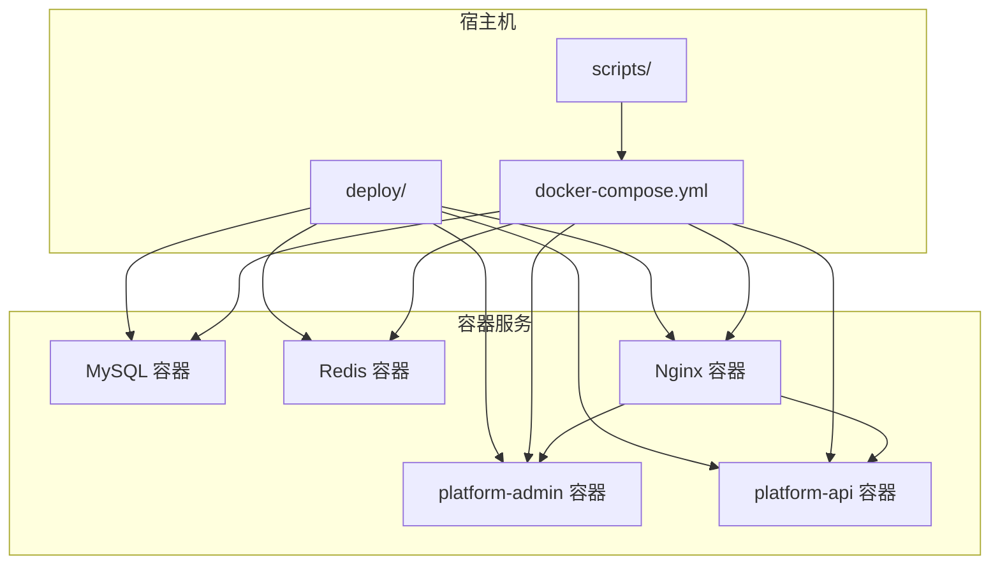
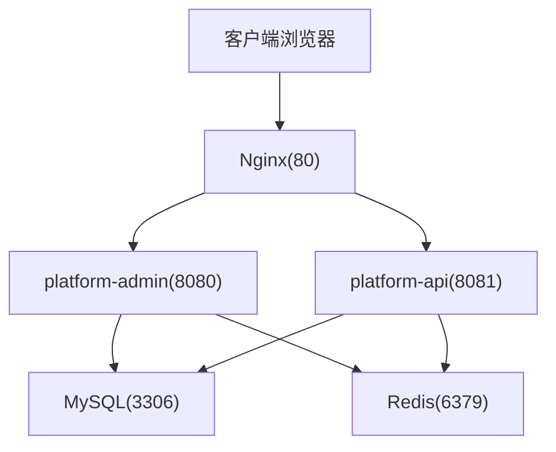
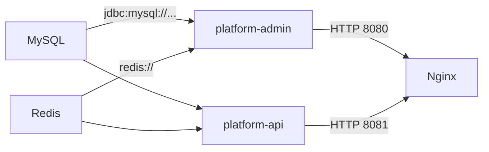

# Docker容器化部署

<cite>
**本文引用的文件**
- [docker-compose.yml](file://docker-compose.yml)
- [scripts/docker-up.sh](file://scripts/docker-up.sh)
- [scripts/docker-down.sh](file://scripts/docker-down.sh)
- [deploy/README.md](file://deploy/README.md)
- [deploy/.env.example](file://deploy/.env.example)
- [scripts/build-jars.sh](file://scripts/build-jars.sh)
- [scripts/build-admin-ui.sh](file://scripts/build-admin-ui.sh)
- [deploy/nginx/default.conf](file://deploy/nginx/default.conf)
- [platform-admin/src/main/resources/application.yml](file://platform-admin/src/main/resources/application.yml)
- [platform-admin/src/main/resources/application-docker.yml](file://platform-admin/src/main/resources/application-docker.yml)
- [platform-api/src/main/resources/application.yml](file://platform-api/src/main/resources/application.yml)
- [platform-api/src/main/resources/application-docker.yml](file://platform-api/src/main/resources/application-docker.yml)
- [platform-admin/src/main/resources/logback-spring.xml](file://platform-admin/src/main/resources/logback-spring.xml)
- [platform-api/src/main/resources/logback-spring.xml](file://platform-api/src/main/resources/logback-spring.xml)
- [platform-admin/pom.xml](file://platform-admin/pom.xml)
</cite>

## 目录
1. [简介](#简介)
2. [项目结构](#项目结构)
3. [核心组件](#核心组件)
4. [架构总览](#架构总览)
5. [组件详解](#组件详解)
6. [依赖关系分析](#依赖关系分析)
7. [性能与资源规划](#性能与资源规划)
8. [故障排查指南](#故障排查指南)
9. [结论](#结论)
10. [附录](#附录)

## 简介
本指南面向希望在生产或开发环境中快速、稳定地部署平台系统的工程师与运维人员。项目提供了基于 Docker Compose 的编排方案，涵盖 MySQL、Redis、Spring Boot 管理后台与 API 服务以及 Nginx 反向代理的完整容器化部署流程。内容包括：
- 编排配置与容器间网络通信、数据卷挂载、环境变量注入
- 镜像构建策略与多阶段优化思路
- 完整部署流程（产物准备、环境变量、数据持久化、健康检查）
- 监控与日志管理（容器状态、日志聚合、性能指标）
- 扩容、滚动更新与故障恢复最佳实践

## 项目结构
围绕 Docker 部署的核心目录与文件如下：
- docker-compose.yml：服务编排定义（MySQL、Redis、Spring Boot 服务、Nginx）
- deploy/：部署产物与配置
  - data/：MySQL、Redis 数据持久化目录
  - nginx/default.conf：Nginx 反向代理配置
  - packages/：打包产物（JAR、前端 dist）
  - .env.example：示例环境变量文件
  - README.md：部署说明
- scripts/：构建与启停脚本
  - build-jars.sh：构建后端 JAR
  - build-admin-ui.sh：构建前端 dist
  - docker-up.sh / docker-down.sh：启动/停止编排
- 平台后端配置
  - application.yml：通用配置（含 Undertow 线程模型、Swagger 文档、静态资源等）
  - application-docker.yml：Docker 环境专用覆盖（数据源、Redis 主机与端口）

图表来源
- [docker-compose.yml:1-115](file://docker-compose.yml#L1-L115)

章节来源
- [docker-compose.yml:1-115](file://docker-compose.yml#L1-L115)
- [deploy/README.md:1-43](file://deploy/README.md#L1-L43)

## 核心组件
- MySQL 8.0：提供关系型数据存储，初始化脚本挂载至 /docker-entrypoint-initdb.d，数据持久化至 deploy/data/mysql
- Redis 7：提供缓存与会话存储，启用 AOF 持久化，数据持久化至 deploy/data/redis
- platform-admin：管理后台服务，监听 8080，上下文路径 /platform-framework
- platform-api：商城 API 服务，监听 8081，上下文路径 /platform-framework-api
- Nginx 1.27：对外暴露 80 端口，反代管理后台与 API，并托管前端静态资源

章节来源
- [docker-compose.yml:1-115](file://docker-compose.yml#L1-L115)
- [deploy/nginx/default.conf:1-28](file://deploy/nginx/default.conf#L1-L28)

## 架构总览
下图展示容器间的网络与流量走向：Nginx 作为统一入口，将 /platform-framework 请求转发至管理后台，/platform-framework-api 转发至 API 服务；管理后台与 API 服务分别连接 MySQL 与 Redis。

图表来源
- [docker-compose.yml:1-115](file://docker-compose.yml#L1-L115)
- [deploy/nginx/default.conf:11-25](file://deploy/nginx/default.conf#L11-L25)

## 组件详解

### MySQL 容器
- 基础镜像：mysql:8.0.36
- 环境变量：根密码、数据库名、时区
- 启动参数：字符集、排序规则、认证插件
- 端口映射：默认 3306（可通过环境变量覆盖）
- 数据卷：
  - /var/lib/mysql：数据库数据持久化
  - /docker-entrypoint-initdb.d：初始化 SQL 脚本挂载（_sql/）
- 健康检查：使用 mysqladmin ping，重试次数与间隔可调

章节来源
- [docker-compose.yml:2-26](file://docker-compose.yml#L2-L26)
- [_sql/base.sql](file://_sql/base.sql)

### Redis 容器
- 基础镜像：redis:7.2-alpine
- 启动参数：开启 AOF 持久化
- 端口映射：默认 6379（可通过环境变量覆盖）
- 数据卷：/data
- 健康检查：redis-cli ping

章节来源
- [docker-compose.yml:28-45](file://docker-compose.yml#L28-L45)

### Spring Boot 管理后台（platform-admin）
- 基础镜像：eclipse-temurin:21-jre
- 依赖健康检查：MySQL 与 Redis 健康后才启动
- 环境变量：
  - 时区、激活配置文件 docker
  - JAVA_OPTS：JVM 内存参数
  - 数据库：主机、端口、库名、用户名、密码
  - Redis：主机、端口、密码
- 数据卷：挂载本地 JAR 至 /app/platform-admin.jar
- 启动命令：以 JAVA_OPTS 启动 JAR

章节来源
- [docker-compose.yml:47-73](file://docker-compose.yml#L47-L73)
- [platform-admin/src/main/resources/application-docker.yml:1-22](file://platform-admin/src/main/resources/application-docker.yml#L1-L22)
- [platform-admin/src/main/resources/application.yml:4-21](file://platform-admin/src/main/resources/application.yml#L4-L21)

### Spring Boot API 服务（platform-api）
- 基础镜像：eclipse-temurin:21-jre
- 依赖健康检查：MySQL 与 Redis 健康后才启动
- 环境变量：与管理后台一致（除端口与上下文路径）
- 数据卷：挂载本地 JAR 至 /app/platform-api.jar
- 启动命令：以 JAVA_OPTS 启动 JAR

章节来源
- [docker-compose.yml:75-101](file://docker-compose.yml#L75-L101)
- [platform-api/src/main/resources/application-docker.yml](file://platform-api/src/main/resources/application-docker.yml)
- [platform-api/src/main/resources/application.yml:4-21](file://platform-api/src/main/resources/application.yml#L4-L21)

### Nginx 反向代理
- 基础镜像：nginx:1.27-alpine
- 端口映射：默认 80（可通过环境变量覆盖）
- 数据卷：
  - /etc/nginx/conf.d/default.conf：挂载反代配置
  - /usr/share/nginx/html：挂载前端 dist
- 反代规则：
  - /platform-framework/ → platform-admin:8080
  - /platform-framework-api/ → platform-api:8081

章节来源
- [docker-compose.yml:103-115](file://docker-compose.yml#L103-L115)
- [deploy/nginx/default.conf:1-28](file://deploy/nginx/default.conf#L1-L28)

### 部署产物与构建脚本
- 后端 JAR 构建：build-jars.sh 使用 Maven Profile（默认 dev），输出至 deploy/packages
- 前端构建：build-admin-ui.sh 执行 npm run build，拷贝 dist 到 deploy/packages/platform-admin-ui-dist
- 启动脚本：docker-up.sh 校验产物与环境，生成默认 .env，创建数据目录，使用 docker compose 启动
- 停止脚本：docker-down.sh 停止并清理

章节来源
- [scripts/build-jars.sh:1-21](file://scripts/build-jars.sh#L1-L21)
- [scripts/build-admin-ui.sh:1-20](file://scripts/build-admin-ui.sh#L1-L20)
- [scripts/docker-up.sh:1-57](file://scripts/docker-up.sh#L1-L57)
- [scripts/docker-down.sh:1-17](file://scripts/docker-down.sh#L1-L17)
- [deploy/README.md:1-43](file://deploy/README.md#L1-L43)

### 环境变量与配置覆盖
- 示例环境变量：时区、Maven Profile、端口、数据库名、密码、JVM 参数
- Docker 环境覆盖：application-docker.yml 中覆盖数据源与 Redis 连接参数，Spring Boot 通过 docker profile 生效

章节来源
- [deploy/.env.example:1-11](file://deploy/.env.example#L1-L11)
- [platform-admin/src/main/resources/application-docker.yml:1-22](file://platform-admin/src/main/resources/application-docker.yml#L1-L22)
- [platform-api/src/main/resources/application-docker.yml](file://platform-api/src/main/resources/application-docker.yml)

### 日志与监控
- 日志配置：后端服务各自配置 logback-spring.xml，按环境输出到控制台与滚动文件
- 监控依赖：platform-admin 依赖 aizuda-monitor 依赖（用于系统监控能力）

章节来源
- [platform-admin/src/main/resources/logback-spring.xml:1-94](file://platform-admin/src/main/resources/logback-spring.xml#L1-L94)
- [platform-api/src/main/resources/logback-spring.xml:1-94](file://platform-api/src/main/resources/logback-spring.xml#L1-L94)
- [platform-admin/pom.xml:41-46](file://platform-admin/pom.xml#L41-L46)

## 依赖关系分析
- 服务依赖
  - platform-admin、platform-api 依赖 MySQL 与 Redis 健康
  - Nginx 依赖 platform-admin、platform-api 启动
- 网络通信
  - 容器间通过服务名互通（mysql、redis、platform-admin、platform-api）
- 数据持久化
  - MySQL、Redis 数据卷分别挂载至 deploy/data/mysql、deploy/data/redis
- 配置覆盖
  - Docker 环境通过 application-docker.yml 覆盖数据源与 Redis 地址，避免污染本地 dev/test/prod 配置

图表来源
- [docker-compose.yml:47-101](file://docker-compose.yml#L47-L101)
- [platform-admin/src/main/resources/application-docker.yml:1-22](file://platform-admin/src/main/resources/application-docker.yml#L1-L22)
- [platform-api/src/main/resources/application-docker.yml](file://platform-api/src/main/resources/application-docker.yml)

章节来源
- [docker-compose.yml:1-115](file://docker-compose.yml#L1-L115)
- [platform-admin/src/main/resources/application-docker.yml:1-22](file://platform-admin/src/main/resources/application-docker.yml#L1-L22)
- [platform-api/src/main/resources/application-docker.yml](file://platform-api/src/main/resources/application-docker.yml)

## 性能与资源规划
- JVM 内存参数
  - 通过环境变量 PLATFORM_ADMIN_JAVA_OPTS、PLATFORM_API_JAVA_OPTS 控制
  - 建议根据并发量与 GC 行为调整初始与最大堆大小
- Web 服务器线程模型
  - Undertow 线程模型已在 application.yml 中配置（IO 线程与 Worker 线程）
  - 建议结合 CPU 核心数与请求特征进行调优
- 数据库与缓存
  - MySQL 字符集与排序规则已设定，确保中文与排序一致性
  - Redis 启用 AOF，建议定期备份与监控内存使用
- 端口与上下文路径
  - 管理后台与 API 分别监听 8080/8081，上下文路径区分，便于反代与路由

章节来源
- [docker-compose.yml:59-95](file://docker-compose.yml#L59-L95)
- [platform-admin/src/main/resources/application.yml:4-21](file://platform-admin/src/main/resources/application.yml#L4-L21)
- [platform-api/src/main/resources/application.yml:4-21](file://platform-api/src/main/resources/application.yml#L4-L21)

## 故障排查指南
- 启动失败
  - 检查 deploy/packages 下是否存在 JAR 与前端 dist
  - 确认 deploy/.env 是否存在且包含必要变量
  - 查看容器健康检查结果与日志
- 数据库初始化
  - 确认 _sql/ 下初始化脚本命名与顺序满足 MySQL 初始化要求
- 端口冲突
  - 修改 .env 中 NGINX_PORT、MYSQL_PORT、REDIS_PORT
- 日志定位
  - 查看后端服务日志（控制台与滚动文件），定位异常堆栈与业务错误
- 依赖健康检查
  - 若服务迟迟不启动，优先检查 MySQL/Redis 健康检查与容器日志

章节来源
- [scripts/docker-up.sh:23-36](file://scripts/docker-up.sh#L23-L36)
- [deploy/README.md:14-31](file://deploy/README.md#L14-L31)
- [docker-compose.yml:19-26](file://docker-compose.yml#L19-L26)
- [platform-admin/src/main/resources/logback-spring.xml:37-49](file://platform-admin/src/main/resources/logback-spring.xml#L37-L49)
- [platform-api/src/main/resources/logback-spring.xml:37-49](file://platform-api/src/main/resources/logback-spring.xml#L37-L49)

## 结论
本指南提供了从零到一的 Docker 容器化部署路径：明确的编排配置、清晰的环境变量与配置覆盖、完善的产物准备与启停脚本、以及可落地的监控与日志策略。按照本文步骤，可在多环境中稳定运行平台系统，并具备良好的扩展性与可观测性。

## 附录

### 部署流程（步骤化）
- 准备产物
  - 执行后端 JAR 构建脚本
  - 执行前端构建脚本
- 准备环境
  - 复制并编辑 .env 文件（可选）
  - 确保 deploy/data/mysql 与 deploy/data/redis 存在
- 启动服务
  - 执行启动脚本，确认各容器健康
- 访问服务
  - 管理台：http://localhost:{NGINX_PORT}
  - 后台接口：http://localhost:{NGINX_PORT}/platform-framework
  - 商城接口：http://localhost:{NGINX_PORT}/platform-framework-api

章节来源
- [deploy/README.md:14-31](file://deploy/README.md#L14-L31)
- [scripts/docker-up.sh:45-56](file://scripts/docker-up.sh#L45-L56)

### 镜像构建策略与优化建议
- 基础镜像选择
  - 使用 eclipse-temurin:21-jre 作为运行时基础镜像，兼顾稳定性与体积
- 多阶段构建建议
  - 在 CI 中采用多阶段构建：编译阶段使用完整 JDK，运行阶段仅复制最小运行时依赖，进一步缩小镜像体积
- 依赖精简
  - 排除不必要的字体与资源文件，减少镜像层大小
- 层缓存优化
  - 将变更频率低的依赖层放在前面，变更频繁的代码层放在后面

章节来源
- [platform-admin/pom.xml:51-70](file://platform-admin/pom.xml#L51-L70)

### 容器监控与日志管理
- 容器状态监控
  - 使用 docker compose ps 与健康检查状态判断服务可用性
- 日志聚合
  - 建议接入集中式日志（如 ELK/Fluentd/Loki），采集后端服务滚动日志
- 性能指标
  - 结合后端监控依赖与系统级指标（CPU、内存、磁盘、网络）进行综合评估

章节来源
- [platform-admin/src/main/resources/logback-spring.xml:68-80](file://platform-admin/src/main/resources/logback-spring.xml#L68-L80)
- [platform-api/src/main/resources/logback-spring.xml:68-80](file://platform-api/src/main/resources/logback-spring.xml#L68-L80)

### 扩容、滚动更新与故障恢复
- 扩容
  - 使用 docker compose up -d --scale platform-admin=N 启动多实例
  - 前端静态资源与反代无需变更，由 Nginx 负载均衡
- 滚动更新
  - 更新 JAR 后重新挂载并重启对应服务，或在 CI 中替换镜像后执行 docker compose up -d
- 故障恢复
  - 优先检查健康检查与日志；回滚至上一个稳定版本；验证数据卷与初始化脚本

章节来源
- [scripts/docker-up.sh:51-56](file://scripts/docker-up.sh#L51-L56)
- [docker-compose.yml:47-101](file://docker-compose.yml#L47-L101)