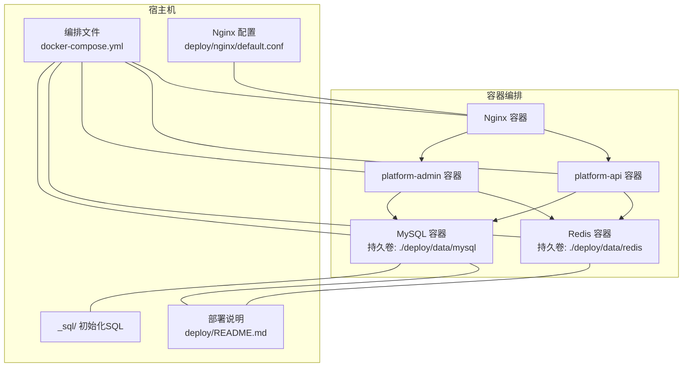
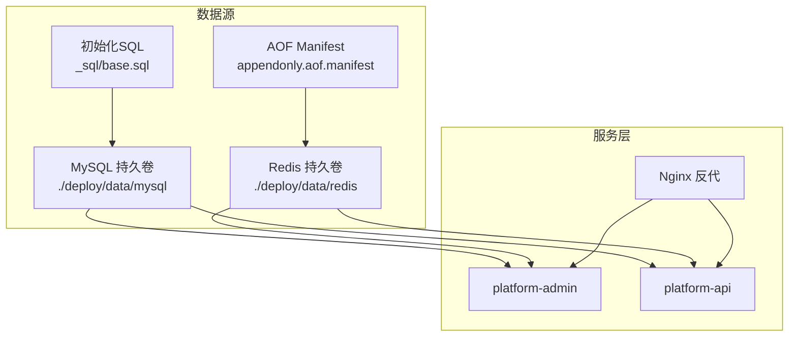
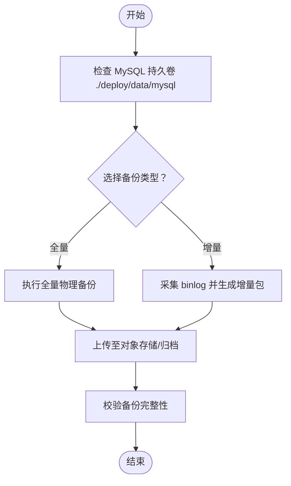
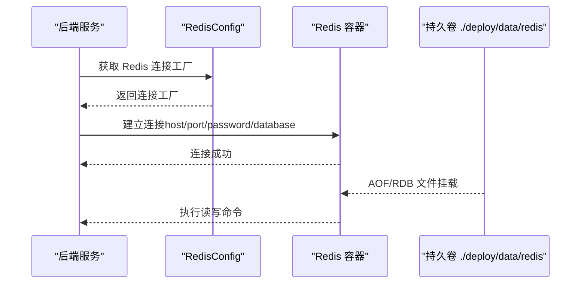
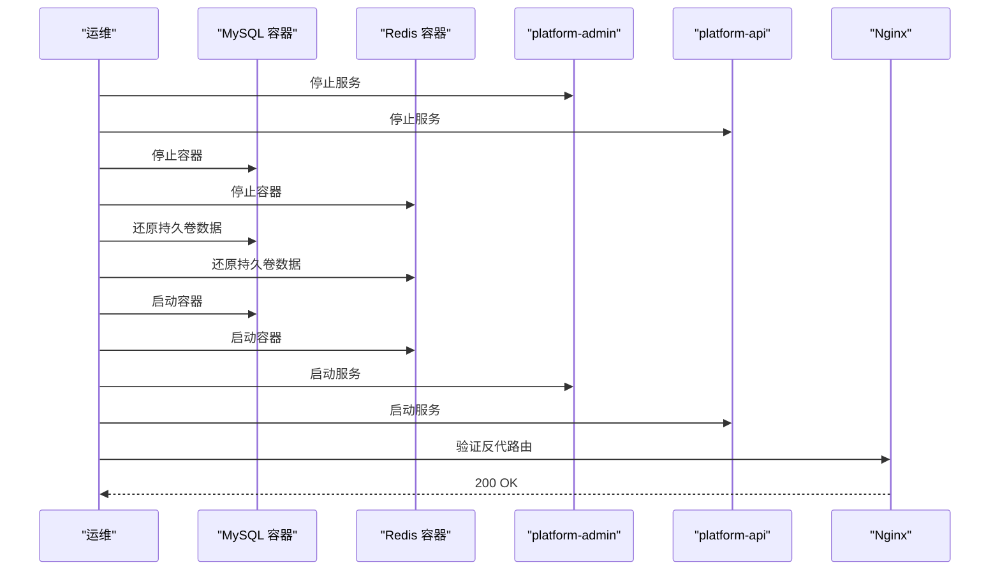
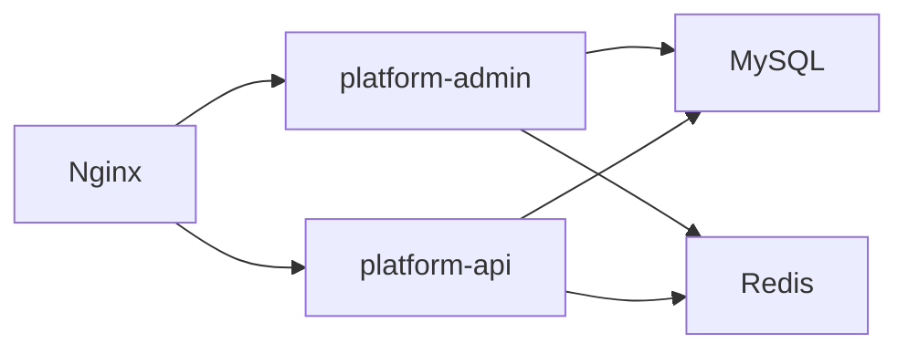

# 备份恢复

<cite>
**本文引用的文件**
- [docker-compose.yml](file://docker-compose.yml)
- [deploy/README.md](file://deploy/README.md)
- [deploy/nginx/default.conf](file://deploy/nginx/default.conf)
- [platform-admin/src/main/resources/application.yml](file://platform-admin/src/main/resources/application.yml)
- [platform-api/src/main/resources/application.yml](file://platform-api/src/main/resources/application.yml)
- [platform-common/src/main/java/com/platform/config/RedisConfig.java](file://platform-common/src/main/java/com/platform/config/RedisConfig.java)
- [_sql/base.sql](file://_sql/base.sql)
- [deploy/data/redis/appendonlydir/appendonly.aof.manifest](file://deploy/data/redis/appendonlydir/appendonly.aof.manifest)
</cite>

## 目录
1. [引言](#引言)
2. [项目结构](#项目结构)
3. [核心组件](#核心组件)
4. [架构总览](#架构总览)
5. [详细组件分析](#详细组件分析)
6. [依赖关系分析](#依赖关系分析)
7. [性能考量](#性能考量)
8. [故障排查指南](#故障排查指南)
9. [结论](#结论)
10. [附录](#附录)

## 引言
本指南面向平台运维与开发团队，提供一套可落地的数据备份与恢复专业实践，涵盖数据库备份策略（全量/增量/定时任务）、Redis 数据持久化（RDB 快照与 AOF 日志）、备份数据管理（存储、版本与加密）、完整恢复流程（验证、服务重启、一致性检查）、灾难恢复（异地备份、故障切换、业务连续性）、备份恢复测试与性能影响评估、以及合规性要求。本文所有技术要点均基于仓库内实际配置与部署文件进行提炼与总结。

## 项目结构
平台采用 Docker Compose 编排，包含 MySQL、Redis、后端服务与 Nginx 反向代理。数据库初始化脚本通过挂载目录一次性导入；Redis 以 AOF 模式持久化；后端服务通过 Nginx 提供统一入口。

图表来源
- [docker-compose.yml:1-115](file://docker-compose.yml#L1-L115)
- [deploy/README.md:1-43](file://deploy/README.md#L1-L43)
- [deploy/nginx/default.conf:1-28](file://deploy/nginx/default.conf#L1-L28)

章节来源
- [docker-compose.yml:1-115](file://docker-compose.yml#L1-L115)
- [deploy/README.md:1-43](file://deploy/README.md#L1-L43)
- [deploy/nginx/default.conf:1-28](file://deploy/nginx/default.conf#L1-L28)

## 核心组件
- 数据库（MySQL）
  - 版本：8.0.36
  - 初始化：首次启动挂载 _sql/ 目录，按文件名顺序执行
  - 持久化：容器内 /var/lib/mysql 挂载至宿主机 ./deploy/data/mysql
- 缓存（Redis）
  - 版本：7.2-alpine
  - 持久化：通过命令行参数启用 AOF（appendonly yes），持久卷 ./deploy/data/redis
  - AOF Manifest：存在 appendonly.aof.manifest，表明系统具备 AOF/RDB 组合持久化能力
- 后端服务
  - platform-admin 与 platform-api 分别监听 8080/8081，通过 Nginx 反代
  - Redis 连接参数由 application.yml 中 spring.redis 节点配置
- Nginx
  - 反代 /platform-framework 与 /platform-framework-api 到对应后端服务

章节来源
- [docker-compose.yml:2-26](file://docker-compose.yml#L2-L26)
- [docker-compose.yml:28-45](file://docker-compose.yml#L28-L45)
- [docker-compose.yml:47-101](file://docker-compose.yml#L47-L101)
- [deploy/nginx/default.conf:11-25](file://deploy/nginx/default.conf#L11-L25)
- [platform-admin/src/main/resources/application.yml:81-98](file://platform-admin/src/main/resources/application.yml#L81-L98)
- [platform-api/src/main/resources/application.yml:70-81](file://platform-api/src/main/resources/application.yml#L70-L81)
- [deploy/data/redis/appendonlydir/appendonly.aof.manifest:1-3](file://deploy/data/redis/appendonlydir/appendonly.aof.manifest#L1-L3)

## 架构总览
下图展示备份与恢复涉及的关键节点与交互：MySQL 初始化脚本、持久化卷、Redis AOF/RDB、后端服务对数据库与缓存的依赖、Nginx 的流量接入。

图表来源
- [docker-compose.yml:16-18](file://docker-compose.yml#L16-L18)
- [docker-compose.yml:35-36](file://docker-compose.yml#L35-L36)
- [deploy/nginx/default.conf:11-25](file://deploy/nginx/default.conf#L11-L25)
- [_sql/base.sql:1-20](file://_sql/base.sql#L1-L20)
- [deploy/data/redis/appendonlydir/appendonly.aof.manifest:1-3](file://deploy/data/redis/appendonlydir/appendonly.aof.manifest#L1-L3)

## 详细组件分析

### 数据库备份策略
- 全量备份
  - 基于容器持久卷的物理备份：将 ./deploy/data/mysql 下的数据库数据目录进行归档与异地存储，确保初始化脚本执行前后的基线一致。
  - 适用场景：首次部署、重大升级前、迁移前。
- 增量备份
  - MySQL 未内置增量备份脚本。建议结合二进制日志（binlog）与时间点恢复（PITR）实现增量备份与回滚，配合物理卷快照或外部备份工具完成自动化采集。
- 定时备份任务配置
  - 在宿主机部署定时任务（如 cron），周期性执行物理卷打包与对象存储上传；或使用数据库专用备份工具（如 Percona XtraBackup）进行在线热备。
  - 与初始化脚本联动：备份完成后，将备份集挂载回 _sql/ 以验证恢复路径（仅限测试环境）。

章节来源
- [docker-compose.yml:16-18](file://docker-compose.yml#L16-L18)
- [_sql/base.sql:1-20](file://_sql/base.sql#L1-L20)

### Redis 数据持久化（RDB/AOF）
- AOF 持久化
  - 通过 Redis 命令行参数启用 appendonly yes，持久卷位于 ./deploy/data/redis，包含 AOF Manifest 文件，指示当前存在 base RDB 与增量 AOF。
- RDB 快照
  - Manifest 显示 base.rdb 存在，表明系统具备快照能力；可通过 BGSAVE 或配置触发快照。
- 配置要点
  - 连接参数：spring.redis（application.yml）定义了 host/port/password/database/超时与连接池参数，用于后端服务访问 Redis。
  - RedisConfig：定义了缓存管理器、序列化器与连接工厂，确保服务侧缓存行为一致。

图表来源
- [platform-common/src/main/java/com/platform/config/RedisConfig.java:154-180](file://platform-common/src/main/java/com/platform/config/RedisConfig.java#L154-L180)
- [platform-admin/src/main/resources/application.yml:81-98](file://platform-admin/src/main/resources/application.yml#L81-L98)
- [platform-api/src/main/resources/application.yml:70-81](file://platform-api/src/main/resources/application.yml#L70-L81)
- [docker-compose.yml:28-45](file://docker-compose.yml#L28-L45)
- [deploy/data/redis/appendonlydir/appendonly.aof.manifest:1-3](file://deploy/data/redis/appendonlydir/appendonly.aof.manifest#L1-L3)

章节来源
- [docker-compose.yml:28-45](file://docker-compose.yml#L28-L45)
- [platform-common/src/main/java/com/platform/config/RedisConfig.java:154-180](file://platform-common/src/main/java/com/platform/config/RedisConfig.java#L154-L180)
- [platform-admin/src/main/resources/application.yml:81-98](file://platform-admin/src/main/resources/application.yml#L81-L98)
- [platform-api/src/main/resources/application.yml:70-81](file://platform-api/src/main/resources/application.yml#L70-L81)
- [deploy/data/redis/appendonlydir/appendonly.aof.manifest:1-3](file://deploy/data/redis/appendonlydir/appendonly.aof.manifest#L1-L3)

### 备份数据管理（存储/版本/加密）
- 存储
  - MySQL：物理卷备份至对象存储或本地归档；Redis：AOF/RDB 文件随持久卷备份。
- 版本管理
  - 为每次备份打上时间戳标签，保留最近 N 个版本；AOF/RDB 组合场景下，确保 base 与增量文件配对。
- 加密保护
  - 备份文件在传输与存储阶段采用加密通道；归档介质（如 S3/GCS）启用服务端加密与访问控制；密钥轮换与权限最小化。

（本节为通用实践说明，无需列出具体文件）

### 完整恢复流程
- 数据库恢复
  - 停止服务与数据库容器；将备份集还原到 ./deploy/data/mysql；启动容器，确认初始化脚本执行顺序与结果。
- Redis 恢复
  - 停止服务与 Redis 容器；将备份集还原到 ./deploy/data/redis；确保 AOF Manifest 与文件序列一致；启动容器，验证数据可用性。
- 服务重启与一致性检查
  - 重启 platform-admin 与 platform-api；通过 Nginx 访问 /platform-framework 与 /platform-framework-api；执行关键业务查询与缓存命中校验。
- 恢复验证
  - 校验数据库表结构与关键数据；校验 Redis 键空间与热点数据；核对日志无异常。

（本图为概念流程示意，无需图表来源）

章节来源
- [docker-compose.yml:16-18](file://docker-compose.yml#L16-L18)
- [docker-compose.yml:35-36](file://docker-compose.yml#L35-L36)
- [deploy/nginx/default.conf:11-25](file://deploy/nginx/default.conf#L11-L25)

### 灾难恢复（DR）
- 异地备份
  - 将 MySQL 与 Redis 的持久卷备份同步至异地对象存储；定期校验下载与解压可用性。
- 故障切换
  - 通过 DNS/负载均衡切换至灾备站点；优先恢复 Redis 与数据库，再逐步拉起应用服务。
- 业务连续性
  - 通过 Nginx 健康检查与容器健康探针保障可用性；关键服务依赖链路明确，缩短故障定位时间。

（本节为通用实践说明，无需列出具体文件）

### 备份恢复测试与性能影响评估
- 测试方法
  - 定期在隔离环境执行“备份-恢复-验证”闭环演练；记录恢复时间（RTO）、数据丢失量（RPO）。
- 性能影响
  - 全量备份期间对 I/O 与网络带宽有压力；建议在业务低谷执行；AOF 重写与快照可能短暂影响延迟。
- 合规性
  - 确保备份数据的访问审计、加密与保留期限符合法规要求；定期审查备份策略与演练记录。

（本节为通用实践说明，无需列出具体文件）

## 依赖关系分析
- 组件耦合
  - platform-admin 与 platform-api 同时依赖 MySQL 与 Redis；Nginx 作为统一入口。
- 外部依赖
  - MySQL 初始化脚本依赖 _sql/ 目录；Redis 持久化依赖 ./deploy/data/redis。
- 潜在风险
  - 若未正确挂载持久卷或未备份 AOF/RDB，可能导致数据丢失；健康检查失败时应快速回滚。

图表来源
- [docker-compose.yml:51-55](file://docker-compose.yml#L51-L55)
- [docker-compose.yml:79-83](file://docker-compose.yml#L79-L83)
- [deploy/nginx/default.conf:11-25](file://deploy/nginx/default.conf#L11-L25)

章节来源
- [docker-compose.yml:51-55](file://docker-compose.yml#L51-L55)
- [docker-compose.yml:79-83](file://docker-compose.yml#L79-L83)
- [deploy/nginx/default.conf:11-25](file://deploy/nginx/default.conf#L11-L25)

## 性能考量
- 备份窗口
  - 建议在业务低峰时段执行全量备份；增量备份结合 binlog 与对象存储上传。
- I/O 与网络
  - 物理卷备份对磁盘 IOPS 与网络带宽有要求；可分批压缩与分片传输。
- Redis 影响
  - AOF 重写与 BGSAVE 会占用 CPU 与内存；建议在低峰期执行或调整策略。

（本节为通用指导，无需列出具体文件）

## 故障排查指南
- MySQL 无法启动
  - 检查 ./deploy/data/mysql 权限与磁盘空间；确认初始化脚本执行顺序与错误日志。
- Redis 无法加载数据
  - 检查 ./deploy/data/redis 权限与 AOF/RDB 文件完整性；确认 appendonly.aof.manifest 与文件序列一致。
- 服务连接异常
  - 校验 spring.redis 配置与容器间网络连通性；查看 Redis 健康检查与日志。
- Nginx 404/502
  - 检查反代路径与后端服务端口；确认后端服务健康探针状态。

章节来源
- [docker-compose.yml:19-26](file://docker-compose.yml#L19-L26)
- [docker-compose.yml:37-44](file://docker-compose.yml#L37-L44)
- [platform-admin/src/main/resources/application.yml:81-98](file://platform-admin/src/main/resources/application.yml#L81-L98)
- [platform-api/src/main/resources/application.yml:70-81](file://platform-api/src/main/resources/application.yml#L70-L81)
- [deploy/nginx/default.conf:11-25](file://deploy/nginx/default.conf#L11-L25)

## 结论
本指南基于仓库内的编排与配置，给出了可操作的备份与恢复实践：以持久卷为基础的全量备份、结合 binlog 的增量备份、AOF/RDB 组合的 Redis 持久化、严格的版本与加密管理、端到端的恢复验证与一致性检查，以及 DR 与合规性要求。建议将上述流程纳入自动化流水线，持续演练并优化恢复策略。

## 附录
- 关键配置参考
  - MySQL 持久卷与初始化脚本：[docker-compose.yml:16-18](file://docker-compose.yml#L16-L18)，[_sql/base.sql:1-20](file://_sql/base.sql#L1-L20)
  - Redis 持久化与 AOF Manifest：[docker-compose.yml:28-45](file://docker-compose.yml#L28-L45)，[deploy/data/redis/appendonlydir/appendonly.aof.manifest:1-3](file://deploy/data/redis/appendonlydir/appendonly.aof.manifest#L1-L3)
  - 后端服务 Redis 连接参数：[platform-admin/src/main/resources/application.yml:81-98](file://platform-admin/src/main/resources/application.yml#L81-L98)，[platform-api/src/main/resources/application.yml:70-81](file://platform-api/src/main/resources/application.yml#L70-L81)
  - Nginx 反代路径：[deploy/nginx/default.conf:11-25](file://deploy/nginx/default.conf#L11-L25)