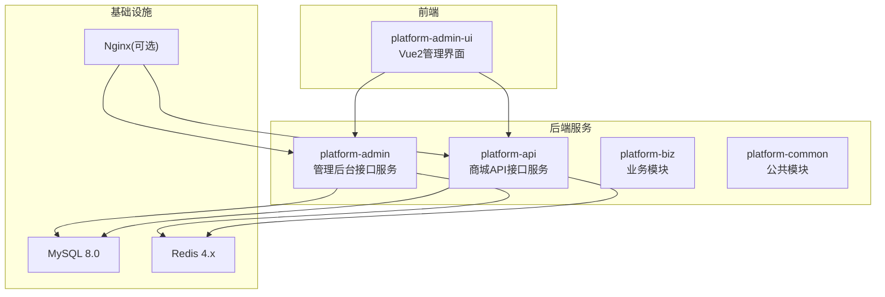
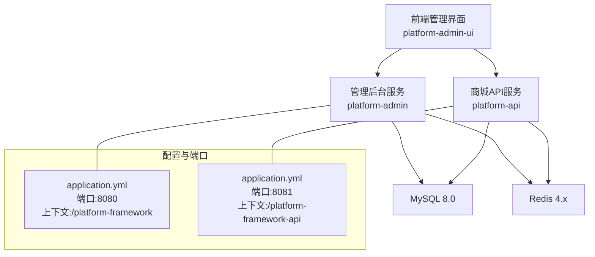
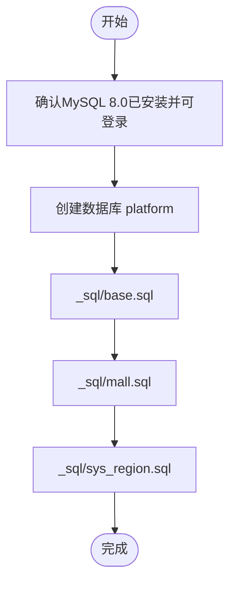
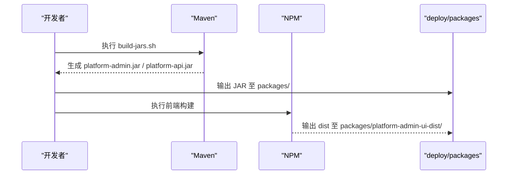
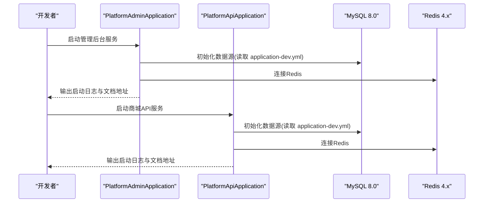
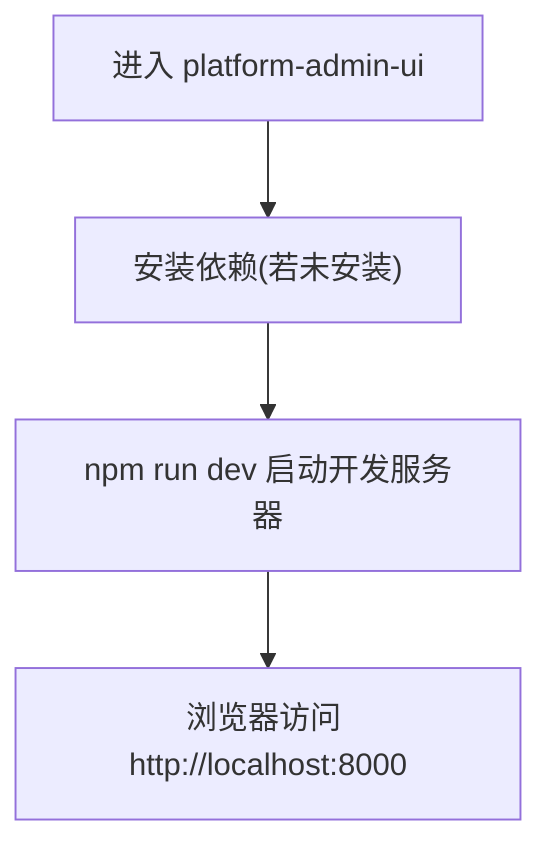
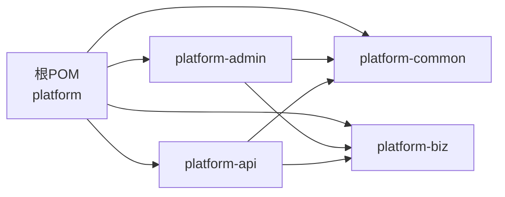

# 本地开发部署

<cite>
**本文引用的文件**
- [pom.xml](file://pom.xml)
- [README.md](file://README.md)
- [_sql/base.sql](file://_sql/base.sql)
- [platform-admin/src/main/resources/application.yml](file://platform-admin/src/main/resources/application.yml)
- [platform-admin/src/main/resources/application-dev.yml](file://platform-admin/src/main/resources/application-dev.yml)
- [platform-api/src/main/resources/application-dev.yml](file://platform-api/src/main/resources/application-dev.yml)
- [platform-admin/src/main/java/com/platform/PlatformAdminApplication.java](file://platform-admin/src/main/java/com/platform/PlatformAdminApplication.java)
- [platform-api/src/main/java/com/platform/PlatformApiApplication.java](file://platform-api/src/main/java/com/platform/PlatformApiApplication.java)
- [platform-admin-ui/package.json](file://platform-admin-ui/package.json)
- [platform-admin-ui/config/index.js](file://platform-admin-ui/config/index.js)
- [scripts/build-jars.sh](file://scripts/build-jars.sh)
- [scripts/build-admin-ui.sh](file://scripts/build-admin-ui.sh)
- [deploy/README.md](file://deploy/README.md)
</cite>

## 目录
1. [简介](#简介)
2. [项目结构](#项目结构)
3. [核心组件](#核心组件)
4. [架构总览](#架构总览)
5. [详细组件分析](#详细组件分析)
6. [依赖分析](#依赖分析)
7. [性能考虑](#性能考虑)
8. [故障排查指南](#故障排查指南)
9. [结论](#结论)
10. [附录](#附录)

## 简介
本指南面向本地开发环境，提供从环境准备、数据库初始化、项目构建到完整启动的全流程说明。目标读者既包括具备一定经验的开发者，也包括初次接触本项目的同学。文档严格基于仓库内现有配置与脚本，确保每一步均可复现。

## 项目结构
该项目为多模块 Maven 工程，包含后端服务（管理后台与商城 API）、公共模块、业务模块、前端管理界面以及若干小程序示例。本地开发主要涉及以下模块与文件：
- 平台根 POM：统一版本与依赖管理
- 平台管理服务：platform-admin
- 平台商城 API：platform-api
- 前端管理界面：platform-admin-ui
- 数据库初始化脚本：_sql/*.sql
- 构建脚本：scripts/build-*.sh

图表来源
- [pom.xml](file://pom.xml)
- [platform-admin/src/main/java/com/platform/PlatformAdminApplication.java](file://platform-admin/src/main/java/com/platform/PlatformAdminApplication.java)
- [platform-api/src/main/java/com/platform/PlatformApiApplication.java](file://platform-api/src/main/java/com/platform/PlatformApiApplication.java)
- [platform-admin/src/main/resources/application.yml](file://platform-admin/src/main/resources/application.yml)

章节来源
- [pom.xml](file://pom.xml)
- [README.md](file://README.md)

## 核心组件
- JDK 21：项目 Java 版本要求为 21，确保本地安装 JDK 21 并正确配置 JAVA_HOME 与 PATH。
- Maven：用于后端模块构建与依赖管理。
- MySQL 8.0：默认使用 localhost:3306，数据库名为 platform，账号 root，密码 root1234。可在 application-dev.yml 中调整。
- Redis 4.x：默认连接 127.0.0.1:6379，可按需调整。
- Node.js/npm：用于前端管理界面的构建与开发服务器启动。

章节来源
- [pom.xml](file://pom.xml)
- [platform-admin/src/main/resources/application-dev.yml](file://platform-admin/src/main/resources/application-dev.yml)
- [platform-api/src/main/resources/application-dev.yml](file://platform-api/src/main/resources/application-dev.yml)
- [platform-admin-ui/package.json](file://platform-admin-ui/package.json)

## 架构总览
本地开发采用“前后端分离 + 多模块后端 + 统一数据库”的架构。前端通过 Nginx 或直接访问后端服务，后端服务通过 Druid 连接池访问 MySQL，使用 Redis 存储缓存与会话信息。

图表来源
- [platform-admin/src/main/resources/application.yml](file://platform-admin/src/main/resources/application.yml)
- [platform-api/src/main/resources/application.yml](file://platform-api/src/main/resources/application.yml)
- [platform-admin/src/main/resources/application-dev.yml](file://platform-admin/src/main/resources/application-dev.yml)
- [platform-api/src/main/resources/application-dev.yml](file://platform-api/src/main/resources/application-dev.yml)

## 详细组件分析

### 数据库初始化流程
- 准备工作：确保本地已安装 MySQL 8.0，并创建数据库 platform。
- 初始化脚本：按顺序执行以下 SQL 文件（建议在 MySQL 客户端中逐个执行）：
  - _sql/base.sql
  - _sql/mall.sql
  - _sql/sys_region.sql
- 初始数据：脚本中包含部分基础数据（如系统配置、数据字典、菜单、管理员等），便于快速验证功能。

图表来源
- [_sql/base.sql](file://_sql/base.sql)
- [README.md](file://README.md)

章节来源
- [_sql/base.sql](file://_sql/base.sql)
- [README.md](file://README.md)

### 项目构建流程
- 后端 JAR 构建：使用 Maven Profile dev，打包 platform-admin 与 platform-api 模块，跳过测试。
- 前端静态资源构建：执行前端构建脚本，产出 dist 目录，并拷贝到 deploy/packages/platform-admin-ui-dist。
- 构建产物位置：
  - deploy/packages/platform-admin.jar
  - deploy/packages/platform-api.jar
  - deploy/packages/platform-admin-ui-dist/

图表来源
- [scripts/build-jars.sh](file://scripts/build-jars.sh)
- [scripts/build-admin-ui.sh](file://scripts/build-admin-ui.sh)
- [deploy/README.md](file://deploy/README.md)

章节来源
- [scripts/build-jars.sh](file://scripts/build-jars.sh)
- [scripts/build-admin-ui.sh](file://scripts/build-admin-ui.sh)
- [deploy/README.md](file://deploy/README.md)

### 后端服务启动
- 管理后台服务：PlatformAdminApplication
  - 端口：8080
  - 上下文路径：/platform-framework
  - 启动后会在控制台输出 API 地址与接口文档地址
- 商城 API 服务：PlatformApiApplication
  - 端口：8081
  - 上下文路径：/platform-framework-api
  - 启动后同样输出 API 地址与接口文档地址

图表来源
- [platform-admin/src/main/java/com/platform/PlatformAdminApplication.java](file://platform-admin/src/main/java/com/platform/PlatformAdminApplication.java)
- [platform-api/src/main/java/com/platform/PlatformApiApplication.java](file://platform-api/src/main/java/com/platform/PlatformApiApplication.java)
- [platform-admin/src/main/resources/application.yml](file://platform-admin/src/main/resources/application.yml)
- [platform-api/src/main/resources/application.yml](file://platform-api/src/main/resources/application.yml)
- [platform-admin/src/main/resources/application-dev.yml](file://platform-admin/src/main/resources/application-dev.yml)
- [platform-api/src/main/resources/application-dev.yml](file://platform-api/src/main/resources/application-dev.yml)

章节来源
- [platform-admin/src/main/java/com/platform/PlatformAdminApplication.java](file://platform-admin/src/main/java/com/platform/PlatformAdminApplication.java)
- [platform-api/src/main/java/com/platform/PlatformApiApplication.java](file://platform-api/src/main/java/com/platform/PlatformApiApplication.java)
- [platform-admin/src/main/resources/application.yml](file://platform-admin/src/main/resources/application.yml)
- [platform-api/src/main/resources/application.yml](file://platform-api/src/main/resources/application.yml)
- [platform-admin/src/main/resources/application-dev.yml](file://platform-admin/src/main/resources/application-dev.yml)
- [platform-api/src/main/resources/application-dev.yml](file://platform-api/src/main/resources/application-dev.yml)

### 前端开发服务器启动
- 端口：8000
- 主机：localhost
- 可选代理：根据 dev.env.js 中 OPEN_PROXY 配置决定是否启用代理
- 构建命令：npm run dev
- 生产构建：npm run build（产出 dist）

图表来源
- [platform-admin-ui/package.json](file://platform-admin-ui/package.json)
- [platform-admin-ui/config/index.js](file://platform-admin-ui/config/index.js)

章节来源
- [platform-admin-ui/package.json](file://platform-admin-ui/package.json)
- [platform-admin-ui/config/index.js](file://platform-admin-ui/config/index.js)

### 数据库连接配置
- 管理后台与商城 API 的 dev 配置均指向本地 MySQL：jdbc:mysql://localhost:3306/platform
- 用户名与密码默认 root/root1234，可在 application-dev.yml 中修改
- Druid 连接池参数已内置优化配置，包含连接数、超时、慢查询日志等

章节来源
- [platform-admin/src/main/resources/application-dev.yml](file://platform-admin/src/main/resources/application-dev.yml)
- [platform-api/src/main/resources/application-dev.yml](file://platform-api/src/main/resources/application-dev.yml)

### 开发调试技巧
- 热部署与自动重启
  - 后端：Spring Boot DevTools 已引入，修改 Java 代码后可自动重启
  - 前端：开发服务器使用 webpack-dev-server，修改前端代码后自动刷新
- 断点调试
  - IDEA 中分别以 PlatformAdminApplication 与 PlatformApiApplication 作为主类启动 Debug
- 日志查看
  - 后端：控制台输出启动日志与 API 文档地址
  - 前端：开发服务器控制台输出编译与热更新信息
- 接口文档
  - 管理后台：/platform-framework/doc.html
  - 商城 API：/platform-framework-api/doc.html

章节来源
- [pom.xml](file://pom.xml)
- [platform-admin/src/main/java/com/platform/PlatformAdminApplication.java](file://platform-admin/src/main/java/com/platform/PlatformAdminApplication.java)
- [platform-api/src/main/java/com/platform/PlatformApiApplication.java](file://platform-api/src/main/java/com/platform/PlatformApiApplication.java)
- [platform-admin/src/main/resources/application.yml](file://platform-admin/src/main/resources/application.yml)
- [platform-api/src/main/resources/application.yml](file://platform-api/src/main/resources/application.yml)

## 依赖分析
- 版本与依赖
  - Java：21
  - Spring Boot：2.7.15
  - MyBatis-Plus：3.5.3
  - MySQL Connector：8.0.33
  - Druid：1.2.19
  - Redis：spring-boot-starter-data-redis
  - Undertow：替换 Tomcat 作为嵌入式 Web 容器
- 模块依赖
  - platform-admin 与 platform-api 均依赖 platform-common 与 platform-biz
  - 平台根 POM 统一管理版本与仓库

图表来源
- [pom.xml](file://pom.xml)

章节来源
- [pom.xml](file://pom.xml)

## 性能考虑
- 嵌入式容器：使用 Undertow 替代 Tomcat，减少启动体积与内存占用
- 连接池：Druid 提供连接池监控与慢 SQL 日志，便于定位性能瓶颈
- 缓存：Redis 用于热点数据与会话缓存，建议合理设置过期策略
- 前端：开发阶段使用 eval-source-map，生产构建关闭 source-map 以减小体积

## 故障排查指南
- 启动端口冲突
  - 管理后台：8080，商城 API：8081；若端口被占用，可在 application.yml 中修改
- 数据库连接失败
  - 检查 MySQL 是否启动、数据库 platform 是否存在、账号密码是否正确
  - 若使用非默认配置，请同步修改 application-dev.yml
- 前端无法访问后端接口
  - 确认后端服务已启动且端口正确
  - 若使用代理，请检查 dev.env.js 中 OPEN_PROXY 与代理配置
- 前端静态资源 404
  - 确认已执行 npm run build，并在浏览器中使用 dist 目录或开发服务器
- Docker 一键启动
  - 首次启动前复制并调整 .env 示例文件，确保端口、数据库密码等符合预期
  - 构建产物由脚本生成，确保已执行 build-jars.sh 与 build-admin-ui.sh

章节来源
- [platform-admin/src/main/resources/application.yml](file://platform-admin/src/main/resources/application.yml)
- [platform-api/src/main/resources/application.yml](file://platform-api/src/main/resources/application.yml)
- [platform-admin-ui/config/index.js](file://platform-admin-ui/config/index.js)
- [deploy/README.md](file://deploy/README.md)

## 结论
本指南基于仓库内的实际配置与脚本，提供了从环境准备到完整启动的可执行步骤。建议在本地先完成数据库初始化与依赖安装，再分别启动后端服务与前端开发服务器，最后结合接口文档与日志进行联调验证。遇到问题时，优先核对配置文件与端口占用情况。

## 附录
- 快速对照清单
  - JDK 21、Maven、MySQL 8.0、Redis 4.x 已安装并可用
  - 数据库 platform 已创建，_sql/*.sql 已执行
  - application-dev.yml 中数据库与 Redis 配置正确
  - 执行 scripts/build-jars.sh 与 scripts/build-admin-ui.sh 生成产物
  - 分别启动 PlatformAdminApplication 与 PlatformApiApplication
  - 启动前端开发服务器 npm run dev
  - 浏览器访问 http://localhost:8000 与接口文档地址