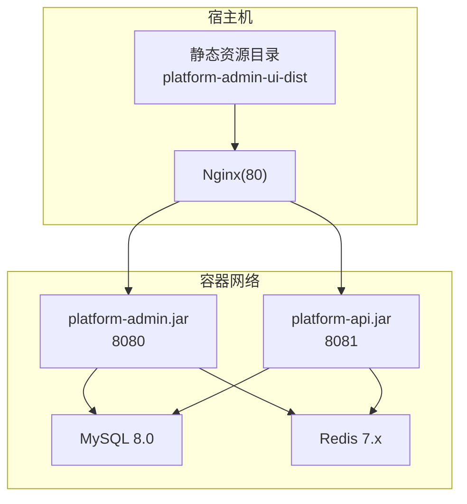
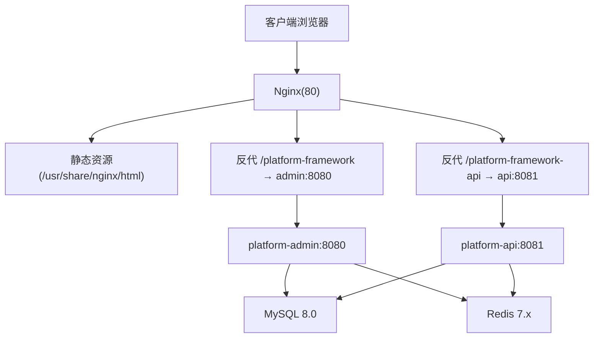
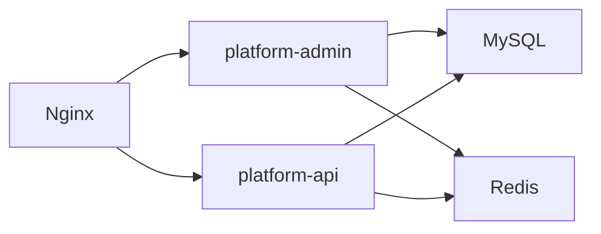
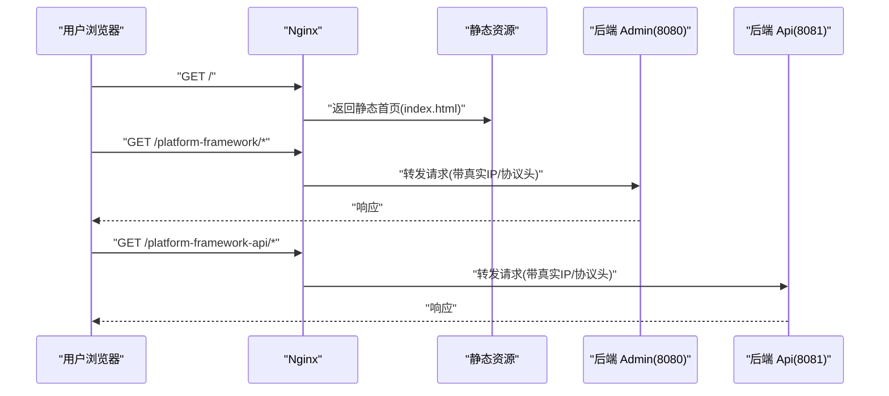
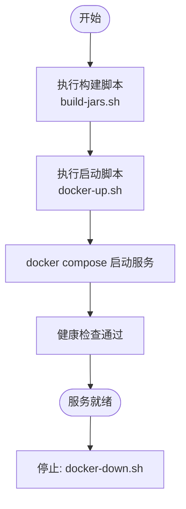

# 生产环境部署

<cite>
**本文引用的文件**
- [deploy/nginx/default.conf](file://deploy/nginx/default.conf)
- [deploy/README.md](file://deploy/README.md)
- [docker-compose.yml](file://docker-compose.yml)
- [scripts/build-jars.sh](file://scripts/build-jars.sh)
- [scripts/docker-up.sh](file://scripts/docker-up.sh)
- [scripts/docker-down.sh](file://scripts/docker-down.sh)
- [platform-admin/src/main/resources/application-prod.yml](file://platform-admin/src/main/resources/application-prod.yml)
- [platform-api/src/main/resources/application-prod.yml](file://platform-api/src/main/resources/application-prod.yml)
- [platform-common/src/main/java/com/platform/config/RedisConfig.java](file://platform-common/src/main/java/com/platform/config/RedisConfig.java)
</cite>

## 目录
1. [简介](#简介)
2. [项目结构](#项目结构)
3. [核心组件](#核心组件)
4. [架构总览](#架构总览)
5. [详细组件分析](#详细组件分析)
6. [依赖关系分析](#依赖关系分析)
7. [性能考虑](#性能考虑)
8. [故障排查指南](#故障排查指南)
9. [结论](#结论)
10. [附录](#附录)

## 简介
本指南面向生产环境部署，围绕 Nginx 反向代理与静态资源托管、负载均衡与 HTTPS 重定向、SSL 证书申请与自动续期、JVM 参数调优、数据库连接池与缓存策略、安全加固（防火墙、访问控制、审计）、高可用架构（多节点、主从复制、LB）、监控告警与日志分析、备份与恢复等主题，结合仓库中的部署脚本、Compose 编排与后端配置进行系统化说明。

## 项目结构
该仓库采用多模块 Maven 结构，并通过 Docker Compose 将 MySQL、Redis、后端服务与 Nginx 组织为统一的运行时。部署相关的关键位置如下：
- Nginx 配置：deploy/nginx/default.conf
- 部署说明：deploy/README.md
- 容器编排：docker-compose.yml
- 构建脚本：scripts/build-jars.sh、scripts/docker-up.sh、scripts/docker-down.sh
- 生产配置：platform-admin 与 platform-api 的 application-prod.yml
- 缓存配置：platform-common 的 RedisConfig.java

图表来源
- [docker-compose.yml:103-115](file://docker-compose.yml#L103-L115)
- [deploy/nginx/default.conf:11-25](file://deploy/nginx/default.conf#L11-L25)

章节来源
- [deploy/README.md:1-43](file://deploy/README.md#L1-L43)
- [docker-compose.yml:1-115](file://docker-compose.yml#L1-L115)

## 核心组件
- Nginx 反向代理与静态资源托管
  - 默认监听 80 端口，根路径托管前端静态资源；对 /platform-framework 与 /platform-framework-api 进行反代，转发至后端服务。
  - 支持通过环境变量 NGINX_PORT 映射宿主机端口。
- 后端服务
  - platform-admin 与 platform-api 分别监听 8080 与 8081，使用 Undertow 访问日志写入指定目录。
  - 数据源采用 Druid 连接池，开启慢 SQL 日志与监控页面。
- 数据存储
  - MySQL 8.0 与 Redis 7.x 作为持久化与缓存介质，均配置健康检查。
- 缓存与序列化
  - Redis 使用 Jedis 连接池与 JSON 序列化，CacheManager 默认 TTL 6 小时。

章节来源
- [deploy/nginx/default.conf:1-28](file://deploy/nginx/default.conf#L1-L28)
- [docker-compose.yml:103-115](file://docker-compose.yml#L103-L115)
- [platform-admin/src/main/resources/application-prod.yml:1-52](file://platform-admin/src/main/resources/application-prod.yml#L1-L52)
- [platform-api/src/main/resources/application-prod.yml:1-52](file://platform-api/src/main/resources/application-prod.yml#L1-L52)
- [platform-common/src/main/java/com/platform/config/RedisConfig.java:1-182](file://platform-common/src/main/java/com/platform/config/RedisConfig.java#L1-L182)

## 架构总览
下图展示生产环境典型拓扑：Nginx 作为入口，负责静态资源与请求分发；后端服务通过容器编排运行；MySQL 与 Redis 提供数据与缓存能力。

图表来源
- [deploy/nginx/default.conf:11-25](file://deploy/nginx/default.conf#L11-L25)
- [docker-compose.yml:47-101](file://docker-compose.yml#L47-L101)

## 详细组件分析

### Nginx 反向代理与静态资源
- 静态资源托管
  - root 指向 /usr/share/nginx/html，index 为 index.html；location / 使用 try_files 回退到单页应用路由。
- 反向代理规则
  - /platform-framework → admin:8080/platform-framework/
  - /platform-framework-api → api:8081/platform-framework-api/
  - 传递真实 IP、协议等头部，便于后端记录访问日志与鉴权。
- 负载均衡
  - 当前配置仅指向单实例服务名，未见 upstream 或多实例配置。若需横向扩展，可在 Nginx 中增加 upstream 并配置多后端实例。
- HTTPS 重定向
  - 当前未见强制 HTTPS 重定向逻辑。建议在生产环境中启用 HTTPS 并添加 301/308 重定向。

章节来源
- [deploy/nginx/default.conf:1-28](file://deploy/nginx/default.conf#L1-L28)
- [docker-compose.yml:103-115](file://docker-compose.yml#L103-L115)

### SSL 证书配置（申请、安装与自动续期）
- 证书申请
  - 推荐使用 ACME 协议（如 Certbot）或云厂商免费证书（如阿里云/腾讯云），确保域名解析正确。
- 安装
  - 将证书与私钥放置于 Nginx 可读目录，更新 server 块 ssl_certificate 与 ssl_certificate_key。
- 自动续期
  - 使用 cron 定时执行 certbot renew；结合 --deploy-hook 重启 Nginx。
- 与当前配置的衔接
  - 在 Nginx 新增 listen 443 ssl 与相关证书路径后，配合 /platform-framework 与 /platform-framework-api 的重写规则，实现全站 HTTPS。

章节来源
- [deploy/nginx/default.conf:1-28](file://deploy/nginx/default.conf#L1-L28)

### JVM 参数调优
- 当前 Compose 中 JAVA_OPTS 默认较小内存（示例值），生产应根据 QPS、GC 行为与堆外内存需求调整。
- 建议关注参数类别
  - 初始/最大堆：-Xms/-Xmx
  - 年老代/新生代比例：-XX:+UseG1GC、-XX:MaxGCPauseMillis、-XX:G1HeapRegionSize
  - 直接内存：-XX:MaxDirectMemorySize
  - GC 日志：-Xloggc:/path/gc.log、-XX:+PrintGCDetails
- 平滑扩容
  - 通过环境变量覆盖 PLATFORM_ADMIN_JAVA_OPTS 与 PLATFORM_API_JAVA_OPTS，避免修改镜像。

章节来源
- [docker-compose.yml:58-69](file://docker-compose.yml#L58-L69)
- [docker-compose.yml:85-95](file://docker-compose.yml#L85-L95)

### 数据库连接池配置
- Druid 连接池参数要点
  - 初始连接数、最小空闲、最大活跃、最大等待时间、空闲回收与校验策略、慢 SQL 阈值与日志开关。
- 生产建议
  - 根据并发与查询复杂度设定 maxActive 与 maxWait；开启 testWhileIdle 与 validationQuery。
  - 监控页面 /druid 限制白名单访问，避免暴露敏感信息。
- 多数据源
  - 当前配置包含 master 与 second，可用于读写分离或灾备切换场景。

章节来源
- [platform-admin/src/main/resources/application-prod.yml:23-41](file://platform-admin/src/main/resources/application-prod.yml#L23-L41)
- [platform-api/src/main/resources/application-prod.yml:23-41](file://platform-api/src/main/resources/application-prod.yml#L23-L41)

### 缓存策略优化
- Redis 连接与序列化
  - Jedis 连接池参数（最大空闲、最小空闲、最大等待）与超时配置；JSON 序列化用于复杂对象缓存。
- CacheManager 默认 TTL
  - 默认 6 小时，适用于长尾数据；热点键建议在业务层单独设置短 TTL。
- 命中率与过期策略
  - 结合业务热点与淘汰策略（如 LRU/LFU），必要时引入本地缓存（如 Caffeine）降低延迟。

章节来源
- [platform-common/src/main/java/com/platform/config/RedisConfig.java:76-100](file://platform-common/src/main/java/com/platform/config/RedisConfig.java#L76-L100)
- [platform-common/src/main/java/com/platform/config/RedisConfig.java:154-180](file://platform-common/src/main/java/com/platform/config/RedisConfig.java#L154-L180)

### 安全加固
- 防火墙与访问控制
  - 仅开放 80/443（HTTPS）与必要的运维端口；对 /druid 等管理页面限制来源 IP。
- 传输安全
  - 强制 HTTPS，禁用弱密码套件与过时协议；HSTS 增强。
- 审计与日志
  - 启用 Undertow 访问日志与慢 SQL 日志；集中采集 Nginx、后端与数据库日志，保留至少 90 天。

章节来源
- [platform-admin/src/main/resources/application-prod.yml:3-5](file://platform-admin/src/main/resources/application-prod.yml#L3-L5)
- [platform-api/src/main/resources/application-prod.yml:3-5](file://platform-api/src/main/resources/application-prod.yml#L3-L5)
- [platform-admin/src/main/resources/application-prod.yml:44-51](file://platform-admin/src/main/resources/application-prod.yml#L44-L51)
- [platform-api/src/main/resources/application-prod.yml:44-51](file://platform-api/src/main/resources/application-prod.yml#L44-L51)

### 高可用部署架构
- 多节点部署
  - 后端：多实例水平扩展，结合 Nginx upstream 与健康检查。
  - 数据库：主从复制（半同步）+ 只读副本，读写分离；使用中间件或应用侧路由。
- 负载均衡
  - Nginx 层面：upstream + keepalive + 健康检查；后端层面：Spring Cloud（如需）。
- 存储高可用
  - MySQL：主从/集群；Redis：哨兵/集群；共享存储或持久卷（Kubernetes）。

章节来源
- [deploy/nginx/default.conf:11-25](file://deploy/nginx/default.conf#L11-L25)
- [docker-compose.yml:19-26](file://docker-compose.yml#L19-L26)
- [docker-compose.yml:37-45](file://docker-compose.yml#L37-L45)

### 监控告警、日志分析与备份恢复
- 监控告警
  - 指标：CPU、内存、磁盘、连接数、QPS、错误率、慢请求、缓存命中率、数据库延迟。
  - 告警：阈值触发 + 降采样 + 抑制策略；与运维平台联动。
- 日志分析
  - Nginx/后端/数据库日志集中化；建立索引与检索规则；异常模式识别。
- 备份与恢复
  - MySQL：定时全量 + 增量/二进制日志；验证恢复流程。
  - Redis：RDB/AOF；持久化策略与跨机房同步。
  - 前端静态资源：版本化发布与回滚。

章节来源
- [platform-admin/src/main/resources/application-prod.yml:3-5](file://platform-admin/src/main/resources/application-prod.yml#L3-L5)
- [platform-api/src/main/resources/application-prod.yml:3-5](file://platform-api/src/main/resources/application-prod.yml#L3-L5)

## 依赖关系分析
- 组件耦合
  - Nginx 依赖后端服务健康；后端依赖 MySQL 与 Redis；容器间通过服务名通信。
- 外部依赖
  - Docker Compose、Maven、JDK 21、Nginx、MySQL、Redis。
- 潜在风险
  - 单实例后端存在 SPOF；数据库无主从；缓存未做高可用；缺少 HTTPS 重定向。

图表来源
- [docker-compose.yml:47-101](file://docker-compose.yml#L47-L101)

章节来源
- [docker-compose.yml:1-115](file://docker-compose.yml#L1-L115)

## 性能考虑
- Nginx
  - 开启 gzip/HTTP/2；合理设置 client_max_body_size；连接超时与 keepalive。
- 后端
  - G1GC + 合理堆大小；线程池与连接池参数匹配；异步化 IO 密集型操作。
- 数据库
  - 读写分离、索引优化、慢查询分析、连接池上限与超时。
- 缓存
  - 多级缓存（本地+分布式）；热点数据预热；TTL 与失效策略。

章节来源
- [platform-common/src/main/java/com/platform/config/RedisConfig.java:154-180](file://platform-common/src/main/java/com/platform/config/RedisConfig.java#L154-L180)
- [platform-admin/src/main/resources/application-prod.yml:23-41](file://platform-admin/src/main/resources/application-prod.yml#L23-L41)
- [platform-api/src/main/resources/application-prod.yml:23-41](file://platform-api/src/main/resources/application-prod.yml#L23-L41)

## 故障排查指南
- 启动失败
  - 检查 JAR 是否构建完成、UI 静态资源是否存在、环境变量是否就位。
- 服务不可达
  - 查看 Nginx 反代目标是否健康；确认后端端口映射与容器网络。
- 数据库连接异常
  - 校验 JDBC URL、账号密码、网络连通性；观察连接池状态与慢 SQL。
- 缓存异常
  - 检查 Redis 连接参数、密码、网络；确认序列化兼容性。

章节来源
- [scripts/docker-up.sh:23-36](file://scripts/docker-up.sh#L23-L36)
- [scripts/docker-down.sh:1-17](file://scripts/docker-down.sh#L1-L17)
- [platform-admin/src/main/resources/application-prod.yml:12-21](file://platform-admin/src/main/resources/application-prod.yml#L12-L21)
- [platform-common/src/main/java/com/platform/config/RedisConfig.java:154-180](file://platform-common/src/main/java/com/platform/config/RedisConfig.java#L154-L180)

## 结论
本指南基于仓库现有配置与脚本，给出了生产环境部署的实施路径与优化建议。当前工程具备基础的容器化与反向代理能力，但尚需补齐 HTTPS、负载均衡、数据库主从、缓存高可用与完善的监控告警体系。建议按优先级逐步落地，先完成 TLS 与 HTTPS 重定向，再推进横向扩展与高可用改造。

## 附录

### Nginx 反向代理与静态资源处理时序

图表来源
- [deploy/nginx/default.conf:7-25](file://deploy/nginx/default.conf#L7-L25)

### 构建与启动流程

图表来源
- [scripts/build-jars.sh:1-21](file://scripts/build-jars.sh#L1-L21)
- [scripts/docker-up.sh:1-57](file://scripts/docker-up.sh#L1-L57)
- [scripts/docker-down.sh:1-17](file://scripts/docker-down.sh#L1-L17)
- [docker-compose.yml:19-26](file://docker-compose.yml#L19-L26)
- [docker-compose.yml:37-45](file://docker-compose.yml#L37-L45)