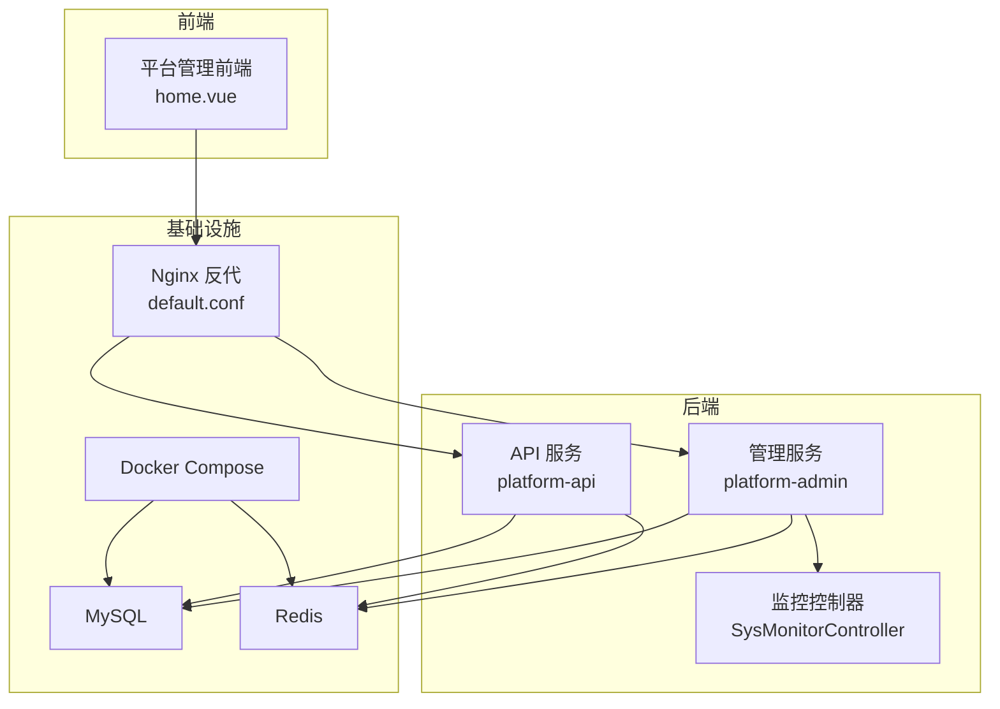
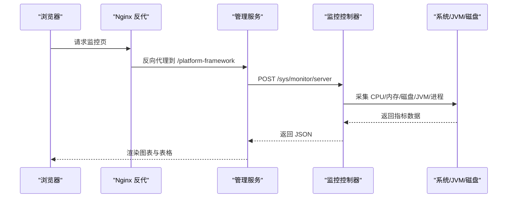
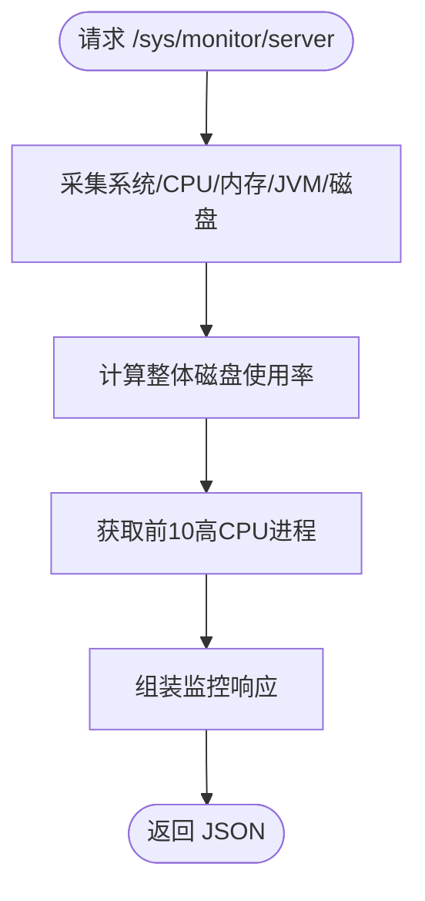
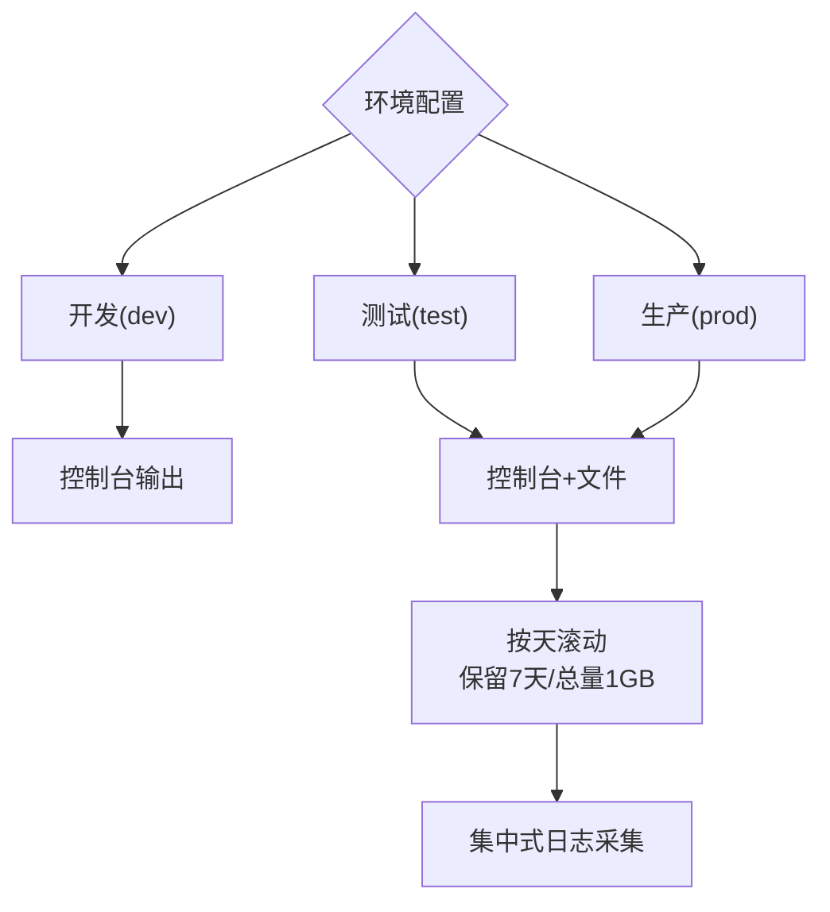
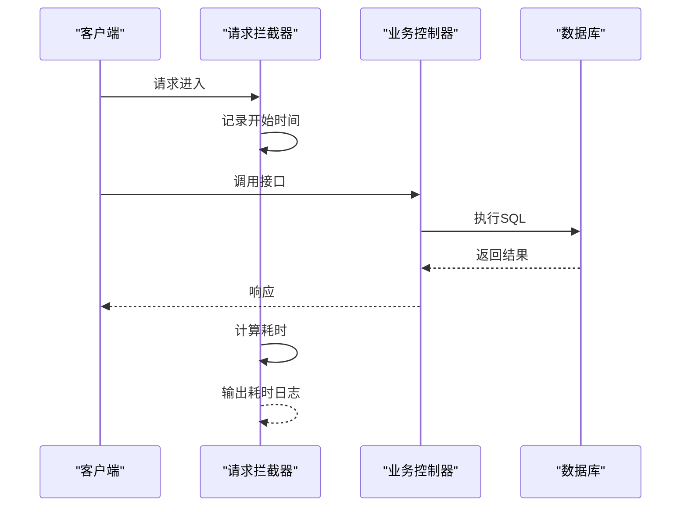
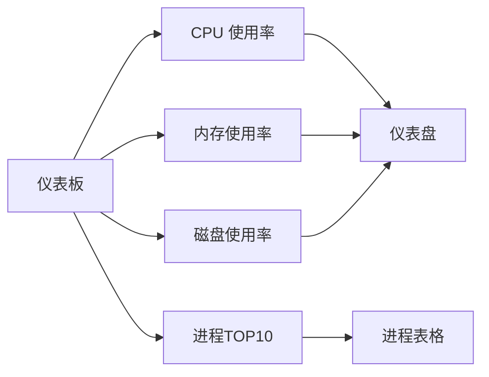
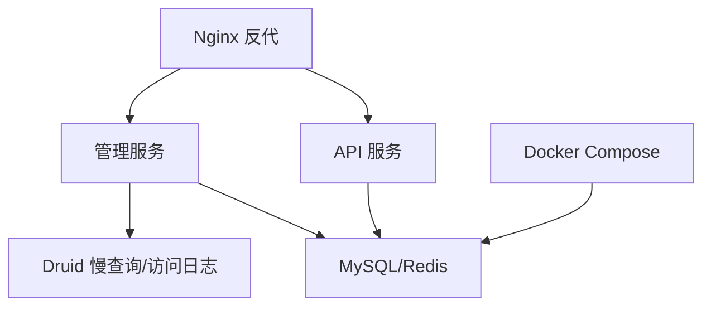

# 监控告警

<cite>
**本文引用的文件**
- [platform-admin/src/main/resources/application.yml](file://platform-admin/src/main/resources/application.yml)
- [platform-api/src/main/resources/application.yml](file://platform-api/src/main/resources/application.yml)
- [platform-admin/src/main/resources/logback-spring.xml](file://platform-admin/src/main/resources/logback-spring.xml)
- [platform-api/src/main/resources/logback-spring.xml](file://platform-api/src/main/resources/logback-spring.xml)
- [platform-admin/src/main/resources/application-dev.yml](file://platform-admin/src/main/resources/application-dev.yml)
- [platform-admin/src/main/resources/application-test.yml](file://platform-admin/src/main/resources/application-test.yml)
- [platform-admin/src/main/resources/application-prod.yml](file://platform-admin/src/main/resources/application-prod.yml)
- [platform-admin/src/main/java/com/platform/modules/sys/controller/SysMonitorController.java](file://platform-admin/src/main/java/com/platform/modules/sys/controller/SysMonitorController.java)
- [platform-admin-ui/src/views/common/home.vue](file://platform-admin-ui/src/views/common/home.vue)
- [deploy/nginx/default.conf](file://deploy/nginx/default.conf)
- [docker-compose.yml](file://docker-compose.yml)
- [platform-admin/src/main/java/com/platform/config/RequestUriLogInterceptor.java](file://platform-admin/src/main/java/com/platform/config/RequestUriLogInterceptor.java)
- [platform-admin/src/main/java/com/platform/config/ActResourceHandlerConfig.java](file://platform-admin/src/main/java/com/platform/config/ActResourceHandlerConfig.java)
- [platform-common/src/main/java/com/platform/config/WebConfigurer.java](file://platform-common/src/main/java/com/platform/config/WebConfigurer.java)
</cite>

## 目录
1. [简介](#简介)
2. [项目结构](#项目结构)
3. [核心组件](#核心组件)
4. [架构总览](#架构总览)
5. [详细组件分析](#详细组件分析)
6. [依赖分析](#依赖分析)
7. [性能考虑](#性能考虑)
8. [故障排查指南](#故障排查指南)
9. [结论](#结论)
10. [附录](#附录)

## 简介
本指南围绕系统监控与告警展开，结合当前代码库的实际实现，给出可落地的应用监控指标、日志监控配置、性能监控策略、告警规则配置、监控数据可视化、故障预警机制、容量规划与性能优化建议。内容涵盖：
- 应用监控指标：CPU 使用率、内存占用、数据库连接数、接口响应时间
- 日志监控：日志级别、日志轮转、集中式日志收集
- 性能监控：慢查询监控、异常追踪、接口耗时统计
- 告警规则：阈值设定、告警级别、通知渠道
- 数据可视化：仪表板、图表、趋势分析
- 故障预警与容量规划：基于指标阈值与趋势的预警策略

## 项目结构
该项目采用多模块 Maven 结构，包含后端管理平台与 API 平台，以及前端 UI、部署与文档。与监控相关的关键位置如下：
- 后端配置与日志：application.yml、logback-spring.xml
- 监控接口与前端展示：SysMonitorController、home.vue
- Nginx 反向代理：default.conf
- 容器编排：docker-compose.yml
- 慢查询与访问日志：Druid 配置、Undertow 访问日志

**图表来源**
- [deploy/nginx/default.conf:1-26](file://deploy/nginx/default.conf#L1-L26)
- [docker-compose.yml:1-45](file://docker-compose.yml#L1-L45)
- [platform-admin/src/main/java/com/platform/modules/sys/controller/SysMonitorController.java:45-110](file://platform-admin/src/main/java/com/platform/modules/sys/controller/SysMonitorController.java#L45-L110)

**章节来源**
- [platform-admin/src/main/resources/application.yml:1-205](file://platform-admin/src/main/resources/application.yml#L1-L205)
- [platform-api/src/main/resources/application.yml:1-195](file://platform-api/src/main/resources/application.yml#L1-L195)
- [platform-admin/src/main/resources/logback-spring.xml:1-94](file://platform-admin/src/main/resources/logback-spring.xml#L1-L94)
- [platform-api/src/main/resources/logback-spring.xml:1-94](file://platform-api/src/main/resources/logback-spring.xml#L1-L94)
- [deploy/nginx/default.conf:1-26](file://deploy/nginx/default.conf#L1-L26)
- [docker-compose.yml:1-45](file://docker-compose.yml#L1-L45)

## 核心组件
- 监控控制器：提供系统与 JVM 指标采集接口，返回 CPU、内存、磁盘、进程等信息，供前端可视化展示。
- 日志配置：Logback 在不同环境配置了控制台与文件输出、按天滚动与总量上限控制。
- 慢查询与访问日志：Druid 配置开启慢 SQL 记录与访问日志目录，便于性能分析与告警。
- Nginx 反代：统一入口，便于接入外部监控与日志采集。

**章节来源**
- [platform-admin/src/main/java/com/platform/modules/sys/controller/SysMonitorController.java:45-110](file://platform-admin/src/main/java/com/platform/modules/sys/controller/SysMonitorController.java#L45-L110)
- [platform-admin/src/main/resources/logback-spring.xml:1-94](file://platform-admin/src/main/resources/logback-spring.xml#L1-L94)
- [platform-api/src/main/resources/logback-spring.xml:1-94](file://platform-api/src/main/resources/logback-spring.xml#L1-L94)
- [platform-admin/src/main/resources/application-dev.yml:1-46](file://platform-admin/src/main/resources/application-dev.yml#L1-L46)
- [platform-admin/src/main/resources/application-test.yml:1-51](file://platform-admin/src/main/resources/application-test.yml#L1-L51)
- [platform-admin/src/main/resources/application-prod.yml:1-51](file://platform-admin/src/main/resources/application-prod.yml#L1-L51)
- [deploy/nginx/default.conf:1-26](file://deploy/nginx/default.conf#L1-L26)

## 架构总览
下图展示了监控数据流与可视化链路：前端通过 Nginx 访问后端服务，后端控制器聚合系统与 JVM 指标，日志由 Logback 输出至文件并可被集中采集；数据库层由 Druid 提供慢查询与访问日志能力。

**图表来源**
- [deploy/nginx/default.conf:11-17](file://deploy/nginx/default.conf#L11-L17)
- [platform-admin/src/main/java/com/platform/modules/sys/controller/SysMonitorController.java:55-109](file://platform-admin/src/main/java/com/platform/modules/sys/controller/SysMonitorController.java#L55-L109)

## 详细组件分析

### 应用监控指标采集
- 指标范围：系统信息、CPU 使用率、内存使用率、JVM 内存与启动时间、磁盘使用率与卷状态、前 10 高 CPU 占用进程。
- 数据来源：监控控制器调用底层监控模块，汇总后返回给前端。
- 前端展示：使用 ECharts 图表展示 CPU、内存、磁盘使用率仪表盘，并列出高占用进程。

**图表来源**
- [platform-admin/src/main/java/com/platform/modules/sys/controller/SysMonitorController.java:55-109](file://platform-admin/src/main/java/com/platform/modules/sys/controller/SysMonitorController.java#L55-L109)

**章节来源**
- [platform-admin/src/main/java/com/platform/modules/sys/controller/SysMonitorController.java:45-110](file://platform-admin/src/main/java/com/platform/modules/sys/controller/SysMonitorController.java#L45-L110)
- [platform-admin-ui/src/views/common/home.vue:1-1188](file://platform-admin-ui/src/views/common/home.vue#L1-L1188)

### 日志监控配置
- 环境区分：dev/test/prod 三档日志级别与输出策略。
- 控制台输出：开发环境彩色日志，生产/测试环境控制台与文件双输出。
- 文件轮转：按天滚动，保留天数与总量上限控制，避免磁盘膨胀。
- 集中式采集：日志文件位于固定路径，可对接日志收集系统（如 Filebeat/Fluent Bit/Logstash）统一采集。

**图表来源**
- [platform-admin/src/main/resources/logback-spring.xml:14-89](file://platform-admin/src/main/resources/logback-spring.xml#L14-L89)
- [platform-api/src/main/resources/logback-spring.xml:14-89](file://platform-api/src/main/resources/logback-spring.xml#L14-L89)

**章节来源**
- [platform-admin/src/main/resources/logback-spring.xml:1-94](file://platform-admin/src/main/resources/logback-spring.xml#L1-L94)
- [platform-api/src/main/resources/logback-spring.xml:1-94](file://platform-api/src/main/resources/logback-spring.xml#L1-L94)

### 性能监控策略
- 慢查询监控：Druid 配置开启慢 SQL 记录与阈值，便于定位慢查询。
- 访问日志：Undertow 启用访问日志并指定输出目录，便于分析请求量与延迟。
- 接口耗时统计：通过拦截器记录请求开始时间并在完成后输出耗时与请求信息，辅助定位慢接口。

**图表来源**
- [platform-admin/src/main/java/com/platform/config/RequestUriLogInterceptor.java:24-43](file://platform-admin/src/main/java/com/platform/config/RequestUriLogInterceptor.java#L24-L43)
- [platform-admin/src/main/java/com/platform/config/ActResourceHandlerConfig.java:46-48](file://platform-admin/src/main/java/com/platform/config/ActResourceHandlerConfig.java#L46-L48)

**章节来源**
- [platform-admin/src/main/resources/application-dev.yml:33-36](file://platform-admin/src/main/resources/application-dev.yml#L33-L36)
- [platform-admin/src/main/resources/application-test.yml:38-41](file://platform-admin/src/main/resources/application-test.yml#L38-L41)
- [platform-admin/src/main/resources/application-prod.yml:38-41](file://platform-admin/src/main/resources/application-prod.yml#L38-L41)
- [platform-admin/src/main/resources/application.yml:3-5](file://platform-admin/src/main/resources/application.yml#L3-L5)
- [platform-api/src/main/resources/application.yml:3-5](file://platform-api/src/main/resources/application.yml#L3-L5)
- [platform-admin/src/main/java/com/platform/config/RequestUriLogInterceptor.java:1-43](file://platform-admin/src/main/java/com/platform/config/RequestUriLogInterceptor.java#L1-L43)
- [platform-admin/src/main/java/com/platform/config/ActResourceHandlerConfig.java:45-49](file://platform-admin/src/main/java/com/platform/config/ActResourceHandlerConfig.java#L45-L49)

### 告警规则配置
建议基于以下阈值与级别建立告警：
- CPU 使用率
  - 告警级别：预警/严重
  - 阈值：预警 ≥ 80%，严重 ≥ 90%
- 内存使用率
  - 预警：≥ 80%
  - 严重：≥ 90%
- 磁盘使用率
  - 预警：≥ 85%
  - 严重：≥ 95%
- 数据库连接数
  - 预警：≥ 连接池上限的 70%
  - 严重：≥ 连接池上限的 90%
- 接口响应时间
  - 预警：P95 ≥ 1 秒
  - 严重：P95 ≥ 5 秒
- 异常与慢查询
  - 预警：慢查询次数增长 > 20%
  - 严重：慢查询次数增长 > 100%

通知渠道建议：
- 即时通知：企业微信/钉钉/飞书机器人
- 邮件备份：关键级别告警邮件
- 告警收敛：同类型告警合并周期内抑制，避免风暴

[本节为通用策略说明，不直接分析具体文件，故无“章节来源”]

### 监控数据可视化
- 仪表板：CPU/内存/磁盘使用率仪表盘，磁盘卷状态进度条，系统与 JVM 信息卡片。
- 表格：前 10 高 CPU 占用进程列表，包含 PID、线程数、虚拟内存、物理内存、IO 等。
- 趋势分析：结合历史日志与数据库访问日志，绘制 P95/P99 延迟曲线与慢查询趋势。

**图表来源**
- [platform-admin-ui/src/views/common/home.vue:1-1188](file://platform-admin-ui/src/views/common/home.vue#L1-L1188)

**章节来源**
- [platform-admin-ui/src/views/common/home.vue:1-1188](file://platform-admin-ui/src/views/common/home.vue#L1-L1188)

### 故障预警机制与容量规划
- 预警机制：基于阈值与趋势的双维度告警，结合滑动窗口与环比变化识别异常波动。
- 容量规划：根据 CPU/内存/IO 峰值与增长趋势，预留 20%-30% 缓冲，定期评估数据库连接池与线程池参数。
- 优化建议：
  - 数据库：慢查询优化、索引补充、连接池参数调优
  - 应用：异步化耗时操作、缓存热点数据、限流与熔断
  - 基础设施：磁盘扩容与 IO 优化、网络带宽与连接上限

[本节为通用策略说明，不直接分析具体文件，故无“章节来源”]

## 依赖分析
- 后端服务通过 Nginx 统一对外提供 /platform-framework 与 /platform-framework-api 两个上下文路径，便于分别接入监控与日志采集。
- Docker Compose 管理 MySQL 与 Redis，提供健康检查，便于监控系统感知服务可用性。
- Druid 与 Undertow 的配置为性能监控与访问审计提供基础数据。

**图表来源**
- [deploy/nginx/default.conf:11-25](file://deploy/nginx/default.conf#L11-L25)
- [docker-compose.yml:1-45](file://docker-compose.yml#L1-L45)
- [platform-admin/src/main/resources/application-dev.yml:33-36](file://platform-admin/src/main/resources/application-dev.yml#L33-L36)

**章节来源**
- [deploy/nginx/default.conf:1-26](file://deploy/nginx/default.conf#L1-L26)
- [docker-compose.yml:1-45](file://docker-compose.yml#L1-L45)
- [platform-admin/src/main/resources/application-dev.yml:1-46](file://platform-admin/src/main/resources/application-dev.yml#L1-L46)

## 性能考虑
- 线程与缓冲： Undertow 线程与缓冲区配置影响并发与内存占用，需结合 CPU 核心数与负载进行调优。
- 日志写入：文件落盘与滚动策略影响 IO，建议在高并发场景下评估磁盘性能与日志级别。
- 数据库连接池：合理设置最大连接数、等待时间与空闲回收策略，避免连接泄漏与抖动。
- 前端渲染：大量进程数据与图表渲染可能带来前端压力，建议分页与增量刷新。

[本节为通用指导，不直接分析具体文件，故无“章节来源”]

## 故障排查指南
- 接口耗时异常
  - 检查拦截器输出的耗时日志，定位慢接口与参数
  - 关联数据库慢查询日志，确认 SQL 性能
- 日志缺失或过少
  - 核对 Logback 环境配置与文件权限
  - 确认集中式采集是否正确挂载日志目录
- 数据库连接不足
  - 查看 Druid 监控页面与连接池状态
  - 检查慢查询与事务超时导致的连接堆积
- 服务不可用
  - 通过 Docker Compose 健康检查确认 MySQL/Redis 状态
  - 检查 Nginx 反代路径与后端服务端口

**章节来源**
- [platform-admin/src/main/java/com/platform/config/RequestUriLogInterceptor.java:36-43](file://platform-admin/src/main/java/com/platform/config/RequestUriLogInterceptor.java#L36-L43)
- [platform-admin/src/main/resources/application-dev.yml:38-41](file://platform-admin/src/main/resources/application-dev.yml#L38-L41)
- [platform-admin/src/main/resources/application-test.yml:38-41](file://platform-admin/src/main/resources/application-test.yml#L38-L41)
- [platform-admin/src/main/resources/application-prod.yml:38-41](file://platform-admin/src/main/resources/application-prod.yml#L38-L41)
- [docker-compose.yml:19-26](file://docker-compose.yml#L19-L26)

## 结论
本指南基于现有代码库的配置与实现，给出了系统监控与告警的完整实践路径：从指标采集、日志与慢查询监控，到可视化与告警规则设计，再到容量规划与性能优化。建议在现有基础上进一步完善集中式日志与 APM 集成、细化告警分级与通知策略，并持续跟踪关键指标趋势，确保系统稳定与高性能运行。

[本节为总结性内容，不直接分析具体文件，故无“章节来源”]

## 附录
- 配置文件要点速览
  - 应用配置：端口、上下文路径、Redis、邮件、Swagger/Knife4j 文档
  - 日志配置：环境差异化输出、文件滚动策略
  - 慢查询与访问日志：Druid 慢 SQL 阈值、Undertow 访问日志目录
  - 反代与容器：Nginx 上下文路径、Docker Compose 健康检查

**章节来源**
- [platform-admin/src/main/resources/application.yml:1-205](file://platform-admin/src/main/resources/application.yml#L1-L205)
- [platform-api/src/main/resources/application.yml:1-195](file://platform-api/src/main/resources/application.yml#L1-L195)
- [platform-admin/src/main/resources/logback-spring.xml:1-94](file://platform-admin/src/main/resources/logback-spring.xml#L1-L94)
- [platform-api/src/main/resources/logback-spring.xml:1-94](file://platform-api/src/main/resources/logback-spring.xml#L1-L94)
- [platform-admin/src/main/resources/application-dev.yml:33-36](file://platform-admin/src/main/resources/application-dev.yml#L33-L36)
- [platform-admin/src/main/resources/application-test.yml:38-41](file://platform-admin/src/main/resources/application-test.yml#L38-L41)
- [platform-admin/src/main/resources/application-prod.yml:38-41](file://platform-admin/src/main/resources/application-prod.yml#L38-L41)
- [deploy/nginx/default.conf:1-26](file://deploy/nginx/default.conf#L1-L26)
- [docker-compose.yml:1-45](file://docker-compose.yml#L1-L45)