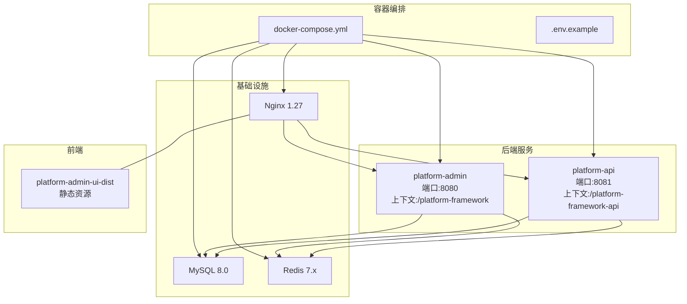
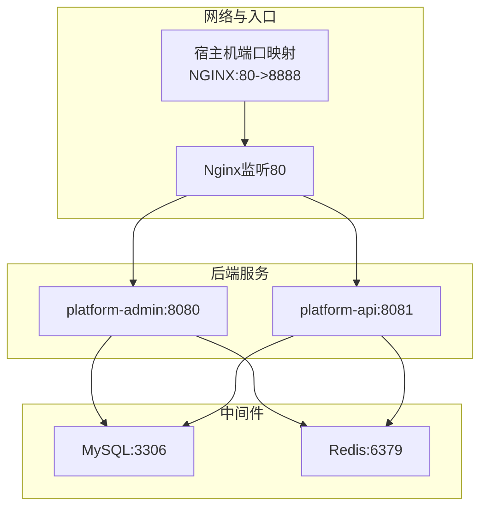
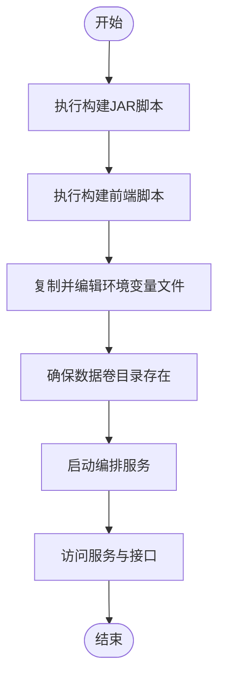
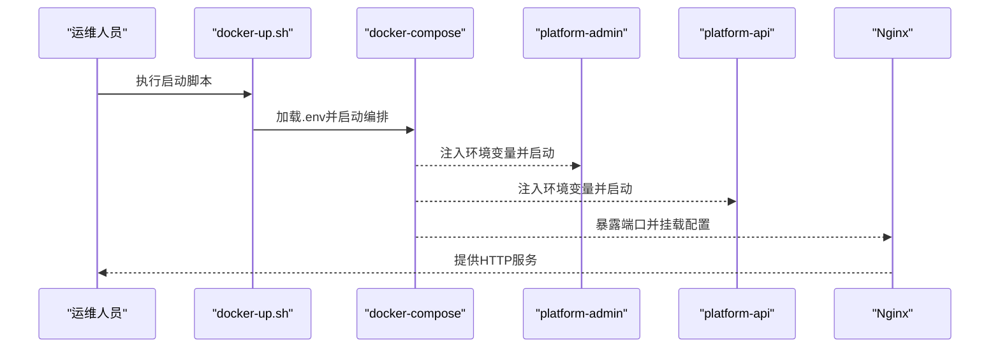
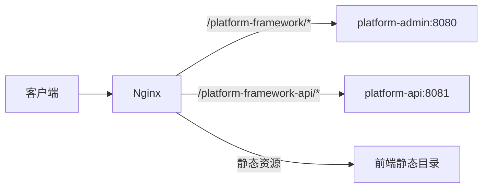
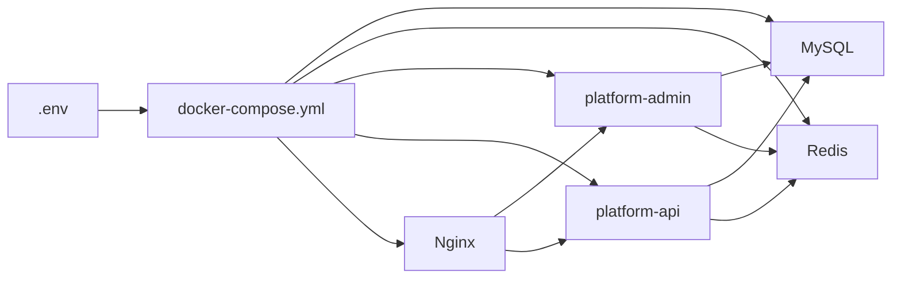

# 部署与运维

<cite>
**本文引用的文件**
- [deploy/README.md](file://deploy/README.md)
- [docker-compose.yml](file://docker-compose.yml)
- [scripts/docker-up.sh](file://scripts/docker-up.sh)
- [scripts/docker-down.sh](file://scripts/docker-down.sh)
- [scripts/build-jars.sh](file://scripts/build-jars.sh)
- [scripts/build-admin-ui.sh](file://scripts/build-admin-ui.sh)
- [deploy/.env.example](file://deploy/.env.example)
- [deploy/nginx/default.conf](file://deploy/nginx/default.conf)
- [_sql/base.sql](file://_sql/base.sql)
- [platform-admin/src/main/resources/application.yml](file://platform-admin/src/main/resources/application.yml)
- [platform-api/src/main/resources/application.yml](file://platform-api/src/main/resources/application.yml)
- [platform-admin/src/main/resources/application-dev.yml](file://platform-admin/src/main/resources/application-dev.yml)
- [platform-api/src/main/resources/application-dev.yml](file://platform-api/src/main/resources/application-dev.yml)
- [platform-admin/src/main/resources/application-docker.yml](file://platform-admin/src/main/resources/application-docker.yml)
- [platform-api/src/main/resources/application-docker.yml](file://platform-api/src/main/resources/application-docker.yml)
</cite>

## 目录
1. [简介](#简介)
2. [项目结构](#项目结构)
3. [核心组件](#核心组件)
4. [架构总览](#架构总览)
5. [详细组件分析](#详细组件分析)
6. [依赖分析](#依赖分析)
7. [性能考虑](#性能考虑)
8. [故障排查指南](#故障排查指南)
9. [结论](#结论)
10. [附录](#附录)

## 简介
本指南面向运维工程师与DevOps团队，提供平台从本地开发到生产部署的全生命周期运维参考。内容涵盖：
- 本地开发部署流程（环境准备、数据库初始化、项目启动与调试）
- Docker容器化部署（镜像构建、容器编排、环境变量与日志）
- 生产部署最佳实践（Nginx反向代理、SSL、性能与安全加固）
- 监控告警、备份恢复、故障排查
- CI/CD流水线设计、版本发布与应急响应

## 项目结构
平台采用多模块Maven工程，后端由两个Spring Boot服务组成，前端为独立的Vue项目，配合Nginx统一对外提供服务；数据库与缓存通过Docker Compose编排。

图表来源
- [docker-compose.yml:1-115](file://docker-compose.yml#L1-L115)
- [deploy/nginx/default.conf:1-28](file://deploy/nginx/default.conf#L1-L28)

章节来源
- [deploy/README.md:1-43](file://deploy/README.md#L1-L43)
- [docker-compose.yml:1-115](file://docker-compose.yml#L1-L115)
- [deploy/nginx/default.conf:1-28](file://deploy/nginx/default.conf#L1-L28)

## 核心组件
- 平台管理后台服务（platform-admin）
  - Undertow线程模型与端口、上下文路径、Swagger/Knife4j接口文档配置
  - 数据源与Redis连接配置（开发与Docker环境）
- 平台业务API服务（platform-api）
  - Undertow线程模型与端口、上下文路径、Swagger/Knife4j接口文档配置
  - 数据源与Redis连接配置（开发与Docker环境）
- Nginx反向代理
  - 路由至管理后台与API服务，静态资源托管
- MySQL与Redis
  - MySQL初始化脚本挂载，Redis持久化AOF
- 构建与编排脚本
  - JAR构建、前端打包、Docker编排启停

章节来源
- [platform-admin/src/main/resources/application.yml:1-205](file://platform-admin/src/main/resources/application.yml#L1-L205)
- [platform-api/src/main/resources/application.yml:1-195](file://platform-api/src/main/resources/application.yml#L1-L195)
- [platform-admin/src/main/resources/application-dev.yml:1-47](file://platform-admin/src/main/resources/application-dev.yml#L1-L47)
- [platform-api/src/main/resources/application-dev.yml:1-47](file://platform-api/src/main/resources/application-dev.yml#L1-L47)
- [platform-admin/src/main/resources/application-docker.yml:1-22](file://platform-admin/src/main/resources/application-docker.yml#L1-L22)
- [platform-api/src/main/resources/application-docker.yml:1-22](file://platform-api/src/main/resources/application-docker.yml#L1-L22)
- [deploy/nginx/default.conf:1-28](file://deploy/nginx/default.conf#L1-L28)

## 架构总览
下图展示容器内服务交互与外部流量走向，包括健康检查、依赖顺序与端口映射。

图表来源
- [docker-compose.yml:14-115](file://docker-compose.yml#L14-L115)
- [deploy/nginx/default.conf:1-28](file://deploy/nginx/default.conf#L1-L28)

章节来源
- [docker-compose.yml:1-115](file://docker-compose.yml#L1-L115)
- [deploy/nginx/default.conf:1-28](file://deploy/nginx/default.conf#L1-L28)

## 详细组件分析

### 本地开发部署流程
- 环境要求
  - Docker与Docker Compose
  - Maven（构建JAR）
  - Node.js（构建前端）
- 步骤
  1) 准备产物
     - 执行JAR构建脚本，产出后端服务JAR
     - 执行前端构建脚本，产出静态资源目录
  2) 初始化环境
     - 复制示例环境变量文件并按需修改
     - 确保MySQL数据卷与Redis数据卷目录存在
  3) 启动服务
     - 使用编排脚本启动，自动加载环境变量文件
  4) 访问
     - 管理后台：http://localhost:{NGINX_PORT}
     - 后台接口：http://localhost:{NGINX_PORT}/platform-framework
     - 商城接口：http://localhost:{NGINX_PORT}/platform-framework-api
- 调试建议
  - 关注Nginx日志与后端服务日志
  - 开发环境可启用Druid SQL监控页面
  - 如需切换Maven Profile，通过环境变量控制

图表来源
- [scripts/build-jars.sh:1-21](file://scripts/build-jars.sh#L1-L21)
- [scripts/build-admin-ui.sh:1-20](file://scripts/build-admin-ui.sh#L1-L20)
- [scripts/docker-up.sh:1-57](file://scripts/docker-up.sh#L1-L57)
- [deploy/.env.example:1-11](file://deploy/.env.example#L1-L11)

章节来源
- [deploy/README.md:1-43](file://deploy/README.md#L1-L43)
- [scripts/build-jars.sh:1-21](file://scripts/build-jars.sh#L1-L21)
- [scripts/build-admin-ui.sh:1-20](file://scripts/build-admin-ui.sh#L1-L20)
- [scripts/docker-up.sh:1-57](file://scripts/docker-up.sh#L1-L57)
- [deploy/.env.example:1-11](file://deploy/.env.example#L1-L11)

### Docker容器化部署
- 镜像与服务
  - MySQL 8.0：字符集、时区、健康检查
  - Redis 7.2：AOF持久化、健康检查
  - platform-admin：基于JRE镜像，挂载JAR，设置JVM参数
  - platform-api：基于JRE镜像，挂载JAR，设置JVM参数
  - Nginx 1.27：反代后端、托管前端静态资源
- 编排要点
  - 服务依赖健康检查后再启动下游
  - 端口映射可通过环境变量控制
  - 数据持久化：MySQL与Redis数据卷
- 环境变量管理
  - 通过.env文件集中管理时区、端口、数据库名、密码、JVM参数等
  - Docker profile仅覆盖数据库与Redis地址，不改变原有开发/测试/生产配置

图表来源
- [scripts/docker-up.sh:1-57](file://scripts/docker-up.sh#L1-L57)
- [docker-compose.yml:1-115](file://docker-compose.yml#L1-L115)
- [deploy/.env.example:1-11](file://deploy/.env.example#L1-L11)

章节来源
- [docker-compose.yml:1-115](file://docker-compose.yml#L1-L115)
- [scripts/docker-up.sh:1-57](file://scripts/docker-up.sh#L1-L57)
- [scripts/docker-down.sh:1-17](file://scripts/docker-down.sh#L1-L17)
- [deploy/.env.example:1-11](file://deploy/.env.example#L1-L11)

### 反向代理与路由
- Nginx配置
  - 静态首页与单页应用路由回退
  - 将管理后台请求转发至platform-admin:8080上下文
  - 将API请求转发至platform-api:8081上下文
- 建议
  - 生产环境建议启用HTTPS与限流
  - 结合上游负载均衡器实现高可用

图表来源
- [deploy/nginx/default.conf:1-28](file://deploy/nginx/default.conf#L1-L28)

章节来源
- [deploy/nginx/default.conf:1-28](file://deploy/nginx/default.conf#L1-L28)

### 数据库初始化与持久化
- 初始化
  - MySQL容器启动时自动执行挂载目录下的SQL文件（按文件名顺序）
  - 建议将基础Schema与初始数据放入挂载目录
- 持久化
  - MySQL数据目录映射至宿主机
  - Redis AOF持久化写入容器内数据目录

章节来源
- [docker-compose.yml:16-18](file://docker-compose.yml#L16-L18)
- [_sql/base.sql:1-892](file://_sql/base.sql#L1-L892)

### 配置文件与环境隔离
- 后端服务
  - 开发环境配置（本地直连localhost）
  - Docker环境配置（通过环境变量注入主机名与端口）
- 前端
  - 构建产物输出至静态目录，由Nginx托管

章节来源
- [platform-admin/src/main/resources/application-dev.yml:1-47](file://platform-admin/src/main/resources/application-dev.yml#L1-L47)
- [platform-api/src/main/resources/application-dev.yml:1-47](file://platform-api/src/main/resources/application-dev.yml#L1-L47)
- [platform-admin/src/main/resources/application-docker.yml:1-22](file://platform-admin/src/main/resources/application-docker.yml#L1-L22)
- [platform-api/src/main/resources/application-docker.yml:1-22](file://platform-api/src/main/resources/application-docker.yml#L1-L22)
- [scripts/build-admin-ui.sh:1-20](file://scripts/build-admin-ui.sh#L1-L20)

## 依赖分析
- 组件耦合
  - 后端服务依赖MySQL与Redis，通过Docker网络互通
  - Nginx依赖后端服务健康状态
- 外部依赖
  - Docker Compose、Nginx、MySQL、Redis、JRE
- 环境变量契约
  - 通过.env集中管理端口、数据库名、密码、JVM参数等

图表来源
- [docker-compose.yml:1-115](file://docker-compose.yml#L1-L115)
- [deploy/.env.example:1-11](file://deploy/.env.example#L1-L11)

章节来源
- [docker-compose.yml:1-115](file://docker-compose.yml#L1-L115)
- [deploy/.env.example:1-11](file://deploy/.env.example#L1-L11)

## 性能考虑
- 线程模型
  - Undertow IO线程与工作线程数量适配CPU核数，避免“打开文件过多”等错误
- 连接池
  - Druid连接池参数与Redis连接池参数在开发配置中已给出参考值
- JVM参数
  - 通过环境变量灵活调整堆大小与GC策略
- Nginx
  - 合理设置缓冲与压缩，结合上游限流与缓存策略

章节来源
- [platform-admin/src/main/resources/application.yml:4-18](file://platform-admin/src/main/resources/application.yml#L4-L18)
- [platform-api/src/main/resources/application.yml:4-18](file://platform-api/src/main/resources/application.yml#L4-L18)
- [platform-admin/src/main/resources/application-dev.yml:18-36](file://platform-admin/src/main/resources/application-dev.yml#L18-L36)
- [platform-api/src/main/resources/application-dev.yml:18-36](file://platform-api/src/main/resources/application-dev.yml#L18-L36)
- [deploy/.env.example:9-10](file://deploy/.env.example#L9-L10)

## 故障排查指南
- 启动失败
  - 检查JAR与前端产物是否存在
  - 确认环境变量文件是否正确复制与赋值
  - 查看各容器健康检查状态与日志
- 数据库问题
  - 确认初始化SQL文件是否正确挂载
  - 检查MySQL端口映射与凭据
- 缓存问题
  - 确认Redis端口映射与密码
- 反向代理问题
  - 检查Nginx配置与后端服务上下文路径
  - 核对静态资源目录挂载

章节来源
- [scripts/docker-up.sh:23-36](file://scripts/docker-up.sh#L23-L36)
- [scripts/docker-down.sh:1-17](file://scripts/docker-down.sh#L1-L17)
- [docker-compose.yml:19-26](file://docker-compose.yml#L19-L26)
- [docker-compose.yml:37-45](file://docker-compose.yml#L37-L45)
- [deploy/nginx/default.conf:1-28](file://deploy/nginx/default.conf#L1-L28)

## 结论
本指南提供了从本地到生产的完整部署与运维路径。通过Docker编排与环境变量集中管理，平台实现了快速部署与环境一致性；借助Nginx统一入口与后端服务上下文路由，满足多模块协同；开发与生产配置分离，便于演进与维护。建议在生产环境中进一步完善SSL、监控告警、备份恢复与CI/CD流水线。

## 附录

### 生产部署最佳实践
- Nginx反向代理
  - 启用HTTPS与证书管理（建议Let’s Encrypt）
  - 配置限流、缓存与健康检查探针
- SSL证书管理
  - 使用自动化证书签发与续期流程
- 性能优化
  - 调整Undertow线程模型与JVM参数
  - 启用连接池优化与数据库索引
- 安全加固
  - 限制Nginx访问日志与敏感头透传
  - 强密码与最小权限原则管理数据库与缓存

### 监控告警与日志
- 日志
  - 后端服务日志输出至标准输出，结合容器日志收集
  - Nginx访问与错误日志采集
- 监控
  - 服务健康检查与容器指标采集
  - 关键业务指标埋点与可视化

### 备份恢复策略
- 数据库
  - 定期快照与增量备份，验证恢复流程
- 缓存
  - AOF重写与持久化策略校验
- 配置
  - 环境变量与配置文件版本化管理

### CI/CD流水线设计
- 触发条件
  - 分支保护与PR合并触发
- 构建阶段
  - Maven构建JAR、NPM构建前端
- 测试阶段
  - 单元测试与集成测试
- 部署阶段
  - Docker镜像构建与推送
  - 编排文件部署与滚动升级
- 回滚策略
  - 版本标记与一键回滚

### 版本发布流程
- 发布分支与标签管理
- 预发布验证与灰度发布
- 发布后巡检与指标回归

### 应急响应方案
- 故障分级与响应时效
- 快速定位与修复流程
- 事后复盘与改进闭环