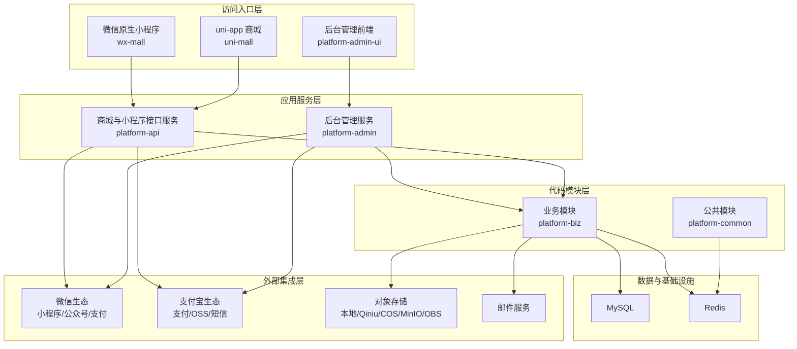
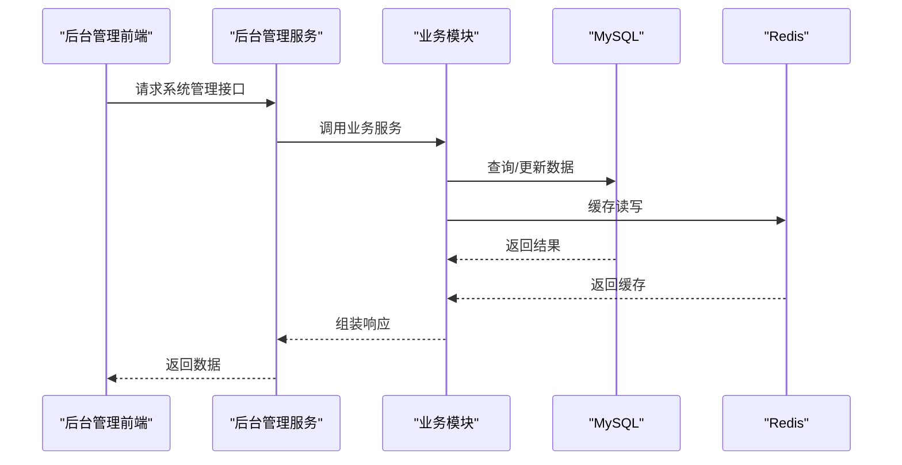
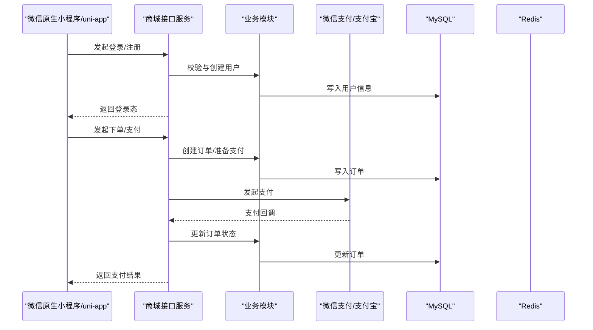
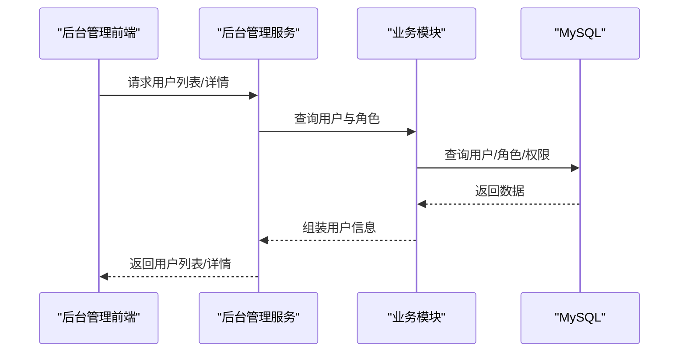
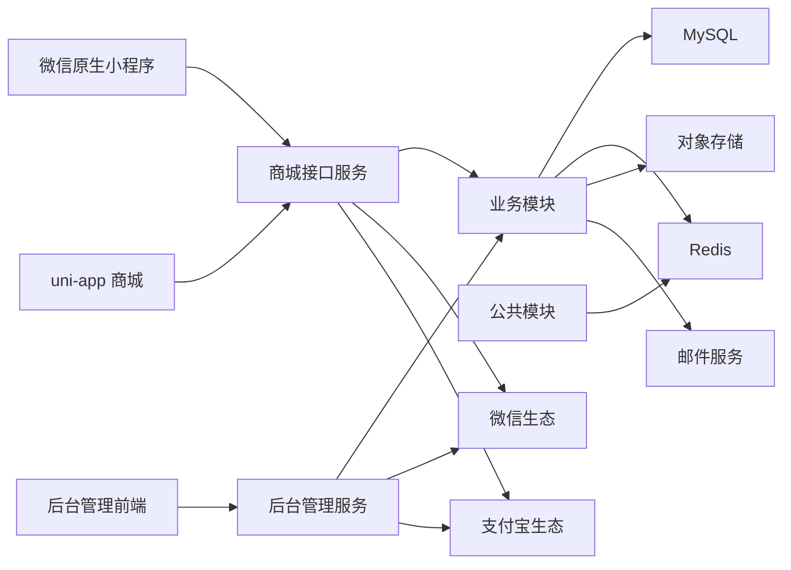
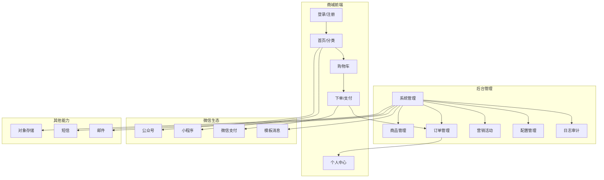

# 功能特性总览

<cite>
**本文引用的文件**
- [README.md](file://README.md)
- [系统架构说明.md](file://docs/系统架构说明.md)
- [application.yml（管理端）](file://platform-admin/src/main/resources/application.yml)
- [application.yml（商城端）](file://platform-api/src/main/resources/application.yml)
- [manifest.json（uni-app）](file://uni-mall/manifest.json)
- [app.json（微信原生小程序）](file://wx-mall/app.json)
- [MallGoodsController.java](file://platform-admin/src/main/java/com/platform/modules/mall/controller/MallGoodsController.java)
- [SysUserController.java](file://platform-admin/src/main/java/com/platform/modules/sys/controller/SysUserController.java)
- [AppGoodsController.java](file://platform-api/src/main/java/com/platform/modules/app/controller/AppGoodsController.java)
- [AppLoginController.java](file://platform-api/src/main/java/com/platform/modules/app/controller/AppLoginController.java)
- [package.json（管理端前端）](file://platform-admin-ui/package.json)
</cite>

## 目录
1. [简介](#简介)
2. [项目结构](#项目结构)
3. [核心组件](#核心组件)
4. [架构总览](#架构总览)
5. [详细组件分析](#详细组件分析)
6. [依赖分析](#依赖分析)
7. [性能考量](#性能考量)
8. [故障排查指南](#故障排查指南)
9. [结论](#结论)
10. [附录](#附录)

## 简介
本平台是一个前后端全开源的微信生态电商解决方案，采用 Java/Spring Boot 技术栈与 Vue2/Element UI 前端技术，提供统一的后台管理与多端商城能力。平台同时支持微信原生小程序与 uni-app 跨平台版本，覆盖商品管理、订单处理、用户体系、营销活动、系统管理、微信生态集成（公众号、小程序、支付、消息推送）、文件存储管理等核心能力，并具备良好的扩展性与可定制性，适用于不同规模与类型的电商需求。

## 项目结构
项目采用多模块分层设计，包含后台管理服务、商城接口服务、业务模块、公共模块以及多端前端入口，形成“多前端入口、双后端服务、共享业务核心”的整体架构。

图表来源
- [系统架构说明.md](file://docs/系统架构说明.md)
- [application.yml（管理端）](file://platform-admin/src/main/resources/application.yml)
- [application.yml（商城端）](file://platform-api/src/main/resources/application.yml)

章节来源
- [README.md](file://README.md)
- [系统架构说明.md](file://docs/系统架构说明.md)

## 核心组件
- 后台管理服务（platform-admin）
  - 负责系统管理、商品/订单/营销/配置/日志/权限等后台维护能力
  - 提供 Swagger/Knife4j 接口文档，支持按模块分组
- 商城接口服务（platform-api）
  - 负责用户登录、商品浏览、购物车、下单、支付、收货地址、优惠券等移动端能力
  - 提供移动端接口与微信服务器接口分组文档
- 业务模块（platform-biz）
  - 承载 Service、DAO、实体、DTO 与领域逻辑
  - 采用 MyBatis-Plus + XML Mapper 的数据访问方式
- 公共模块（platform-common）
  - 提供公共配置、工具类、Redis 能力、异常处理与通用安全处理
- 多端前端
  - 平台管理前端（Vue2 + Element UI）
  - 微信原生小程序（wx-mall）
  - uni-app 商城（uni-mall）

章节来源
- [application.yml（管理端）](file://platform-admin/src/main/resources/application.yml)
- [application.yml（商城端）](file://platform-api/src/main/resources/application.yml)
- [系统架构说明.md](file://docs/系统架构说明.md)

## 架构总览
平台采用“多入口 + 双后端 + 共享业务 + 外部生态集成”的架构，前后端分离，服务间通过 REST 接口交互，业务数据持久化于 MySQL，缓存使用 Redis，第三方能力通过微信、支付宝、对象存储、短信、邮件等生态对接。

图表来源
- [系统架构说明.md](file://docs/系统架构说明.md)

章节来源
- [系统架构说明.md](file://docs/系统架构说明.md)

## 详细组件分析

### 商城核心功能
- 商品管理
  - 支持商品列表、详情、规格、画廊、属性、问答、品牌等聚合数据查询
  - 后台提供商品的增删改查与聚合保存能力
- 订单处理
  - 支持下单、支付、订单列表、订单详情、物流查询等
  - 集成微信支付与支付宝支付能力
- 用户体系
  - 支持微信小程序登录、手机号授权、用户信息维护、积分与等级等
- 营销活动
  - 支持优惠券发放、兑换、使用、新人券、转券等

图表来源
- [AppLoginController.java](file://platform-api/src/main/java/com/platform/modules/app/controller/AppLoginController.java)
- [AppGoodsController.java](file://platform-api/src/main/java/com/platform/modules/app/controller/AppGoodsController.java)
- [application.yml（商城端）](file://platform-api/src/main/resources/application.yml)

章节来源
- [AppGoodsController.java](file://platform-api/src/main/java/com/platform/modules/app/controller/AppGoodsController.java)
- [AppLoginController.java](file://platform-api/src/main/java/com/platform/modules/app/controller/AppLoginController.java)
- [application.yml（商城端）](file://platform-api/src/main/resources/application.yml)

### 系统管理功能
- 用户权限
  - 系统用户增删改查、角色与组织管理、密码修改、登录信息获取
- 配置管理
  - 字典、参数、缓存、短信日志等配置能力
- 日志审计
  - 操作日志、监控、定时任务日志等

图表来源
- [SysUserController.java](file://platform-admin/src/main/java/com/platform/modules/sys/controller/SysUserController.java)
- [application.yml（管理端）](file://platform-admin/src/main/resources/application.yml)

章节来源
- [SysUserController.java](file://platform-admin/src/main/java/com/platform/modules/sys/controller/SysUserController.java)
- [application.yml（管理端）](file://platform-admin/src/main/resources/application.yml)

### 微信生态集成
- 公众号与小程序
  - 登录授权、用户信息、手机号授权、JS-SDK 签名等
- 支付
  - 微信支付与支付宝支付配置与回调
- 消息推送
  - 模板消息与关键词回复规则管理

章节来源
- [application.yml（管理端）](file://platform-admin/src/main/resources/application.yml)
- [application.yml（商城端）](file://platform-api/src/main/resources/application.yml)
- [manifest.json（uni-app）](file://uni-mall/manifest.json)
- [app.json（微信原生小程序）](file://wx-mall/app.json)

### 文件存储管理
- 支持本地存储与多家云存储（七牛云、腾讯 COS、MinIO、华为 OBS）
- 提供上传组件与配置界面

章节来源
- [application.yml（管理端）](file://platform-admin/src/main/resources/application.yml)
- [application.yml（商城端）](file://platform-api/src/main/resources/application.yml)

### 多端适配能力对比
- 微信原生小程序（wx-mall）
  - 页面路由、TabBar、Agent 技能、插件集成、分包加载等
- uni-app 版本（uni-mall）
  - 多端编译、模块化、支付/分享/定位/广告等 SDK 配置
- 两者均通过 platform-api 提供统一接口能力

章节来源
- [manifest.json（uni-app）](file://uni-mall/manifest.json)
- [app.json（微信原生小程序）](file://wx-mall/app.json)

## 依赖分析
- 服务间依赖
  - platform-admin 与 platform-api 均依赖 platform-biz
  - platform-biz 依赖 platform-common
- 数据与缓存
  - 业务模块依赖 MySQL 与 Redis
- 外部集成
  - 商城接口服务与后台管理服务共同对接微信、支付宝、对象存储、短信、邮件等

图表来源
- [系统架构说明.md](file://docs/系统架构说明.md)

章节来源
- [系统架构说明.md](file://docs/系统架构说明.md)

## 性能考量
- 服务端
  - Undertow 线程模型与静态资源配置，合理设置 IO 线程与工作线程数量
  - MyBatis-Plus XML Mapper 优化与分页查询
- 缓存
  - Redis 连接池配置与热点数据缓存策略
- 外部集成
  - 微信/支付宝回调地址一致性与证书配置，避免重复回调与签名失败

## 故障排查指南
- 查询与列表类问题
  - 按前端请求参数 → controller 入参 → service 调用路径 → DAO 接口 → XML mapper 条件与结果映射顺序排查
- 权限与登录问题
  - 区分后台链路（Shiro/OAuth2）与用户侧链路（JWT/LoginUser），核对 token 与用户注入
- 第三方集成问题
  - 核对应用配置、证书/密钥、回调地址与第三方账号环境

章节来源
- [系统架构说明.md](file://docs/系统架构说明.md)

## 结论
本平台以清晰的分层架构与完善的多端能力，覆盖电商核心业务与微信生态集成，具备良好的扩展性与可定制性，能够满足从个人学习到商业化落地的不同场景需求。通过统一的后台管理与接口服务，结合灵活的前端版本（原生小程序与 uni-app），可快速构建并迭代电商应用。

## 附录
- 功能全景图（概念示意）
