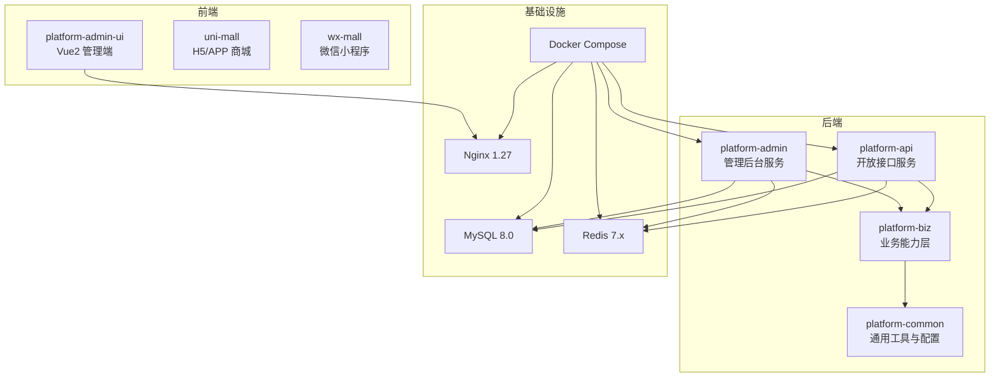
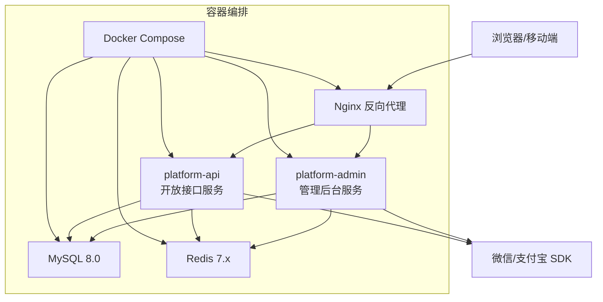
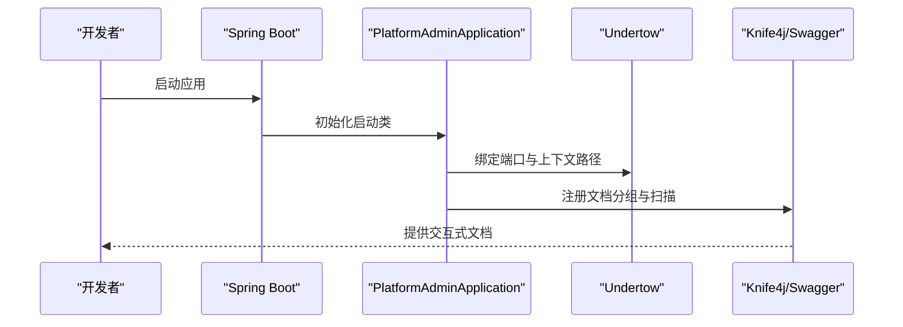
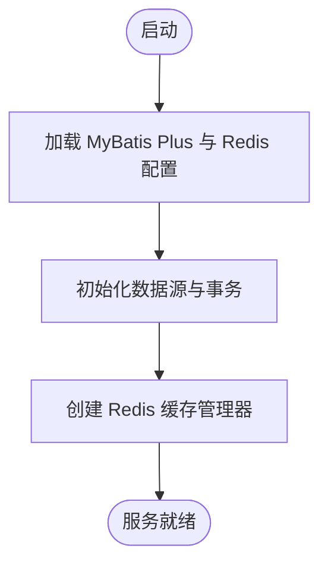
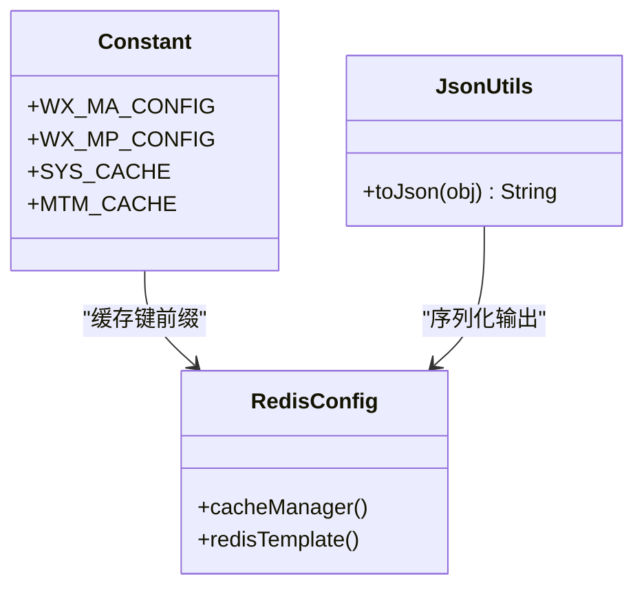
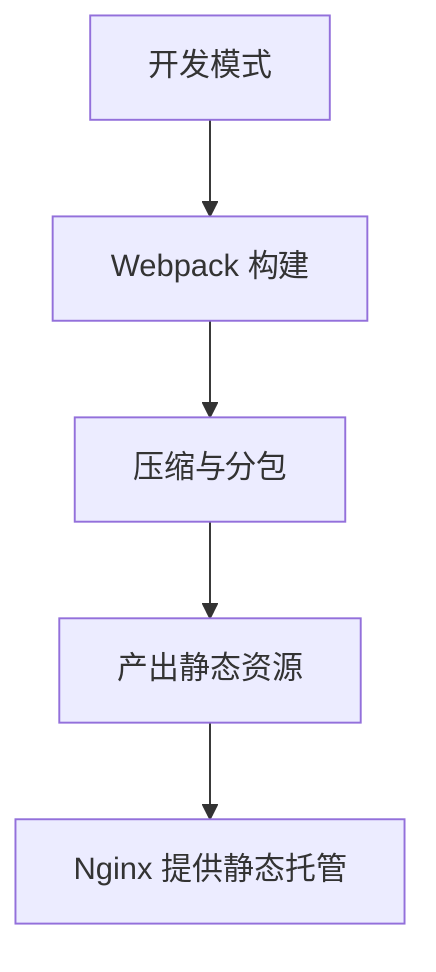
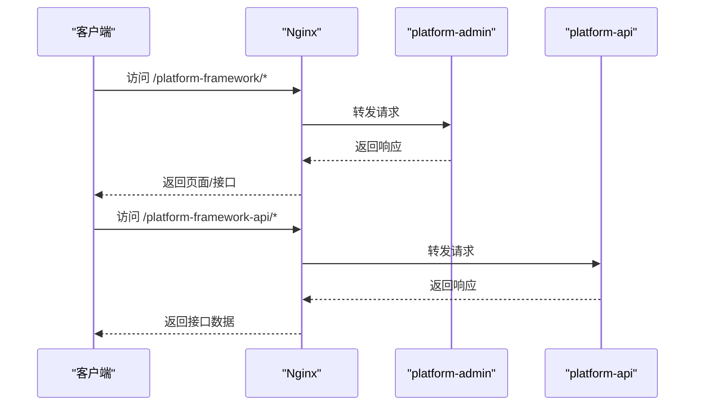
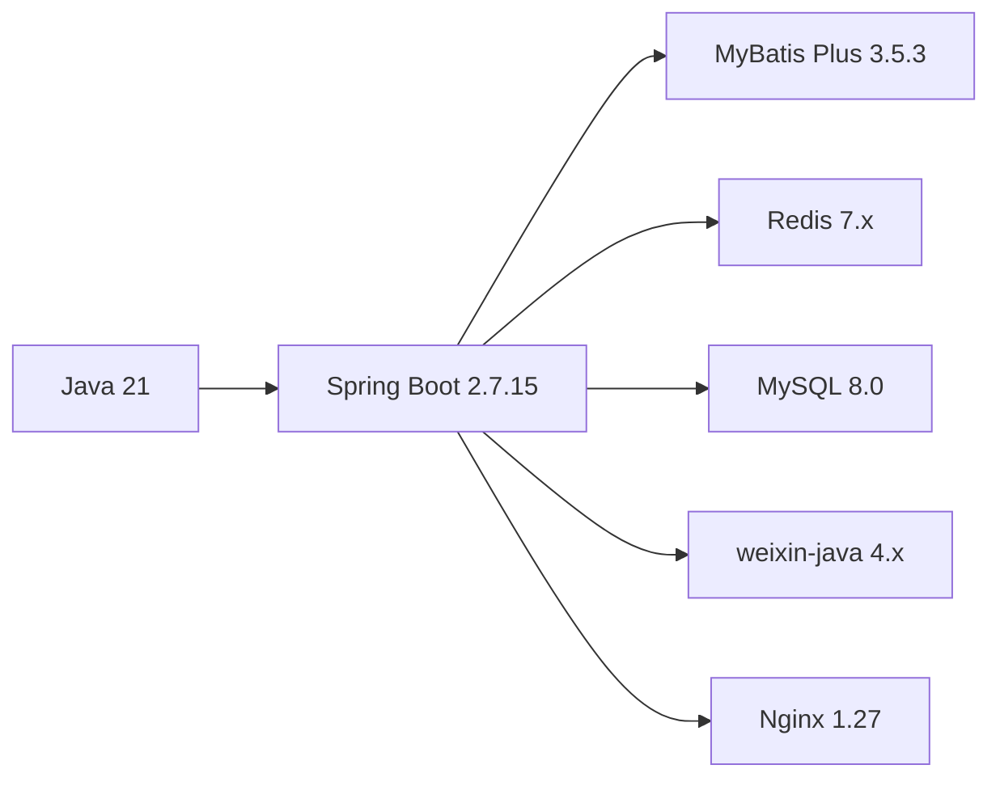

# 技术栈概览

<cite>
**本文引用的文件**
- [README.md](file://README.md)
- [pom.xml](file://pom.xml)
- [platform-admin/pom.xml](file://platform-admin/pom.xml)
- [platform-admin/src/main/java/com/platform/PlatformAdminApplication.java](file://platform-admin/src/main/java/com/platform/PlatformAdminApplication.java)
- [platform-api/src/main/java/com/platform/PlatformApiApplication.java](file://platform-api/src/main/java/com/platform/PlatformApiApplication.java)
- [platform-admin/src/main/resources/application.yml](file://platform-admin/src/main/resources/application.yml)
- [platform-common/src/main/java/com/platform/config/RedisConfig.java](file://platform-common/src/main/java/com/platform/config/RedisConfig.java)
- [platform-common/src/main/java/com/platform/common/utils/Constant.java](file://platform-common/src/main/java/com/platform/common/utils/Constant.java)
- [platform-common/src/main/java/com/platform/common/utils/JsonUtils.java](file://platform-common/src/main/java/com/platform/common/utils/JsonUtils.java)
- [platform-admin-ui/package.json](file://platform-admin-ui/package.json)
- [platform-admin-ui/build/webpack.prod.conf.js](file://platform-admin-ui/build/webpack.prod.conf.js)
- [platform-admin-ui/src/main.js](file://platform-admin-ui/src/main.js)
- [platform-admin-ui/src/App.vue](file://platform-admin-ui/src/App.vue)
- [docker-compose.yml](file://docker-compose.yml)
- [deploy/nginx/default.conf](file://deploy/nginx/default.conf)
</cite>

## 更新摘要
**变更内容**
- 新增"技术站"部分的集中技术栈展示，突出SpringBoot、Vue2、ElementUI等核心技术要求
- 更新技术栈选择理由和优势分析，强调技术组合的协同效应
- 补充前端技术栈的详细实现细节，包括Vue2生命周期、Element UI组件体系
- 完善微信生态集成的技术要求，涵盖weixin-java 4.5.2版本的具体应用场景

## 目录
1. [引言](#引言)
2. [技术站：集中展示的核心技术栈](#技术站集中展示的核心技术栈)
3. [项目结构](#项目结构)
4. [核心组件](#核心组件)
5. [架构总览](#架构总览)
6. [详细组件分析](#详细组件分析)
7. [依赖分析](#依赖分析)
8. [性能考虑](#性能考虑)
9. [故障排查指南](#故障排查指南)
10. [结论](#结论)
11. [附录](#附录)

## 引言
本技术栈概览面向平台项目，系统性阐述后端与前端技术选型、微信生态集成、容器化与反向代理等运维方案，并给出对比分析、性能考量与学习路径建议。目标是帮助开发者快速理解并高效落地项目。

**更新** 新增"技术站"部分，集中展示SpringBoot、Vue2、ElementUI等核心技术要求，体现技术栈的统一性和协同性。

## 技术站：集中展示的核心技术栈

平台采用"技术站"模式，将核心技术栈信息集中展示，确保技术选型的一致性和可维护性。

### 后端技术栈
- **SpringBoot 2.7.15**：基于Spring Framework 5.3.x，提供自动配置、起步依赖和生产就绪特性，简化应用开发与部署
- **Java 21**：采用最新长期支持版本，提供更好的性能、安全性与语言特性支持
- **MyBatis Plus 3.5.3**：在MyBatis基础上增强，提供代码生成、条件构造器、分页插件等高级特性
- **Redis 4.0+**：高性能内存数据结构存储，支持多种数据类型和持久化选项
- **MySQL 8.0**：企业级关系型数据库，支持JSON、窗口函数、增强的安全机制

### 前端技术栈  
- **Vue2 + Element UI**：成熟的中后台管理系统技术栈，Vue2提供响应式数据绑定，Element UI提供丰富的UI组件
- **Webpack**：模块化构建工具，支持代码分割、懒加载和开发服务器热更新
- **ES6+**：现代化JavaScript语法，提供更好的开发体验和代码可维护性

### 微信生态集成
- **weixin-java 4.5.2**：完整的微信生态SDK，支持公众号、小程序、支付、开放平台等全方位能力
- **支付宝SDK**：提供小程序与网页支付对接能力，支持多种支付场景

**章节来源**
- [README.md:19-22](file://README.md#L19-L22)
- [README.md:10-15](file://README.md#L10-L15)
- [pom.xml:81](file://pom.xml#L81)

## 项目结构
平台采用多模块 Maven 聚合工程组织，包含通用层、后台服务、API 服务、业务层及前后端 UI 工程；同时提供 Docker Compose 编排与 Nginx 反向代理部署方案。

**图表来源**
- [pom.xml:42-47](file://pom.xml#L42-L47)
- [docker-compose.yml:1-115](file://docker-compose.yml#L1-L115)

**章节来源**
- [pom.xml:42-47](file://pom.xml#L42-L47)
- [docker-compose.yml:1-115](file://docker-compose.yml#L1-L115)

## 核心组件
- **后端技术栈**
  - **Java 21**：面向未来的高性能运行时，具备更强的垃圾回收与并发能力。
  - **Spring Boot 2.7.15**：约定优于配置，简化应用初始化与外部化配置。
  - **MyBatis Plus 3.5.3**：提升数据访问效率，内置分页、逻辑删除、自动填充等特性。
  - **Redis 4.0+**：高并发缓存与会话存储，结合 Jedis 客户端与连接池优化。
  - **MySQL 8.0**：稳定的企业级关系型数据库，支持 JSON、窗口函数与更强安全机制。
- **前端技术栈**
  - **Vue2 + Element UI**：成熟稳定的中后台 UI 生态，组件丰富、文档完善。
  - **Webpack**：构建与打包工具链，配合生产环境压缩与分包策略。
- **微信生态集成**
  - **weixin-java 系列 SDK**：覆盖公众号、小程序、支付、开放平台与企业微信能力。
  - **支付宝 SDK**：提供小程序与网页支付对接能力。
- **运维与部署**
  - **Docker 容器化**：统一镜像与编排，隔离环境差异。
  - **Nginx 反向代理**：静态资源分发与后端服务路由转发。

**章节来源**
- [pom.xml:36-40](file://pom.xml#L36-L40)
- [pom.xml:52-56](file://pom.xml#L52-L56)
- [pom.xml:178-187](file://pom.xml#L178-L187)
- [pom.xml:332-364](file://pom.xml#L332-L364)
- [platform-admin/src/main/resources/application.yml:81-99](file://platform-admin/src/main/resources/application.yml#L81-L99)
- [platform-admin/src/main/resources/application.yml:169-205](file://platform-admin/src/main/resources/application.yml#L169-L205)
- [docker-compose.yml:103-115](file://docker-compose.yml#L103-L115)

## 架构总览
下图展示平台整体架构：Nginx 作为统一入口，将管理后台与 API 请求分别代理到对应后端服务；后端服务通过 MyBatis Plus 访问 MySQL，使用 Redis 提升读写性能；微信与支付宝相关能力在业务层按需集成。

**图表来源**
- [deploy/nginx/default.conf:1-28](file://deploy/nginx/default.conf#L1-L28)
- [docker-compose.yml:1-115](file://docker-compose.yml#L1-L115)

**章节来源**
- [deploy/nginx/default.conf:11-25](file://deploy/nginx/default.conf#L11-L25)
- [docker-compose.yml:47-101](file://docker-compose.yml#L47-L101)

## 详细组件分析

### 后端应用启动与配置
- **启动类职责**
  - 管理后台与 API 服务均基于 Spring Boot 启动，分别暴露健康检查与 API 文档入口。
  - 管理后台排除默认安全自动装配，便于自定义鉴权；API 服务启用异步与自定义安全配置。
- **Undertow 与上下文路径**
  - 管理后台使用 Undertow 作为嵌入式 Web 容器，配置 IO/Worker 线程与缓冲参数，上下文路径为 /platform-framework。
  - API 服务同样采用 Undertow，上下文路径为 /platform-framework-api。
- **Swagger/OpenAPI 与 Knife4j**
  - 使用 springdoc-openapi 与 knife4j 提供交互式文档，按模块分组扫描控制器包。

**图表来源**
- [platform-admin/src/main/java/com/platform/PlatformAdminApplication.java:49-77](file://platform-admin/src/main/java/com/platform/PlatformAdminApplication.java#L49-L77)
- [platform-admin/src/main/resources/application.yml:22-67](file://platform-admin/src/main/resources/application.yml#L22-L67)

**章节来源**
- [platform-admin/src/main/java/com/platform/PlatformAdminApplication.java:49-77](file://platform-admin/src/main/java/com/platform/PlatformAdminApplication.java#L49-L77)
- [platform-api/src/main/java/com/platform/PlatformApiApplication.java:49-77](file://platform-api/src/main/java/com/platform/PlatformApiApplication.java#L49-L77)
- [platform-admin/src/main/resources/application.yml:22-67](file://platform-admin/src/main/resources/application.yml#L22-L67)

### 数据访问与缓存
- **MyBatis Plus 配置**
  - Mapper 扫描路径、实体别名包、驼峰映射、逻辑删除字段与全局配置等集中于 application.yml。
- **Redis 配置**
  - 通过 RedisConfig 统一配置连接工厂、序列化策略、缓存管理器与 Key 生成策略，支持 Jedis 连接池参数调优。

**图表来源**
- [platform-admin/src/main/resources/application.yml:114-142](file://platform-admin/src/main/resources/application.yml#L114-L142)
- [platform-common/src/main/java/com/platform/config/RedisConfig.java:91-100](file://platform-common/src/main/java/com/platform/config/RedisConfig.java#L91-L100)

**章节来源**
- [platform-admin/src/main/resources/application.yml:114-142](file://platform-admin/src/main/resources/application.yml#L114-L142)
- [platform-common/src/main/java/com/platform/config/RedisConfig.java:91-100](file://platform-common/src/main/java/com/platform/config/RedisConfig.java#L91-L100)

### 微信生态集成
- **weixin-java SDK 集成**
  - 公众号、小程序、支付、开放平台与企业微信相关依赖均已引入，便于在业务层扩展。
- **配置要点**
  - 在 application.yml 中提供公众号与小程序的基础配置项，如 appId、secret、token、aesKey 等。
  - 支付相关配置包含商户号、密钥、证书路径与回调地址，确保支付流程闭环。
- **常量与工具**
  - Constant 中定义了微信相关配置键与缓存前缀，JsonUtils 提供 JSON 序列化辅助。

**图表来源**
- [platform-common/src/main/java/com/platform/common/utils/Constant.java:152-154](file://platform-common/src/main/java/com/platform/common/utils/Constant.java#L152-L154)
- [platform-common/src/main/java/com/platform/common/utils/JsonUtils.java:27-34](file://platform-common/src/main/java/com/platform/common/utils/JsonUtils.java#L27-L34)
- [platform-common/src/main/java/com/platform/config/RedisConfig.java:91-100](file://platform-common/src/main/java/com/platform/config/RedisConfig.java#L91-L100)

**章节来源**
- [pom.xml:332-364](file://pom.xml#L332-L364)
- [platform-admin/src/main/resources/application.yml:169-205](file://platform-admin/src/main/resources/application.yml#L169-L205)
- [platform-common/src/main/java/com/platform/common/utils/Constant.java:152-154](file://platform-common/src/main/java/com/platform/common/utils/Constant.java#L152-L154)
- [platform-common/src/main/java/com/platform/common/utils/JsonUtils.java:27-34](file://platform-common/src/main/java/com/platform/common/utils/JsonUtils.java#L27-L34)

### 前端技术栈与构建
- **Vue2 + Element UI**
  - 依赖版本与脚手架配置明确，支持路由、状态管理与常用 UI 组件。
  - Vue2提供响应式数据绑定和组件化开发，Element UI提供丰富的中后台组件库。
- **Webpack 构建**
  - 生产环境启用 CSS/JS 分离、压缩与 Tree-shaking；分包策略减少首屏体积。
- **开发体验**
  - ESLint 规则与热更新服务，提升开发效率与代码质量。

**图表来源**
- [platform-admin-ui/package.json:8-13](file://platform-admin-ui/package.json#L8-L13)
- [platform-admin-ui/build/webpack.prod.conf.js:77-120](file://platform-admin-ui/build/webpack.prod.conf.js#L77-L120)

**章节来源**
- [platform-admin-ui/package.json:14-36](file://platform-admin-ui/package.json#L14-L36)
- [platform-admin-ui/build/webpack.prod.conf.js:77-120](file://platform-admin-ui/build/webpack.prod.conf.js#L77-L120)

### 容器化与反向代理
- **Docker Compose**
  - MySQL 8.0、Redis 7.x、管理后台、API 服务与 Nginx 服务编排，统一环境变量与卷挂载。
  - 服务健康检查保障启动顺序与可用性。
- **Nginx 反向代理**
  - 将 /platform-framework 与 /platform-framework-api 路由分别转发至管理后台与 API 服务，支持静态资源回退与头部透传。

**图表来源**
- [docker-compose.yml:47-101](file://docker-compose.yml#L47-101)
- [deploy/nginx/default.conf:11-25](file://deploy/nginx/default.conf#L11-L25)

**章节来源**
- [docker-compose.yml:28-45](file://docker-compose.yml#L28-L45)
- [docker-compose.yml:103-115](file://docker-compose.yml#L103-L115)
- [deploy/nginx/default.conf:11-25](file://deploy/nginx/default.conf#L11-L25)

## 依赖分析
- **版本与兼容性**
  - Java 21 与 Spring Boot 2.7.15 组合在 LTS 与稳定性之间取得平衡；MyBatis Plus 3.5.3 提供良好 ORM 能力。
  - weixin-java 4.x 系列与微信生态保持同步，便于后续升级。
- **外部依赖**
  - Redis 与 MySQL 作为核心存储；Nginx 提供统一入口与静态资源服务。
- **模块耦合**
  - platform-admin 与 platform-api 通过共享的 platform-biz 与 platform-common 解耦，便于独立演进与测试。

**图表来源**
- [pom.xml:36-40](file://pom.xml#L36-L40)
- [pom.xml:52-56](file://pom.xml#L52-L56)
- [pom.xml:178-187](file://pom.xml#L178-L187)
- [pom.xml:332-364](file://pom.xml#L332-L364)
- [docker-compose.yml:103-115](file://docker-compose.yml#L103-L115)

**章节来源**
- [pom.xml:36-40](file://pom.xml#L36-L40)
- [pom.xml:52-56](file://pom.xml#L52-L56)
- [pom.xml:178-187](file://pom.xml#L178-L187)
- [pom.xml:332-364](file://pom.xml#L332-L364)

## 性能考虑
- **JVM 与容器**
  - 使用 Eclipse Temurin 21 JRE，结合 JAVA_OPTS 控制堆大小，满足不同环境资源约束。
- **Web 容器**
  - Undertow 线程模型与缓冲区配置需根据并发与 IO 特性调优，避免文件句柄耗尽。
- **数据层**
  - MyBatis Plus 合理使用逻辑删除与自动填充，减少重复 SQL；Redis 缓存热点数据，降低数据库压力。
- **网络与静态资源**
  - Nginx 提供静态资源缓存与 gzip 压缩，缩短首屏加载时间。
- **构建优化**
  - Webpack 分包与压缩策略降低包体积，提升加载速度。

**章节来源**
- [docker-compose.yml:58-69](file://docker-compose.yml#L58-L69)
- [platform-admin/src/main/resources/application.yml:4-18](file://platform-admin/src/main/resources/application.yml#L4-L18)
- [platform-admin-ui/build/webpack.prod.conf.js:77-120](file://platform-admin-ui/build/webpack.prod.conf.js#L77-L120)

## 故障排查指南
- **启动与健康检查**
  - Docker Compose 中 MySQL 与 Redis 的健康检查失败会导致服务延迟启动，需检查密码、端口与卷挂载。
- **端口冲突**
  - 若本地端口占用，调整 docker-compose 或 Nginx 映射端口。
- **跨域与代理**
  - Nginx 反代需正确透传 Host、X-Real-IP、X-Forwarded-For、X-Forwarded-Proto 等头，避免鉴权与重定向异常。
- **缓存与会话**
  - Redis 连接参数（超时、池大小）需与业务峰值匹配，避免阻塞与抖动。
- **日志与可观测性**
  - 启动类输出 API 文档地址与基础信息，便于快速定位服务入口。

**章节来源**
- [docker-compose.yml:19-26](file://docker-compose.yml#L19-L26)
- [deploy/nginx/default.conf:11-25](file://deploy/nginx/default.conf#L11-L25)
- [platform-common/src/main/java/com/platform/config/RedisConfig.java:154-180](file://platform-common/src/main/java/com/platform/config/RedisConfig.java#L154-L180)
- [platform-admin/src/main/java/com/platform/PlatformAdminApplication.java:79-90](file://platform-admin/src/main/java/com/platform/PlatformAdminApplication.java#L79-L90)

## 结论
平台采用"Java 21 + Spring Boot + MyBatis Plus + Redis + MySQL"的后端技术栈，搭配 Vue2 + Element UI + Webpack 的前端体系，并通过 weixin-java 与 Nginx/Docker 完整覆盖微信生态与容器化部署。该组合在易用性、性能与可维护性之间取得良好平衡，适合中大型企业级后台与电商/微信生态项目。

**更新** "技术站"模式确保了技术栈的统一性和一致性，SpringBoot、Vue2、ElementUI等核心技术要求得到集中展示和强化，体现了技术栈组合的协同效应和最佳实践。

## 附录
- **学习路径建议**
  - **后端**：掌握 Spring Boot 自动装配原理、MyBatis Plus 常用特性、Redis 读写策略与连接池配置、Docker 基础与 compose 编排。
  - **前端**：熟悉 Vue2 生命周期与组件通信、Element UI 常用组件、Webpack 构建优化与性能分析。
  - **微信生态**：从公众号/小程序接入到支付回调，逐步完成消息加解密、模板消息与支付流程验证。
- **最佳实践**
  - **后端**：统一异常处理、参数校验、接口幂等与限流；缓存双写一致性；数据库索引与慢查询治理。
  - **前端**：组件化与模块化、按需加载与懒加载、构建产物分析与 CDN 配置。
  - **运维**：灰度发布、蓝绿部署、健康检查与告警、日志聚合与链路追踪。

**章节来源**
- [README.md:39-43](file://README.md#L39-L43)