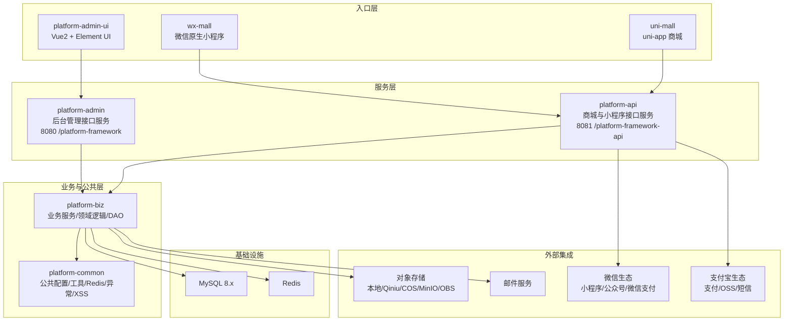
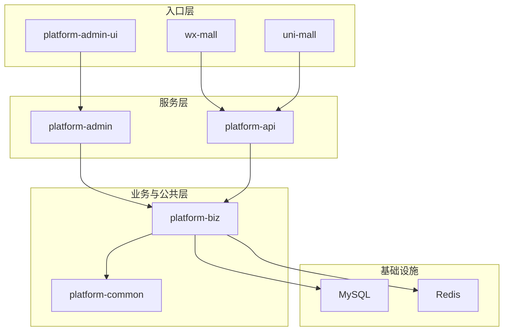
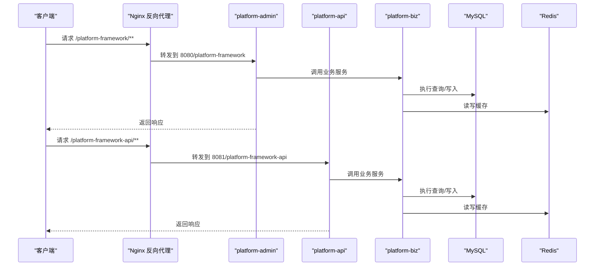
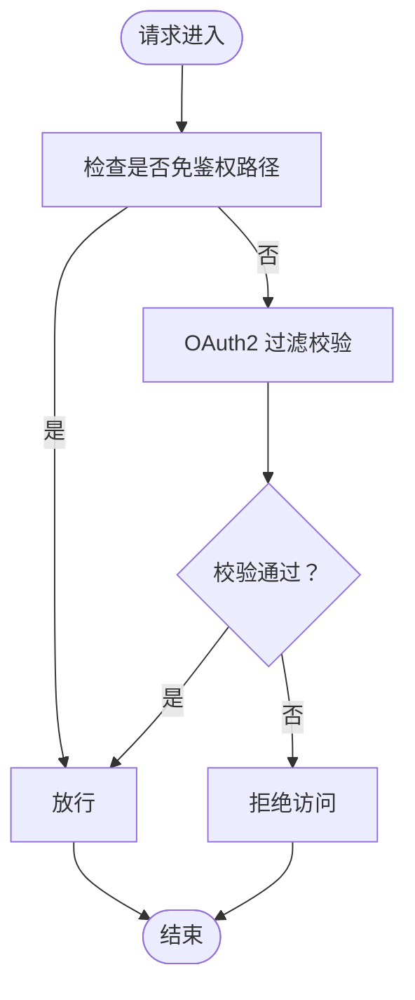
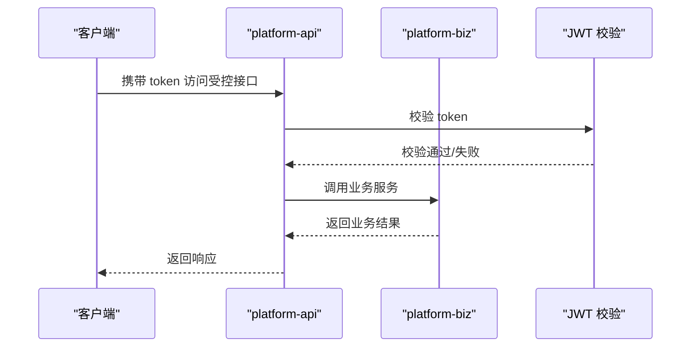
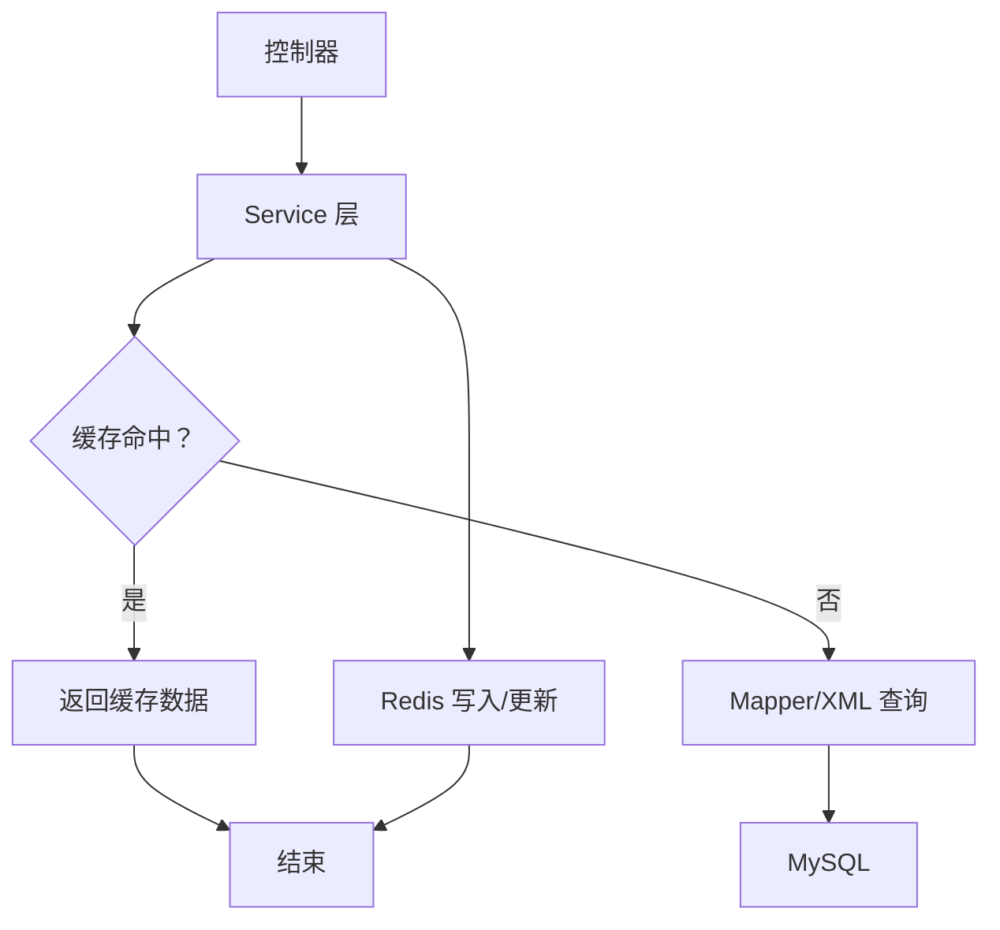
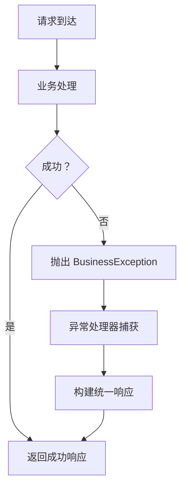
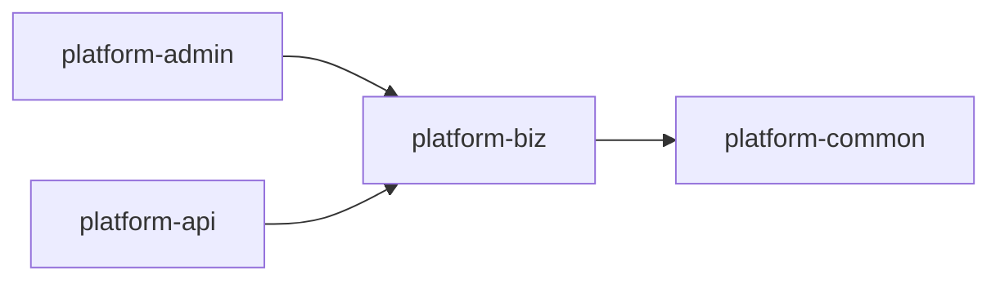

# 架构设计理念

<cite>
**本文引用的文件**
- [platform-admin 启动类](file://platform-admin/src/main/java/com/platform/PlatformAdminApplication.java)
- [platform-api 启动类](file://platform-api/src/main/java/com/platform/PlatformApiApplication.java)
- [平台聚合 POM](file://pom.xml)
- [platform-admin 配置](file://platform-admin/src/main/resources/application.yml)
- [platform-api 配置](file://platform-api/src/main/resources/application.yml)
- [platform-biz 模块 POM](file://platform-biz/pom.xml)
- [platform-common 模块 POM](file://platform-common/pom.xml)
- [Shiro 安全配置](file://platform-admin/src/main/java/com/platform/config/ShiroConfig.java)
- [系统架构说明](file://docs/系统架构说明.md)
- [平台 README](file://README.md)
- [docker-compose 编排](file://docker-compose.yml)
- [Nginx 反向代理](file://deploy/nginx/default.conf)
- [平台公共常量](file://platform-common/src/main/java/com/platform/common/utils/Constant.java)
- [业务异常定义](file://platform-common/src/main/java/com/platform/common/exception/BusinessException.java)
- [后台用户控制器示例](file://platform-admin/src/main/java/com/platform/modules/sys/controller/SysUserController.java)
- [商城首页控制器示例](file://platform-api/src/main/java/com/platform/modules/app/controller/AppIndexController.java)
- [平台前端包配置](file://platform-admin-ui/package.json)
</cite>

## 目录
1. [引言](#引言)
2. [项目结构](#项目结构)
3. [核心组件](#核心组件)
4. [架构总览](#架构总览)
5. [详细组件分析](#详细组件分析)
6. [依赖分析](#依赖分析)
7. [性能考量](#性能考量)
8. [故障排查指南](#故障排查指南)
9. [结论](#结论)
10. [附录](#附录)

## 引言
本项目采用前后端分离与多入口协同的现代化架构，围绕“双后端服务 + 共享业务核心 + 多前端入口”的设计思想构建。平台通过 Spring Boot + Undertow 容器提供高性能服务，结合 MyBatis-Plus + XML Mapper 的数据访问策略，配合 Redis 缓存与多种外部集成（微信生态、支付宝生态、对象存储、短信、邮件），形成稳定的企业级解决方案。本文档系统阐述平台的设计理念、模块职责、交互关系与扩展实践，帮助开发者快速理解并高效扩展。

## 项目结构
平台采用 Maven 多模块聚合工程，按“入口层-服务层-业务层-公共层-基础设施-外部集成”的分层组织方式，模块间职责清晰、耦合度低，便于独立演进与团队协作。

图表来源
- [系统架构说明](file://docs/系统架构说明.md)
- [docker-compose 编排](file://docker-compose.yml)
- [Nginx 反向代理](file://deploy/nginx/default.conf)

章节来源
- [平台聚合 POM](file://pom.xml)
- [platform-admin 配置](file://platform-admin/src/main/resources/application.yml)
- [platform-api 配置](file://platform-api/src/main/resources/application.yml)
- [系统架构说明](file://docs/系统架构说明.md)

## 核心组件
- 平台入口与启动
  - platform-admin 与 platform-api 分别作为后台管理与商城/小程序的对外服务入口，均基于 Spring Boot 启动，内置 Undertow 容器，提升并发与稳定性。
  - 两服务通过不同的 context-path 与端口对外提供 API，便于 Nginx 统一反代与路由。
- 安全与鉴权
  - 后台管理端采用 Shiro + OAuth2 进行统一鉴权与权限控制；用户登录后通过令牌访问受控接口。
  - 商城端采用 JWT 机制，结合登录用户上下文注入，简化移动端与小程序的无状态访问。
- 数据与缓存
  - MyBatis-Plus + XML Mapper 承载复杂查询、分页与联表逻辑；Redis 用于缓存、验证码与会话加速。
- 外部集成
  - 微信生态（小程序/公众号/支付）、支付宝生态（支付/OSS/短信）、对象存储（本地/Qiniu/COS/MinIO/OBS）、邮件服务等能力贯穿业务流程。
- 前端与多端
  - platform-admin-ui 基于 Vue2/Element UI；wx-mall 与 uni-mall 分别面向微信原生小程序与跨端应用，三端通过统一后端服务提供一致的业务能力。

章节来源
- [platform-admin 启动类](file://platform-admin/src/main/java/com/platform/PlatformAdminApplication.java)
- [platform-api 启动类](file://platform-api/src/main/java/com/platform/PlatformApiApplication.java)
- [Shiro 安全配置](file://platform-admin/src/main/java/com/platform/config/ShiroConfig.java)
- [platform-admin 配置](file://platform-admin/src/main/resources/application.yml)
- [platform-api 配置](file://platform-api/src/main/resources/application.yml)

## 架构总览
平台采用“多入口 + 双后端 + 共享业务 + 多外部集成”的总体架构，强调：
- 分层清晰：入口层负责交互，服务层负责编排，业务层承载领域逻辑，公共层提供横切能力。
- 解耦协作：通过模块化依赖与统一的 DTO/Service 层，降低模块间耦合。
- 可扩展性：模块边界明确，便于按需扩展新功能或替换第三方能力。
- 高可用与可观测：容器化部署、反向代理、健康检查与日志输出，支撑生产级运维。

图表来源
- [系统架构说明](file://docs/系统架构说明.md)
- [platform-admin 配置](file://platform-admin/src/main/resources/application.yml)
- [platform-api 配置](file://platform-api/src/main/resources/application.yml)

## 详细组件分析

### 平台启动与运行时
- 启动类特性
  - platform-admin 与 platform-api 均继承 SpringBootServletInitializer，支持打包为可部署的 WAR/JAR。
  - 通过排除默认 Tomcat、引入 Undertow，提升 IO 线程与工作线程配置灵活性，适配高并发场景。
  - 启动后输出 API 与文档地址，便于快速验证服务状态。
- 运行时配置
  - 两服务分别绑定不同端口与 context-path，避免冲突；同时通过 Nginx 进行统一入口与静态资源托管。

图表来源
- [platform-admin 启动类](file://platform-admin/src/main/java/com/platform/PlatformAdminApplication.java)
- [platform-api 启动类](file://platform-api/src/main/java/com/platform/PlatformApiApplication.java)
- [Nginx 反向代理](file://deploy/nginx/default.conf)
- [docker-compose 编排](file://docker-compose.yml)

章节来源
- [platform-admin 启动类](file://platform-admin/src/main/java/com/platform/PlatformAdminApplication.java)
- [platform-api 启动类](file://platform-api/src/main/java/com/platform/PlatformApiApplication.java)
- [platform-admin 配置](file://platform-admin/src/main/resources/application.yml)
- [platform-api 配置](file://platform-api/src/main/resources/application.yml)
- [Nginx 反向代理](file://deploy/nginx/default.conf)

### 安全与鉴权（后台管理端）
- 认证与授权
  - 通过 Shiro + OAuth2 实现统一认证与权限拦截，开放特定路径（如登录、验证码、Swagger）无需鉴权。
  - 会话管理与生命周期管理由 Shiro 管理，确保会话安全与失效策略。
- 控制器权限
  - 控制器方法通过注解声明所需权限，结合 Shiro 过滤链生效，保证细粒度授权。

图表来源
- [Shiro 安全配置](file://platform-admin/src/main/java/com/platform/config/ShiroConfig.java)
- [后台用户控制器示例](file://platform-admin/src/main/java/com/platform/modules/sys/controller/SysUserController.java)

章节来源
- [Shiro 安全配置](file://platform-admin/src/main/java/com/platform/config/ShiroConfig.java)
- [后台用户控制器示例](file://platform-admin/src/main/java/com/platform/modules/sys/controller/SysUserController.java)

### 安全与鉴权（商城端）
- JWT 机制
  - 商城端采用 JWT 进行无状态鉴权，结合登录用户上下文注入，简化移动端与小程序的访问模型。
- 忽略鉴权接口
  - 部分公开接口通过注解标记忽略鉴权，便于首页、商品列表等匿名访问场景。

图表来源
- [平台公共常量](file://platform-common/src/main/java/com/platform/common/utils/Constant.java)
- [商城首页控制器示例](file://platform-api/src/main/java/com/platform/modules/app/controller/AppIndexController.java)

章节来源
- [平台公共常量](file://platform-common/src/main/java/com/platform/common/utils/Constant.java)
- [商城首页控制器示例](file://platform-api/src/main/java/com/platform/modules/app/controller/AppIndexController.java)

### 数据访问与缓存
- 数据访问
  - 采用 MyBatis-Plus + XML Mapper，结合分页、条件构造器与复杂联表查询，满足业务多样化的数据需求。
- 缓存策略
  - Redis 用于热点数据缓存、验证码、会话与业务加速，提升响应速度与系统吞吐。

图表来源
- [平台-admin 配置](file://platform-admin/src/main/resources/application.yml)
- [平台-api 配置](file://platform-api/src/main/resources/application.yml)

章节来源
- [平台-admin 配置](file://platform-admin/src/main/resources/application.yml)
- [平台-api 配置](file://platform-api/src/main/resources/application.yml)

### 异常与日志
- 业务异常
  - 自定义 BusinessException，统一异常消息与状态码，便于前端与监控系统识别与处理。
- 日志与可观测
  - 启动类输出服务启动信息与文档地址；结合 Knife4j/Swagger 提供接口文档与调试能力。

图表来源
- [业务异常定义](file://platform-common/src/main/java/com/platform/common/exception/BusinessException.java)
- [platform-admin 启动类](file://platform-admin/src/main/java/com/platform/PlatformAdminApplication.java)
- [platform-api 启动类](file://platform-api/src/main/java/com/platform/PlatformApiApplication.java)

章节来源
- [业务异常定义](file://platform-common/src/main/java/com/platform/common/exception/BusinessException.java)
- [platform-admin 启动类](file://platform-admin/src/main/java/com/platform/PlatformAdminApplication.java)
- [platform-api 启动类](file://platform-api/src/main/java/com/platform/PlatformApiApplication.java)

## 依赖分析
模块间依赖关系清晰，遵循“服务层依赖业务层，业务层依赖公共层”的原则，减少循环依赖风险，提升可测试性与可维护性。

图表来源
- [平台聚合 POM](file://pom.xml)
- [platform-biz 模块 POM](file://platform-biz/pom.xml)
- [platform-common 模块 POM](file://platform-common/pom.xml)

章节来源
- [平台聚合 POM](file://pom.xml)
- [platform-biz 模块 POM](file://platform-biz/pom.xml)
- [platform-common 模块 POM](file://platform-common/pom.xml)

## 性能考量
- 容器与线程模型
  - Undertow 的 IO 与 Worker 线程配置直接影响并发处理能力；合理设置线程数与缓冲区大小，避免文件句柄耗尽。
- 缓存与数据库
  - 利用 Redis 缓存热点数据，减少数据库压力；对复杂查询使用分页与索引优化，避免全表扫描。
- 外部集成
  - 对象存储与支付回调等外部调用应设置合理的超时与重试策略，避免阻塞主线程。
- 前端与反向代理
  - Nginx 承担静态资源与反向代理，合理配置 keepalive 与 gzip，提升首屏与接口响应速度。

章节来源
- [platform-admin 配置](file://platform-admin/src/main/resources/application.yml)
- [platform-api 配置](file://platform-api/src/main/resources/application.yml)
- [Nginx 反向代理](file://deploy/nginx/default.conf)

## 故障排查指南
- 查询与列表类问题
  - 优先检查前端请求参数、控制器入参、Service 调用路径、DAO 接口与 XML Mapper 的条件与映射。
- 权限与登录问题
  - 区分后台链路（Shiro/OAuth2）与用户侧链路（JWT/LoginUser），分别定位鉴权与会话问题。
- 第三方集成问题
  - 若涉及支付、短信、OSS、微信回调等，需核对应用配置、证书/密钥、回调地址与第三方账号环境一致性。

章节来源
- [系统架构说明](file://docs/系统架构说明.md)
- [后台用户控制器示例](file://platform-admin/src/main/java/com/platform/modules/sys/controller/SysUserController.java)
- [商城首页控制器示例](file://platform-api/src/main/java/com/platform/modules/app/controller/AppIndexController.java)

## 结论
平台以“多入口 + 双后端 + 共享业务 + 多外部集成”为核心设计，结合 Spring Boot + Undertow、MyBatis-Plus + XML Mapper、Redis 缓存与完善的鉴权体系，形成高内聚、低耦合、易扩展的企业级架构。通过容器化与反向代理，平台具备良好的可运维性与可扩展性，适合在多端场景下持续演进与规模化部署。

## 附录
- 多端部署与容器化
  - docker-compose 一键拉起 MySQL、Redis、两个后端服务与 Nginx，支持通过环境变量定制端口、密码与 JVM 参数。
  - Nginx 将前端静态资源与后端服务统一入口，便于生产部署与负载均衡前置。
- 前端与脚手架
  - platform-admin-ui 基于 Vue2/Element UI，提供后台管理界面；uni-mall 与 wx-mall 分别面向跨端与微信原生小程序，统一对接后端服务。

章节来源
- [docker-compose 编排](file://docker-compose.yml)
- [Nginx 反向代理](file://deploy/nginx/default.conf)
- [平台前端包配置](file://platform-admin-ui/package.json)
- [平台 README](file://README.md)