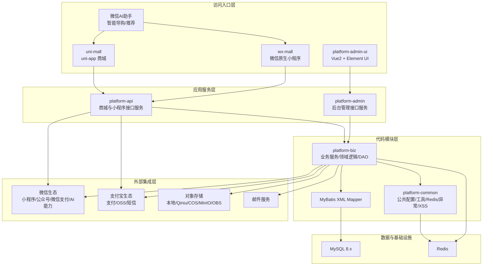
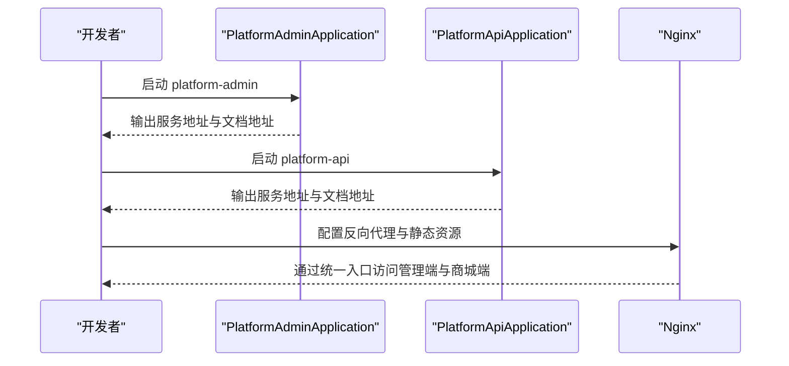
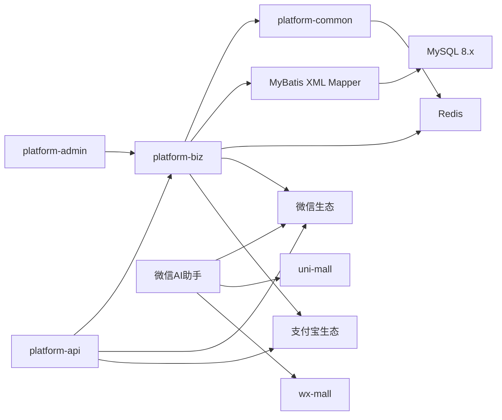

# 项目概述

<cite>
**本文引用的文件**
- [README.md](file://README.md)
- [pom.xml](file://pom.xml)
- [platform-admin/src/main/resources/application.yml](file://platform-admin/src/main/resources/application.yml)
- [platform-api/src/main/resources/application.yml](file://platform-api/src/main/resources/application.yml)
- [platform-admin/src/main/java/com/platform/PlatformAdminApplication.java](file://platform-admin/src/main/java/com/platform/PlatformAdminApplication.java)
- [platform-api/src/main/java/com/platform/PlatformApiApplication.java](file://platform-api/src/main/java/com/platform/PlatformApiApplication.java)
- [platform-admin-ui/package.json](file://platform-admin-ui/package.json)
- [platform-common/src/main/java/com/platform/common/utils/Constant.java](file://platform-common/src/main/java/com/platform/common/utils/Constant.java)
- [uni-mall/pages.json](file://uni-mall/pages.json)
- [wx-mall/app.json](file://wx-mall/app.json)
- [docs/系统架构说明.md](file://docs/系统架构说明.md)
- [docs/时序架构图.mmd](file://docs/时序架构图.mmd)
- [uni-mall/components/ai-guide-entry/ai-guide-entry.vue](file://uni-mall/components/ai-guide-entry/ai-guide-entry.vue)
- [wx-mall/components/ai-guide-entry/index.js](file://wx-mall/components/ai-guide-entry/index.js)
- [uni-mall/skills/mall-guide-skill/SKILL.md](file://uni-mall/skills/mall-guide-skill/SKILL.md)
- [uni-mall/skills/mall-checkout-skill/SKILL.md](file://uni-mall/skills/mall-checkout-skill/SKILL.md)
- [uni-mall/skills/mall-order-skill/SKILL.md](file://uni-mall/skills/mall-order-skill/SKILL.md)
</cite>

## 更新摘要
**所做更改**
- 新增微信AI助手功能章节，详细介绍AI能力接入和使用说明
- 更新技术栈描述，增加SpringBoot 2.7.15、MyBatis Plus 3.5.3等最新版本信息
- 新增技术站部分，明确项目采用的核心技术栈
- 更新重要说明部分，包含微信AI功能的详细要求和版本限制
- 新增微信AI可视化指导图片展示

## 目录
1. [引言](#引言)
2. [项目结构](#项目结构)
3. [核心组件](#核心组件)
4. [架构总览](#架构总览)
5. [详细组件分析](#详细组件分析)
6. [微信AI助手功能](#微信ai助手功能)
7. [依赖关系分析](#依赖关系分析)
8. [性能考量](#性能考量)
9. [故障排查指南](#故障排查指南)
10. [结论](#结论)
11. [附录](#附录)

## 引言
本项目是一个面向微信生态的全栈电商应用，覆盖微信小程序、H5 页面与 APP 多终端，采用前后端分离与模块化架构设计，结合 Spring Boot 2.7.15、MyBatis Plus 3.5.3、Vue2 + ElementUI、Redis、MySQL 8.0 等主流技术栈，提供从商城核心交易流程到系统管理与微信生态集成的一体化能力。项目强调可扩展性、可维护性与多端一致性，既适合初学者建立完整认知框架，也为有经验的开发者提供深入的技术细节与最佳实践参考。

**更新** 新增微信AI助手功能，支持智能导购、商品推荐和订单管理等AI能力，为用户提供更智能化的购物体验。

## 项目结构
项目采用多模块聚合工程组织，包含后端服务、业务模块、通用组件与多端前端。核心模块划分如下：
- 平台后端服务
  - platform-admin：后台管理接口服务，提供系统管理、微信管理、定时任务、代码生成等功能
  - platform-api：商城与小程序接口服务，提供用户、商品、购物车、订单、支付等业务接口
- 业务与通用模块
  - platform-biz：业务服务与领域逻辑，封装 DAO、Mapper 与业务处理器
  - platform-common：公共配置、工具类、Redis、异常处理、XSS 过滤等
- 前端与多端
  - platform-admin-ui：Vue2 + ElementUI 后台管理前端
  - uni-mall：基于 uni-app 的跨端商城前端
  - wx-mall：原生微信小程序前端
- 基础设施与部署
  - _sql：数据库初始化脚本
  - deploy：Docker 化部署与 Nginx 配置
  - docs：架构图与说明文档

**图表来源**
- [docs/系统架构说明.md:24-79](file://docs/系统架构说明.md#L24-L79)

**章节来源**
- [README.md:61-115](file://README.md#L61-L115)
- [docs/系统架构说明.md:24-79](file://docs/系统架构说明.md#L24-L79)

## 核心组件
- 后端启动与配置
  - platform-admin 与 platform-api 分别提供独立的 Spring Boot 启动类，内置 Undertow 服务器、Swagger/OpenAPI 文档、MyBatis Plus、Redis、JWT、Shiro 等配置，分别服务于管理端与商城端
- 业务与通用模块
  - platform-biz 聚合业务逻辑与数据访问层，platform-common 提供统一的工具、缓存、异常与安全配置
- 前端与多端
  - platform-admin-ui 基于 Vue2 + ElementUI 构建后台管理界面
  - uni-mall 与 wx-mall 分别适配 H5 与微信小程序，提供一致的购物流程与交互体验
- 微信生态集成
  - 通过 weixin-java-* 依赖集成小程序、公众号与微信支付能力，配合支付证书与回调地址完成闭环

**章节来源**
- [platform-admin/src/main/java/com/platform/PlatformAdminApplication.java:49-92](file://platform-admin/src/main/java/com/platform/PlatformAdminApplication.java#L49-L92)
- [platform-api/src/main/java/com/platform/PlatformApiApplication.java:49-91](file://platform-api/src/main/java/com/platform/PlatformApiApplication.java#L49-L91)
- [platform-admin/src/main/resources/application.yml:69-205](file://platform-admin/src/main/resources/application.yml#L69-L205)
- [platform-api/src/main/resources/application.yml:58-195](file://platform-api/src/main/resources/application.yml#L58-L195)
- [platform-admin-ui/package.json:14-36](file://platform-admin-ui/package.json#L14-L36)
- [pom.xml:332-364](file://pom.xml#L332-L364)

## 架构总览
系统采用"多端入口 + 双后端服务 + 业务与通用模块 + 外部生态"的分层架构。访问入口层包含管理端与多端前端；应用服务层由后台管理服务与商城接口服务组成；代码模块层包含业务与通用模块；基础设施层提供 MySQL 与 Redis；外部集成层涵盖微信与支付宝生态、对象存储与邮件服务。双后端服务通过 Nginx 反向代理统一对外提供服务，实现多端一致的 API 体验。

```mermaid
graph TB
subgraph "访问入口层"
AUI["platform-admin-ui"]
WM["wx-mall"]
UM["uni-mall"]
AI["微信AI助手"]
end
subgraph "应用服务层"
ADM["platform-admin"]
API["platform-api"]
end
subgraph "代码模块层"
BIZ["platform-biz"]
COM["platform-common"]
end
subgraph "数据与基础设施"
MYSQL["MySQL 8.x"]
REDIS["Redis"]
end
subgraph "外部集成层"
WX["微信生态"]
ALI["支付宝生态"]
OSS["对象存储"]
MAIL["邮件服务"]
end
AUI --> ADM
WM --> API
UM --> API
AI --> WM
AI --> UM
ADM --> BIZ
API --> BIZ
BIZ --> COM
BIZ --> MYSQL
BIZ --> REDIS
API --> WX
BIZ --> WX
API --> ALI
BIZ --> ALI
BIZ --> OSS
BIZ --> MAIL
```

**图表来源**
- [docs/系统架构说明.md:24-79](file://docs/系统架构说明.md#L24-L79)

**章节来源**
- [docs/系统架构说明.md:24-79](file://docs/系统架构说明.md#L24-L79)

## 详细组件分析

### 后端服务启动与上下文
- platform-admin 与 platform-api 启动类均继承 SpringBootServletInitializer，支持嵌入式 Undertow 服务器，提供统一的首页提示与 API 文档入口
- 两套服务分别配置独立的 context-path 与端口，便于在 Nginx 下统一反向代理与静态资源托管

**图表来源**
- [platform-admin/src/main/java/com/platform/PlatformAdminApplication.java:69-90](file://platform-admin/src/main/java/com/platform/PlatformAdminApplication.java#L69-L90)
- [platform-api/src/main/java/com/platform/PlatformApiApplication.java:68-90](file://platform-api/src/main/java/com/platform/PlatformApiApplication.java#L68-L90)

**章节来源**
- [platform-admin/src/main/java/com/platform/PlatformAdminApplication.java:49-92](file://platform-admin/src/main/java/com/platform/PlatformAdminApplication.java#L49-L92)
- [platform-api/src/main/java/com/platform/PlatformApiApplication.java:49-91](file://platform-api/src/main/java/com/platform/PlatformApiApplication.java#L49-L91)

### 配置与依赖要点
- Spring Boot 版本与模块化：父 POM 统一版本与依赖管理，模块化拆分便于独立构建与部署
- MyBatis Plus：统一实体映射、逻辑删除、驼峰命名等配置，提升数据访问效率
- Redis：提供高并发下的缓存与会话存储能力
- 微信生态：weixin-java-* 依赖提供小程序、公众号与支付能力，结合证书与回调地址完成闭环
- 前端依赖：Vue2、Element UI、axios、路由与状态管理等，支撑后台管理端与多端前端

**章节来源**
- [pom.xml:37-40](file://pom.xml#L37-L40)
- [pom.xml:52-89](file://pom.xml#L52-L89)
- [pom.xml:332-364](file://pom.xml#L332-L364)
- [platform-admin/src/main/resources/application.yml:114-142](file://platform-admin/src/main/resources/application.yml#L114-L142)
- [platform-api/src/main/resources/application.yml:96-122](file://platform-api/src/main/resources/application.yml#L96-L122)
- [platform-admin-ui/package.json:14-36](file://platform-admin-ui/package.json#L14-L36)

### 多端前端与页面导航
- uni-mall 与 wx-mall 均提供完整的购物流程页面，包括首页、分类、购物车、订单、用户中心、支付等
- 页面配置集中于 pages.json 或 app.json，统一导航栏样式、TabBar 与懒加载策略，保证多端一致体验

**章节来源**
- [uni-mall/pages.json:1-385](file://uni-mall/pages.json#L1-L385)
- [wx-mall/app.json:1-136](file://wx-mall/app.json#L1-L136)

### 业务常量与标识
- platform-common 中的 Constant 提供统一的业务常量、缓存前缀、微信配置键、定时任务状态枚举等，确保跨模块一致性与可维护性

**章节来源**
- [platform-common/src/main/java/com/platform/common/utils/Constant.java:26-238](file://platform-common/src/main/java/com/platform/common/utils/Constant.java#L26-L238)

## 微信AI助手功能

### 技术站
项目采用以下核心技术栈：
- SpringBoot 2.7.15：提供稳定的后端框架支持
- Vue2 + ElementUI：构建现代化的后台管理系统
- MyBatis Plus 3.5.3：简化数据访问层开发
- weixin-java 4.5.2：集成微信生态能力
- MySQL 8.0：高性能关系型数据库
- Redis：提供缓存与会话存储
- Java 21：最新的Java版本支持

### 重要说明
- 微信AI能力已经接入，需要在微信公众平台开通`AI能力`
- 手机体验微信版本最低 `8.0.75`
- 开发工具中调试基础库最低`3.16.1`
- 微信AI能力还在灰度内测，暂未开放提审
- 如果开发中遇到不清楚的地方可以添加下方客服微信，请注明来意
- 项目合作洽谈，请联系客服微信（使用微信扫码添加好友，请注明来意）
- 如需购买商业版源码请联系客服

### AI助手组件实现
微信AI助手通过专门的组件实现，支持在小程序和H5页面中提供智能导购服务：

#### uni-mall AI组件
- 组件名称：ai-guide-entry
- 支持属性：context（上下文）、text（显示文本）、位置参数等
- 实现方式：基于微信小程序原生API wx.openAgent
- 响应式设计：支持底部、右侧、左侧、顶部位置调整

#### wx-mall 原生组件
- 组件名称：ai-guide-entry
- 支持属性：context（上下文）、text（显示文本）、样式参数等
- 生命周期：attached钩子检测AI能力支持
- 观察者模式：监听位置参数变化并动态更新样式

### AI技能系统
项目实现了完整的AI技能系统，包含三个核心技能：

#### 商品导购技能（mall-guide-skill）
负责商品推荐、商品搜索和商品详情解释：
- 当用户表达模糊购物意图时，优先调用 `recommendGoods` 推荐商品
- 当用户明确给出商品名或关键词时，优先调用 `searchGoods`
- 用户决定查看某个商品后，调用 `getGoodsDetail`
- 用户决定购买某个商品后，将 `goodsId`、`productId`、`number` 交给 `mall-checkout-skill`

#### 购物车结算技能（mall-checkout-skill）
负责购物车清单核对和结算预览：
- 查看购物车清单使用 `getCartSnapshot`
- 结算前的金额、地址、运费、优惠预览使用 `prepareCheckout`
- 用户确认要下单时，引导跳转到结算页，不在 AI 流程里直接调用提交订单接口

#### 订单管理技能（mall-order-skill）
负责订单列表查询和订单详情查询：
- 查询订单列表使用 `listOrders`
- 查询某个订单使用 `getOrderDetail`
- 若 orderId 来自用户口述，应先调用 `listOrders` 让用户确认，再调用 `getOrderDetail`

### 可视化指导
项目提供了详细的微信AI功能可视化指导，包含7个步骤的使用说明：
1. 打开微信小程序
2. 点击AI助手按钮
3. 输入购物需求
4. 查看AI推荐结果
5. 选择感兴趣的商品
6. 查看商品详情
7. 完成购买流程

**章节来源**
- [README.md:17-30](file://README.md#L17-L30)
- [README.md:169-177](file://README.md#L169-L177)
- [uni-mall/components/ai-guide-entry/ai-guide-entry.vue:1-120](file://uni-mall/components/ai-guide-entry/ai-guide-entry.vue#L1-L120)
- [wx-mall/components/ai-guide-entry/index.js:1-109](file://wx-mall/components/ai-guide-entry/index.js#L1-L109)
- [uni-mall/skills/mall-guide-skill/SKILL.md:1-9](file://uni-mall/skills/mall-guide-skill/SKILL.md#L1-L9)
- [uni-mall/skills/mall-checkout-skill/SKILL.md:1-9](file://uni-mall/skills/mall-checkout-skill/SKILL.md#L1-L9)
- [uni-mall/skills/mall-order-skill/SKILL.md:1-8](file://uni-mall/skills/mall-order-skill/SKILL.md#L1-L8)

## 依赖关系分析
- 模块依赖
  - platform-admin 与 platform-api 均依赖 platform-biz 与 platform-common，前者侧重系统管理与微信管理，后者侧重商城交易与多端接口
  - platform-biz 依赖 platform-common 的工具与配置，同时通过 MyBatis XML Mapper 访问 MySQL
- 外部依赖
  - weixin-java-* 提供微信生态能力，支付宝 SDK 提供支付与短信等能力
  - Redis 提供缓存与分布式锁等支撑
- 前后端分离
  - 前端通过 HTTP 接口调用后端服务，后端通过 Swagger/OpenAPI 文档暴露接口，便于联调与测试

**图表来源**
- [pom.xml:42-47](file://pom.xml#L42-L47)
- [docs/系统架构说明.md:24-79](file://docs/系统架构说明.md#L24-L79)

**章节来源**
- [pom.xml:42-47](file://pom.xml#L42-L47)
- [docs/系统架构说明.md:24-79](file://docs/系统架构说明.md#L24-L79)

## 性能考量
- 服务器与线程模型：采用 Undertow 服务器，合理配置 IO 线程与工作线程数量，平衡高并发与资源占用
- 缓存策略：通过 Redis 缓存热点数据与会话信息，降低数据库压力
- 数据访问优化：MyBatis Plus 统一配置驼峰映射与逻辑删除，减少 ORM 层开销
- 多端一致性：前端通过统一 API 与状态管理，减少重复请求与渲染负担
- 外部集成：微信与支付宝回调采用异步通知与幂等处理，保障支付链路稳定
- AI功能优化：微信AI助手采用原生API调用，确保响应速度和用户体验

## 故障排查指南
- 启动与端口
  - 若启动失败或端口冲突，检查 application.yml 中 server.port 与 context-path 配置
- 数据库与缓存
  - 确认 MySQL 与 Redis 服务可用，检查连接参数与超时设置
- 微信支付与证书
  - 确保支付证书正确放置于 cert 目录，回调地址与商户配置一致
- 微信AI功能
  - 确认微信公众平台已开通AI能力，检查微信版本是否满足最低要求
  - 验证AI组件的wx.openAgent方法是否可用
- 前端联调
  - 检查 Nginx 反向代理与静态资源托管，确认 API 基础地址与跨域策略
- 日志与监控
  - 查看服务启动日志与业务日志，定位异常请求与数据库慢查询

**章节来源**
- [platform-admin/src/main/resources/application.yml:4-21](file://platform-admin/src/main/resources/application.yml#L4-L21)
- [platform-api/src/main/resources/application.yml:4-21](file://platform-api/src/main/resources/application.yml#L4-L21)
- [README.md:82-100](file://README.md#L82-L100)

## 结论
本项目以"多端入口 + 双后端服务 + 业务与通用模块 + 外部生态"为核心架构，围绕微信生态与多端购物场景，提供从商品浏览、下单支付到订单管理的完整闭环。通过前后端分离与模块化设计，项目具备良好的可扩展性与可维护性；借助 Spring Boot、MyBatis Plus、Vue2 + ElementUI、Redis、MySQL 等成熟技术栈，既能满足初学者的学习需求，也能为进阶开发者提供深入的实践参考。

**更新** 新增的微信AI助手功能进一步提升了项目的智能化水平，通过AI技能系统实现智能导购、商品推荐和订单管理，为用户带来更便捷的购物体验。项目的技术栈持续更新，确保采用最新的技术标准和最佳实践。

## 附录
- 快速安装与运行
  - 准备环境：Java 21、Maven、MySQL 8.0、Redis
  - 初始化数据库：按顺序执行 _sql 下的 base.sql、mall.sql、sys_region.sql
  - 配置支付证书与后端配置文件，启动 Redis、后台服务与前端
  - Docker 一键启动：执行构建脚本与 docker-compose，访问统一入口
  - 微信AI功能配置：在微信公众平台开通AI能力，确保微信版本满足最低要求

**章节来源**
- [README.md:74-153](file://README.md#L74-L153)
- [README.md:23-29](file://README.md#L23-L29)