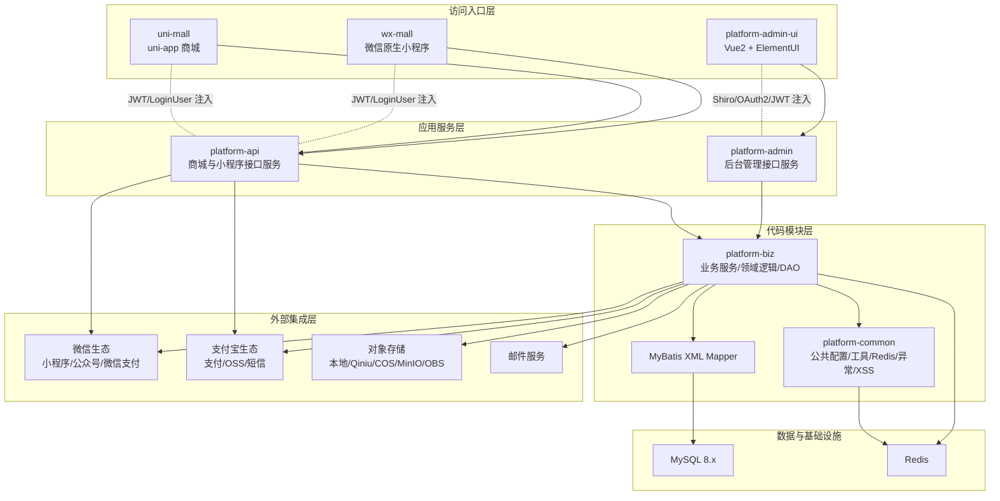
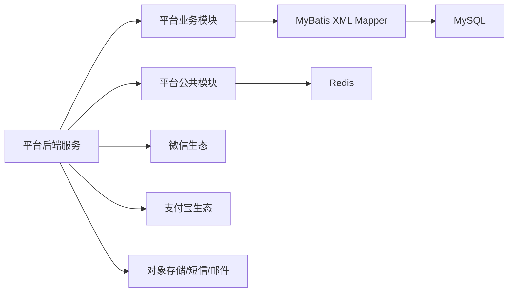
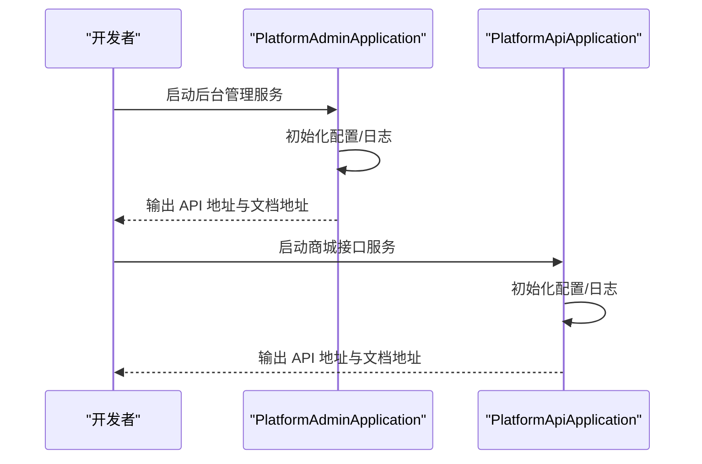
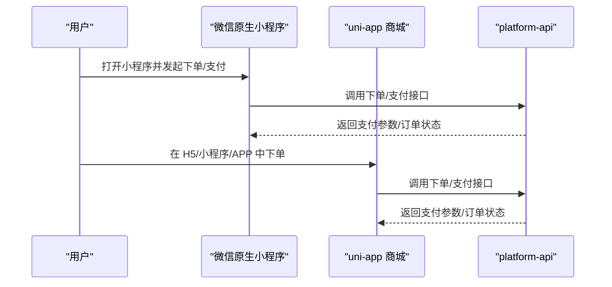
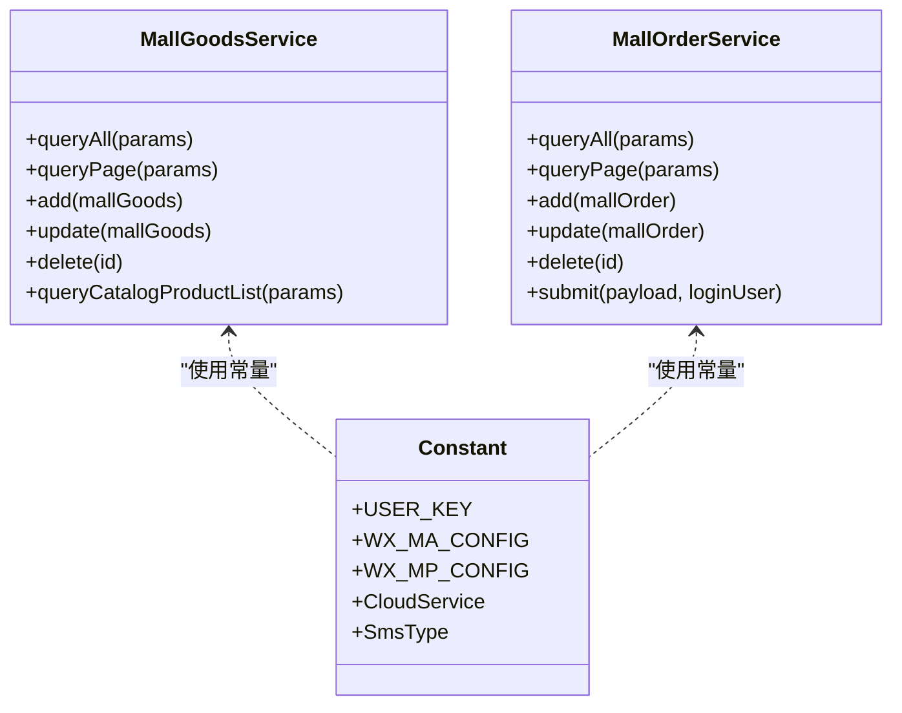
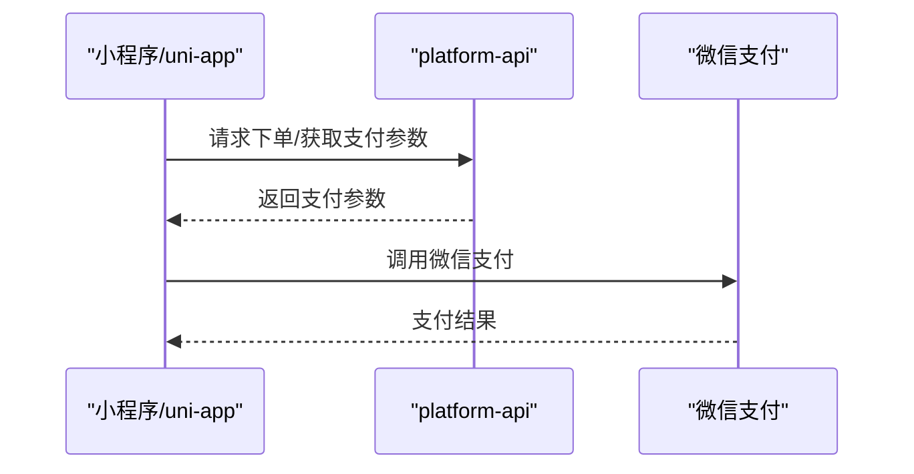
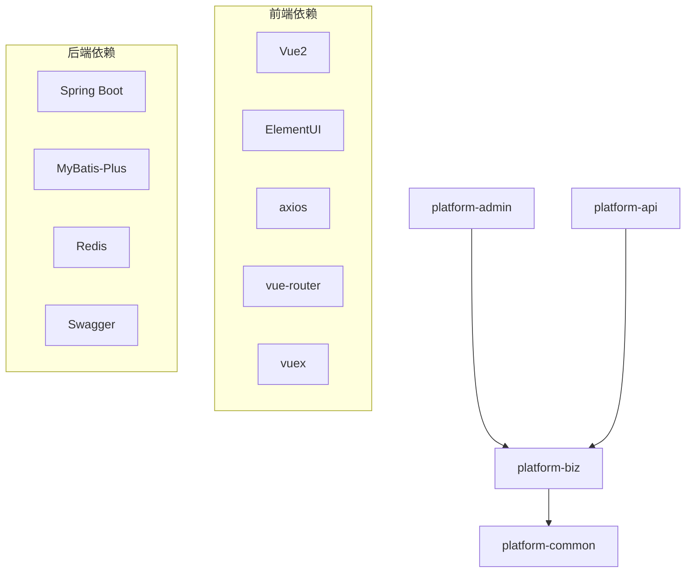

# 项目简介与定位

<cite>
**本文引用的文件**
- [README.md](file://README.md)
- [系统架构说明.md](file://docs/系统架构说明.md)
- [platform-admin-ui/package.json](file://platform-admin-ui/package.json)
- [platform-api/pom.xml](file://platform-api/pom.xml)
- [uni-mall/manifest.json](file://uni-mall/manifest.json)
- [wx-mall/app.json](file://wx-mall/app.json)
- [platform-admin/src/main/java/com/platform/PlatformAdminApplication.java](file://platform-admin/src/main/java/com/platform/PlatformAdminApplication.java)
- [platform-api/src/main/java/com/platform/PlatformApiApplication.java](file://platform-api/src/main/java/com/platform/PlatformApiApplication.java)
- [platform-common/src/main/java/com/platform/common/utils/Constant.java](file://platform-common/src/main/java/com/platform/common/utils/Constant.java)
- [platform-biz/src/main/java/com/platform/modules/mall/service/MallGoodsService.java](file://platform-biz/src/main/java/com/platform/modules/mall/service/MallGoodsService.java)
- [platform-biz/src/main/java/com/platform/modules/mall/service/MallOrderService.java](file://platform-biz/src/main/java/com/platform/modules/mall/service/MallOrderService.java)
</cite>

## 目录
1. [引言](#引言)
2. [项目结构](#项目结构)
3. [核心组件](#核心组件)
4. [架构总览](#架构总览)
5. [详细组件分析](#详细组件分析)
6. [依赖分析](#依赖分析)
7. [性能考量](#性能考量)
8. [故障排查指南](#故障排查指南)
9. [结论](#结论)
10. [附录](#附录)

## 引言
本项目是一个面向微信生态的全栈电商解决方案，采用 Java 后端 + Vue2 + ElementUI 前端技术栈，同时覆盖微信小程序、H5 页面以及 APP 多终端。项目通过统一的业务模块与接口服务，支撑后台管理、商城前台、小程序与 uni-app 多端协同，形成“多入口、双后端、共享业务”的架构形态。

项目定位明确：
- 为企业级电商提供可复用、可扩展的完整能力；
- 为个人开发者提供学习与实战的参考范例；
- 在微信生态内提供从商品、订单、支付到营销的闭环能力。

开源优势体现在：
- 技术栈成熟稳定：Spring Boot、MyBatis-Plus、Vue2、ElementUI；
- 架构设计清晰：前后端分离、模块化分层、统一认证与安全；
- 功能完整性：商品、购物车、订单、支付、优惠券、营销、内容专题、用户中心等；
- 多端适配：微信原生小程序、uni-app 多端、H5、后台管理台；
- 易于部署：提供 Docker 一键编排与脚本化构建。

## 项目结构
项目采用多模块分层组织，包含后端服务、业务模块、公共组件与多端前端：
- 平台后端服务
  - platform-admin：后台管理接口服务，提供系统管理、商品、订单、营销、微信配置等管理能力
  - platform-api：商城与小程序接口服务，提供登录、商品、购物车、订单、支付、地址、优惠券等用户侧能力
- 业务与公共模块
  - platform-biz：核心业务模块，包含 DAO、Service、实体与领域逻辑
  - platform-common：公共配置、工具类、Redis、异常与安全处理
- 前端与多端
  - platform-admin-ui：后台管理前端（Vue2 + ElementUI）
  - wx-mall：微信原生小程序
  - uni-mall：uni-app 商城（支持 H5、小程序、APP 等多端）

**图表来源**
- [系统架构说明.md](file://docs/系统架构说明.md)
- [README.md](file://README.md)

**章节来源**
- [README.md:59-70](file://README.md#L59-L70)
- [系统架构说明.md:24-79](file://docs/系统架构说明.md#L24-L79)

## 核心组件
- 后端启动类
  - platform-admin 启动类：负责后台管理服务的启动与日志输出
  - platform-api 启动类：负责商城与小程序接口服务的启动与日志输出
- 前端依赖与技术栈
  - platform-admin-ui：Vue2 + ElementUI + webpack，提供后台管理界面
  - uni-mall：基于 uni-app 的多端应用，支持 H5、小程序、APP
  - wx-mall：微信原生小程序，提供基础商城能力
- 业务与公共模块
  - platform-biz：商品、订单、优惠券、地址、营销等核心业务能力
  - platform-common：常量、工具、Redis、异常与安全处理

**章节来源**
- [platform-admin/src/main/java/com/platform/PlatformAdminApplication.java:49-90](file://platform-admin/src/main/java/com/platform/PlatformAdminApplication.java#L49-L90)
- [platform-api/src/main/java/com/platform/PlatformApiApplication.java:49-90](file://platform-api/src/main/java/com/platform/PlatformApiApplication.java#L49-L90)
- [platform-admin-ui/package.json:14-36](file://platform-admin-ui/package.json#L14-L36)
- [uni-mall/manifest.json:169-225](file://uni-mall/manifest.json#L169-L225)
- [wx-mall/app.json:1-136](file://wx-mall/app.json#L1-L136)
- [platform-common/src/main/java/com/platform/common/utils/Constant.java:26-240](file://platform-common/src/main/java/com/platform/common/utils/Constant.java#L26-L240)

## 架构总览
系统采用“多入口 + 双后端 + 共享业务 + 基础设施 + 外部集成”的整体架构。访问入口层包含后台管理前端、微信原生小程序与 uni-app 商城；应用服务层由后台管理服务与商城接口服务组成；代码模块层以 platform-biz 为核心，共享 platform-common；基础设施为 MySQL 与 Redis；外部集成涵盖微信、支付宝、对象存储、短信与邮件等。

**图表来源**
- [系统架构说明.md](file://docs/系统架构说明.md)

**章节来源**
- [系统架构说明.md:81-129](file://docs/系统架构说明.md#L81-L129)

## 详细组件分析

### 后端服务启动与入口
- platform-admin：排除安全与数据源自动装配，开启异步与动态数据源，启动后输出 API 地址与文档地址
- platform-api：排除 Druid 数据源自动装配，开启异步，启动后输出 API 地址与文档地址

**图表来源**
- [platform-admin/src/main/java/com/platform/PlatformAdminApplication.java:55-90](file://platform-admin/src/main/java/com/platform/PlatformAdminApplication.java#L55-L90)
- [platform-api/src/main/java/com/platform/PlatformApiApplication.java:54-90](file://platform-api/src/main/java/com/platform/PlatformApiApplication.java#L54-L90)

**章节来源**
- [platform-admin/src/main/java/com/platform/PlatformAdminApplication.java:49-90](file://platform-admin/src/main/java/com/platform/PlatformAdminApplication.java#L49-L90)
- [platform-api/src/main/java/com/platform/PlatformApiApplication.java:49-90](file://platform-api/src/main/java/com/platform/PlatformApiApplication.java#L49-L90)

### 多端前端与微信生态集成
- uni-mall：在 manifest 中声明多端配置，包含微信小程序 appId、H5 路由、subPackages（技能包）、插件等
- wx-mall：在 app.json 中定义页面、tabBar、agent 技能、subPackages 等，支持微信原生小程序能力

**图表来源**
- [uni-mall/manifest.json:169-225](file://uni-mall/manifest.json#L169-L225)
- [wx-mall/app.json:1-136](file://wx-mall/app.json#L1-L136)

**章节来源**
- [uni-mall/manifest.json:169-225](file://uni-mall/manifest.json#L169-L225)
- [wx-mall/app.json:1-136](file://wx-mall/app.json#L1-L136)

### 业务模块与数据访问
- platform-biz 提供商品、订单、优惠券等核心业务接口，结合 MyBatis XML Mapper 实现复杂查询与分页
- platform-common 提供常量、工具、Redis、异常与安全处理，支撑业务与安全能力

**图表来源**
- [platform-biz/src/main/java/com/platform/modules/mall/service/MallGoodsService.java:35-98](file://platform-biz/src/main/java/com/platform/modules/mall/service/MallGoodsService.java#L35-L98)
- [platform-biz/src/main/java/com/platform/modules/mall/service/MallOrderService.java:40-101](file://platform-biz/src/main/java/com/platform/modules/mall/service/MallOrderService.java#L40-L101)
- [platform-common/src/main/java/com/platform/common/utils/Constant.java:26-240](file://platform-common/src/main/java/com/platform/common/utils/Constant.java#L26-L240)

**章节来源**
- [platform-biz/src/main/java/com/platform/modules/mall/service/MallGoodsService.java:35-98](file://platform-biz/src/main/java/com/platform/modules/mall/service/MallGoodsService.java#L35-L98)
- [platform-biz/src/main/java/com/platform/modules/mall/service/MallOrderService.java:40-101](file://platform-biz/src/main/java/com/platform/modules/mall/service/MallOrderService.java#L40-L101)
- [platform-common/src/main/java/com/platform/common/utils/Constant.java:26-240](file://platform-common/src/main/java/com/platform/common/utils/Constant.java#L26-L240)

### 支付流程与微信生态对接
- 小程序端通过调用后端接口获取支付参数，再使用微信支付能力完成支付
- uni-app 端通过统一封装的支付方法调起微信支付

**图表来源**
- [wx-mall/services/pay.js:11-39](file://wx-mall/services/pay.js#L11-L39)
- [uni-mall/utils/util.js:389-420](file://uni-mall/utils/util.js#L389-L420)

**章节来源**
- [wx-mall/services/pay.js:11-39](file://wx-mall/services/pay.js#L11-L39)
- [uni-mall/utils/util.js:389-420](file://uni-mall/utils/util.js#L389-L420)

## 依赖分析
- 模块依赖
  - platform-admin 依赖 platform-biz
  - platform-api 依赖 platform-biz
  - platform-biz 依赖 platform-common
- 外部依赖
  - 前端：Vue2、ElementUI、axios、vue-router、vuex 等
  - 后端：Spring Boot、MyBatis-Plus、Redis、Swagger 等

**图表来源**
- [platform-api/pom.xml:16-22](file://platform-api/pom.xml#L16-L22)
- [platform-admin-ui/package.json:14-36](file://platform-admin-ui/package.json#L14-L36)

**章节来源**
- [platform-api/pom.xml:16-22](file://platform-api/pom.xml#L16-L22)
- [platform-admin-ui/package.json:14-36](file://platform-admin-ui/package.json#L14-L36)

## 性能考量
- 数据访问层采用 MyBatis-Plus + XML Mapper，适合复杂查询与分页场景，建议在高频查询上配合 Redis 缓存热点数据
- 前端采用按需加载与组件化，建议在多端场景下优化首屏加载与资源体积
- 后端服务通过异步与动态数据源提升并发与灵活性，建议结合限流与熔断策略保障稳定性

## 故障排查指南
- 后台管理链路：platform-admin-ui -> platform-admin -> platform-biz -> MyBatis XML -> MySQL
- 商城/小程序链路：wx-mall/uni-mall -> platform-api -> platform-biz -> MyBatis XML -> MySQL
- 常见问题排查顺序
  - 前端请求参数与 URL
  - 服务端口、context-path 与 profile
  - 数据源、Redis、第三方配置（微信/支付/存储）
- 权限与登录
  - 后台链路：Shiro/OAuth2
  - 用户侧链路：JWT/LoginUser 注入

**章节来源**
- [系统架构说明.md:131-218](file://docs/系统架构说明.md#L131-L218)

## 结论
本项目以清晰的分层架构与成熟的开源技术栈，提供了覆盖多端的电商解决方案。其核心价值在于：
- 多端一体：一套后端服务支撑小程序、H5、APP 与后台管理
- 业务完整：从商品到订单、从支付到营销，覆盖电商关键环节
- 易于落地：提供 Docker 一键编排与详尽安装指引，降低部署门槛
- 可持续演进：模块化设计便于扩展与二次开发

## 附录
- 快速开始与安装
  - 环境准备：Java、Maven、MySQL、Redis
  - 初始化数据库脚本：/_sql/base.sql、/_sql/mall.sql、/_sql/sys_region.sql
  - 后端启动：PlatformAdminApplication、PlatformApiApplication
  - 前端启动：platform-admin-ui、wx-mall、uni-mall
- Docker 一键启动
  - 构建 jar 与前端静态资源
  - docker-compose 启动 MySQL、Redis、Nginx、后端服务
  - 默认访问地址：管理台、后台接口、商城接口

**章节来源**
- [README.md:72-153](file://README.md#L72-L153)