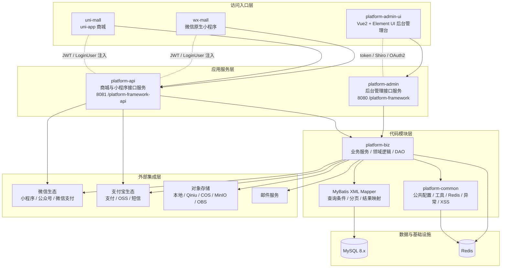

# 系统架构说明

## 1. 文档目的

本文档基于当前仓库代码整理系统架构，用于帮助开发、联调、排障和后续维护快速理解系统全貌。

本文档聚焦两个问题：

- 运行时，前端、后端、数据库、缓存和第三方系统如何协作
- 代码层面，`platform-admin`、`platform-api`、`platform-biz`、`platform-common` 如何分层与依赖

## 2. 适用范围

本文档对应当前仓库实现，覆盖以下模块：

- `platform-admin`
- `platform-api`
- `platform-biz`
- `platform-common`
- `platform-admin-ui`
- `wx-mall`
- `uni-mall`

## 3. 系统架构图

## 4. 分层说明

### 4.1 访问入口层

- `platform-admin-ui` 是后台管理台前端，基于 Vue 2、Element UI、webpack，主要调用 `platform-admin`
- `wx-mall` 是原生微信小程序，主要调用 `platform-api`
- `uni-mall` 是 uni-app 商城前端，同样主要调用 `platform-api`

这一层负责页面交互、表单提交、列表展示和用户操作入口，不承载核心业务规则。

### 4.2 应用服务层

- `platform-admin` 面向后台管理端，负责系统管理、商城后台管理、任务、OSS、微信管理等接口
- `platform-api` 面向商城和小程序端，负责登录、商品、购物车、订单、支付、收货地址、优惠券等接口

这两个服务是系统运行态的主要入口，分别对应不同访问端，但共享底层业务能力。

### 4.3 代码模块层

- `platform-biz` 是核心业务模块，承载大部分 Service、DAO、实体、DTO 和领域逻辑
- MyBatis XML mapper 承载大量真实查询逻辑，包括列表、搜索、分页、结果映射和联表 SQL
- `platform-common` 提供公共配置、工具类、Redis 能力、异常处理和通用安全处理

从代码关系上看：

- `platform-admin` 依赖 `platform-biz`
- `platform-api` 依赖 `platform-biz`
- `platform-biz` 依赖 `platform-common`

因此，大多数“接口字段不对”“列表查不出来”“分页条件异常”“联调返回不一致”等问题，最终都需要落到 `platform-biz` 和对应 XML mapper 上排查。

### 4.4 数据与基础设施

- MySQL 是主业务数据库，承载用户、商品、订单、配置、营销、系统管理等核心数据
- Redis 用于缓存、短信验证码、部分会话和业务加速能力

当前仓库的数据访问以 MyBatis-Plus + XML mapper 为主，而不是纯注解式 CRUD。

### 4.5 外部集成层

系统当前代码中已经接入多类外部能力：

- 微信生态：小程序、公众号、微信支付
- 支付宝生态：小程序 / 支付
- 对象存储：本地存储、七牛云、腾讯 COS、MinIO、华为 OBS
- 短信：阿里云短信、腾讯云短信
- 邮件服务

这意味着排障时不能只看仓库内代码，还要考虑当前环境下的第三方配置、证书、账号和回调地址是否一致。

## 5. 关键调用关系

### 5.1 后台管理链路

典型链路如下：

`platform-admin-ui` -> `platform-admin` -> `platform-biz` -> `MyBatis XML` -> `MySQL`

该链路主要覆盖：

- 系统管理
- 后台登录与权限
- 商品、分类、订单、营销等后台维护
- 任务调度、OSS、微信后台配置

### 5.2 商城 / 小程序链路

典型链路如下：

`wx-mall / uni-mall` -> `platform-api` -> `platform-biz` -> `MyBatis XML` -> `MySQL`

根据业务场景，还会继续访问：

- `Redis`
- 微信支付 / 微信小程序能力
- 支付宝能力
- 对象存储

该链路主要覆盖：

- 登录注册
- 商品浏览
- 购物车
- 下单
- 支付
- 收货与订单完成

## 6. 本地联调关注点

基于当前配置，联调时需要重点关注以下入口：

- `platform-admin`
  - 端口：`8080`
  - context-path：`/platform-framework`
- `platform-api`
  - 端口：`8081`
  - context-path：`/platform-framework-api`
- `platform-admin-ui`
  - 默认本地地址：`http://localhost:8000`
- `wx-mall`
  - 当前本地 API 基址默认指向 `http://localhost:8081/platform-framework-api/app/`

联调失败时，优先检查：

- 前端实际请求 URL
- 服务是否启动在预期端口
- context-path 是否匹配
- 当前 profile 是否正确
- 数据源、Redis、微信 / 支付 / 存储配置是否对应当前环境

## 7. 排障建议

### 7.1 查询与列表类问题

优先从以下顺序排查：

1. 前端请求参数
2. controller 入参
3. service 调用路径
4. DAO 接口
5. XML mapper 条件与结果映射

### 7.2 权限与登录问题

优先区分两条链路：

- 后台链路：`platform-admin-ui` + `platform-admin` + Shiro / OAuth2
- 用户侧链路：`wx-mall / uni-mall` + `platform-api` + JWT / `LoginUser`

### 7.3 第三方集成问题

如果现象发生在支付、短信、OSS、微信回调等链路，不要只改业务代码，先核对：

- 应用配置
- 证书 / 密钥
- 回调地址
- 第三方账号与环境是否正确

## 8. 结论

这个仓库的系统形态可以概括为：

- 多前端入口
- 双后端服务入口
- 共享业务核心模块
- MyBatis XML 驱动的数据访问层
- MySQL + Redis 基础设施
- 微信、支付宝、对象存储、短信、邮件等外部能力集成

因此，后续开发和排障时，最重要的不是只看某一个 controller 或页面，而是先确认自己处于哪条业务链路、哪个服务入口、哪个共享模块，再沿真实调用路径逐层下钻。
